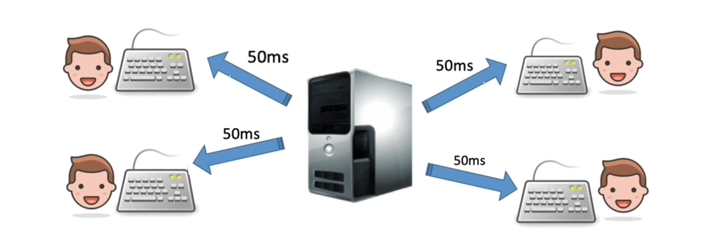
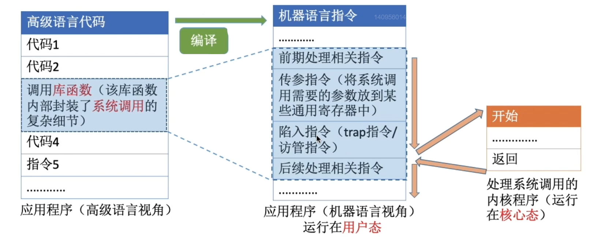

# 第一章：操作系统概述

------

### 一、基本概念

#### 1.OS的概念：

操作系统是指满足以下特征的程序的集合。

- 控制和管理整个计算机系统的硬件和软件资源（OS是系统资源的管理者）
- 并合理地组织调度计算机的工作和资源的分配，以提供给用户和其他软件方便的接口和环境（向上层提供方便易用的服务）

#### 2.OS的特征

##### （1）并发Concurrence：

并发：指两个/多个事件在同一时间间隔内发生（宏观上是同时发生、微观上是交替发生）

OS并发性：计算机系统中同时运行着多个程序，这些程序宏观上同时运行的微观上看是交替运行的。

> 1. 操作系统的并发与共享是两个最基本的特征，二者互为存在条件。
> 2. 操作系统就是伴随着多道程序技术而出现的，因此操作系统和程序并发是一起诞生的。

##### （2）共享Sharing：

共享：即资源共享，是指系统中的资源可供内存中的多个并发执行的进程共同使用。

==两种资源共享的方式==：

- 互斥共享：系统中的某些资源，虽然可以提供给多个进程使用，但1个时间段只能允许1个进程访问。
- 同时共享：系统中的某些资源，允许1个时间段内由多个进程同时访问

##### （3）虚拟Virtual：

虚拟：将物理上的实体变为若干个逻辑上的对应实体（物理实体是实际存在的，而逻辑上对应的实体则是用户感受到的）。

==操作系统中的虚拟技术==包括：虚拟处理器、虚拟内存、虚拟外部设备等

1. 虚拟处理器：通过多道程序设计技术、采用多道程序并发执行的方式，来分时使用一个处理器（时分复用技术）
2. 虚拟存储器：采用虚拟存储技术、将物理存储器变为虚拟存储器，实现逻辑上扩充存储器的容量（空分复用技术）
3. 虚拟外部设备：

> 注：如果失去了并发性1个时间段内只需运行1到程序，则失去了实现虚拟性的意义（没有并发性就谈不上虚拟性）。

##### （4）异步Asynchronism：

异步：在多道程序环境下允许多个程序并发执行，但由于资源有限进程的执行不是一贯到底的。

> 注：如果失去了并发性系统只能串行地运行各个程序，每个程序的执行就会一贯到底（拥有并发性才有可能导致异步性）。

#### 3.OS的功能：

##### （1）作为系统资源管理者：

操作系统作为系统资源的管理者，应具有以下几方面的功能：处理机管理、存储器管理、文件管理和设备管理。

##### （2）作为用户与硬件系统之间的接口：

为了方便用户使用操作系统，操作系统还必须向用户提供接口。

封装思想：将底层的硬件功能封装成易用的服务，用户能更方便地使用计算机，而无需关心底层硬件原理。

- 联机命令接口：交互式命令接口（cmd命令行）
- 脱机命令接口：批处理命令接口（bat批处理文件）
- 程序接口：可以在程序中进行系统调用来使用程序接口，普通用户不能直接使用程序接口，只能通过程序代码间接使用。

##### （3）实现对计算机资源的扩展：

操作系统可用来扩充机器，以提供更方便的服务、更高的资源利用率。

没有任何软件支持的计算机成为裸机。在裸机上安装的操作系统可以提供资源管理功能和方便用户的服务功能。通常把覆盖了软件的机器成为扩充机器，又称之为虚拟机。

### 二、发展与分类

#### 1.手工操作阶段

用户独占全机、人机速度矛盾导致资源的利用率极低

#### 2.批处理阶段

##### （1）单道批处理系统：

引入脱机输入/输出技术（外围机+磁带实现），并由监督程序负责控制作业的输入、输出。

|                             优点                             |        缺点        |
| :----------------------------------------------------------: | :----------------: |
| 单道批处理系统缓解了一定程度的人机速度矛盾，资源利用率有所提升。 | 资源利用率依然很低 |

##### （2）多道批处理系统（OS debut）：

| 优点                                                         | 缺点                                                       |
| ------------------------------------------------------------ | ---------------------------------------------------------- |
| 多道程序并发执行，                                           | 用户响应时间长没有人机交互功能                             |
| 共享计算机资源（资源利用率提升）CPU和其他资源更能保持忙碌状态，系统吞吐量增大。 | 用户提交自己的作业后就只能等待，中间不能控制自己作业的执行 |

#### 3.分时操作系统

分时操作系统：计算机以时间片为单位轮流为各个用户/作业服务，各个用户可通过终端与计算机进行交互。

| 优点                                                         | 缺点                                                         |
| ------------------------------------------------------------ | ------------------------------------------------------------ |
| 用户的请求可以被即使响应，解决了人机交互问题。 | 不能优先处理一些紧急的任务      |
| 允许多个用户同时使用一台计算机，并且用户对计算机的操作相互独立，感受不到其他人的存在。 | 操作系统对各个用户/作业都是完全公平的，循环地为每个用户/作业服务一个时间片。 |

#### 4.实时操作系统

在实时操作系统的控制下，计算机系统接收到外部信号后及时进行处理，并且要求在严格的时限内处理完事件。

- 优点：能够优先响应一些紧急任务，某些紧急任务不需时间片排队（及时性、可靠性）

### 三、运行环境

#### 1.处理器运行机制

==内核态与用户态==：

- 特权指令：指不允许用户直接使用的指令，如IO指令、置中断指令、存取用于内存保护的寄存器的等的指令
- 非特权指令：指允许用户直接使用的指令，指令不能访问系统中的软硬件资源、仅限于访问用户的地址空间
- 内核态（管态）：说明正在运行的是内核程序，此时可以执行特权指令
- 用户态（目态）：说明正在运行的是应用程序，此时只能执行非特权指令

> 注：CPU中有一个程序状态字寄存器PSW，其中有1个二进制位用于记录表示CPU目前处于的状态（内核态1、用户态0）

==内核态用户态间的切换==：

- 内核态切换为用户态：执行一条特权指令修改PSW标志位为用户态，该动作意味着操作系统将主动让出CPU使用权。
- 用户态切换为内核态：由中断引发硬件自动完成变态过程，触发中断信号意味着操作系统将强行夺回CPU使用权。

> 注：除了非法使用特权指令之外还有很多事件会触发中断信号，但凡需要操作系统介入之处都会触发中断信号。

#### 2.中断和异常

##### （1）中断和异常概念：

> 注：中断是让操作系统内核夺回CPU使用权的唯一途径

- 中断/外中断：与当前执行的指令无关（中断信号来自CPU外部），常用于信息IO。如设备发出的IO结束中断、时钟中断。
- 异常/内中断：与当前执行的指令有关（中断信号来自CPU内部），如程序的非法操作码、地址越界、运算溢出、虚拟系统缺页。

==中断的分类==：

1. 可屏蔽中断INTR，通过改变屏蔽字可以实现多重中断，从而使中断处理更加灵活。
2. 不可屏蔽中断NMI，通过是紧急的硬件故障，如电源掉电（异常不能被屏蔽）。
3. 故障Fault：由指令执行引起的异常，如非法操作码、缺页故障、除数为0、运算溢出等。
4. 自陷Trap：是一种实现安排的异常事件，用于在用户态下调用操作系统内核程序（主动将CPU控制权还给内核），如条件陷阱指令
5. 终止Abort：是指出现了使得CPU无法继续执行的硬件故障，如控制器出错、存储器校验错误等

##### （2）中断处理的过程：

不同的中断信号，需要用不同的中断处理程序来处理。

当CPU检测到中断信号后，会根据中断信号的类型去查询中断向量表，以此来找到相应的中断处理程序在内存中的位置。

#### 3.系统调用

##### （1）系统调用：

OS作为用户和硬件间的接口，需要向上层提供服务主要包括命令接口和程序接口。其中程序接口由一组系统调用组成。

系统调用可以通过操作系统，提供给应用程序使用的接口（可理解为可供应用程序调用的特殊函数）

##### （2）系统调用过程：

1. 陷入指令是在用户态执行的，执行陷入指令之后会立即引发一个内中断，使CPU进入核心态。
2. 发出系统调用请求是在用户态，而对系统调用的相应处理在核心态下进行。

### 四、体系结构

#### 1.大内核/微内核

| 大内核 |                                                      |
| ------ | ---------------------------------------------------- |
| 概念   | 将操作系统的主要功能模块都作为系统内核，运行在核心态 |
| 优点   | 高性能                                               |
| 缺点   | 内核代码庞大、结构混乱难以维护                       |

| 微内核 |                                              |
| ------ | -------------------------------------------- |
| 概念   | 只把最基本的功能保留在内核中                 |
| 优点   | 内核功能少、结构清晰便于维护                 |
| 缺点   | 需要频繁的在核心态与用户态之间切换，性能较低 |

1. 操作系统的内核需要运行在内核态，非内核功能运行在用户态
2. 典型的大内核OS：Linux、UNXI、
3. 典型的微内核OS：Window NT

#### 2.分层结构/模块化/外核

### 五、操作系统引导

操作系统引导是指计算机利用CPU运行特定程序，通过识别硬盘分区、分区上的操作系统、最后通过程序启动操作系统的过程。

- Step1：CPU从一个特定主存地址开始取指令，执行ROM中的引导程序（先进行硬件自检、再开机）
- Step2：将磁盘的第一块（主引导记录）读入内存，执行磁盘引导程序扫描分区表
- Step3：从活动分区（主分区OS安装分区）读入分区引导记录，执行其中的程序
- Step4：从根目录下找完整的操作系统初始化程序并执行，完成开机一系列动作

### 六、虚拟机

