# 第二章：进程管理

------

### 一、进程与线程

#### 1.进程概述

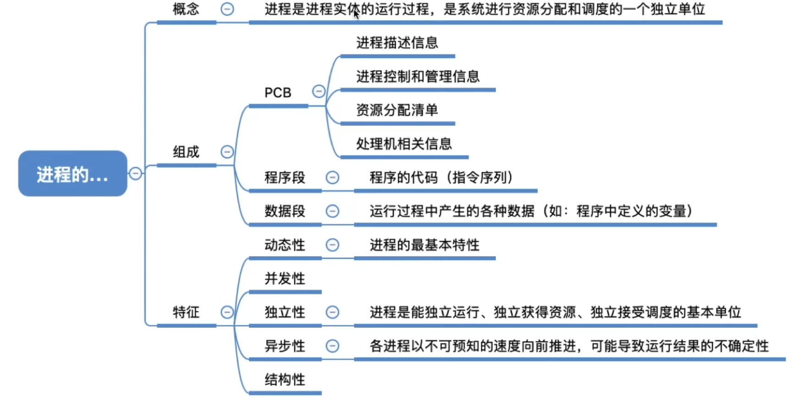

##### （1）进程PCB：

进程是进程实体的运行过程，是系统进行资源分配和调度的一个单位。

| 概念 | 说明                                                         |
| ---- | ------------------------------------------------------------ |
| 程序 | 是指静态的存放在磁盘里、的可执行的文件，实际上为一系列的指令集合 |
| 进程 | 是指动态的、程序的一次执行过程                               |

1. 一个程序可以同时创建多个进程，当进程被创建时操作系统会为该进程分配<font color='#BAOC2F'>唯一不重复的身份证号PID</font>。
2. PCB是进程存在的唯一标志，当进程被创建时系统会为其创建PCB，结束时会收回其PCB。


这些信息<font color='#BAOC2F'>都将被保存在一个数据结构PCB</font>（Process Control Block）中，即<font color='#BAOC2F'>进程控制块</font>。

操纵系统需要对各个并发运行的进程进行管理，但凡管理时所需要的信息都将被放入在PCB中。

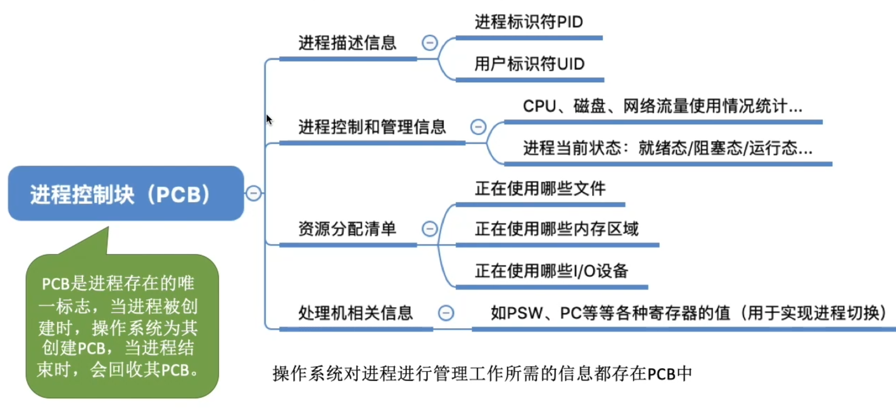

##### （2）进程的组成：

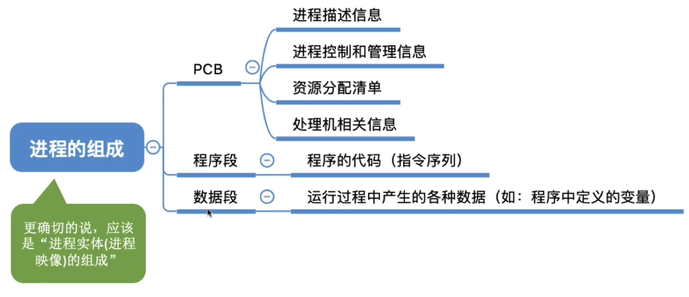

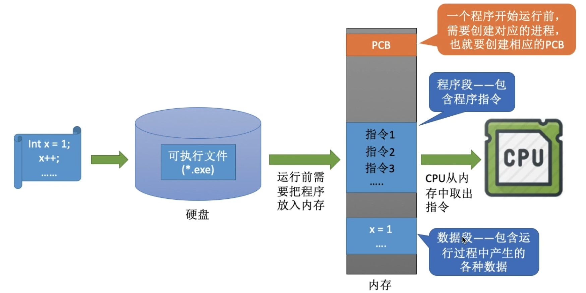

一个进程实体（进程映像）由<font color='#BAOC2F'>PCB、程序段、数据段组成</font>，进程实体反应了进程在某一时刻的状态。

进程是动态的，进程实体（进程映像）是静态的。进程是进程实体的<font color='#BAOC2F'>运行过程</font>，是系统进行<font color='#BAOC2F'>资源分配和调度</font>的一个独立单位。

> 注：PCB是为操作系统而准备的，而程序段和数据段是给进程使用的，PCB是进程存在的唯一标志。

##### （3）进程的特征：

程序是静态的，进程是动态的，相比于程序<font color='#BAOC2F'>进程拥有以下特征</font>：

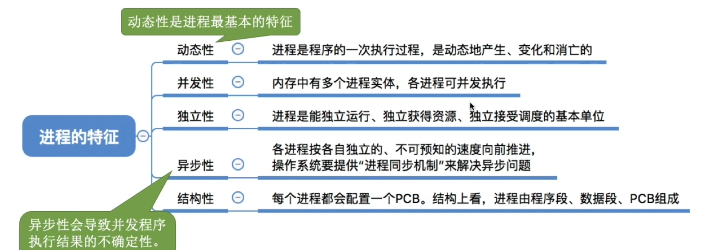

#### 2.进程的状态与转换

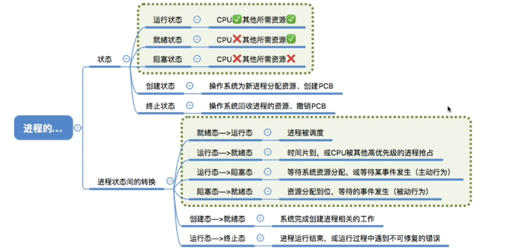

##### （1）进程的状态：

==创建态==：

进程<font color='#BAOC2F'>正在被创建时</font>其状态为创建态，在该阶段操作系统会为<font color='#BAOC2F'>进程分配资源、初始化PCB</font>。

==就绪态==：

当进程创建完成后便进入就绪态，处于就绪态的进程已经具备运行条件，但是由于<font color='#BAOC2F'>没有空闲的CPU</font>暂时不能运行。

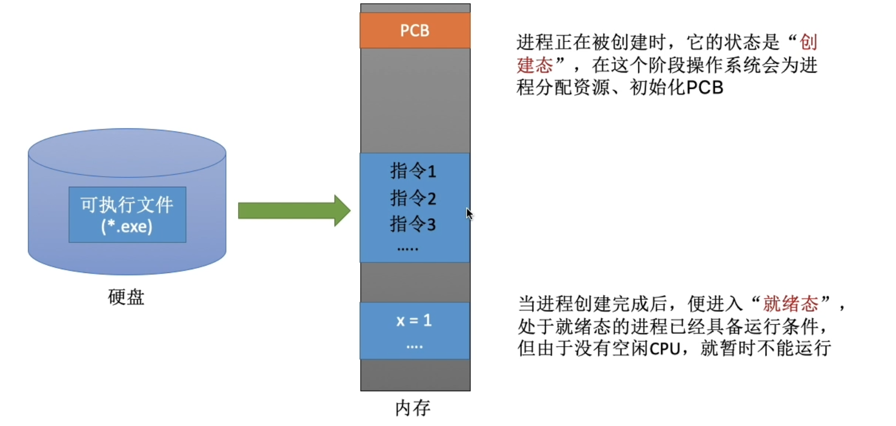

==运行态==：

如果一个进程此时在CPU上运行就处于运行态，CPU会执行<font color='#BAOC2F'>该进程对应的程序</font>（执行指令序列）。

==阻塞态==：

在进程运行的过程中，可能会请求<font color='#BAOC2F'>等待某个事件的发生</font>。（如等待某种系统资源的分配、等待其他进程的响应等）

在等待过程中进程无法继续往下执行，OS会将进程下CPU，使其进入阻塞状态。

==终止态==：

一个进程可以执行`exit`系统调用，请求操作系统<font color='#BAOC2F'>终止该进程</font>。

此时该进程会进入终止态，操作系统会让该进程下CPU并<font color='#BAOC2F'>回收内存空间</font>等资源包括进程的PCB。

##### （2）进程状态的转换：

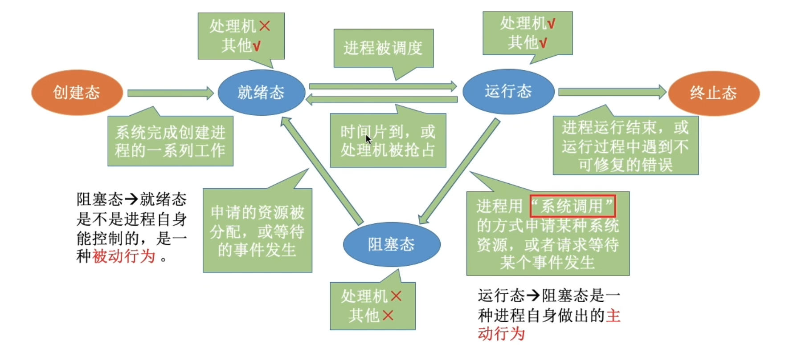

1. 运行态转换到阻塞态是一种<font color='#BAOC2F'>进程自身做出的主动行为</font>。
2. 阻塞态转换到就绪态不是进程自身能控制的（CPU决定），是<font color='#BAOC2F'>进程的一种被动行为</font>。
3. 不能直接由<font color='#BAOC2F'>阻塞态转换为运行态</font>，也不能直接由<font color='#BAOC2F'>就绪态转换为阻塞态</font>（阻塞态是进程主动请求的，而只有在运行态的进程才能发）
4. 有时进程能够直接从运行态转换为就绪态，例如：时间片用尽、处理机被抢占等情况。

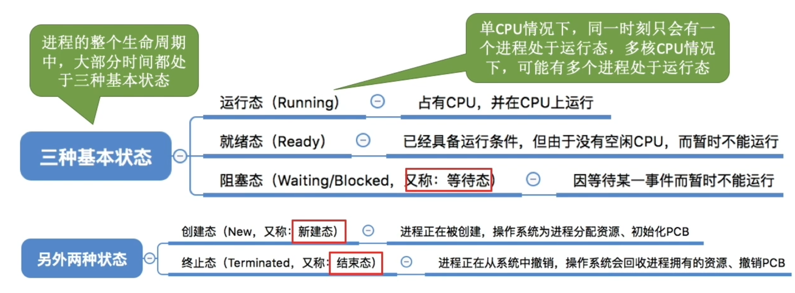

在进程PCB中会有一个state变量来表示进程的当前状态，如创建态1、就绪态2、运行态3、阻塞态4、终止态5。

操作系统会将<font color='#BAOC2F'>各个进程的PCB组织起来</font>，实现对<font color='#BAOC2F'>相同状态的各个进程</font>进行管理。

##### （3）进程的组织

==链接方式（队列）==：

操作系统会<font color='#BAOC2F'>管理一系列的队列</font>，每个队列都会指向相应状态下的PCB：

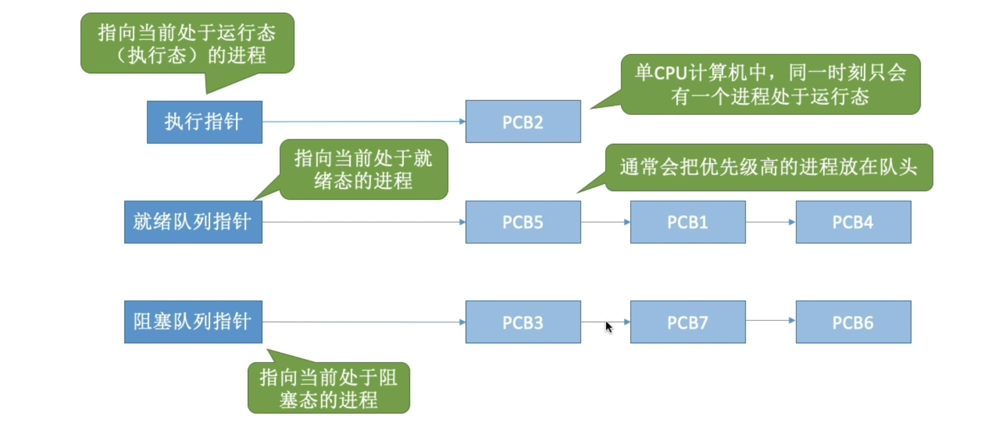

==索引方式（索引表）==：

操作系统会给各种状态的进程建立<font color='#BAOC2F'>相应的索引表</font>，每个索引表的<font color='#BAOC2F'>表项会指向相应的PCB</font>：

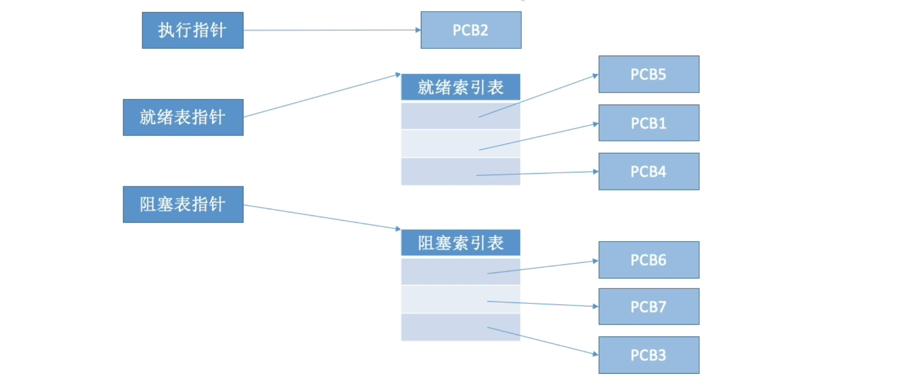

#### 3.进程控制

##### （1）进程控制实现：

进程控制的主要功能是对系统中的<font color='#BAOC2F'>所有进程实施有效的管理</font>，具有<font color='#BAOC2F'>创建新进程</font>、<font color='#BAOC2F'>撤销已有进程</font>、实现<font color='#BAOC2F'>进程状态转换</font>等功能。

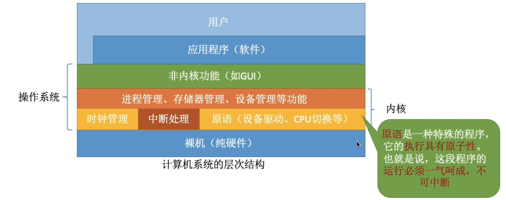

进程控制通过<font color='#BAOC2F'>原语</font>来实现。

而原语是一种特殊的程序，其<font color='#BAOC2F'>执行具有原子性</font>。即该程序的执行（进程状态转换）必须<font color='#BAOC2F'>一次完成，不可被中断</font>。

如果原语的执行（进程的状态转换）不能一次完成，就可能导致OS中某些<font color='#BAOC2F'>关键数据结构信息不统一</font>影响管理工作。

可以使用<font color='#BAOC2F'>关中断指令</font>和<font color='#BAOC2F'>开中断指令</font>这连个特权指令，来实现原语的原子性。

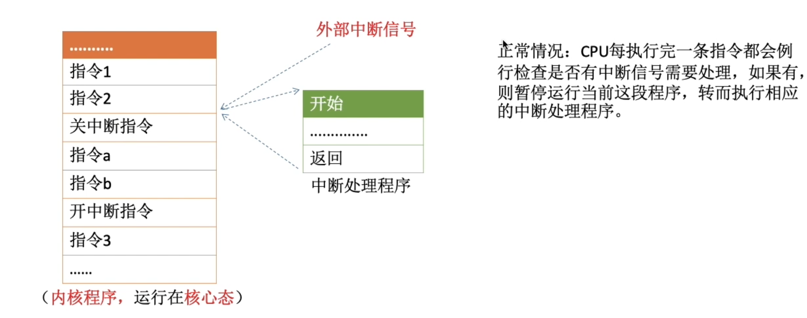

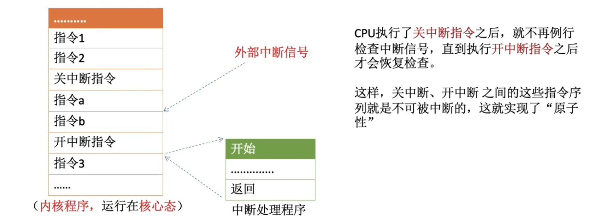

##### （2）进程控制相关原语：

==创建原语==：

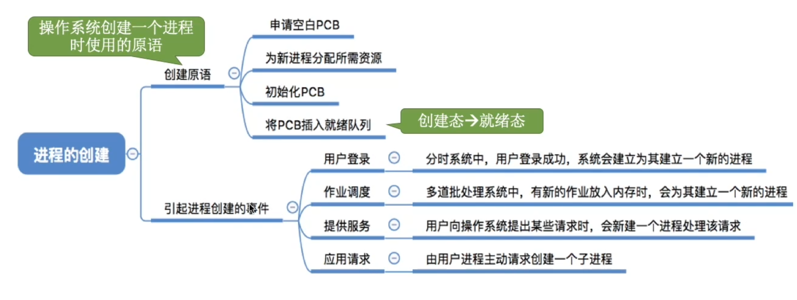

==撤销原语==：

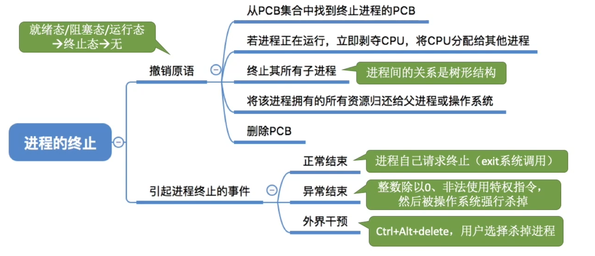

==阻塞与唤醒原语==：

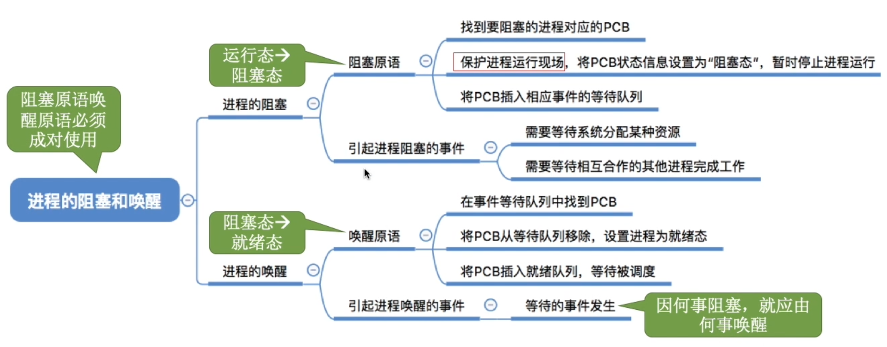

==切换原语==：

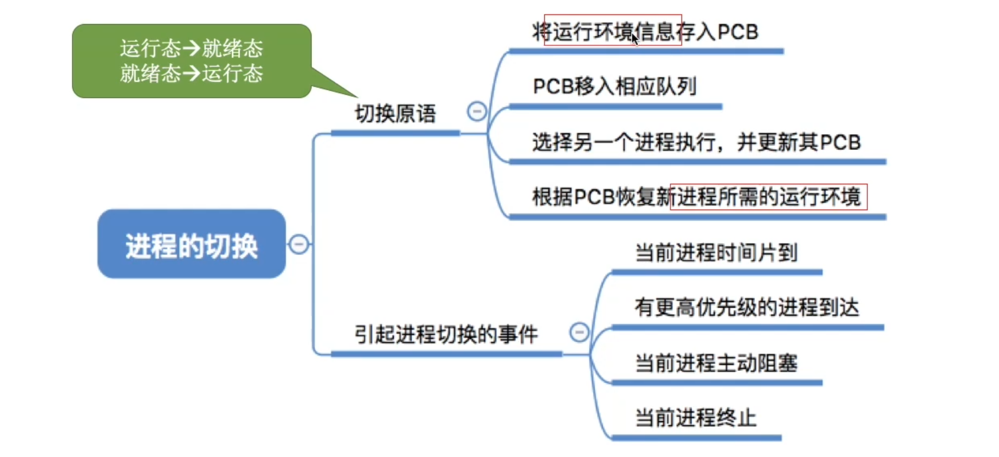

#### 4.进程通信

进程是分配系统资源的单位（包括内存地址），因此<font color='#BAOC2F'>各进程拥有的内存地址空间相互独立</font>。	

为了保证进程安全，1个进程<font color='#BAOC2F'>不能直接访问</font>另1个进程的地址空间，为了保证进程通信间的安全性，操作系统提供了一些方法。

##### （1）共享存储

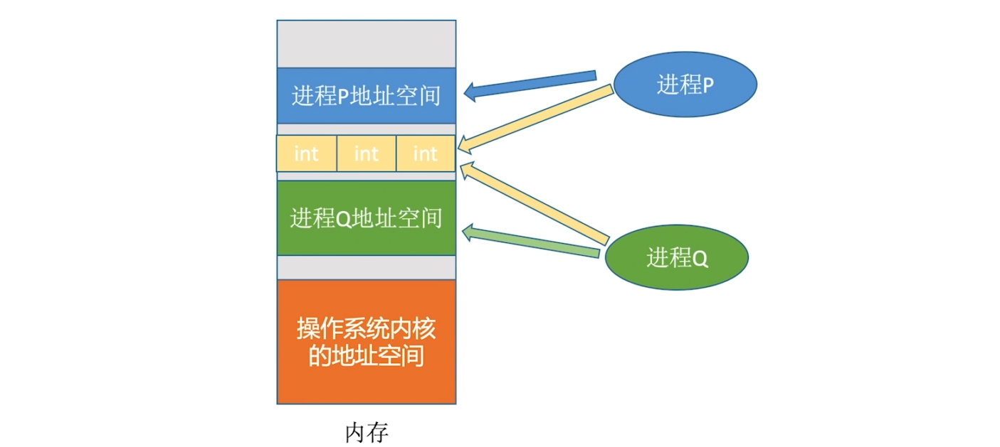

1. 共享存储中两个进程必须<font color='#BAOC2F'>对共享空间的访问互斥</font>（访问互斥通过操作系统提供的工具实现）
2. 操作系统只负责提供共享空间与同步互斥工具（如P、V操作）

==基于数据结构的共享==：

基于数据结构，共享空间里只能存放一个长度为10的数组。这种共享方式速度慢、限制多是一种低级的通信方式。

==基于存储区的共享==：

基于存储区，在内存中的共享存储区<font color='#BAOC2F'>数据的形式、存放的位置</font>都由<font color='#BAOC2F'>进程控制</font>而不是操作系统。共享速度更快是一种高级的通信方式。

##### （2）消息传递

进程间的数据交换以<font color='#BAOC2F'>格式化的消息</font>Message为单位，进程通过操作系统提供的<font color='#BAOC2F'>发送消息/接收消息</font>两个<font color='#BAOC2F'>原语</font>进行数据交换。


==直接通信方式==：

直接通信方式，是指将格式化消息直接<font color='#BAOC2F'>挂到接收进程的消息缓冲队列</font>上，如图：

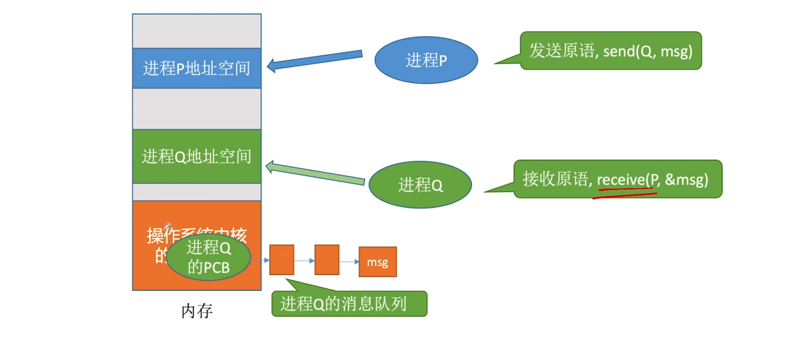

==间接通信方式==：

间接通信方式，是指需要先将格式化的消息发送到<font color='#BAOC2F'>中间实体</font>（信箱）中，因此也被称为信箱通信方式（电子邮件系统）。

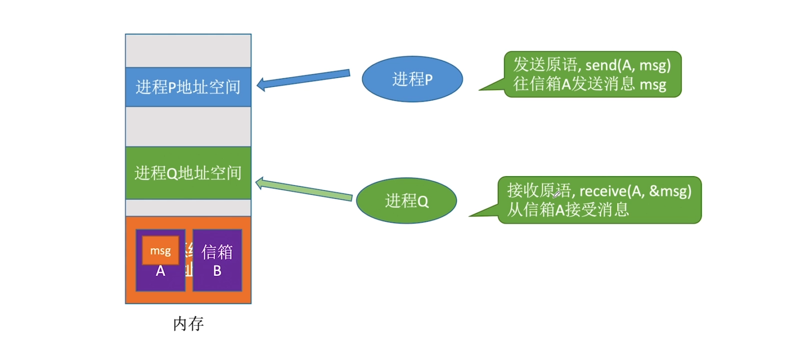

##### （3）管道通信

管道是指用于<font color='#BAOC2F'>连接读写进程的一个共享文件</font>（pipe文件），本质是在内存中开辟的<font color='#BAOC2F'>一个大小固定的缓冲区</font>。


1. 各个进程也需要<font color='#BAOC2F'>互斥的访问管道</font>（操作系统实现）。
2. 管道只能采用半双工通信，<font color='#BAOC2F'>某一时间段内只能实现单向传输</font>。
3. 数据以字节流的形式写入管道，当管道写满时，写进程的`write()`系统调用将被阻塞，等待读进程将数据全部取走。
4. 数据以字节流的形式读出管道，当管道读空后，读进程的`read()`系统调用将被阻塞。
5. 数据从管道中<font color='#BAOC2F'>一旦读出就会彻底消失</font>，即读进程最多只能有一个，否则可能会有读错数据的情况。

#### 5.线程与多线程模型

##### （1）线程TCB

传统的进程只能<font color='#BAOC2F'>串性地执行一系列程序</font>，为此引入了线程的概念来<font color='#BAOC2F'>增加并发度</font>。

传统的进程是<font color='#BAOC2F'>程序执行流</font>的最小单位，引入线程后<font color='#BAOC2F'>线程成了程序执行流的最小单位</font>，是一个<font color='#BAOC2F'>基本的CPU执行单元</font>。

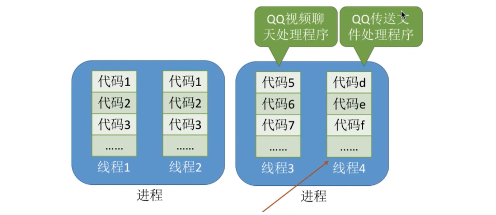

==线程引入带来的变化==：

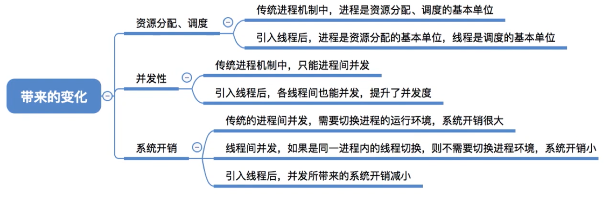

##### （2）线程特点

==线程基本属性==：

1. 线程是处理机调度的单位
3. 每一个线程都有线程ID、线程控制块（TCB）
4. 线程也有就绪、阻塞、运行三种基本状态
5. 线程几乎不拥有系统资源
5. 多CPU计算机中，各个线程可占用不同的CPU
6. 同一进程的不同线程间共享进程资源，所以同一进程中的线程间<font color='#BAOC2F'>通信无需系统干预</font>。

==线程切换中的属性==：

1. 同一进程中的线程切换，不会引起进程切换
2. 不同进程中的线程切换，会引起进程切换
3. 切换同进程内的线程，系统开销很小
4. 切换进程，系统开销很大

##### （3）线程实现方式

==用户级线程==：

ULT用户级线程User-Level Thread，早期的操作系统<font color='#BAOC2F'>只支持进程、不支持线程</font>，线程是由<font color='#BAOC2F'>线程库</font>实现的。

很多编程语言提供了强大的线程库，可以<font color='#BAOC2F'>实现线程的创建、销毁、调度等</font>功能。

1. 线程管理是由应用程序通过线程库来完成的，并不是操作系统
2. 线程切换<font color='#BAOC2F'>不需要CPU从用户态转换为内核态</font>，线程切换是由线程库应用程序完成的，不需要操作系统干涉。
3. 操作系统不会意识到用户级线程的存在。

| 优点                                                         | 缺点                                                         |
| ------------------------------------------------------------ | ------------------------------------------------------------ |
| 1.线程切换在用户空间就能够完成，不需要切换到核心态。         | 1.某个用户级线程阻塞后，整个进程都会阻塞并发度不高。         |
| 2.线程管理的<font color='#BAOC2F'>系统开销小、效率高</font>。 | 2.多个线程<font color='#BAOC2F'>不可在多核处理机上并行运行</font>。 |

==内核级线程==：

KLT内核级线程Kernel-Level Thread，内核支持的线程。

1. 线程管理是由操作系统完成
2. 线程切换<font color='#BAOC2F'>需要CPU从用户态转换为内核态</font>，线程切换是由操作系统完成的。
3. 操作系统意识到用内核线程的存在。

| 优点                                                         | 缺点                                                       |
| ------------------------------------------------------------ | ---------------------------------------------------------- |
| 1.当一个线程被阻塞后，其他线程能继续并发能力强。             | 1.一个用户进程占用多个内核级线程，线程切换由操作系统完成。 |
| 2.多线程<font color='#BAOC2F'>可在多核处理机上并行执行</font>。 | 2.线程切换需要切换到核心态，因此线程管理的成本高、开销大。 |

> 注：操作系统只看得见内核级线程，因此<font color='#BAOC2F'>只有内核级线程才是处理机分配的单位</font>。

##### （4）多线程模型

在支持内核级线程的操作系统中再引入线程库，实现用户级线程与内核级线程结合使用。

###### <1>nv1模型（内核级线程）

一个用户级线程映射到一个内核级线程，<font color='#BAOC2F'>每个用户进程</font>与<font color='#BAOC2F'>用户级线程</font>同等数量的内核级线程。

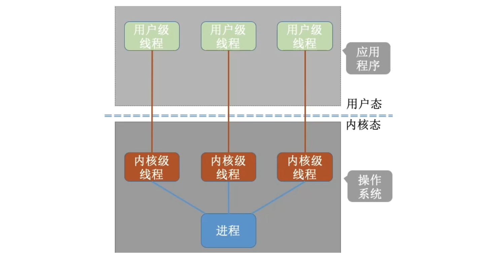

| 优点                                               | 缺点                                                       |
| -------------------------------------------------- | ---------------------------------------------------------- |
| 1.当一个线程被阻塞后，其他线程能够继续并发能力强。 | 1.用户进程会占用多个内核级线程，线程切换由操作系统内核完成 |
| 2.多线程可在多核处理机上并行执行。                 | 2.线程切换需要切换到核心态，因此线程管理的成本高、开销大。 |

###### <2>1v1模型（用户级线程）

多个用户级线程映射到一个内核级线程，且<font color='#BAOC2F'>1个进程</font>只被分配<font color='#BAOC2F'>1个内核级线程</font>。

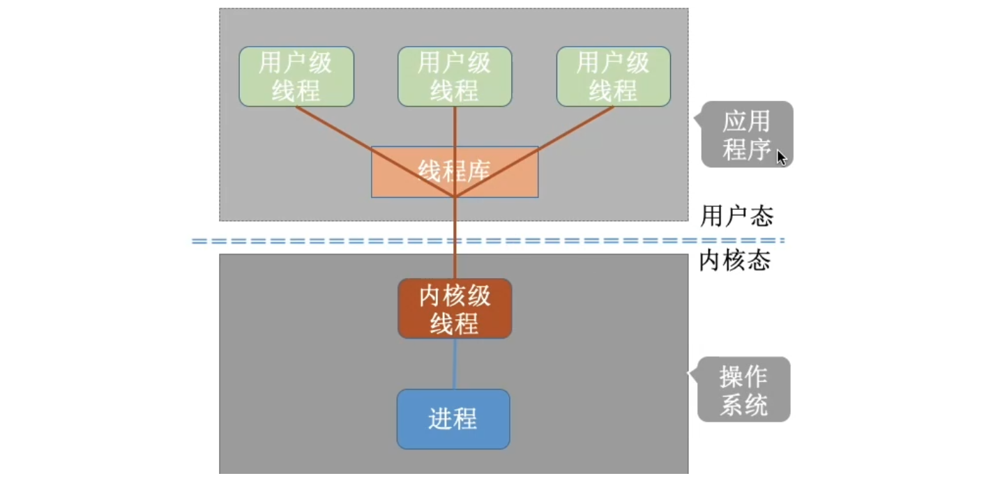

| 优点                                                         | 缺点                                                         |
| ------------------------------------------------------------ | ------------------------------------------------------------ |
| 1.线程切换在用户空间即可完成，不需要切换到核心态。           | 1.某个用户级线程阻塞后，整个进程都会阻塞，并发度不高。       |
| 2.线程管理的<font color='#BAOC2F'>系统开销小、效率高</font>。 | 2.多个线程<font color='#BAOC2F'>不可在多核处理机上并行运行</font>。 |

###### <3>nvn模型

多对多模型：n个用户及线程映射到m个内核级线程（n>=m），每个用户进程对应m个内核级线程。

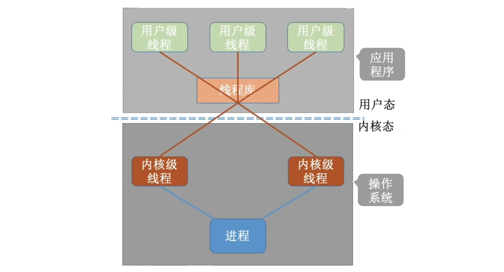

1. 克服了nv1模型并<font color='#BAOC2F'>发度不高的缺点</font>。
2. 克服了1v1模型中<font color='#BAOC2F'>1个用户进程占用太多内核级线程</font>，导致开销太大。

### 二、处理机调度

#### 1.处理机调度

当有一堆任务需要处理时，由于资源有限无法全部同时处理。这时需要某种规则来决定处理这些任务的顺序，这就是调度的问题。

##### （1）处理机调度层次

==高级调度：作业调度==

1. 按照一定的原则从外存的作业后备队列中<font color='#BAOC2F'>挑选一个作业调入内存，并创建进程</font>。
2. 每个作业只调入一次、调出一次，作业调入时会建立PCB，调出时才撤销PCB。

> 作业：是指一项具体的任务。用户向系统提交一个作业：用户让操作系统启动一个程序（处理一个具体的任务）。

==中级调度：内存调度==

1. 内存不够时将某些进程的数据调出外存，等内存空闲或者进程需要运行时再重新调入内存。
2. 暂时调到外存等待的进程状态称为<font color='#BAOC2F'>挂起状态</font>，被挂起的进程PCB会被组织成<font color='#BAOC2F'>挂起队列</font>。
3. 按照某种策略决定<font color='#BAOC2F'>将哪个处于挂起状态的进程重新调入内存</font>。

> 注：单个进程可能会被多次调入、调出内存，因此中级调度发生的频率比高级调度更高。

==低级调度：进程调度/处理机调度==

1. 按照某种策略从<font color='#BAOC2F'>就绪队列</font>中选取一个进程，将处理机分配给该进程。
2. 进程调度是操作系统中最<font color='#BAOC2F'>基本的一种调度</font>，在一般的操作系统中都必须配置进程调度。
3. 进程调度的频率很高，一般几十毫秒一次。

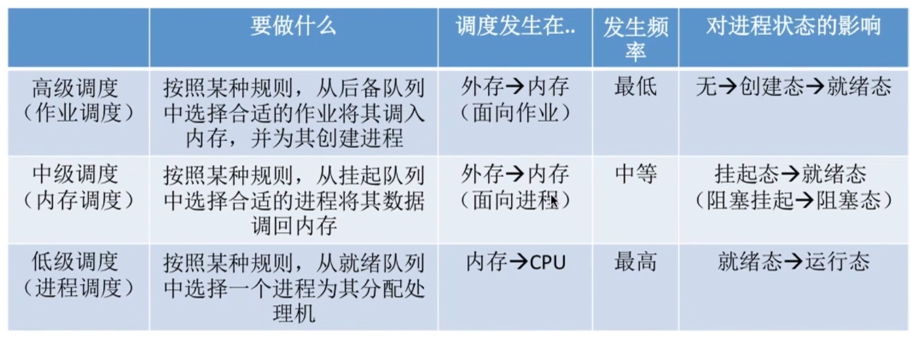

##### （2）进程七状态模型：

暂时调回外存等待的进程状态称为<font color='#BAOC2F'>挂起状态</font>（挂起态，suspend）

将挂起状态进一步细分可分为<font color='#BAOC2F'>就绪挂起</font>、<font color='#BAOC2F'>阻塞挂起</font>两种状态，则将五模型进一步补充为七模型：

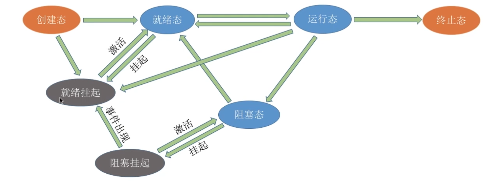

1. 挂起和阻塞的区别：两种状态都是暂时不能获取CPU的服务，但<font color='#BAOC2F'>挂起态</font>是将<font color='#BAOC2F'>进程映射到外存中</font>，而阻塞态下<font color='#BAOC2F'>进程映像还在内存中</font>。
2. 有的操作系统会把就绪挂起、阻塞挂起分为两个队列，甚至会根据阻塞的原因再<font color='#BAOC2F'>将阻塞挂起进程</font>进一步<font color='#BAOC2F'>细分为多个队列</font>。

#### 2.进程调度（低级调度）

进程调度，就是按照某种算法<font color='#BAOC2F'>从就绪队列中选择一个进程为其分配处理机</font>。

##### （1）调度时机：


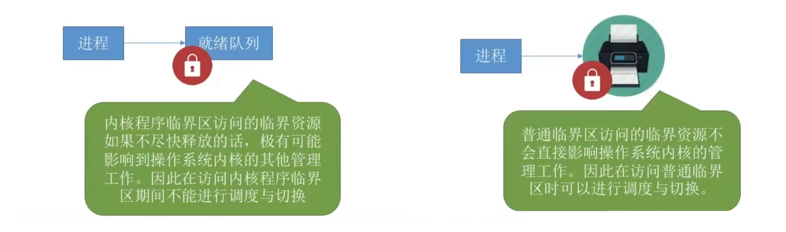

##### （2）调度方式：

==抢占式调度方式==：

抢占式调度方式，又称为剥夺调度方式。

当一个进程正在处理机上执行时，如果有一个更重要 or 更紧迫的进程需要使用处理机，则<font color='#BAOC2F'>立即暂停正在执行的进程</font>，将处理机分配给更重要紧迫的那个进程。


==非抢占式调度方式==：

非抢占式调度方式，又称为非剥夺调度方式。

只允许进程主动放弃处理机，在运行过程中即便有更紧迫的任务到达，当前进程依然会继续使用处理机，直到该进程终止 or 主动要求进入阻塞状态。


##### （3）进程切换的过程

进程切换的过程完成的任务：

1. 对原来运行的<font color='#BAOC2F'>进程各种数据的保存</font>。
2. 对新的进程<font color='#BAOC2F'>各种数据的恢复</font>。

> 注：进程切换是有代价的，因此如果过于频繁的进行进程调度&切换，必然会使整个系统的效率降低。

#### 3.调度算法评价指标

1. CPU利用率：指的是CPU忙碌的时间占总时间的比例（通常考查<font color='#BAOC2F'>多道程序并发执行</font>的情况）

2. 系统吞吐量：单位时间内<font color='#BAOC2F'>完成作业的数量</font>，

3. 周转时间：指从作业被<font color='#BAOC2F'>提交给系统开始</font>到<font color='#BAOC2F'>作业完成</font>为止，这段时间的间隔

    包括作业在外存后备队列上等待作业调度（高级调度）的时间、

    进程在就绪队列上等待进程调度（低级调度）的时间、

    进程在CPU上执行的时间、

    进程等待IO操作完成的时间

    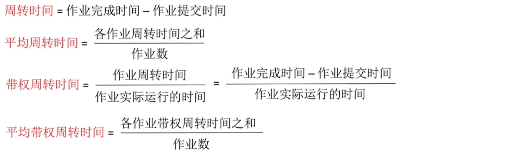

4. 等待时间：指进程 or 作业处于等待处理机状态的时间之和，等待时间越长用户满意度越低。

5. 响应时间：指从用户提交请求到首次产生响应所用的时间。

#### 4.批处理系统调度

##### （1）FCFS

FCFS,First Come First Serve先来先服务算法

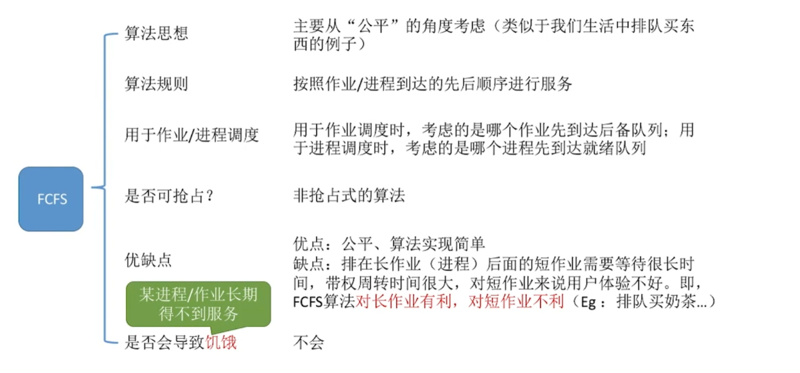

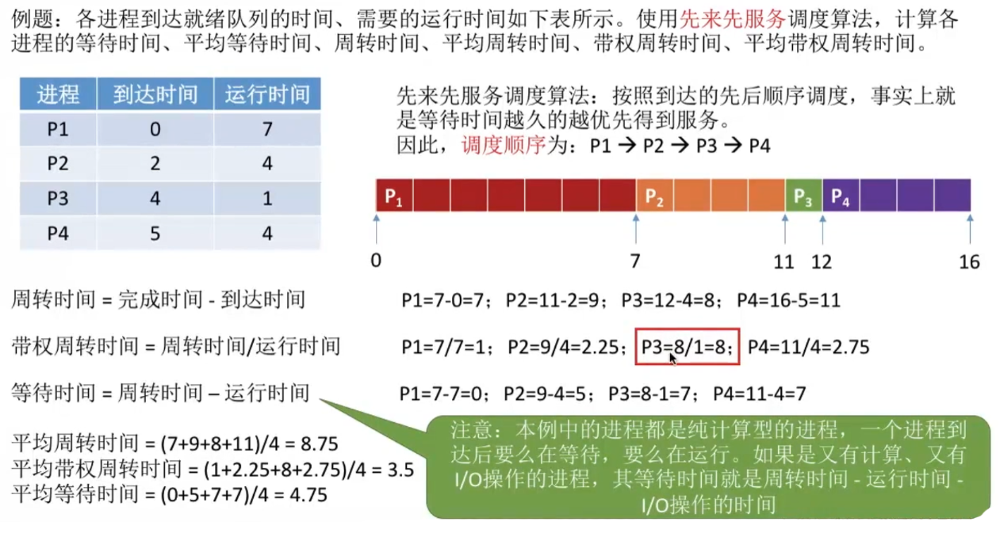

##### （2）SJF&SRTN

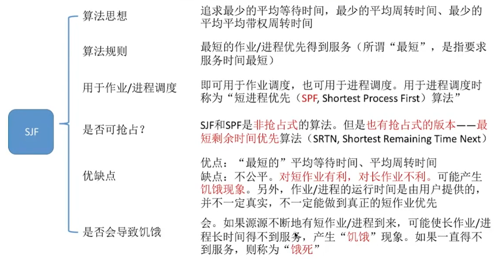

SJF,Shortest Job First短作业优先算法（非抢占式）

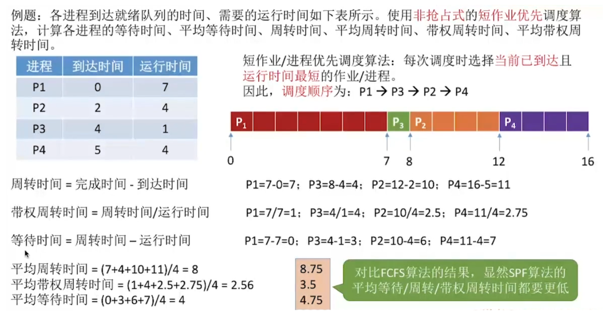

SRTN,Shortest Remaining Time Next最短剩余时间优先算法（抢占式）

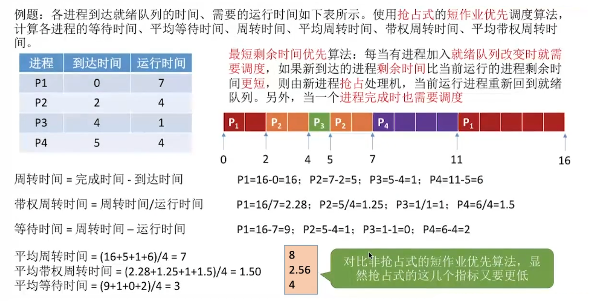

##### （3）HRRN

HRRN,Hightest Response Ratio Next高响应比优先算法

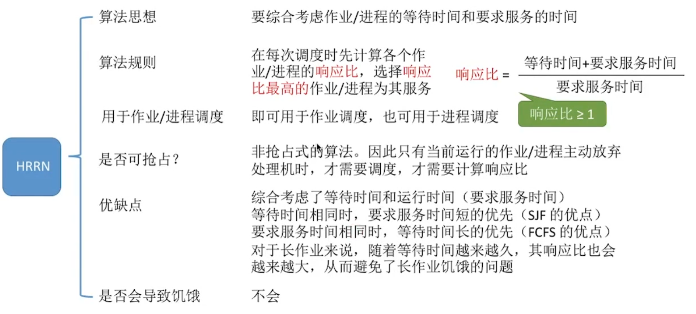

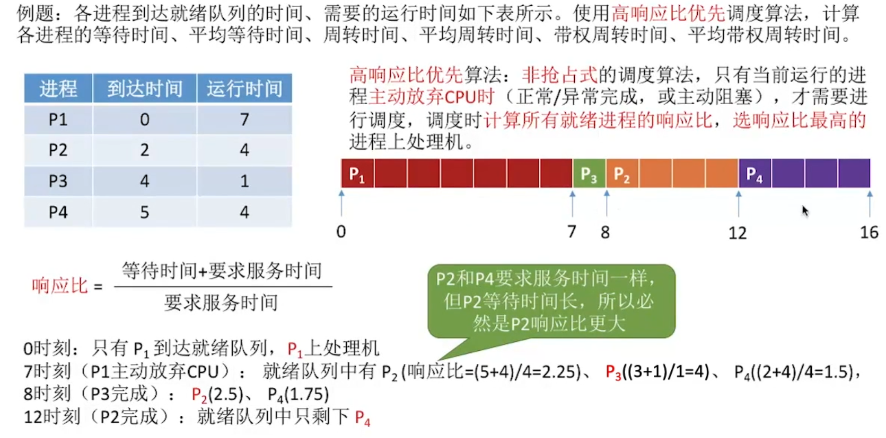

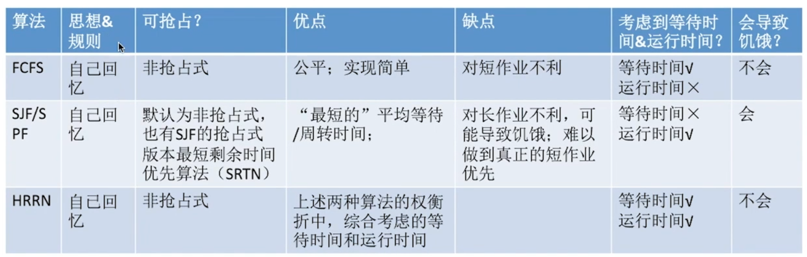

批处理系统的调度算法主要关心对用户的公平性、平均周转时间、平均等待时间等<font color='#BAOC2F'>评价系统整体性能</font>的指标，

不关心响应时间、不区分任务的紧急程度，因此对于用户来说交互性十分的糟糕（早期的批处理系统）。

#### 5.交互式系统调度

##### （1）RR

RR,Round-Robin时间片轮转

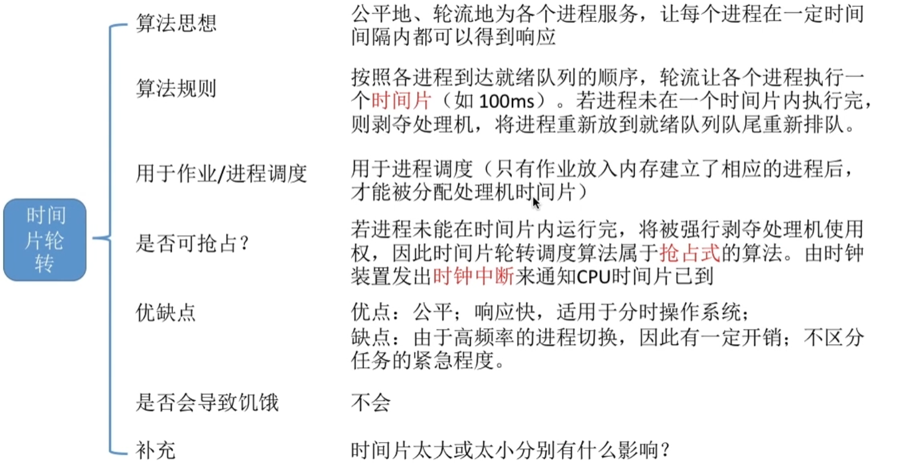

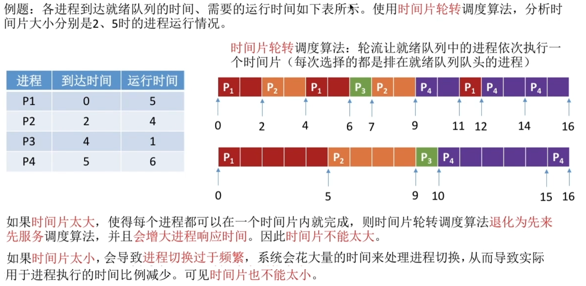

##### （2）优先级

优先级调度算法：

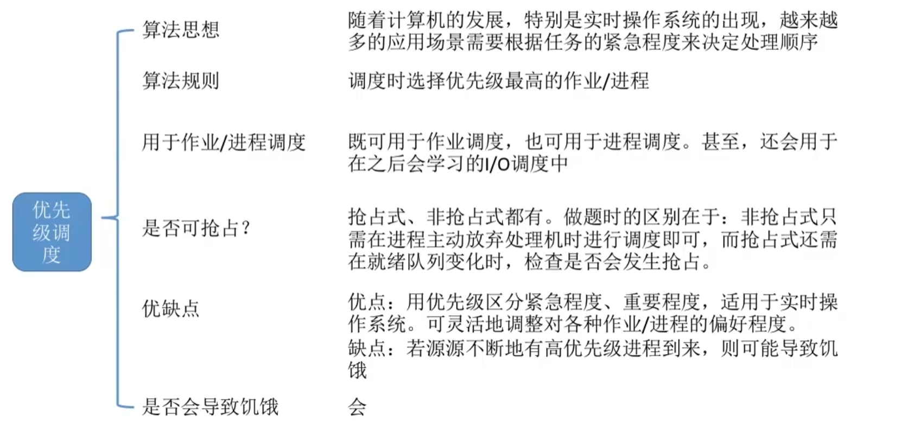

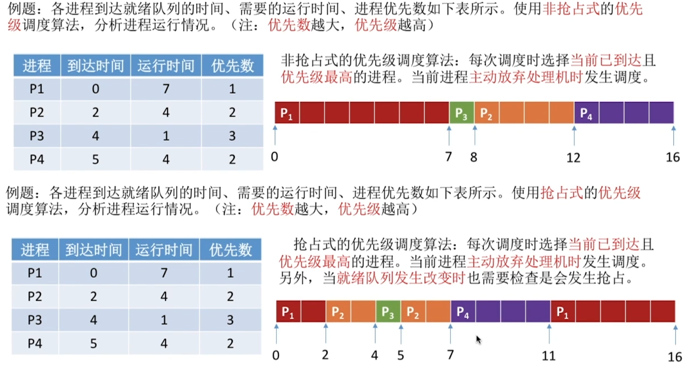

##### （3）多级反馈队列

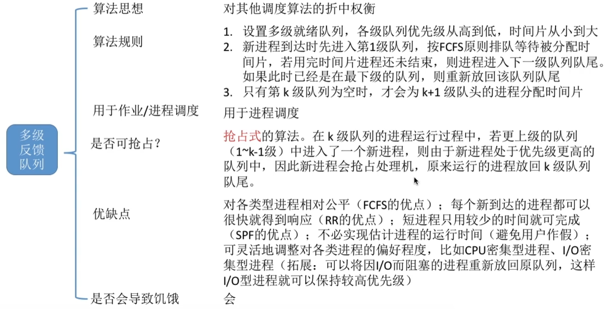

1. 设置多级就绪队列，各级队列优先级从高到低，时间片从小到大

2. 新进程到达时先进入第1级队列，按照FCFS原则排队等待被分配时间片。

    若用完时间片进程还未结束，则进程进入下一级队列队尾。

    如果此时已经在最下级的队列，则重新放回最下级队列队尾。

3. 只有第k级队列为空时，才会为k+1级队头的进程分配时间片。

4. 被抢占处理机的进程重新放回原队列的队尾，[详细讲解](https://www.bilibili.com/video/BV1Ne4y1k7gD)。

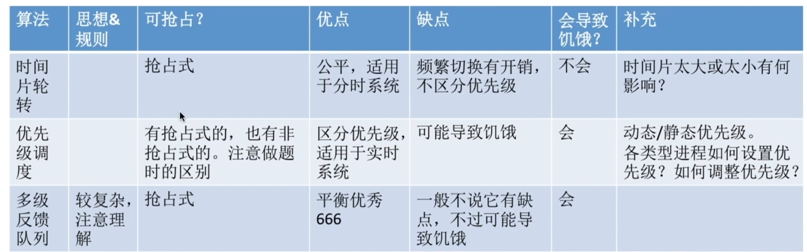

### 三、进程同步与互斥

#### 1.进程同步与互斥：

##### （1）进程同步：

- 进程异步：指的是各并发执行的进程以各自独立的、不可预知的速度向前推进。
- 进程同步：亦称直接制约关系，为完成某种任务而建立的两个或多个进程，在某些位置上<font color='#BAOC2F'>协调它们的工作次序</font>而产生的制约关系。

##### （2）进程互斥：

时间段内<font color='#BAOC2F'>只允许一个进程使用</font>的资源称为<font color='#BAOC2F'>临界资源</font>，进程互斥是指当一个进程访问临界资源时，另一个进程必须等待其结束。

==临界资源的访问逻辑==：

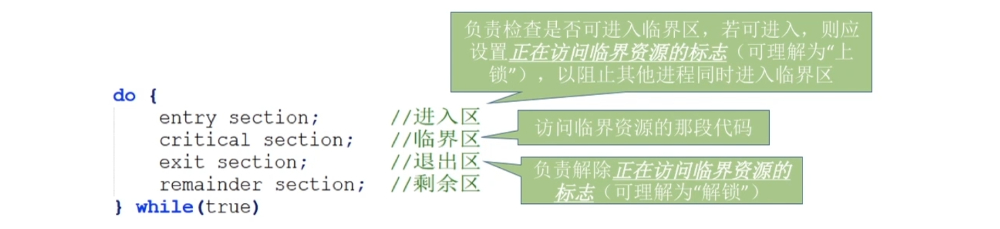

- 临界区是进程中访问临界资源的代码段

- 进入区和退出区是负责实现互斥的代码段

==进程互斥遵循的4个原则==：

1. 空闲让进：临界区空闲时，可以<font color='#BAOC2F'>允许一个请求进入临界区的进程立即进入临界区</font>。
2. 忙则等待：当已有进程进入临界区时，其他试图进入临界区的进程必须等待。
3. 有限等待：对请求访问的进程，应保证能在有限的时间内进入临界区（保证不会饥饿）。
4. 让权等待：当进程不能进入临界区时，应立即释放处理机，防止进程忙等待。

#### 2.进程互斥软件实现

##### （1）单标志法：

算法思想：两个进程在<font color='#BAOC2F'>访问完邻接资源后</font>会把使用临界区的权限转交给另一个进程，每个进程进入临界区的权限只能被另一个进程赋予。

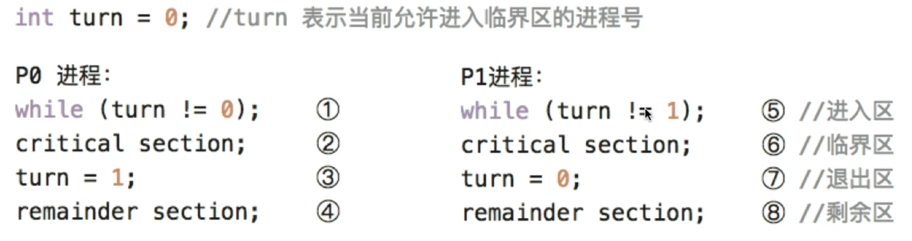

单标志法缺点：违反了<font color='#BAOC2F'>空闲让进</font>的原则。

##### （2）双表示先检查

算法思想：

1. 设置一个布尔型数组`flag[]`，数组中的各个元素用来标记<font color='#BAOC2F'>各进程进入临界区的意愿</font>。flag[0]=true;
2. 每个进程在进入临界区之前，先检查当前是否有其他进程也想进入临界区
3. 如果没有则把自身对应的标志`flag[i]`设置为true，之后开始访问临界区。

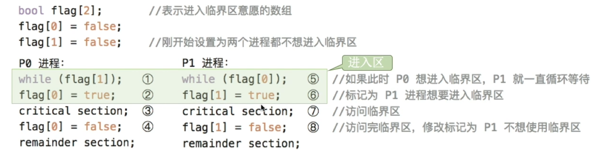

双标志先检查法的缺点：在进程并发时有可能导致临界资源的多进程访问，违反了<font color='#BAOC2F'>忙则等待原则</font>。

##### （3）双标志后检查

算法思想：

1. 设置一个布尔型数组`flag[]`，数组中的各个元素用来标记<font color='#BAOC2F'>各进程进入临界区的意愿</font>。flag[0]=true;
2. 每个进程在进入临界区之前，先把自身对应的标志`flag[i]`设置为true
3. 在检查当前是没有其他进程也想进入临界区，之后开始访问临界区。

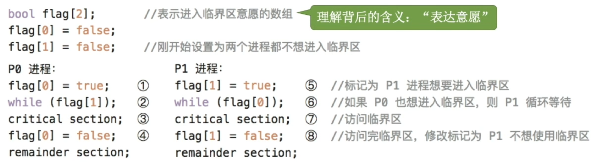

双标志后检查法的缺点：在进程并发时有可能导致各进程都长期无法访问临界资源的饥饿现象，违反了<font color='#BAOC2F'>空闲让进</font>与<font color='#BAOC2F'>有限等待</font>原则。

##### （4）Peterson算法

Peterson算法结合了双标志与单标志的思想，如果双方都想进入临界区，则可以让某个进程进行谦让。

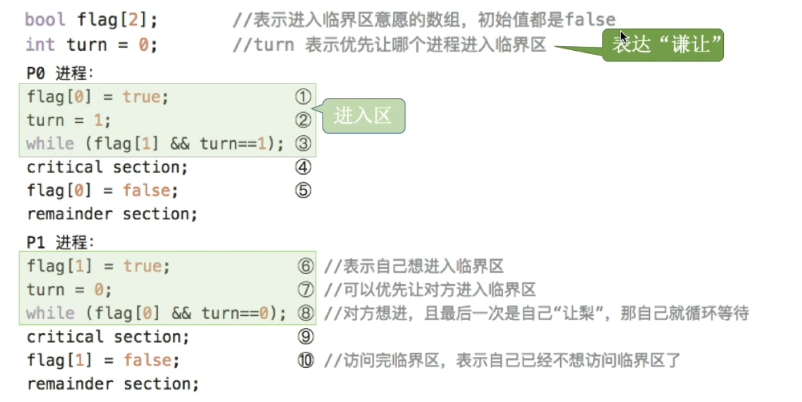

Peterson算法利用软件方法解决了进程互斥问题，遵循了空闲让进、忙着等待、有限等待原则，但是仍然未遵循<font color='#BAOC2F'>让权等待原则</font>。

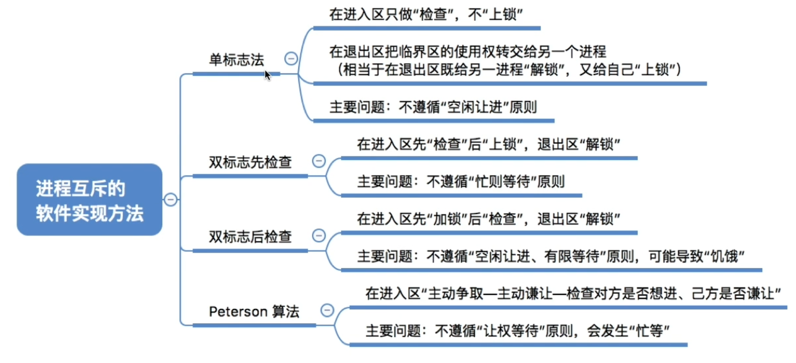

#### 3.进程互斥硬件实现

##### （1）中断屏蔽算法

中断屏蔽算法是利用开/关中断指令实现，与原语的实现思想相同，在某进程开始开始访问临界资源到结束都不允许被中断。


- 优点：简单、高效
- 缺点：不适用于多处理机，且只适用于操作系统的内核进程，不适用于用户进程（随意使用危险）。

##### （2）TestAndSet（TS/TSL）

TSL指令是利用硬件实现的，执行过程不允许被中断。

TSL指令将上锁与检查操作，用硬件的方式变成了一气呵成的原子操作。

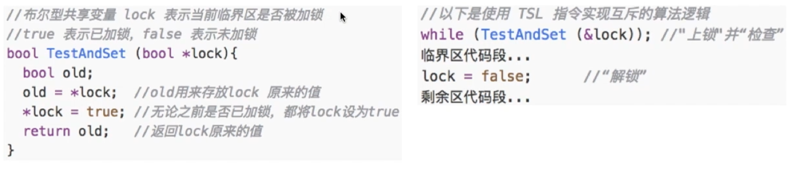

- 优点：实现简单，无序像软件实现方式一样检查是否会有逻辑漏洞，且适用于多处理机环境。
- 缺点：不满足让权等待原则，暂时无法进入临界区的进程会占用CPU并循环执行TSL指令，从而导致忙等。

##### （3）Swap指令（XCHG）

Swap/XCHG指令利用硬件实现执行的过程不允许被中断，只能一气呵成。

逻辑上看Swap与TSL并无太大区别，

1. 都是先记录下此时临界区是否已经被上锁，再将上锁标记lock设置为true，最后检查old
2. 如果old为false则说明之前没有别的进程对临界区上锁，则可跳出循环、进入临界区

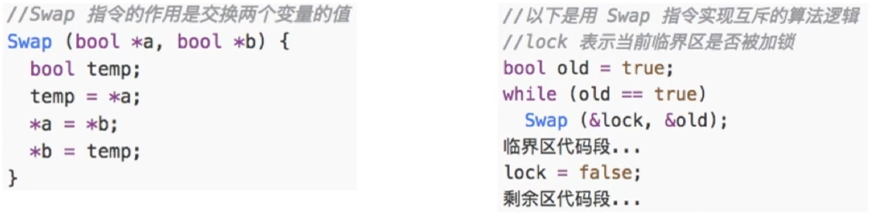

- 优点：实现简单，无序像软件实现方式一样检查是否会有逻辑漏洞，且适用于多处理机环境。
- 缺点：不满足让权等待原则，暂时无法进入临界区的进程会占用CPU并循环执行TSL指令，从而导致忙等。

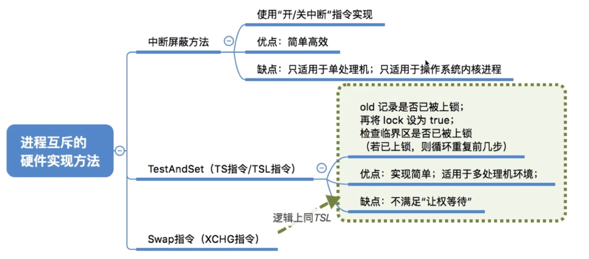

#### 4.Semaphore信号量机制

用户进程可以通过使用操作系统<font color='#BAOC2F'>提供的一对原语</font>来对信号量进行操作，从而很方便的实现了进程互斥、进程同步。

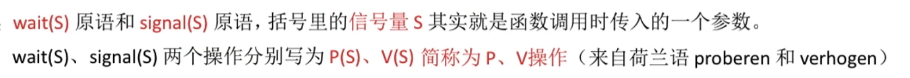

##### （1）整型信号量

用一个整数型变量作为信号量，用来表示系统中某种资源的数量。对信号量的操作只有三种：初始化、P操作、V操作

```cpp
int S = 1; //初始化整型信号量S，表示当前系统中可用资源（打印机）的数量
void wait(int S) { //wait原语相当于进入区
    while (S <= 0);//如果资源不够则一直循环等待
    S = S - 1;//如果资源足够就占用一个资源
}
void signal(int S) { //signal原语相当于退出区
    S = S + 1;//使用完资源后，在退出区释放资源
}
```

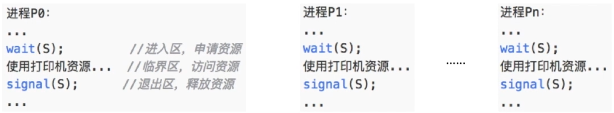

- 缺点：不满足让权等待原则，会发生忙等的情况。

##### （2）记录型信号量

整型信号量有一个很大的缺陷：

如果一个进程暂时无法进入临界区（资源不够），该进程会一直占用处理机循环检查导致忙等，可以采用记录型信号量解决。

记录型信号量即用<font color='#BAOC2F'>记录型数据结构</font>表示信号量。

```cpp
/*记录型信号量定义*/
typedef struct {
    int value;//剩余资源数
    struct process *L;//等待队列
} semaphore;
void wait(semaphore S) {
    S.value--;
    if (S.value < 0) {
        block(S.L);
    }
}
void signal(semaphore S) {
    s.value++;
    if (S.value <= 0) {
        wakeup(S.L);
    }
}
```

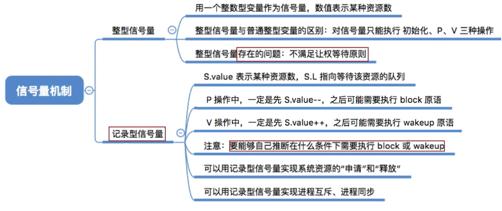

##### （3）Semaphore实现进程互斥&同步★

进程互斥的软件与硬件实现都没有解决让权等待的问题，用信号量机制中的阻塞与唤醒机制可以解决：

==信号量机制实现进程互斥==：

1. 分析并发进程的关键活动，划定临界区（如对临界资源打印机的访问）
2. 设置互斥信号量mutex，并初始化为1
3. 在进入区P(mutex)申请资源
4. 在退出去V(mutex)释放资源

```cpp
/*信号量机制实现互斥*/
semaphore mutex = 1;
P1() {
    ...
    P(mutex);//使用临界资源前需要加锁
    临界区代码段...
    V(mutex);//使用临界资源后需要解锁
    ...
}
P2() {
    ...
    P(mutex);
    临界区代码段...
    V(mutex);
    ...
}
```

==信号量机制实现进程同步（难点）==：

进程同步：是指要让各个并发的进程按照要求有序的推进。

1. 分析何处需要实现进程的同步关系（保证前后顺序）
2. 设置同步信号量S，并初始化为0
3. 在前操作之后执行`V(S)`
4. 在后操作之前执行`P(S)`

```cpp
/*信号量机制实现同步*/
semaphore S = 0;
P1() {
    代码1;
    代码2;
    V(S);//释放资源
    代码3;
}
P2() {
    P(S);
    代码4;
    代码5;
    代码6;
}
```

##### （4）Semaphore实现前驱关系：

要求代码按照如下前驱图所示的顺序来执行，每1对前驱关系都是1个进程同步问题（多级同步问题）

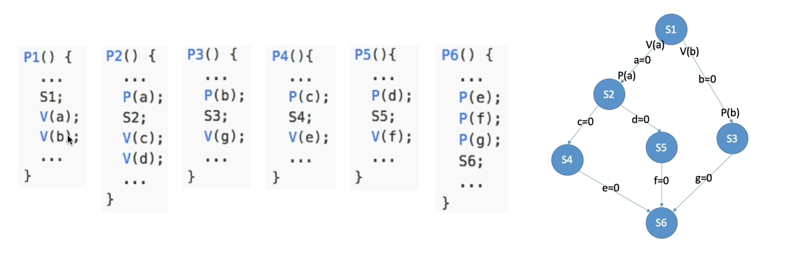

#### 5.进程同步互斥经典问题★

PV操作问题分析步骤：

1. 关系分析：找出问题中描述的各个进程，分析它们之间的同步or互斥关系。
2. 整理思路：根据各个进程的操作流程确定PV操作的大致顺序。
3. 设置信号量：根据题目条件确定信号量的初始值。（互斥信号量一般为1，同步信号量初始值根据对应资源的初值确定）

##### （1）生产者消费者（同步）

系统中有一组生产者进程和一组消费者进程，

生产者进程每次生产一个产品放入缓冲区，消费者进程每次从缓冲区中取出一个产品并使用。共享一个初始为空、大小为n的缓冲区。

1. 只有<font color='#BAOC2F'>缓冲区未满</font>时生产者才能将产品放入缓冲区中，否则必须等待。
2. 只有<font color='#BAOC2F'>缓冲区不空</font>时消费者才能从缓冲区中取出产品，否则必须等待。
3. 缓冲区是临界资源，各个进程必须互斥的访问。


```cpp
/*生产者消费者问题核心代码*/
void producer() {
    while(1) {
        produce a good;
        
        P(empty);//消耗一个空闲缓冲区
        pull this good into buffer;
        V(full);//增加一个产品数量
    }
}
void consumer() {
    while(1) {
        P(full);//申请消耗一个产品
        take this good out from buffer;
        V(empty);//增加一个空闲缓冲区
        
        consume a good;
    }
}
```

```cpp
semaphore mutex = 1;//互斥信号量
semaphore empty = n;//同步信号量
semaphore full = 0;//同步信号量
void producer() {
    while(1) {
        produce a good;
        P(empty);
        P(mutex);
        pull this good into buffer;
        V(mutex);
        V(full);
    }
}
void consumer() {
    while(1) {
        P(full);
        P(mutex);
        take this good out from buffer;
        V(mutex);
        V(empty);
        consume a good;
    }
}
```

有的时候是生产者进程需要等待消费者进程，有的时候是消费者进程需要等待生产者进程，需要设置两对不同的信号量。

> 注：实现互斥的P操作一定要在实现同步的P操作之后，否则会出现死锁的情况。

##### （2）多生成者多消费者nvn：


1. 父亲将苹果放入盘子后，女儿才能取出苹果
2. 母亲将橘子放入盘子后，儿子才能取出橘子
3. 只有盘子为空时，父亲与母亲才能放入水果
4. 对缓冲区（盘子）的访问要互斥的进行


```cpp
/*多生产者多消费者问题核心代码*/
void father() {
    prepare a apple;
    
    P(plate);
    put this apple into the plate;
    V(apple);
}
void mother() {
    prepare a orange;
    
    P(plate);
    put this orange into the plate;
    V(orange);
}
void daughter() {
    P(apple);
    take this orange from the plate;
    V(plate);
    
    eat this apple;
}
void son() {
    P(orange);
    take this apple from the plate;
    V(plate);
    
    eat this orange;
}
```

```cpp
semaphore mutex = 1;//缓冲区互斥
semaphore apple = 0;//盘子中苹果的数量
semaphore orange = 0;//盘子中橘子的数量
semaphore plate = 1;//盘子中还可以方多少个水果

void father() {
    prepare a apple;
    P(plate);
    P(mutex);
    put this apple into the plate;
    V(mutex);
    V(apple);
}
void mother() {
    prepare a orange;
    P(plate);
    P(mutex);
    put this orange into the plate;
    V(mutex);
    V(orange);
}
void daughter() {
    P(apple);
    P(mutex);
    take this orange from the plate;
    V(mutex);
    V(plate);
    eat this apple;
}
void son() {
    P(orange);
    P(mutex);
    take this apple from the plate;
    V(mutex);
    V(plate);
    eat this orange;
}
```

可省去互斥mutex信号量的PV操作，

原因是缓冲区的大小为1，在任意时刻apple、orange、plate同步信号量中最多只有1个为1，在任意时刻最多只有一个进程的P操作。

```cpp
semaphore mutex = 1;//缓冲区互斥
semaphore apple = 0;//盘子中苹果的数量
semaphore orange = 0;//盘子中橘子的数量
semaphore plate = 1;//盘子中还可以方多少个水果

void father() {
    prepare a apple;
    P(plate);
    put this apple into the plate;
    V(apple);
}
void mother() {
    prepare a orange;
    P(plate);
    put this orange into the plate;
    V(orange);
}
void daughter() {
    P(apple);
    take this orange from the plate;
    V(plate);
    eat this apple;
}
void son() {
    P(orange);
    take this apple from the plate;
    V(plate);
    eat this orange;
}
```

##### （3）吸烟者问题1vn：

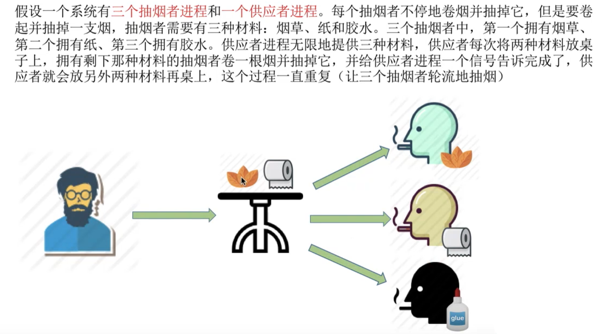

1. 桌子上有组合1纸与胶水时，则第一个抽烟者取走材料
2. 桌子上有组合2烟草与胶水时，则第二个抽烟者取走材料
3. 桌子上有组合3烟草与纸时，则第三个抽烟者取走材料
4. 当抽烟者发出完成抽烟信号，供应者将下一个组合放到桌子上
5. 对缓冲区（桌子）的访问要互斥的进行

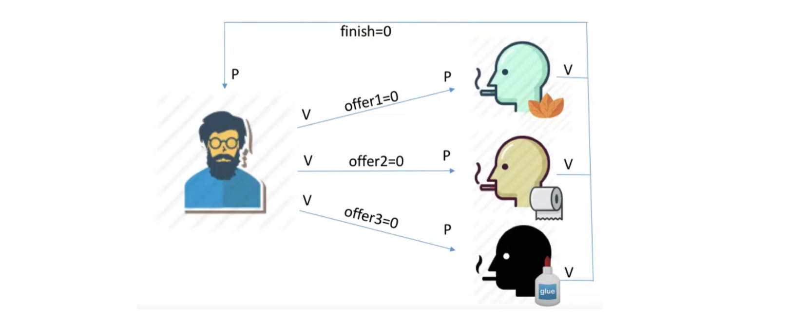

```cpp
semaphore offer1 = 0;
semaphore offer2 = 0;
semaphore offer3 = 0;
semaphore finish = 0;

int i = 0;//用于实现抽烟者轮流抽烟
void provider() {
    while(1) {
        if (i == 0) {
            Put combination 1 into the buffer;
            V(offer1);
        } else if (i == 1) {
            Put combination 2 into the buffer;
            V(offer2);
        } else if (i == 2) {
            Put combination 3 into the buffer;
            V(offer3);
        }
        i = (i + 1) % 3;
        P(finish);
    }
}
void smoker1() {
    while(1) {
        P(offer1);
        take combination1 from the buffer;
        V(finish);
    }
}
void smoker2() {
    while(1) {
        P(offer1);
        take combination1 from the buffer;
        V(finish);
    }
}
void smoker3() {
    while(1) {
        P(offer1);
        take combination1 from the buffer;
        V(finish);
    }
}
```

##### （4）读者写者问题（互斥）

有读者写者两组并发进程共享一个文件，

当两个或两个以上的读进程同时访问共享数据时，不会产生副作用。

但若某个写进程和其他进程（读进程or写进程）同时访问共享数据时，则可能导致数据不一致的错误。因此要求：

```cpp
1.允许多个读者可以同时对文件执行读操作
2.只允许一个写者往文件中写信息
3.任一写者在完成写操作之前不允许其他读者或写者工作
4.写者执行写操作之前，应该让已有的读者和写者全部都退出
```

- 两类进程：写进程、读进程

- 互斥关系：写进程-写进程、写进程-读进程、读进程与读进程之前不存在互斥关系

```cpp
/*1.读者写者互斥访问文件*/
semaphore rw = 1;//用于实现对共享文件的互斥访问
void writer() {
    while(1) {
        P(rw);//写文件前加锁
        write data to the file;
        V(rw);//写文件后解锁
    }
}
void reader() {
    while(1) {
        P(rw);
        read data from the file;
        V(rw);
    }
}
/*读写与读写之间不可同时访问文件*/
```

```cpp
/*1.读者写者互斥访问文件*/
/*2.修改读者与读者之间可同时访问文件*/
semaphore rw = 1;
count = 0;//用于记录当前有几个读进程在访问文件

void writer() {
    while(1) {
        P(rw);//写文件前加锁
        write data to the file;
        V(rw);//写文件后解锁
    }
}
void reader() {
    while(1) {
        if (count == 0) P(rw);
        count++;
        read data from the file;
        count--;
        if (count == 0) V(rw);
    }
}
/*如果两个读进程并发执行，则count==0时两个进程也许能同时通过if语句，从而都会执行P(rw)导致第二个读进程阻塞*/
/*问题源头：count变量的检查与赋值无法一气呵成，中间有可能有并发进程插入*/
```

```cpp
/*1.读者写者互斥访问文件*/
/*2.修改读者与读者之间可同时访问文件*/
/*3.设置互斥信号量mutext用于保证对count的互斥访问*/
semaphore rw = 1;//用于实现对共享文件的互斥访问
count = 0;//用于记录当前有几个读进程在访问文件
semaphore mutex = 1;//新增mutex互斥信号量，用于保证对count的互斥访问

void writer() {
    while(1) {
        P(rw);//写文件前加锁
        write data to the file;
        V(rw);//写文件后解锁
    }
}
void reader() {
    while(1) {
        P(mutex);
        if (count == 0) P(rw);
        count++;
        V(mutex);
        read data from the file;
        P(mutex);
        count--;
        if (count == 0) V(rw);
        V(mutex);
    }
}
/*只要有读进程还在继续，写进程就需要一直阻塞可能饿死*/
```

```cpp
/*1.读者写者互斥访问文件*/
/*2.修改读者与读者之间可同时访问文件*/
/*3.设置互斥信号量mutext用于保证对count的互斥访问,解决第二个读进程阻塞的问题*/
/*4.设置互斥信号量w用于实现写进程优先,解决写进程饥饿的问题*/
semaphore rw = 1;//用于实现对共享文件的互斥访问
count = 0;//用于记录当前有几个读进程在访问文件
semaphore mutex = 1;//用于保证对count的互斥访问
semaphore w = 1;//用于实现写优先

void writer() {
    while(1) {
        P(w);
        P(rw);//写文件前加锁
        write data to the file;
        V(rw);//写文件后解锁
        V(w);
    }
}
void reader() {
    while(1) {
        P(w);
        P(mutex);
        if (count == 0) P(rw);
        count++;
        V(mutex);
        V(w);
        read data from the file;
        P(mutex);
        count--;
        if (count == 0) V(rw);
        V(mutex);
    }
}
```

==读者与写者问题的核心思想在于==：

1. 设置一个计数器count用来记录当前正在访问共享文件的读进程数量，
2. 用count的值来判断当前进入的进程是否是最后一个读进程，从而做出不同的处理方式。
3. 另外对于count变量的检查与赋值一气呵成的实现方法，自然也应该想到使用互斥信号量。

##### （5）哲学家进餐问题：

一张圆桌上坐着5名哲学家，每两个哲学家之间的桌上摆着一根筷子，桌子的中间是一碗米饭。

哲学家在思考时并不影响其他人，只有当哲学家饥饿时才会试图拿起左右两侧的筷子，如果筷子已在其他人的手上则需要等待。

饥饿的哲学家只有同时拿起两根筷子时才能开始进餐，进餐完毕后继续思考。


哲学家进餐问题中<font color='#BAOC2F'>只有互斥关系</font>，但与之前遇到的问题不同的是，每个则学家需要同时持有两个临界资源，因此有死锁的隐患。

如何避免<font color='#BAOC2F'>临界资源分配不当造成死锁</font>的问题，是哲学家进餐问题的精髓。

信号量设置：

1. 互斥信号量数组`chopstick[5]={1,1,1,1,1}`用于实现对5根筷子的互斥访问。
2. 对哲学家按照0~4进行编号，哲学家`i`左边的筷子编号为`i`，右边的筷子编号为`(i+1)%5`

```cpp
semaphore chopstick[5] = {1,1,1,1,1};
pi() {//i号哲学家的进程
   while(1) {
       P(chopstick[i]);
       P(chopstick[(i+1)%5]);
       Have a meal;
       V(chopstick[i]);
       V(chopstick[(i+1)%5]);
       
       Ponder questions;
   }
}
/*存在问题当如果5个哲学家并发的拿起了自己左手边的筷子，则所有哲学家都会循环等待右边的人放下筷子（阻塞）造成死锁*/
```

```cpp
/*1.添加限制条件最多只允许4个哲学家进餐，以解决死锁问题*/
/*2.添加限制条件：
	要求奇数号哲学家先拿起左边的筷子，然后再拿起右边的筷子
	要求偶数号哲学家先拿起右边的筷子，然后再拿起左边的筷子
	这种方式可以保证如果相邻的两个奇偶号哲学家都想吃饭，那么只会有其中一个可以拿起筷子，另一个会直接堵塞
	从而以解决死锁的问题*/
/*3.添加限制条件：仅当一个哲学家左右两根筷子都可使用时，才允许他抓起筷子*/
semaphore chopstick[5] = {1,1,1,1,1};
semaphore mutex = 1;//i号哲学家互斥的取筷子
pi() {
   while(1) {
       P(mutex);
       P(chopstick[i]);
       P(chopstick[(i+1)%5]);
       V(mutex);
       Have a meal;
       V(chopstick[i]);
       V(chopstick[(i+1)%5]);
       
       Ponder questions;
   }
}
```

#### 6.Monitors管程同步机制

##### （1）管程定义与特征：

信号量机制存在的问题导致编程程序困难、易出错，管程属于一种高级的进程同步机制（不需要再关注PV操作）

==管程的组成==：

1. 局部于管程的<font color='#BAOC2F'>共享数据结构</font>说明
2. 对该数据结构进行操作or访问的<font color='#BAOC2F'>一组过程（函数）</font>
3. 对局部于管程的共享数据设置初始值的语句
4. 管程有一个名字

==管程的基本特征==：

1. 局部于管程的数据只能被局部于管程的过程所访问
2. 一个进程只有<font color='#BAOC2F'>通过调用管程的过程</font>才能进入管程访问共享数据（常考）
3. 每次<font color='#BAOC2F'>仅允许一个进程</font>在管程内执行某个内部程序（常考）

##### （2）管程解决生产者消费者问题：

```java
monitor ProducerConsumer {
    condition full, empty;//条件变量用于实现同步（排队）
    int count = 0;
    void insert(Item item) {//将item放入缓冲区中
        if (count == N) wait(full);
        count++;
        insert_item(item);
        if (count == 1) signal(empty);
    }
    Item remove() {//从缓冲区中取出一个产品
        if (count == 0) wait(empty);
        count--;
        if (count == N - 1) signal(full);
        return remove_item();
    }
}
```

```cpp
//生产者进程
void producer() {
    while(1) {
        item = produce a item;
        ProdecerConsumer.insert(item);
    }
}
//消费者进程
void consumer() {
    while(1) {
        item = ProdecerConsumer.remove();
        consume a item;
    }
}
```

##### （3）Java中的管程机制：

```java
static class monitor {
    private Item buffer[] = new Item[N];
    private int count = 0;

    /**
     * 每次只有一个线程进行insert函数
     * 如果多个线程同时调用insert函数，则后来者需要排队进行等待
     * @param item
     */
    public synchronized void insert(Item item) {
        ......
    }
}
```

### 四、进程死锁

#### 1.死锁概述：

- 死锁：在并发环境下各进程竞争资源，造成相互等待对方手里的资源，导致各进程都阻塞无法向前推进的现象。
- 饥饿：某进程由于长期得不到想要的资源，无法向前推进的现象。
- 死循环：某进程执行过程中一直跳不出某个循环的现象。

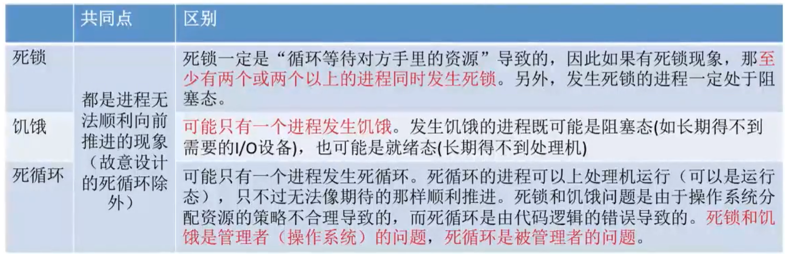

==死锁的必要条件==：

产生死锁必须同时满足以下4个条件：

1. 互斥条件：只有对必须互斥使用资源的争抢，才会导致死锁现象。

2. 不可剥夺条件：进程所获得的资源在未使用完之前，不能由其他进程强行夺走只能主动释放。

3. 请求与保持条件：

    进程已经保持了至少一个资源，但又提出了新的资源请求。

    而该资源又被其他进程占有，此时请求进程被阻塞，但又对自己已有的资源保持不释放。

4. 循环等待条件：存在一种进程资源的<font color='#BAOC2F'>循环等待链</font>，链中的每个进程已获得的资源同时被下一个进程所请求。

> 注：发生循环等待未必会导致死锁现象，如果同类资源大于1则即使发生循环等待也不会死锁，否则一定会发生死锁（考点）。

==常见的死锁场景==：

1. 对系统资源的竞争：各进程对不可剥夺的资源进行竞争可能会引起死锁，对可剥夺的资源（CPU）竞争不会引起死锁。
2. 进程推进顺序非法：请求和释放资源的顺序不当，同样也会导致死锁。
3. 信号量使用不当：如生产者-消费者问题中，如果实现互斥的P操作在实现同步的P操作之前，就有可能会导致死锁。

> 注：可以死锁发生的场景可以总结为，当不可剥夺资源的分配出现问题时，就会导致死锁现象。

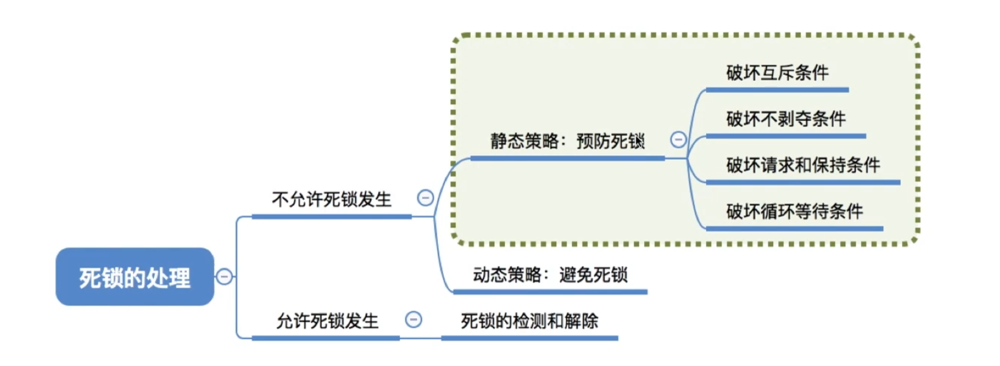

#### 2.死锁的预防：


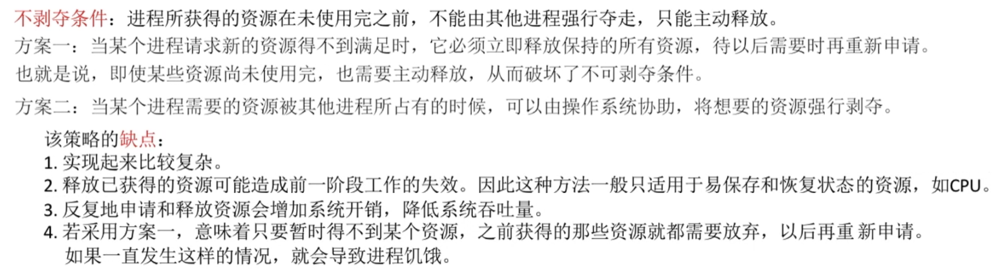


#### 3.死锁的避免（银行家算法）★

- 安全序列：系统按照该序列分配资源，则每个进程都能顺利完成（只要能找到1个安全序列，系统就是安全的）。
- 不安全序列：如果系统按照该序列分配了资源后，找不出任何一个安全的序列，则系统就进入了不安全状态。

> 注：如果系统处于安全状态就一定不会发生死锁，如果处于不安全状态就有可能会发生死锁（考点）。

==银行家算法==：可以在资源分配之前预先判断，这次分配是否会导致系统进入不安全状态，以此决定是否答应资源分配请求。


#### 4.死锁的检查与解除：

##### （1）死锁检测（常考）

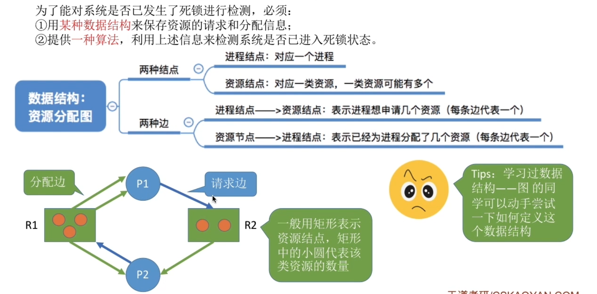

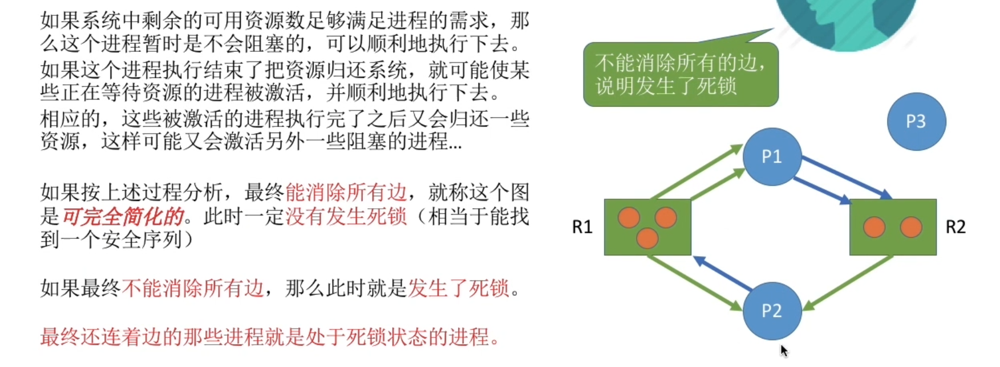

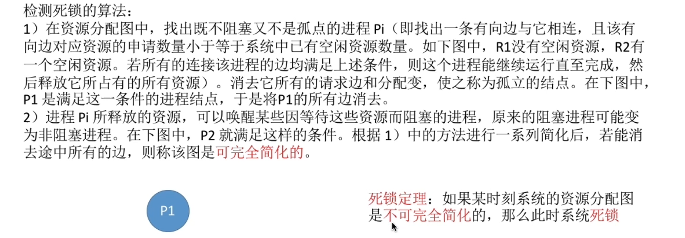

##### （2）死锁解除（选择题）

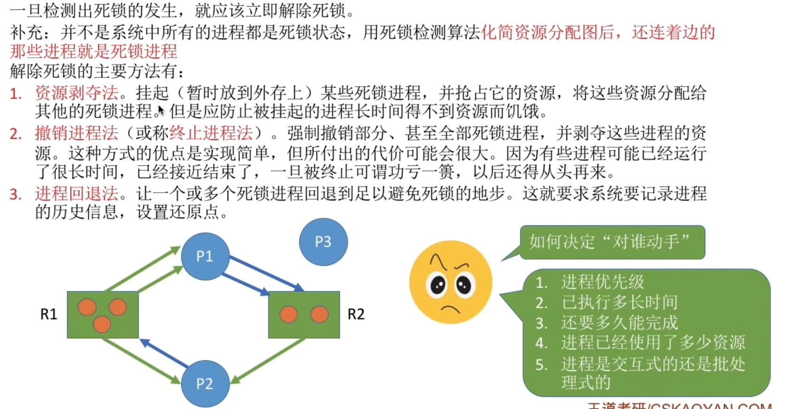


