# 第四章：文件管理

------

### 一、文件目录★

#### 1.文件控制块

文件控制块FCB，File Control Block是实现文件目录的关键数据结构，

双击打开目录时，操作系统会在该目录中找到关键字`照片`对应的目录项，从外存中将目录信息读入内存，目录中的内容就显示了。

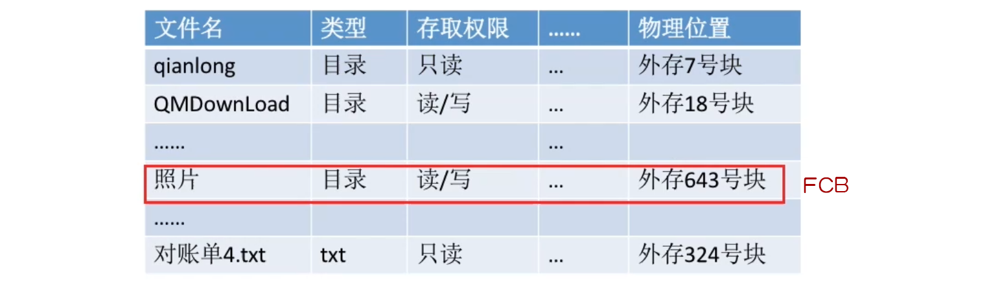

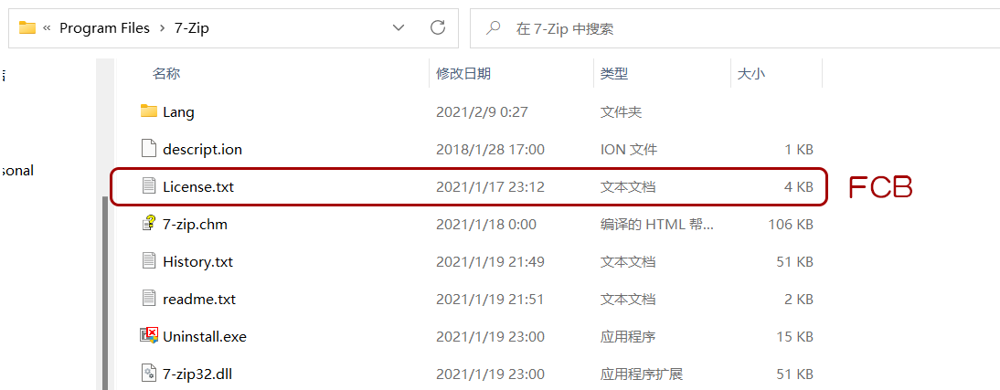

1. FCB的有序集合称为文件目录，1个FCB就是1个文件目录项，
2. FCB中包含了文件的基本信息（文件名、物理地址、逻辑结构、物理结构等）、存取控制信息（读写权限）、使用信息（创建时间）

#### 2.目录结构

##### （1）单级目录结构：

早期操作系统并不支持多级目录，整个系统中只建立一张目录表，每个文件占用一个目录项（不适用与多用户操作系统）。

##### （2）两级目录结构：

早期的多用户操作系统采用两级目录结构，分为主文件目录MFD，MasterFileDirectory和用户文件目录UFD，UserFileDirectory

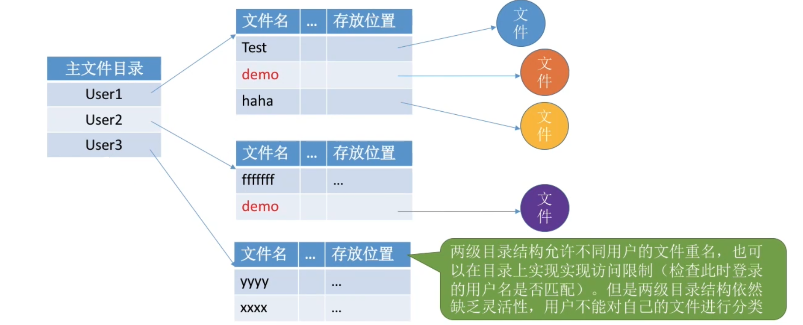

##### （3）多级目录结构：

在多级目录结构/树形目录结构中，用户要访问某个文件时需要用文件路径名标识文件，文件路径名是个字符串各级目录之间用/隔开。

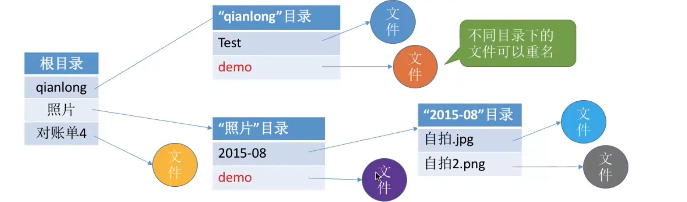

树形目录结构可以很方便地对文件进行分类，层次结构清晰能更有效地进行文件的管理和保护。

但是树形结构不便于实现对文件的共享，于是提出了无环图目录结构。

##### （4）无环图目录结构：

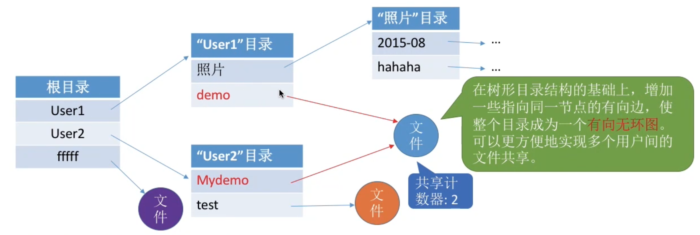

可以用不同文件名指向同一个文件or目录，需要为每个结点设置一个共享计数器用于记录此时有多少个地方在共享该结点。

#### 3.索引结点

索引结点是对文件控制块的优化，在查找各级目录的过程中只需用到文件名这个信息，只有文件名匹配时才需要读出文件的其他信息，

因此可考虑让目录表简化，当文件找到对应的目录项时才需要将索引结点调入内存，存放在外存中的索引结点称为磁盘索引结点，当索引结点放入内存后称为内存索引结点（相比磁盘结点需要增加一些信息）。

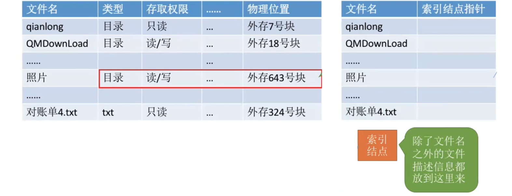

### 二、文件的逻辑结构

无结构文件：文件内部的数据就是一系列二进制流or字符流组成又称为流式文件，如`.txt`文件

有结构文件：由一组相似的记录组成又称记录式文件，每条记录又称若干个数据项组成，如数据库表文件。

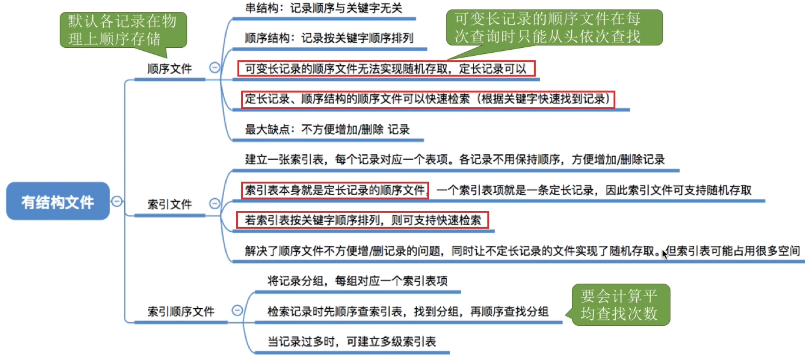

#### 1.顺序文件：

顺序文件：文件中的记录一个个顺序排列（逻辑上），记录可以是定长的or可变长的。各个记录在物理上可以顺序存储or链式存储。

- 串结构：记录之间的顺序与关键字无关
- 顺序结构：记录之间的顺序按关键字顺序排列

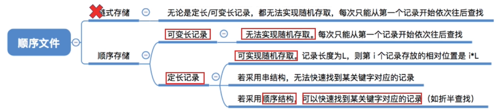

#### 2.索引文件：

索引表本身是定长记录的顺序文件，因此可以快速找到第`i`个记录对应的索引项。

可以将关键字作为索引号内容，按照关键字排序排列则还可以支持按照关键字折半查找。

每当要增加/删除一个记录时，需要对索引表进行修改，由于索引文件有很快的检索速度，因此主要用于对信息处理及时性高的场景。

#### 3.索引顺序文件：

索引顺序文件是索引文件与顺序文件的结合，索引顺序文件中会建立一张索引表，一组文件对应一个索引表项：

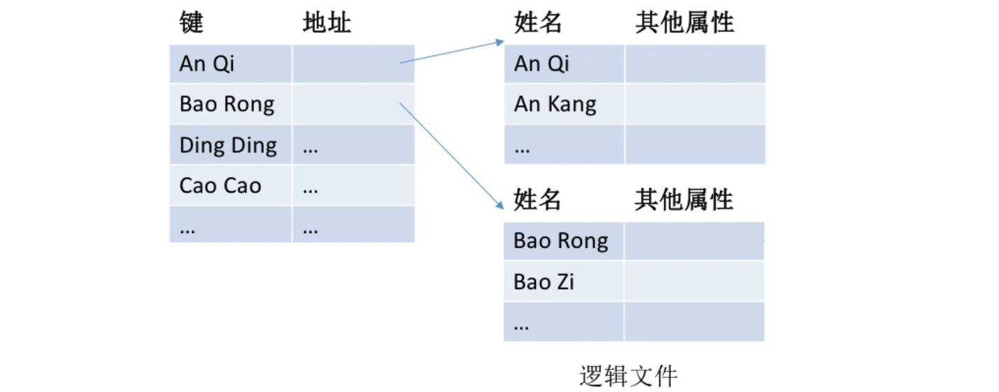

为了进一步提高检索的效率，可以为顺序文件建立多级索引表：

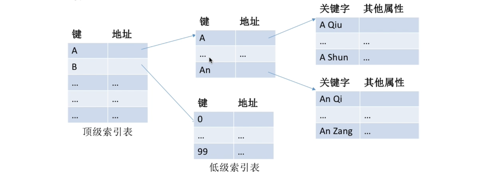

### 三、文件的物理结构★

文件的物理结构主要讨论的是文件数据应该怎样存放在外存中。

与内存管理相同，在外存管理中为了方便对文件数据的管理，文件的逻辑地址空间被分为了一个个文件块。

文件的逻辑地址可以表示为（逻辑块号，块内地址）的形式。

> 注：需要关注操作系统如何将文件块号映射为物理块号。

#### 1.连续分配

连续分配方式要求每个文件在磁盘上占有一组连续的块，

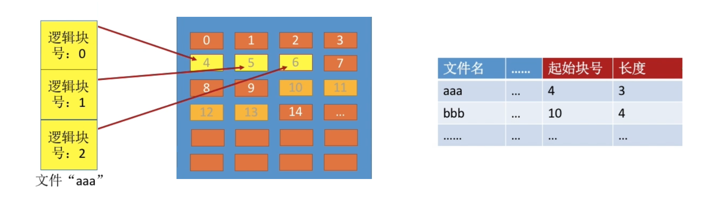

用户只需要给出访问的逻辑块号，操作系统找到该文件对应的目录项PCB，则可算出`物理块号=起始块号+逻辑块号`。

- 优点：连续分配支持顺序访问和直接访问（随机访问），连续分配的文件在顺序读/写时速度最快。
- 缺点：物理上采用连续分配的文件不方便扩展，存储空间利用率较低，会产生难以利用的磁盘碎片。

#### 2.链接分配

链接分配采用离散分配的方式，可以为文件采用离散的磁盘块，分为隐式链接和显式链接两种。

##### （1）隐式链接：

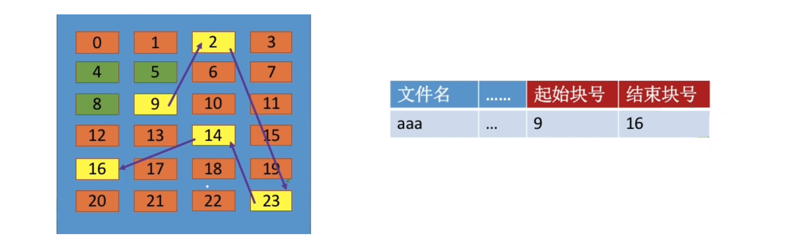

用户只需要给出访问的逻辑块号i，操作系统找到该文件对应的目录项PCB，

从目录中找到起始块号，将0块号逻辑块读入内存，由此知道1号逻辑块存放的物理块号，于是读入1号逻辑快……

- 优点：便于文件的扩展，不会有碎片问题，外存利用率很高。
- 缺点：采用链式分配方式的文件只支持顺序访问不支持随机访问，查找效率很低，存储指针需要耗费少量空间。

##### （2）显式链接：

把用于链接文件各个物理块的指针显式的存放在一张表中，即文件分配表FAT，FileAllocationTable。

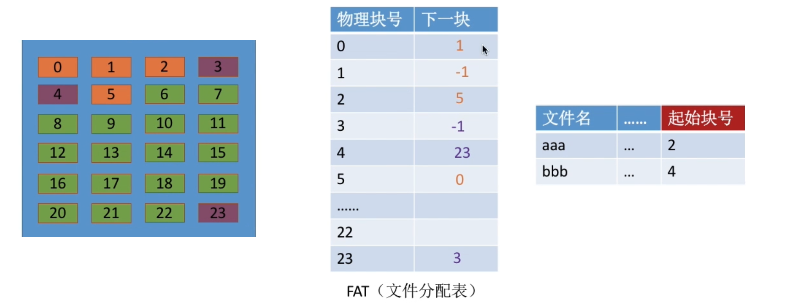

> 1. 一个磁盘仅需要设置1张FAT，开机时读入内存并常驻。
>2. 各个表项在物理上连续存储，每个表项长度相同，因此物理块号字段可以是隐藏的。

用户只需要给出访问的逻辑块号i，操作系统找到该文件对应的目录项PCB，

从目录中找到起始块号，若i>0则查询内存中的文件分配表FAT，往后找到i号逻辑块对应的物理块号，

逻辑块号转换成物理块号的过程不需要读磁盘操作。

- 优点：
    - 采用显示链式分配方式的文件，支持顺序访问和随机访问。
    - 由于块号转换过程无需访问磁盘，较隐式链接访问速度快很多。
    - 便于文件的扩展，不会产生外部碎片。
- 缺点：文件分配表需要占用一定的内存存储空间。

#### 3.索引分配

索引分配允许文件离散的分布在各个磁盘中，系统会为每个文件建立一张索引表，索引表中记录了文件的各个逻辑块对应的物理块。

索引表存放的磁盘块称为索引块，文件数据存放的磁盘块称为数据块。

> - 在显式链接的链式分配方式中，文件分配表FAT是一个磁盘对应一张。
> - 而索引分配方式中，索引表是一个文件对应一张。

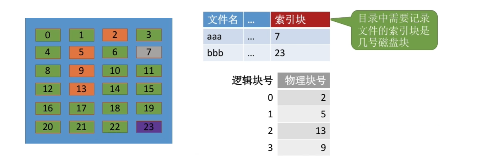

用户只需要给出访问的逻辑块号i，操作系统找到该文件对应的目录项PCB，

从目录中可以知道索引表的存放位置，将索引表从外存读入内存，并查找索引表即可知`i`号逻辑块在外存中的存放位置。

- 优点：索引分配方式可以支持随机访问，文件拓展也很容易实现（只需给文件分配一个空闲块，并增加一个	索引表项即可）。
- 缺点：索引表需要占用一定的存储空间。

如果一个文件的大小超过了256块，那么一个磁盘块是装不下文件的整张索引表的，如何解决该问题？

==链接方案==：如果索引表太大，一个索引块装不下，那么可以将多个索引块链接起来存放。

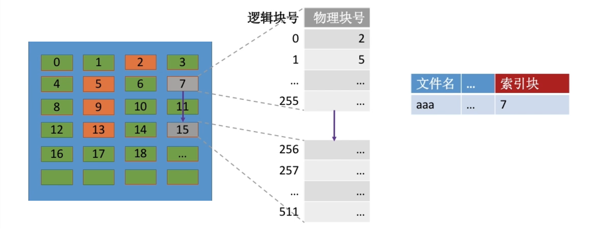

如果想要访问文件的最后一个逻辑块，就必须顺序地读入前255个索引块，这样显然是十分低效的。

==多层索引==：原理类似于多级页表，使第一层索引块指向第二层的索引块，还可以根据文件大小的要求再建立第三层、第四层索引块。

> 注：若采用多层索引，则各层索引表的大小不能超过一个磁盘块。

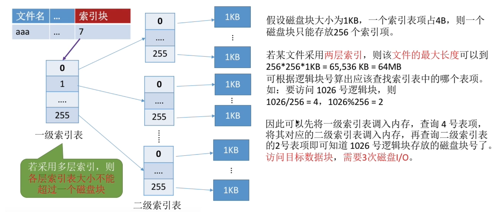

==混合索引==：多种索引分配方式的结合，顶级索引表中

既可以包含直接地址索引（直接指向数据块），又包含一级间接索引（指向单层索引表）、还包含两级间接索引（指向两层索引表）。

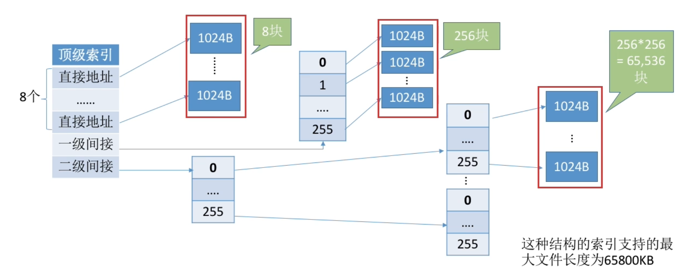

重要考点：

1. 根据多层索引、混合索引的结构计算出文件的最大长度（key：各级索引表最大不能超过一个块）
2. 能够分析访问某个数据块所需要的读磁盘的次数（key：FCB中会存有指向顶级索引块的指针，因此可以根据FCB读入顶级索引块）

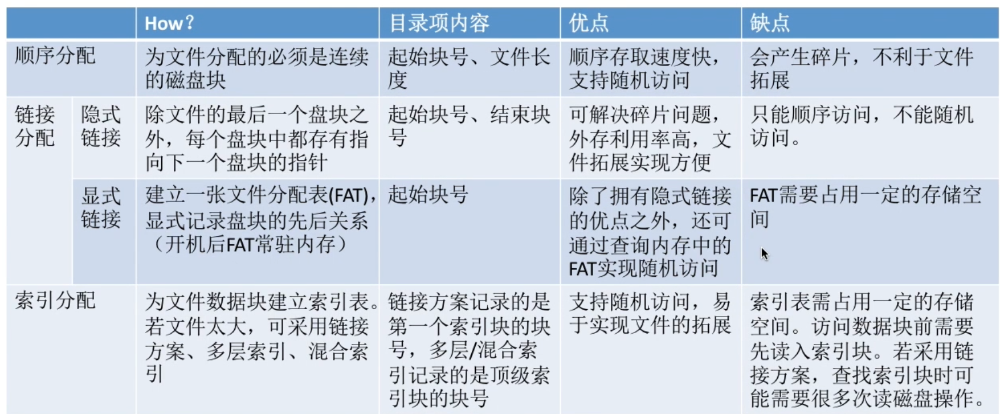

### 四、文件存储空间管理

- 目录区：主要存放目录信息FCB、用于磁盘存储空间管理的信息。
- 文件区：主要用于存放文件数据
- 存储空间初始化：将各个文件卷划分为目录区

#### 1.空闲表法：

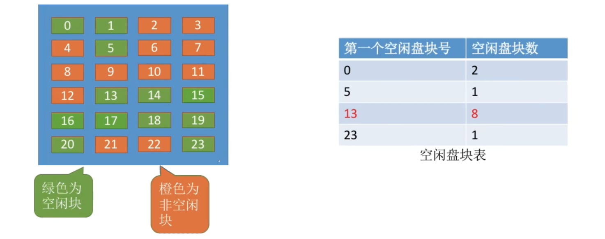

- 存储分配：与内存管理中的动态分区分配相似分配连续的存储空间，同样可采用首次适应等算法来确定分配的区间。
- 存储回收：与内存管理中的动态分区分配相似，当回收某个存储区时有4种情况，总之需要注意表项的合并问题。

#### 2.空闲链表法：

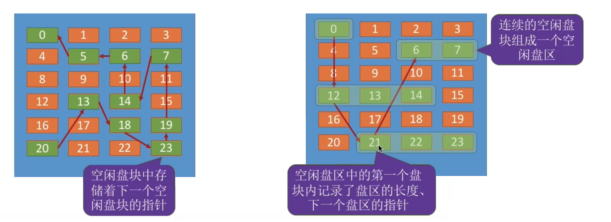

==空闲盘块链==：

以盘块为单位组成一条空闲链，操作系统保存着链头、链尾指针。

- 存储分配：若某文件申请K个盘块，则从链头开始依次摘下K个盘块分配，并修改空闲的链头指针。
- 存储回收：回收的盘块依次挂到链尾，并修改空闲链的链尾指针。

这种方式适用于离散分配的物理结构，为文件分配盘块时可能需要重复多次操作。

==空闲盘区链==：

以盘区为单位组成一条空闲链，操作系统保存着链头、链尾指针。

- 存储分配：若某文件申请K个盘块，则可以采用首次适应等算法从链头开始检索，按照算法规则找到大小符要求的空闲盘区，
- 存储回收：若会收区和某个空闲盘相邻，则需要将会收区合并到空闲盘区中。若回收区没有和任何空闲区相邻，将回收区作为单独的一个空闲盘区挂到链尾。

这种管理方式对于离散分配、连续分配都适用，为1个文件分配多个盘块时效率更高。

#### 3.位示图法：★

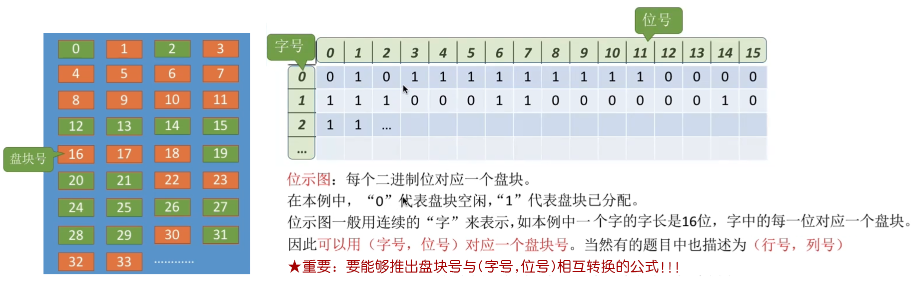

- 存储分配：若某文件申请K个盘块，
    - step1：顺序扫描位示图找到K个相邻or不相邻的未分配存储空间`0`
    - step2：根据字号位号算出对应的盘块号，将相应盘块分配给文件
    - step3：将相应位设置为1
- 存储回收：
    - step1：根据回收的盘块号计算出对应的字号、位号
    - step2：将相应二进制位设置为0

#### 4.成组链接法：

空闲表法、空闲链表法不适用于大型的文件系统（空闲表/空闲链表可能过大），UNIX系统中采用了成组链接法对磁盘空闲块进行管理。

文件卷的目录中区中专门用一个磁盘作为超级块，当系统启动时需要将超级块读入内存，并且要保证内存与外存中的超级块数据一致。

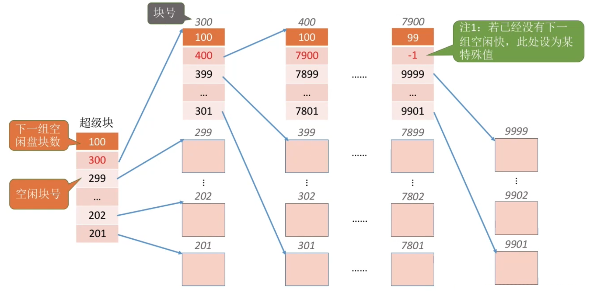

### 五、文件的基本操作

#### 1.创建文件create

用户进行Create系统调用时，需要提供的几个主要参数：

- 所需的外存空间大小，如一个盘块即1KB
- 文件存放路径，如"D:/Demo"
- 文件名，默认为新建文本文件.txt

操作系统处理create系统调用时，主要做的工作：

1. 在外存中找到文件所需的空间（使用空闲链表法、位示图、成组链接法等管理策略来寻找空闲空间）
2. 根据文件存放路径的信息找到该目录对应的目录文件，在目录中创建该文件对应的目录项（目录中包含了文件名、外存存放位置等重要信息）。

#### 2.删除文件delete

用户进行Delete系统调用时，需要提供的几个主要参数：

- 文件存放路径，如"D:/Demo"
- 文件名，"test.txt"

操作系统处理Delete系统调用时，主要做的工作：

1. 根据文件存放路径找到相应的目录文件，从目录中找到对应的目录项。
2. 根据目录项记录的文件信息回收文件占用的磁盘块（回收磁盘块时，根据空闲表法、空闲链表法、位图法等管理策略来做不同处理）
3. 从目录表中删除文件对应的目录项。

#### 3.打开文件open

在很多操作系统中在对文件进行操作之前，要求用户先使用opne系统调用打开文件，需要提供的几个主要参数：

- 文件存放路径，如"D:/Demo"
- 文件名，"test.txt"
- 要对文件的操作类型，如r、w、rw

==操作系统处理open系统调用时，主要做的工作==：

1. 根据文件存放路径找到相应的目录文件，从目录中找到对应的目录项，然后检查该用户是否有指定的权限操作。
2. 将目录项复制到内存中的打开文件表中，并将对应表目的编号返回给用户。
3. 最后用户使用打开文件表的编号来指明要操作的文件。

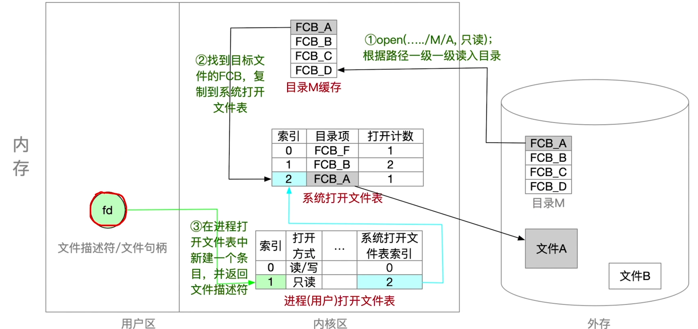

#### 4.关闭文件close

==操作系统处理close系统调用时，主要做的工作==：

1. 将进程的打开文件表相应表项进行删除
2. 回收分配给该文件的内存空间等资源
3. 系统打开文件表的打开计数器count减1，若count=0则删除对应表项。

#### 5.读文件read

用户进行read系统调用时，需要提供的几个主要参数：

- 指明是哪个文件（在支持打开文件操作的系统中，只需要提供文件在打开文件表中的索引号即可），
- 指明要读入多少数据，如读入1KB
- 指明读入的数据存放在内存中的位置

操作系统在处理read系统调用时，会从读指针指向的外存中，将用户指定大小的数据读入用户指定的内存区域中。

#### 6.写文件write

用户进行write系统调用时，需要提供的几个主要参数：

- 指明是哪个文件（在支持打开文件操作的系统中，只需要提供文件在打开文件表中的索引号即可）
- 指明要写出多少数据，如写出1KB
- 指明写回外存的数据存放在外存中的位置

操作系统在处理write系统调用时，会从用户指定的内存区域中，将指定大小的数据写回写指针指向的外存。

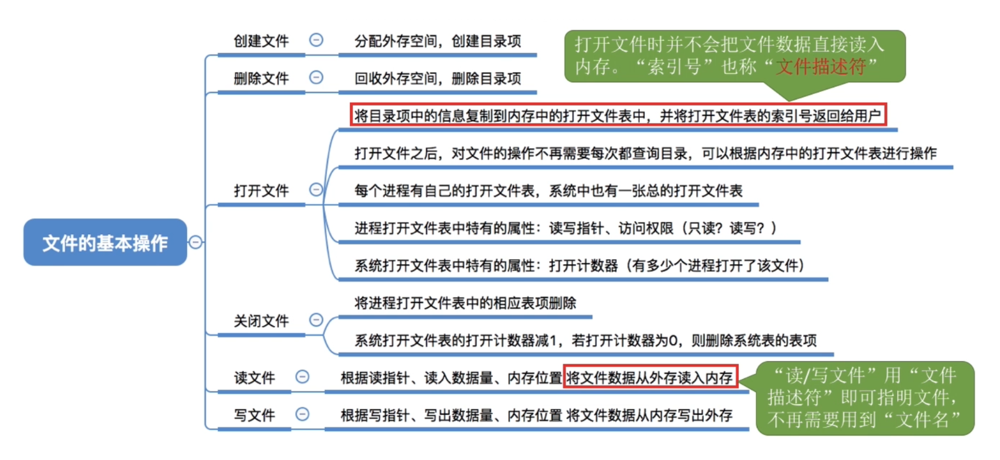

### 六、文件的共享与保护

操作系统为用户提供文件共享功能，可以让多个用户共享地使用同一个文件，文件共享的实现方式包括硬链接和软链接。

多个用户共享1个文件，只要某个用户修改了该文件的数据，其他用户也可以看到文件数据的变化。

#### 1.文件共享

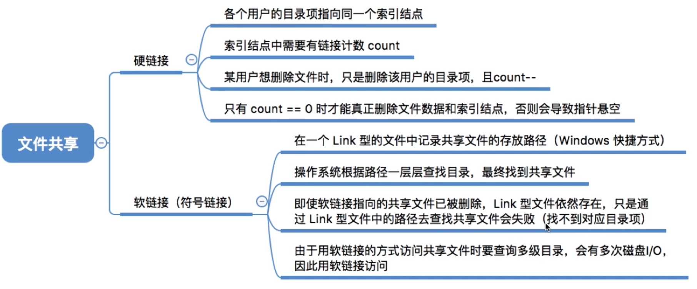

##### （1）硬链接

基于索引结点的共享方式（硬链接）

索引结点中设置一个链接计数变量count，用于表示链接到本索引结点上的用户目录数量。

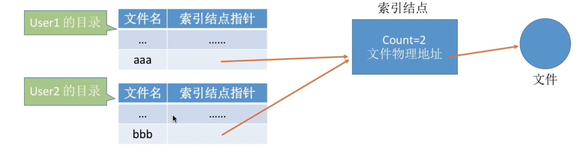

##### （2）软链接

基于符号链的共享方式（软链接），如windows操作系统中的快捷方式：

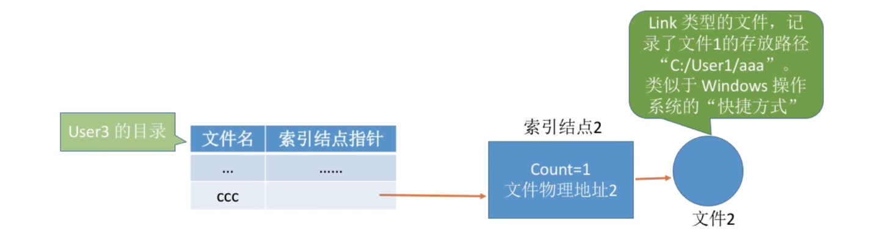

#### 2.文件保护

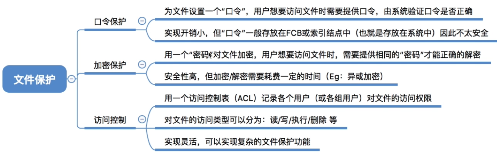

##### （1）口令保护

口令一般存放在文件对应的FCBor索引结点中，用户访问文件前需要先输入口令，口令正确则允许用户访问该文件。

- 优点：保存口令的空间开销不多，验证口令的时间开销也很小
- 缺点：正确的口令存放在系统内部不够安全

##### （2）加密保护：

使用某个密码对文件进行加密，在访问文件时需要提供正确的密码才能对文件进行正确的解密。

- 优点：保密性强不需要在系统中存储密码
- 缺点：加密/解密需要花费一定的时间

##### （3）访问控制：

系统在每个文件的FCB中增加一个访问控制列表ACL（Access-Control List），该表中记录了各用户可以对该文件执行哪些操作。

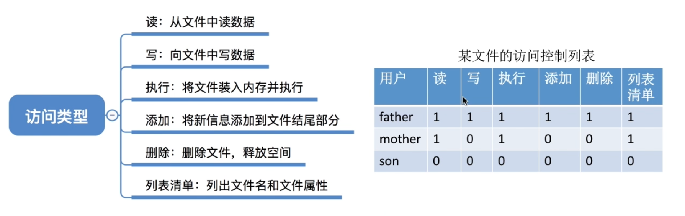

### 七、文件系统的结构

#### 1.文件系统在外存中的结构

1. 原始磁盘
2. 物理格式化/低级格式化之后，并用备用扇区替换坏扇区
3. 逻辑格式化/高级格式化之后，磁盘分区/分卷Volume（每个分区可以建立独立的文件系统），完成各分区的文件系统初始化

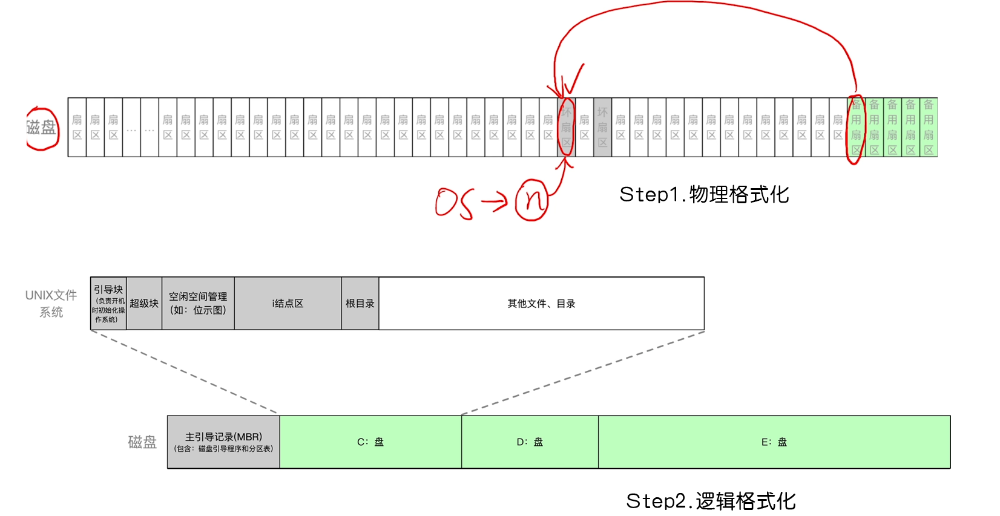

#### 2.文件系统在内存中的结构

近期访问过的目录文件会缓存在内存中，不用每次都从磁盘读入，这样可以加快目录检索速度。

open系统调用打开文件的内部过程：

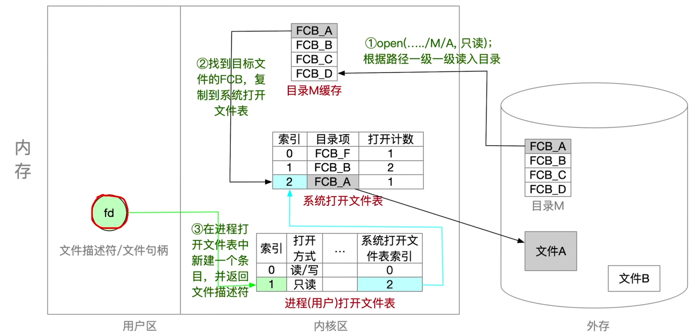

### 八、虚拟文件系统

#### 1.虚拟文件系统

计算机内部有可能同时存在各种各样的文件系统，操作系统应向上层用户进行提供统一标准的函数接口（虚拟文件系统VFS），

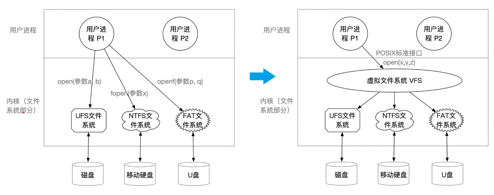

==虚拟文件系统VFS特点==：

1. 向上层用户进程提供统一标准的系统调用接口，屏蔽底层具体文件系统的实现差异。
2. 要求下层的文件系统必须实现某些规定的函数功能，如open/read/write（新的文件系统想要在某操作系统上使用，就必须满足该操作系统VFS的要求）
3. 每打开一个文件VFS就会在主存中新建一个vnode，用统一的数据结构表示文件，无论该文件存储在哪个文件系统中。

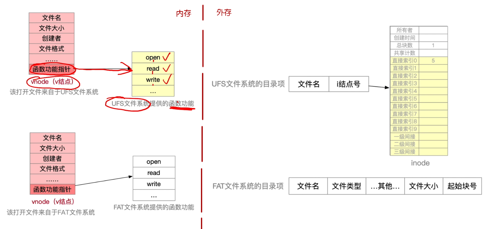

文件系统中的vnode只存在于主存中，而inode既会被调入主存也会在外存中存储。

打开文件后创建vnode，并将文件信息复制到vnode中，vnode的函数功能指针指向具体文件系统的函数功能。

#### 2.文件系统的挂载

文件系统的挂载mounting即文件系统安装/装载，如何将一个文件系统挂载到操作系统中：

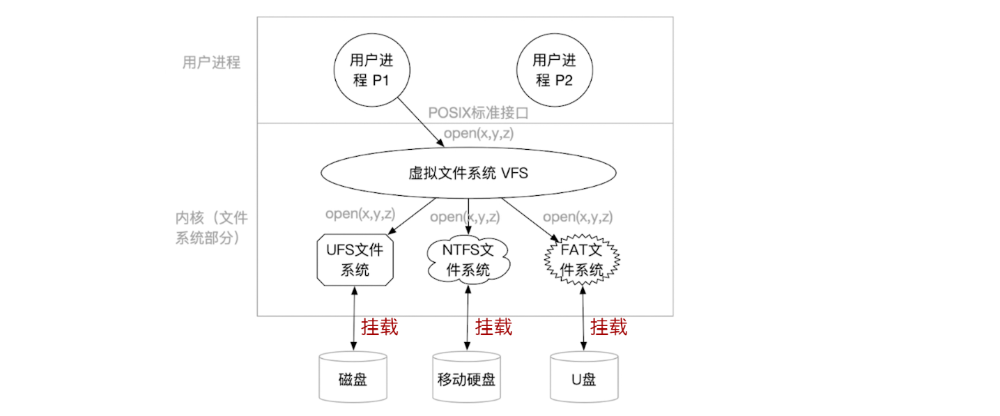

==文件挂载需要做的操作==：

1. 在VFS中注册新挂载的文件系统，内存中的挂载表（mount table）包含每个文件系统的相关信息，包括文件系统类型、容量大小等。
2. 新挂载的文件系统要向VFS提供一个函数地址列表，以便调用挂载文件系统的功能
3. 将新文件系统加到挂载点（mount point），也就是将新文件系统挂载在某个父目录下

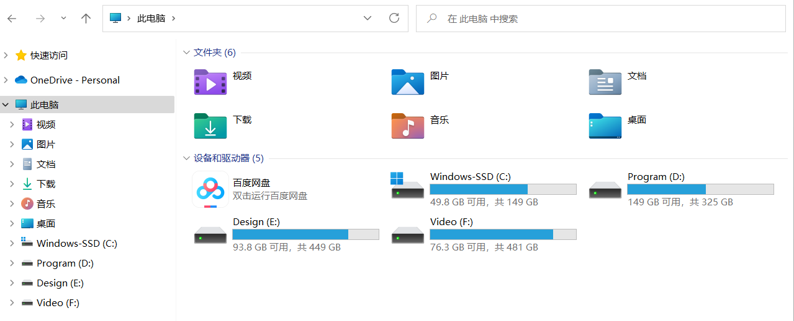

