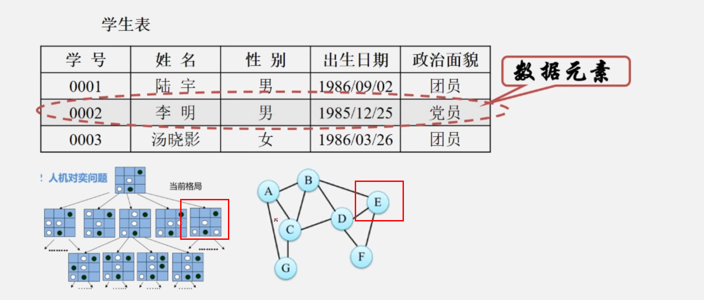
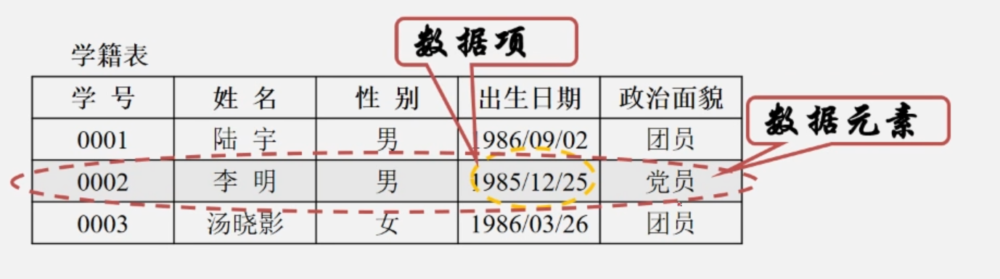
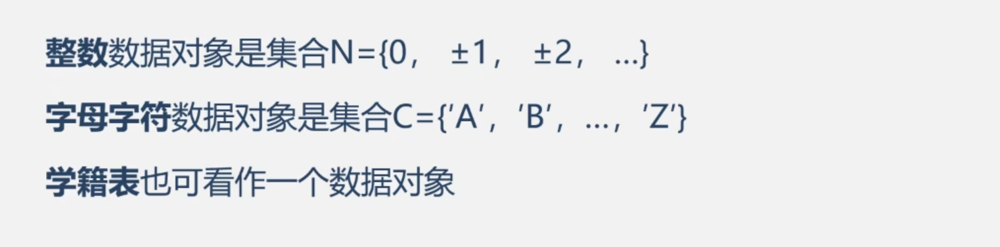
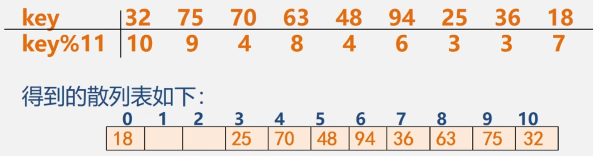
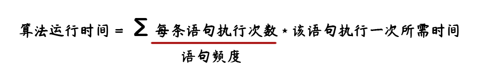
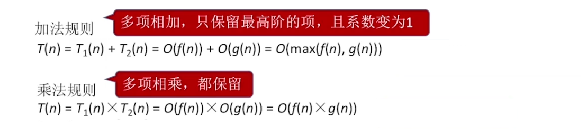
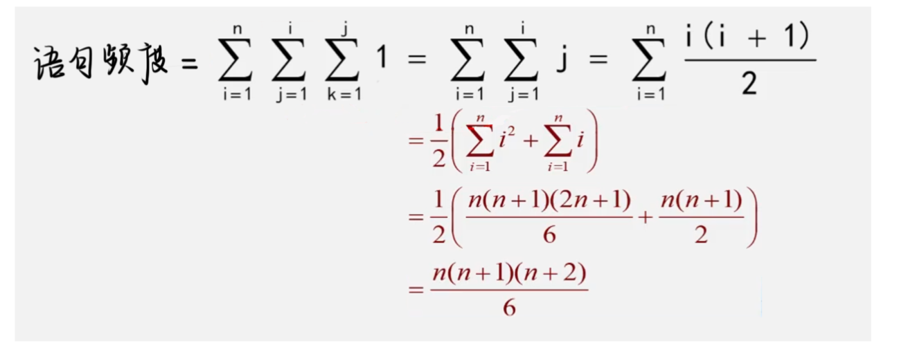
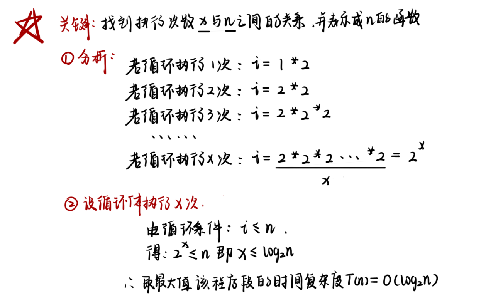

# 第一章：绪论

---

### 一、基本概念

#### 1.Data数据

Data数据：是能够输入计算机且能被计算机处理的<font color='#BAOC2F'>各种符号的集合</font>。

Data数据包括：

1. 数值型数据：整数、实数
2. 非数值型数据：文字、图像、图形、声音等

#### 2.DataElement数据元素

DataElement数据元素（元素/记录/结点/顶点）：是Data数据的基本单位，在计算机程序中通常被作为一个整体进行考虑和处理



#### 3.DataItem数据项

DataItem数据项：是构成数据元素的<font color='#BAOC2F'>不可分割的最小单位</font>。



> 数据三者之间的关系：数据 > 数据元素  > 数据项

#### 4.DataObject数据对象

DataObject数据对象：是性质相同的数据元素的集合，是数据的一个子集。



==数据元素与数据对象之间的不同==：

1. 数据元素是组成数据的基本单位，是数据集合的个体
2. 数据对象是性质相同的数据元素的集合，是数据集合的子集

#### 5.DataStructure数据结构

##### （1）逻辑结构：

| 划分方式1  | 说明                                                         |
| ---------- | ------------------------------------------------------------ |
| 线性结构   | 有且仅有一个开始和一个终端结点，并且所有结点都最多只有一个直接前驱和直接后继。 |
| 非线性结构 | 一个结点可能有多个直接前驱和直接后继。                       |

| 划分方式2   | 说明                                             |
| ----------- | ------------------------------------------------ |
| 集合结构    | 结构中的数据元素之间属于同一集合，无任何其他关系 |
| 线性结构    | 结构中的数据元素存在一对一关系                   |
| 树形结构    | 结构中的数据元素存在一对多关系                   |
| 图/网状结构 | 结构中的数据元素存在多对多关系                   |

##### （2）存储结构：

物理/存储结构：数据元素及其关系在计算机内存中的表示/映像

1. 顺序存储结构：用一组<font color='#BAOC2F'>连续的存储单元</font>依次存储数据元素，数据元素之间的逻辑关系由<font color='#BAOC2F'>元素的存储位置</font>来表示。
2. 链式存储结构：用一组<font color='#BAOC2F'>任意的存储单元</font>存储数据元素，数据之间的逻辑关系用<font color='#BAOC2F'>指针</font>来表示。
3. 索引存储结构：在存储结点信息的同时，还建立附加的<font color='#BAOC2F'>索引表</font>。
4. 散列存储结构：根据<font color='#BAOC2F'>结点的关键字</font>直接计算出该结点的存储地址。



##### （3）数据的运算：

数据的运算：包括运算的定义和实现

- 定义针对逻辑结构，指出<font color='#BAOC2F'>运算的功能</font>。
- 实现针对存储结构，指出<font color='#BAOC2F'>运算的具体操作步骤</font>。

### 二、算法分析

算法是对特定问题求解步骤的一种描述，是指令的有限序列（其中每个指令表示一个或多个操作）。

#### 1.算法特性

1. 有穷性：一个算法必须总是在执行有穷步之后结束，且每一步都在有穷的时间内完成
2. 确定性：对于相同的输入只能得到相同的输出
3. 可行性：算法可执行
4. 输入：一个算法有零个或多个输入
5. 输出：一个算法有一个或多个输出

#### 2.时间复杂度

##### （1）语句执行次数：



可假设执行每条语句所需要的时间均为<font color='#BAOC2F'>单位时间</font>，则对算法运行时间的讨论可转化为讨论算法中<font color='#BAOC2F'>所有语句的执行次数</font>，即频度之和。

算法运行时间效率比较 = 算法语句执行次数比较

```cpp
//两个n*n矩阵相乘的算法时间效率分析
for(int i = 1; i <= n; ++i){//执行n+1次（条件不成立退出循环）
    for(int j = 1; j <= n; ++j){//执行n(n+1)次（外循环n次内循环n+1次）
        c[i][j] = 0;//执行n*n次
        for(int k = 0; k < n; ++k)//执行n*n*(n+1)次
            c[i][j] = c[i][j] + a[i][k]*b[k][j]//执行n*n*n次
    }
}
//T(n) = 算法运行时间效率 = 算法语句执行次数
```


##### （2）时间复杂度的定义：

为了便于比较不同算法的时间效率，我们仅比较他们的==数量级==来粗略的替代执行次数

若有某个辅助函数f(n)，使得当n趋近于无穷大时T(n)/f(n)的极限为不等于零的常数，则称f(n)是T(n)的同数量级函数。记作`T(n)=O(f(n))`

称`O(f(n))`为算法的<font color='#BAOC2F'>渐进时间复杂度</font>，简称时间复杂度。

##### （3）时间复杂度的计算：

算法中基本语句重复执行的次数是问题规模n的某个函数`f(n)`，算法的时间度量记作`T(n)=O(f(n))`

==时间复杂度计算步骤==：

1. 找出语句频度最大的那条语句作为基本语句
2. 计算基本语句的频度，得到问题规模n的某个函数`f(n)`
3. 取其数量级用符号O表示
4. 对于复杂的算法，可以将其分成几个容易估算的部分，然后利用加法规则和乘法规则计算时间复杂度



==时间复杂度分类==：

1. 最坏时间复杂度
2. 最好时间复杂度
3. 平均时间复杂度：所有可能输入实例在等概论出现情况下，算法的期望运行时间

==时间复杂度T(n)按数量级递增顺序为==：

| 常数阶 | 对数阶              | 线性阶 | 线性对数阶           | 平方阶           | 立方阶           | …    | 指数阶           | 阶乘  |                  |
| ------ | ------------------- | ------ | -------------------- | ---------------- | ---------------- | ---- | ---------------- | ----- | ---------------- |
| O(1)   | O(log<sub>2</sub>n) | O(n)   | O(nlog<sub>2</sub>n) | O(n<sup>2</sup>) | O(n<sup>3</sup>) | …    | O(2<sup>n</sup>) | O(n!) | O(n<sup>n</sup>) |

##### （4）实例分析：

```cpp
//例1
void exam(float x[][], int m, int n){
    float sum[];
    for(int i = 0; i < m; ++i){
        sum[i] = 0.0;
        for(int j = 0; j < n; ++j){
            sum[i] += x[i][j]; //f(n)=m*n, T(n) = O(m*n)
        }
    }
    for(int i = 0; i < m; ++i)
        cout << i << " : " << sum[i] << endl;
}
```

```cpp
//例2
for(int i = 1; i <= n; ++i){
    for(int j = 1; j <= i; ++j){
        for(int k = 1; k <= j; ++k)
            x = x + 1;
    }
}
```



```cpp
//例3
int i = 1;
while(i <= n){
    i = i * 2;
}
```



#### 3.空间复杂度

##### （1）空间复杂度定义：

算法所需存储空间的度量，记作`S(n)=O(f(n))`,其中n为问题的规模大小

> 注：算法本身要占用的空间：输入/输出、指令、常数、变量、辅助空间

##### （2）空间复杂度计算：

- 普通程序
    - 找到所占用空间大小与问题规模相关的变量
    - 分析<font color='#BAOC2F'>所占空间x</font>与<font color='#BAOC2F'>问题规模n</font>的关系`x = f(n)`
    - x的数量级O(x)即为空间复杂度S(n)
- 递归程序
    - 找到<font color='#BAOC2F'>递归调用的深度x</font>与<font color='#BAOC2F'>问题规模n</font>的关系`x = f(n)`
    - x的数量级O(x)即为空间复杂度S(n)

##### （3）实例分析：

实现将一维数组a中的n个数逆序存放到原数组中（数组逆置）：

```cpp
//算法1:S(n) = O(1)辅助空间为变量temp
for(int i = 0; i < n/2; ++i){
    temp = a[i];
    a[i] = a[n - i - 1];
    a[n - i - 1] = temp;
}
```

```cpp
//算法2:S(n) = O(n)辅助空间为数组b[]
for(int i = 0; i < n; ++i)
    b[i] = a[n - i - 1];
for(int i = 0; i < n; ++i)
    a[i] = b[i];
```


