# 第八章：排序

---

| 分类标准     | 类别1                                                        | 类别2                                                        |
| ------------ | ------------------------------------------------------------ | ------------------------------------------------------------ |
| 按存储介质   | 内部排序：数据量不大数据在内存，无需内外存交换数据           | 外部排序：数据量较大数据在外存（文件排序）                   |
| 按比较器个数 | 串行排序：单处理机（同一时刻比较一对元素）                   | 并行排序：多处理机（同一时刻比较多对元素）                   |
| 按主要操作   | 比较排序：使用比较的方法，包括插入排序、交换排序、选择排序、归并排序 | 基数排序：不比较元素的大小，<font color='#BAOC2F'>仅仅根据元素本身的取值</font>确定其有序位置 |
| 按辅助空间   | 原地排序：辅助空间用量为`O(1)`                               | 非原地排序                                                   |
| 按稳定性     | 稳定排序：使<font color='#BAOC2F'>任何数值</font>相等的元素，排序以后相对次序不变 | 非稳定排序                                                   |
| 按自然性     | 自然排序：输入数据越有序，排序的速度越快                     | 非自然排序                                                   |

1. 外部排序时，要将数据分批调入内存来排序，中间结果还要及时放入外存，显然外部排序要复杂得多。
2. 排序稳定性只对<font color='#BAOC2F'>结构类型的数据</font>排序有意义，例如student类型
3. 排序方法是否稳定，并不能衡量一个排序算法的优劣

```cpp
//案例中使用的数据结构
#define MAXLENGTH 50
typedef struct {
    int elem[MAXLENGTH];
    int length;
} SqList;
```

### 一、插入排序

每步将1个待排序的对象，<font color='#BAOC2F'>按照大小</font>插入到前面<font color='#BAOC2F'>已经排好序</font>的一组对象的适当位置上，直到对象全部插入为止，

即边插入边排序保证子序列中<font color='#BAOC2F'>随时都是排好序的</font>。


1. 在有序序列中插入一个元素，保持序列有序（有序长度不断增加）
2. 起初a[0]是长度为1的子序列，然后逐一将a[1]至a[n-1]插入到<font color='#BAOC2F'>有序子序列中</font>。
3. 插入a[i]使a[0]~a[i-1]有序，也就是要为a[i] <font color='#BAOC2F'>找到有序位置</font> j，将a[i]插入在a[j]的位置上

根据<font color='#BAOC2F'>寻找插入位置方式</font>的不同，可将插入排序分为3类：

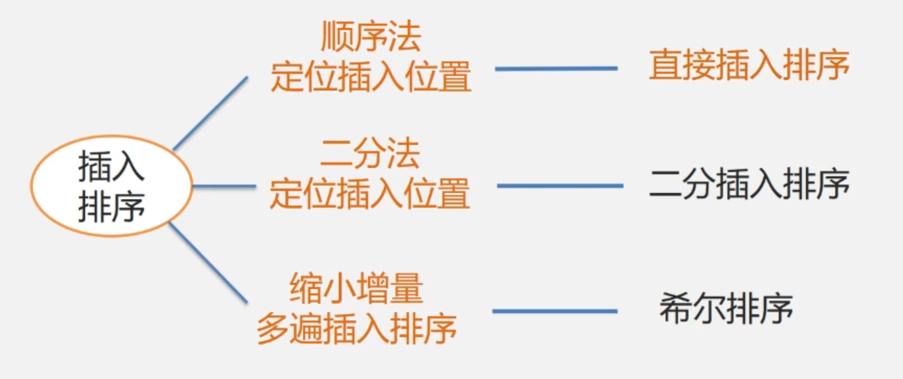

#### 1.直接插入排序

采用<font color='#BAOC2F'>顺序查找法</font>查找插入位置：


1. 复制插入元素`x = a[i];`

2. 记录后移查找插入位置

    ```cpp
    for (j = i - 1; a[j] > x && j >= 0; --j) {
        a[j + 1] = a[j];
    }
    ```

3. 插入到寻找到的正确位置`a[j - 1] = x;`

```cpp
//直接插入排序 不带哨兵
void insertSort(SqList &L) {
    int i, j;
    for (i = 0; i < L.length; ++i) {
        if (L.elem[i] < L.elem[i - 1]) {
            int x = L.elem[i];
            for (j = i - 1; L.elem[j] > x && j >= 0; --j)//顺序查找找到插入的位置
                L.elem[j + 1] = L.elem[j];//所有大于x的记录都将后移
            L.elem[j + 1] = x;//插入元素
        }
    }
}
```

```cpp
//直接插入排序 利用哨兵省略掉 j >= 0 的判断语句
void insertSort(SqList &L) {
    int i, j;
    for (i = 2; i <= L.length; ++i) {
        if (L.elem[i] < L.elem[i - 1]) {
            L.elem[0] = L.elem[i];//赋值为哨兵
            for (j = i - 1; L.elem[j] > L.elem[0]; --j)//顺序查找找到插入的位置
                L.elem[j + 1] = L.elem[j];//所有大于哨兵的元素记录都将后移
            L.elem[j + 1] = L.elem[0];//将哨兵插入到正确的位置
        }
    }
}
```

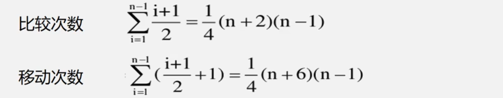

#### 2.折半插入排序

采用<font color='#BAOC2F'>二分查找法</font>查找插入位置：

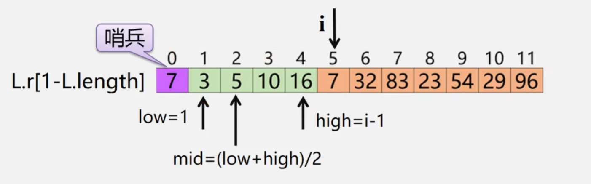

```cpp
//折半插入排序 不带哨兵
void BInsertSort1(SqList &L) {
    for (int i = 0; i < L.length; ++i) {
        int x = L.elem[i];//插入排序目标值
        //利用二分查找寻找插入位置 high + 1为插入位置
        int low = 0;
        int high = i - 1;
        while (low <= high) {
            int mid = (low + high)/2;
            if (x < L.elem[mid]) high = mid - 1;
            else low = mid + 1;
        }
        //查找位置结束后 进行常规插入操作
        for (int j = i - 1; j >= high + 1; --j) L.elem[j + 1] = L.elem[j];//j+1插入位置后的元素后移
        L.elem[high + 1] = x;//插入元素
    }
}
/*
直到low > high时才停止折半查找
当mid所指元素等于当元素时 应继续令low = mid + 1以保证稳定性
最终应将当前元素插入到low所指的位置(high + 1)
*/
```

```cpp
//折半插入排序 带哨兵
void BInsertSort2(SqList &L) {
    for (int i = 1; i < L.length + 1; ++i) {
        L.elem[0] = L.elem[i];//插入排序目标值
        //利用二分查找寻找插入位置 high + 1为插入位置
        int low = 1;
        int high = i - 1;
        while (low <= high) {
            int mid = (low + high)/2;
            if (L.elem[mid] > L.elem[0]) high = mid - 1;//查找左半边子表
            else low = mid + 1;//查找右半边子表
        }
        //查找位置结束后 进行常规插入操作
        for (int j = i - 1; j >= high + 1; --j) L.elem[j + 1] = L.elem[j];//j+1插入位置后的元素后移
        L.elem[high + 1] = L.elem[0];//插入元素
    }
}
```

1. 折半查找是一种<font color='#BAOC2F'>稳定的排序方法</font>。
2. 折半查找排序时间复杂度为O(n<sup>2</sup>)，空间复杂度为O(1)
3. 折半查找的<font color='#BAOC2F'>关键码比较次数</font>与待排序对象序列的初始排列无关，仅依赖于<font color='#BAOC2F'>对象的个数</font>。
4. 插入第i个对象时需要经过[log<sub>2</sub>i + 1]次关键码的比较，才能确定插入位置
5. 当n较大时，总关键码的比较次数比直接插入排序的<font color='#BAOC2F'>最坏情况</font>要好很多，但是比其<font color='#BAOC2F'>最好的情况</font>要差
6. 在对象的初始序列<font color='#BAOC2F'>已经按关键码排好序</font> or <font color='#BAOC2F'>接近有序时</font>，直接插入排序比折半插入排序执行的关键码比较次数要少

> 注：折半插入排序减少了<font color='#BAOC2F'>比较次数</font>，但是没有减少<font color='#BAOC2F'>移动次数</font>。

#### 3.希尔排序

直接插入排序在<font color='#BAOC2F'>基本有序</font>时、待排序的<font color='#BAOC2F'>记录个数较少时</font>效率较高，其是针对直接插入排序算法的改进。

==基本思想==：

1. 先将整个待排序记录序列分割成若干子序列（缩小增量），分别进行直接插入排序，
2. 待整个序列中的记录<font color='#BAOC2F'>基本有序</font>时，再对全体记录进行一次直接插入排序（多遍插入排序）。
3. 即先追求元素部分有序，再逐渐逼近全局有序。

==希尔排序的特点==：

1. 一次移动移动的位置较大，跳跃式地接近排序后的最终位置，最后一次只需要少量的移动位置
2. 增量序列必须是递减的，且最后一个必须是1
3. 增量序列应该是<font color='#BAOC2F'>互质的</font>。
4. 自定义增量序列D<sub>k</sub>，D<sub>M</sub> > D<sub>M-1</sub> > … >D<sub>1</sub> = 1，对每个D<sub>k</sub>进行D<sub>k</sub>间隔的插入排序（k = M, M -1, …1）

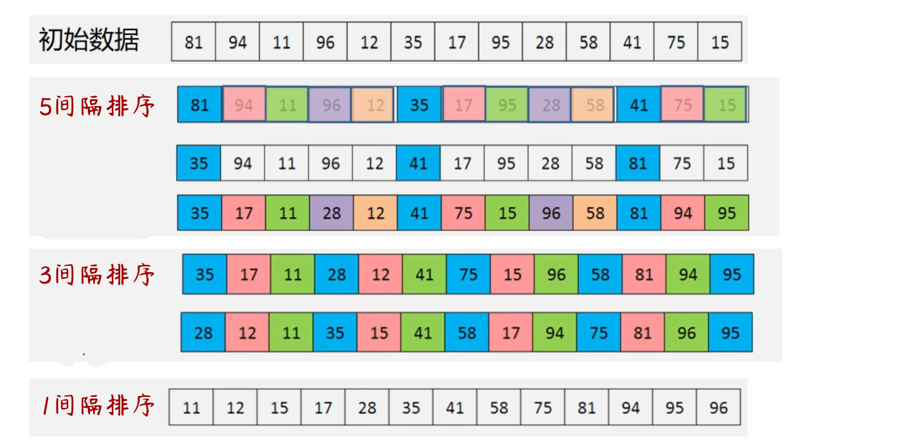

```cpp
//实现方案1:间隔内直接插入排序
void shellInsert(SqList &L, int dk) {
    //对顺序表L进行一趟增量为dk的shell排序，其中dk为步长因子
    int i, j;
    for (i = dk - 1; i < L.length; ++i) {
        if (L.elem[i] < L.elem[i - dk]) {
            int x  = L.elem[i];
            for (j = i - dk; L.elem[j] > x && j >= 0; j = j - dk)//顺序查找找到插入的位置
                L.elem[j + dk] = L.elem[j];//所有大于x的记录都将后移
            L.elem[j + dk] = x;//插入元素
        }
    }
}
void shellSort(SqList &L, int dlta[], int max) {
    //dk值依次存在dlta[t]中
    //按增量序列dlta[0..L.length]对顺序表L作希尔排序
    for (int k = 0; k < max; ++k) {
        shellInsert(L, dlta[k]);//一趟增量为dlta[k]的直接插入排序
    }
}
```

```cpp
//实现方案2:间隔间切换进行直接插入排序
void shellSort1(int A[], int n) {
    //A[0]只是暂存单元不是哨兵 当j<=0时插入位置已到
    int dk;
    int i, j;
    for (dk = n/2; dk >= 1; dk = dk/2) {//步长变化
        for (i = dk + 1; i <= n; ++i) {
            if (A[i] < A[i - dk]) {
                A[0] = A[i];//暂存在A[0]
                for (j = i - dk; A[j] > A[0] && j > 0; j = j - dk) A[j + dk] = A[j];//元素后移
                A[j + dk] = A[0];//元素插入
            }
        }
    }
}
```

1. 希尔排序是一种<font color='#BAOC2F'>不稳定</font>的排序方法
2. 希尔排序<font color='#BAOC2F'>不适合在链式存储上</font>实现
3. 希尔排序的时间复杂度：O(n<sup>1.25</sup> ~ O(1.6n<sup>1.25</sup>))，空间复杂度为O(1)
4. <font color='#BAOC2F'>最后一个增量必须为1</font>，其他序列除了1之外不能有公因子（互质）
5. 希尔排序算法效率与<font color='#BAOC2F'>增量序列取值</font>有关（希尔建议每次将增量缩小一半）

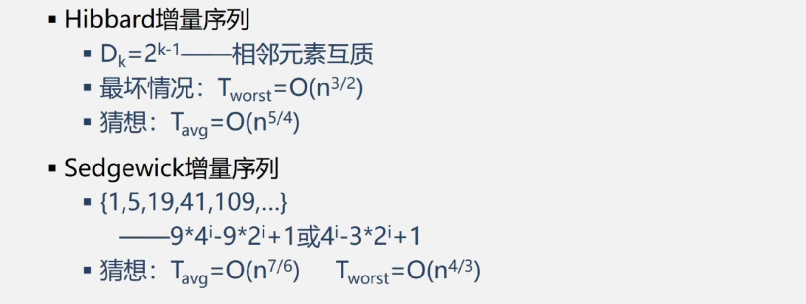

#### 4.表插入排序

折半插入排序和二路插入排序分别减少了记录<font color='#BAOC2F'>关键字的比较次数</font>和<font color='#BAOC2F'>记录的移动次数</font>，但都不能避免非重要数据的移动

==算法思想==：

1. 设置顺序表（数组）中下标为0的分量为表头结点，并令表头结点记录的关键字取最大整数
2. 首先将静态链表中<font color='#BAOC2F'>数组下标为1的结点</font>和<font color='#BAOC2F'>表头结点</font>构成一个循环链表
3. 然后依次将<font color='#BAOC2F'>下标为2至n的结点</font>按照<font color='#BAOC2F'>关键字非递减</font>有序插入到循环链表中

==表插入排序特点==：

1. 表插入排序采用了<font color='#BAOC2F'>静态链表的存储结构</font>实现，其核心仍是将记录<font color='#BAOC2F'>插入到已排好序的有序表中</font>。
2. 与直接插入排序相比，表插入排序不同之处仅是以<font color='#BAOC2F'>修改2n次指针值</font>来替代记录的移动
3. 表插入排序过程中所需要进行的关键字间比较次数仍然相同，时间复杂度仍为O(n<sup>2</sup>)
4. 表插入排序得到到的是一个有序链表，因此只能进行随机查找不能顺序查找（为了进行有序表折半查找，可能需要对记录重新排列）

```cpp
//表插入排序
void tableInsertSort(Table &tb, int n) {
    //1.将静态链表中数组下标为1的结点和表头结点构成一个循环链表
    tb[0].next = 1;
    //2.依次将下标为 2~n 的结点按照 关键字非递减 有序插入到循环链表中
    int p, q;//q为p的前驱
    for (int i = 2; i < n; ++i) {
        //调整p、q位置
        q = 0;
        p = tb[0].next;
        while (p != 0 && tb[p].data <= tb[i].data) {
            q = p;
            p = tb[p].next;
        }
        //进行插入操作
        tb[i].next = tb[q].next;
        tb[q].next = i;
    }
}
```

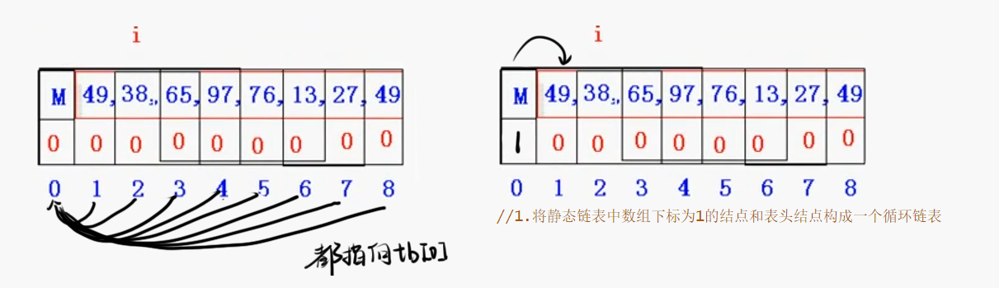

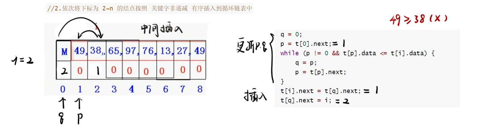

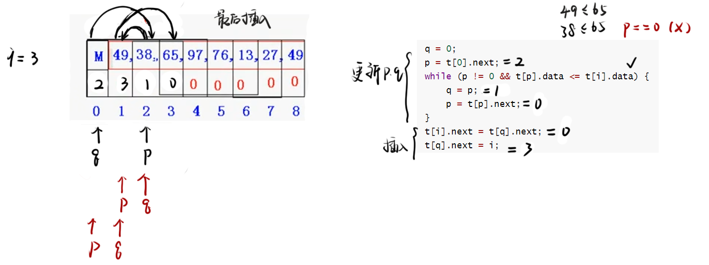

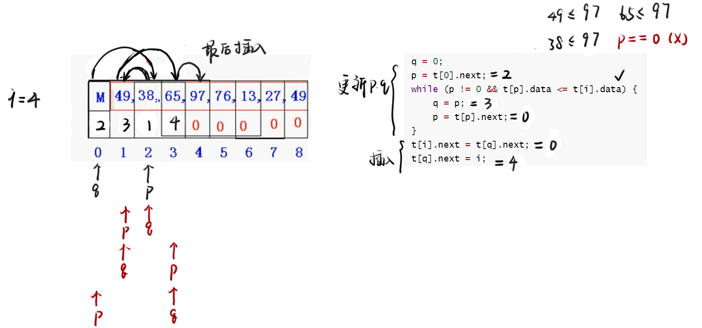

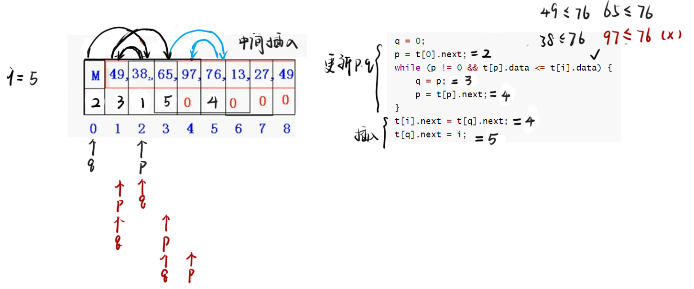

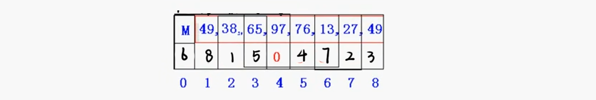

==对表插入排序后的记录进行重排序==：

顺序扫描有序链表，将链表中第i个结点移动至数组的第i个分量中（使链表中的项与地址下标项对应）

```cpp
//根据静态链表tb中各结点的指针值调整记录位置 使得tb中记录 按关键字非递减
void Arrange(Table &tb,int n) {
    int p, q;
    p = tb[0].next;
    for (int i = 1; i < n; ++i) {
        //1.调整p、q位置
        while (p < i) p = tb[p].next;//找到第i个记录 并用p指示其在tb中当前的位置
        q = tb[p].next;//q指示尚未调整的表尾
        //2.进行调整
        if (p != i) {
            swap(tb[p], tb[i]);//交换整个记录(包括 data和 next) 使第i个记录到位
            tb[i].next = p;//tb[i].next指向被移动的记录 使得后续可由 while循环找回
        }
        //3.p指向尚未调整的表尾 为找第i + 1个记录作准备
        p = q;
    }
}
```

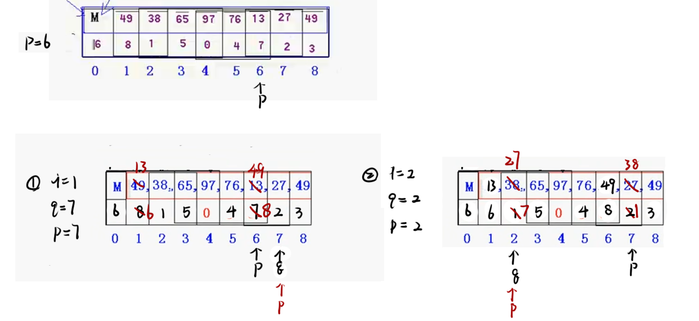

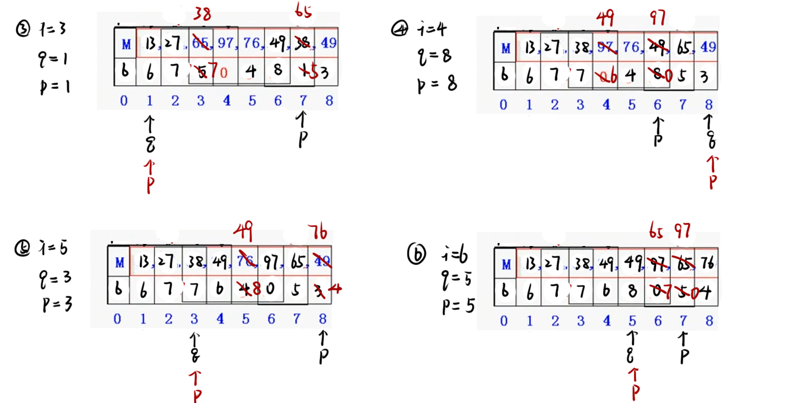

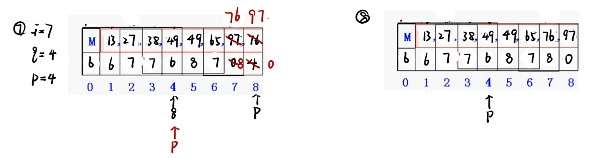

==调试程序==：

```cpp
#include <iostream>
using namespace std;

#define MAXSIZE 100
#define MAXVALUE 9999

// typedef struct {
//     int data;
//     int next;
// } Table[MAXSIZE];

typedef struct Node {
    int data;
    int next;
} Node;
typedef Node Table[MAXSIZE];

void initTable(Table &tb, int arr[], int n) {
    //初始化首元结点
    tb[0].data = MAXVALUE;
    tb[0].next = 0;
    for (int i = 1; i < n; ++i) {
        tb[i].data = arr[i];//将arr中的数据放入到Table中
        tb[i].next = 0;//所有结点都指向首元结点
    }
}

void print(Table tb, int n) {
    for (int i = 0; i < n; ++i) cout << tb[i].data << "         ";
    cout << endl;
    for (int i = 0; i < n; ++i) cout << tb[i].next << "          ";
    cout << endl;
    for (int i = 0; i < n; ++i) cout << i << "          ";
    cout << endl;
}

//表插入排序
void tableInsertSort(Table &tb, int n) {
    //1.将静态链表中数组下标为1的结点和表头结点构成一个循环链表
    tb[0].next = 1;
    //2.依次将下标为 2~n 的结点按照 关键字非递减 有序插入到循环链表中
    int p, q;//q为p的前驱
    for (int i = 2; i < n; ++i) {
        //调整p、q位置
        q = 0;
        p = tb[0].next;
        while (p != 0 && tb[p].data <= tb[i].data) {
            q = p;
            p = tb[p].next;
        }
        //进行插入操作
        tb[i].next = tb[q].next;
        tb[q].next = i;
    }
}

//根据静态链表tb中各结点的指针值调整记录位置 使得tb中记录 按关键字非递减
void Arrange(Table &tb,int n) {
    int p, q;
    p = tb[0].next;
    for (int i = 1; i < n; ++i) {
        //1.调整p、q位置
        while (p < i) p = tb[p].next;//找到第i个记录 并用p指示其在tb中当前的位置
        q = tb[p].next;//q指示尚未调整的表尾
        //2.进行调整
        if (p != i) {
            swap(tb[p], tb[i]);//交换整个记录(包括 data和 next) 使第i个记录到位
            tb[i].next = p;//tb[i].next指向被移动的记录 使得后续可由 while循环找回
        }
        //print(tb, n); cout << endl;
        //3.p指向尚未调整的表尾 为找第i + 1个记录作准备
        p = q;
        //cout << "i = " << i << " p = " << p << " q = " << q << endl;
    }
}

int main() {
    //1.准备静态链表
    int n = 9;
    int arr[MAXSIZE] = {0, 49, 38, 65, 97, 76, 13, 27, 49};
    Table tb;
    initTable(tb, arr, n);//用arr数组初始化table
    
    //2.进行表插入排序
    cout << "tableInsertSort:" << endl;
    tableInsertSort(tb, n); print(tb, n); cout << endl;
    
    //3.进行表插入排序后的重排序
    cout << "Arrange:" << endl;
    Arrange(tb, n); print(tb, n); cout << endl;
    return 0;
}
```

### 二、交换排序

#### 1.冒泡排序

每一趟将记录进行两两比较，并按照<font color='#BAOC2F'>前小后大</font>的规则进行交换（n个记录总共需要比较n-1趟，第m趟需要比较n-m次）：

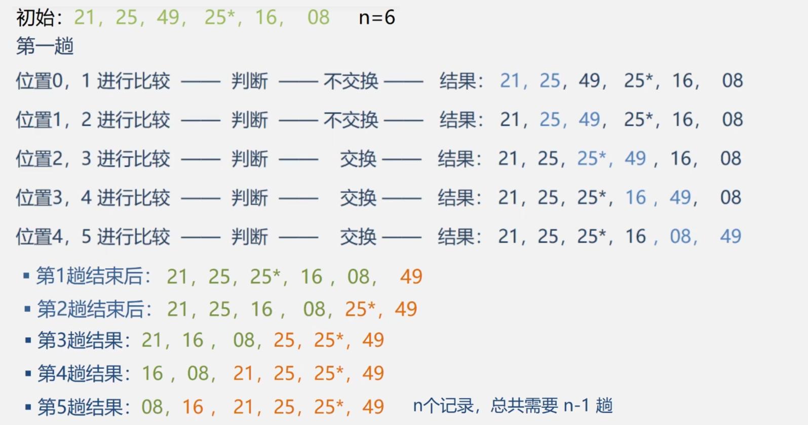

```cpp
//下标易读化写法 i范围为(0 ~ n-2) 修改j范围为(0 ~ n-i-2)
void bubbleSort1(SqList &L) {
    int n = L.length;
    for (int i = 0; i < n - 1; ++i) {//需要n - 1趟
        for (int j = 0; j < n - i - 1; ++j) {
            if (L.elem[j] > L.elem[j + 1]) 
                swap(L.elem[j], L.elem[j + 1]);//发生逆序则进行交换
        }
    }
}
//下标简化的等价写法 修改i范围为(1 ~ n-1) 则修改j的范围可简化写(0 ~ n-i-1)
void bubbleSort2(SqList &L) {
    int n = L.length;
    for (int i = 1; i < n; ++i) {//需要n - 1趟
        for (int j = 0; j < n - i; ++j) {
            if (L.elem[j] > L.elem[j + 1]) 
                swap(L.elem[j], L.elem[j + 1]);//发生逆序则进行交换
        }
    }
}
```

```cpp
//改进的冒泡排序算法:若发现某次遍历后已经是有序的序列，则可直接跳出循环无需再遍历
//新增flag用于标记是否发生交换
void bubbleSort3(SqList &L) {
    int flag = 1;
    int n = L.length;
    for (int i = 1; i < n && flag; ++i) {//需要n - 1趟
        flag = 0;
        for (int j = 0; j < n - i; ++j) {
            if (L.elem[j] > L.elem[j + 1]) {
                flag = 1;
                swap(L.elem[j], L.elem[j + 1]);//发生逆序则进行交换
            }
        }
    }
}
```

1. 优点：每一趟结束时，不仅能挤出一个<font color='#BAOC2F'>最大值到最后面的位置</font>，还能同时<font color='#BAOC2F'>部分理顺其他元素</font>，稳定的排序。
2. 最好情况：比较次数n-1（1趟）、移动次数0，时间负责度为O（n）
3. 最差情况：时间负复杂度为O（n^2）
4. 平均时间复杂度：O（n^2）、空间复杂度为：O（1）

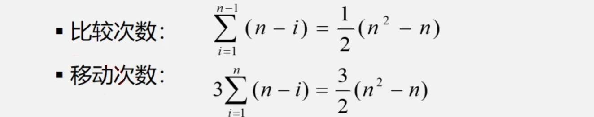

#### 2.快速排序

快速排序是一种改进的冒泡排序算法，


==基本思想==：

1. <font color='#BAOC2F'>任取一个元素</font>作为中心pivot
2. 所有比pivot小的元素都放在前面，比pivot大的元素都放在后面，形成左右两个子表
3. 对各子表重新选择中心元素pivot，并按照规则进行调整（递归思想）
4. 直到每个子表的元素都只剩一个，结束排序
5. 每一趟的子表的形成是采用<font color='#BAOC2F'>从两头向中间交替</font>式的<font color='#BAOC2F'>逼近法</font>。

==算法改进==：减小算法使用的空间（只需要1个额外位置）

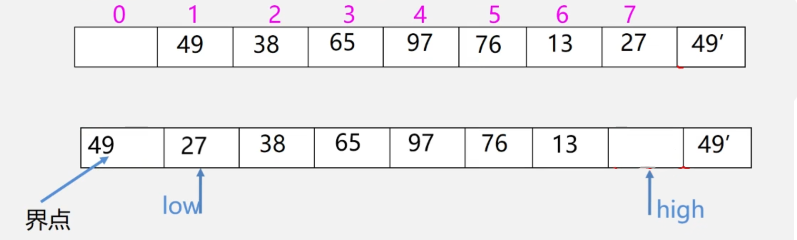

```cpp
//选出pivot并对SqList进行排序
int partition(SqList &L, int low, int high) {
    int key = L.elem[low];//取low处元素的值作为比较参考
    while(low < high) {
        while(low < high && L.elem[high] >= key) --high;//右侧比temp元素大的元素结点不动
        L.elem[low] = L.elem[high];//将比key元素小的结点搬到low位置
        while(low < high && L.elem[low] <= key) ++low;//左侧比temp元素小的元素结点不动
        L.elem[high] = L.elem[low];//将比key元素大的结点搬到high位置
    }
    L.elem[low] = key;//low = high = pivot
    return low;
}

void QSort(SqList &L, int low, int high) {//快速排序调用并指明排序下标范围(low ~ high)
    if (low < high) {//排序区间长度大于1则继续递归,否则退出递归
        int pivot = partition(L, low, high);//选出pivot并对SqList进行排序
        QSort(L, low, pivot - 1);
        QSort(L, pivot + 1, high);
    }
}
```

1. <font color='#BAOC2F'>快速排序</font>是所有内部排序方法中最好的一个
3. 快速排序是一种<font color='#BAOC2F'>不稳定</font>的排序方法
3. 快速排序<font color='#BAOC2F'>不是原地排序</font>（程序中使用了递归需要递归调用栈的支持，而栈的长度取决于递归调用的深度）
4. 平均时间复杂度O(nlog<sub>2</sub>n)：QSort—O(log<sub>2</sub>n)、Partition—O(n)
5. 平均情况下需要使用O(logn)的栈空间，最坏情况下栈空间可以达到O(n)
6. 快速排序不适用与对<font color='#BAOC2F'>原本有序或基本有序</font>的记录序列进行排序（划分元素值的<font color='#BAOC2F'>随机性越好</font>，排序速度越快，即<font color='#BAOC2F'>非自然排序</font>）
7. 改变<font color='#BAOC2F'>划分元素的选取方法</font>，最多只能改变算法<font color='#BAOC2F'>平均时间性能</font>，无法改变最坏情况下的时间性能O(n<sup>2</sup>)
8. 由于每次枢轴pivot记录的关键字都是大于其他所有记录的关键字，致使一次划分之后得到的子序列（1）的长度为0，这时的快速排序就已经退化成为了没有改进措施的冒泡排序了。

### 三、选择排序

#### 1.选择排序

==基本思想==：在待排序的数据中<font color='#BAOC2F'>选出最大/小</font>的元素，放在其最终的位置（符合人类的排序思维）。

1. 首先通过n-1次关键字比较，从n个记录中找出<font color='#BAOC2F'>关键字最小的记录</font>，将其与第一个记录交换。
2. 再通过n-2次比较，从剩余的n-1个记录中找出<font color='#BAOC2F'>关键字次小的记录</font>，将其与第二个记录交换。
3. <font color='#BAOC2F'>重复上述操作</font>，共进行n-1趟排序之后，排序结束。

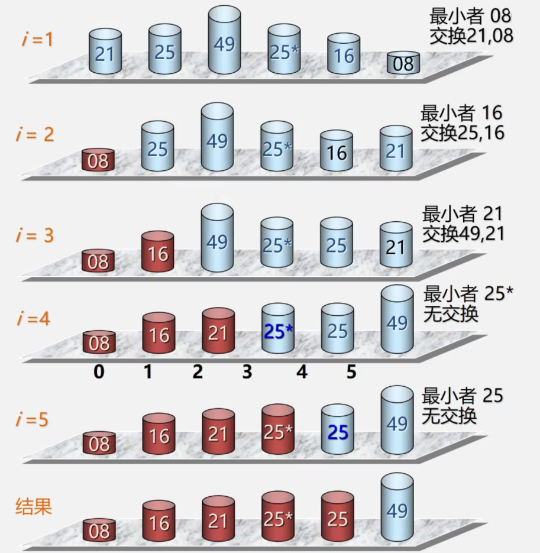

```cpp
void selectSort(SqList &L) {
    for (int i = 0; i < L.length - 1; ++i) {
        //从待排序序列中选出最小值
        int min = i;
        for (int j = i + 1; j < L.length; ++j) {
            if (L.elem[j] < L.elem[min]) min = j;//更新最小值位置
        }
        //如果最小值为自己则不进行元素交换
        if (min != i) {
            int temp = L.elem[i];
            L.elem[i] = L.elem[min];
            L.elem[min] = temp;
        }
    }
}
```

1. 选择排序记录移动次数：最好的情况为0、最坏的情况为3(n-1)

2. 无论<font color='#BAOC2F'>待排序序列处于什么状态</font>，选择排序所需要进行<font color='#BAOC2F'>比较的次数都相同</font>：时间复杂度为O(n<sup>2</sup>)

3. 简单选择排序是<font color='#BAOC2F'>不稳定排序</font>

#### 2.堆排序

堆的实质其实是满足如下性质的<font color='#BAOC2F'>完全二叉树</font>，二叉树中<font color='#BAOC2F'>非叶子结点</font>均小于/大于<font color='#BAOC2F'>其孩子结点</font>的树，

如果输出堆顶值最大/最小值后，<font color='#BAOC2F'>使得剩余元素重新形成一个堆</font>，反复循环则便能够得到一个有序的序列。

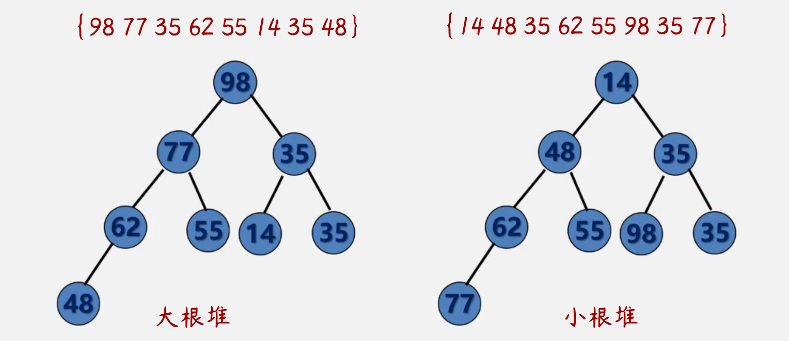

##### （1）堆初始化：

1. 单结点的二叉树是堆（无需调整树中的叶子结点）
2. 在完全二叉树中所有<font color='#BAOC2F'>以叶子结点为根的子树</font>是堆（无需调整）
3. 堆的调整只需要从<font color='#BAOC2F'>最后一个非叶子结点</font>开始即可
4. 需要依次将以序号为n/2、n/2-1、…1的结点为根的<font color='#BAOC2F'>子树</font>均调整为堆即可（筛选需<font color='#BAOC2F'>从第n/2个元素开始</font>）

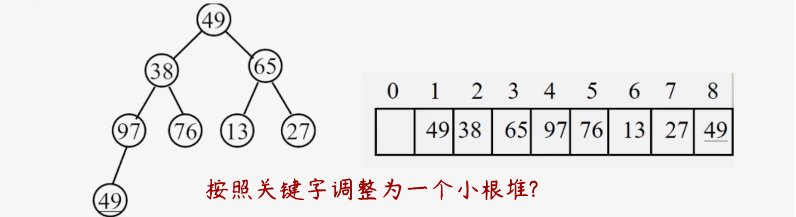

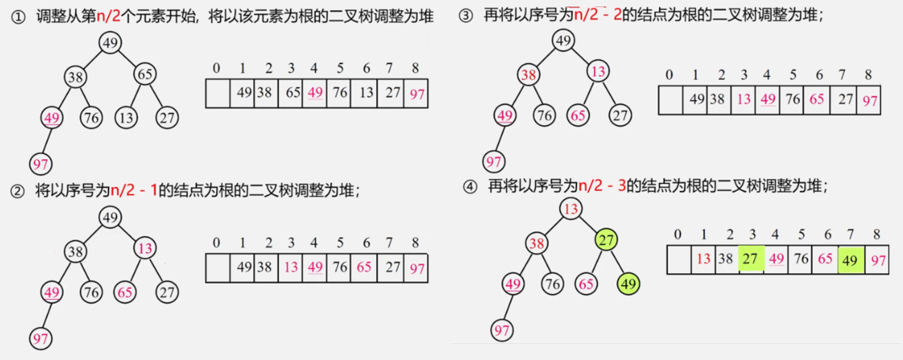

将初始无序序列调整成小根堆（筛选过程），可以利用以算法实现：

```cpp
void HeapAdjust(int R[], int x, int n) {
    //调整R[x]的关键字，使R[x...n]成为一个大根堆
    int rc = R[x];
    for (int i = 2*x; i <= n; i *= 2) {//沿较大的孩子结点向下筛选（2*x即为较大孩子）
        if (i < n && R[i] < R[i + 1]) i = i + 1;//对比左右孩子的大小 取key为较大的孩子节点的下标（保证有右孩子）
        if (rc >= R[i]) break;//若rc已经满足大根堆的要求 则筛选直接结束
        eles {
            R[x] = R[i];//将A[i]调整到双亲结点上
            x = i;//修改x值为i继续向下筛选（实现树的继续向下筛选）
        }
    }
    R[x] = rc;//被筛选结点的值放入最终位置
}
//依次将以序号为n/2、n/2-1...1的结点为根的子树调整为堆
for (int i = n/2; i >= 1; --i) HeapAdjust(R, i, n);
```

##### （2）堆去顶重构：

1. 输出堆顶元素之后，以<font color='#BAOC2F'>堆中最后一个元素</font>替代其位置
2. 将根结点值与左、右子树的根节点值进行比较，并与其中<font color='#BAOC2F'>较小者</font>进行交换。
3. 重复上述操作<font color='#BAOC2F'>直至叶子结点</font>，得到的新的堆（称从这个堆顶至叶子的调整过程为筛选）

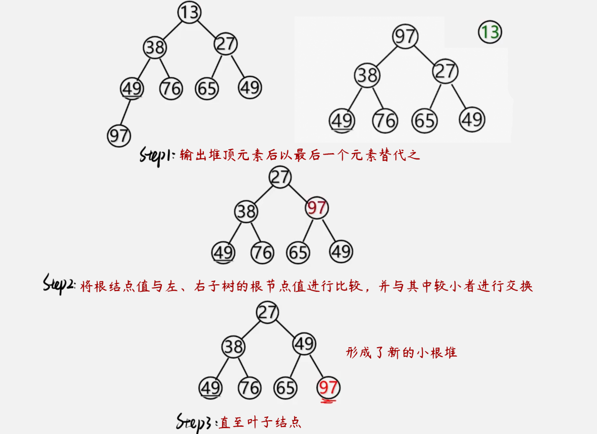

> 从上述算法可以看出，对一个<font color='#BAOC2F'>无序的序列进行反复的筛选</font>就可以得到一个堆。（建堆过程即是一个反复筛选的过程）

##### （3）堆排序算法：

若对一个无序序列建堆，然后输出根（堆顶），重复过程就可以由一个无序序列输出有序序列（实现堆排序）。

> 注意：堆排序实质上就是利用完全二叉树中<font color='#BAOC2F'>父节点与孩子结点之间的内在联系</font>来排序的。

```cpp
//将以x为根的子树调整为大根堆
void HeapAdjust(int R[], int x, int n) {
    int rc = R[x];
    for (int i = 2*x; i <= n; i *= 2) {//沿较大的孩子结点向下筛选（2*x即为较大孩子）
        if (i < n && R[i] < R[i + 1]) i = i + 1;//对比左右孩子的大小 取key为较大的孩子节点的下标（保证有右孩子）
        if (rc >= R[i]) break;//若rc已经满足大根堆的要求 则筛选直接结束
        eles {
            R[x] = R[i];//将A[i]调整到双亲结点上
            x = i;//修改x值为i继续向下筛选（实现树的继续向下筛选）
        }
    }
    R[x] = rc;//被筛选结点的值放入最终位置
}
//堆排序下标范围为  0 - length-1
void HeapSort(int R[], int n) {//对R[1]到R[n]进行堆排序
    //1.建立初始堆O(n)
    for (int i = (n-1)/2; i >= 0; --i) HeapAdjust(R, i, n);
    //2.堆去顶后重构O(nlogn)
    for (int i = n - 1; i > 0; --i) {//去顶重构n-1次
        swap(R[0], R[i]);//根与最后一个元素交换（去顶）
        HeapAdjust(R, 0, i - 1);//重新建堆
    }
}
//堆排序下标范围为 1 - length
void HeapSort(int R[], int n) {//对R[1]到R[n]进行堆排序
    //1.建立初始堆O(n)
    for (int i = n/2; i >= 1; --i) HeapAdjust(R, i, n);
    //2.堆去顶后重构O(nlogn)
    for (int i = n; i > 1; --i) {//去顶重构n-1次
        swap(R[1], R[i]);//根与最后一个元素交换（去顶）
        HeapAdjust(R, 1, i - 1);//重新建堆
    }
}
```

1. 堆排序的时间主要消耗在<font color='#BAOC2F'>建立初始堆</font>和<font color='#BAOC2F'>调整建立新堆</font>操作的反复进行
2. 堆排序无论是在最好/坏的情况下<font color='#BAOC2F'>时间复杂度都为O（nlog<sub>2</sub>n）</font>，无论序列中的记录是否有序。这是堆排序最大的优点
3. 堆排序仅需要一个记录大小的存储空间（供交换使用）
4. 堆排序是一种<font color='#BAOC2F'>不稳定</font>的排序算法
5. 堆排序对<font color='#BAOC2F'>数量较大</font>的的排序是比较有效，不适用于数量较少的情况

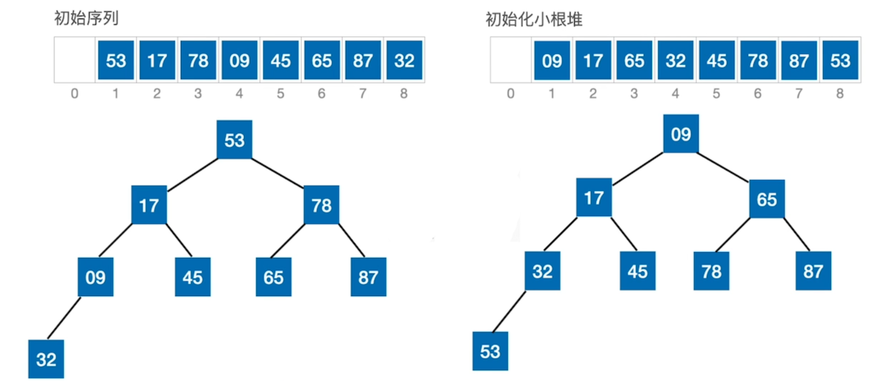

##### （4）堆的插入与删除：

- 小根堆插入：新元素放到表尾与父节点进行对比，若新元素更小则将二者位置交换，新元素就这样一路上升到无法继续为止。
- 小根堆删除：被删除的元素用堆底的元素替代，然后让元素不断下坠直到无法下坠为止（下方有2个孩子与1个孩子对比次数）。

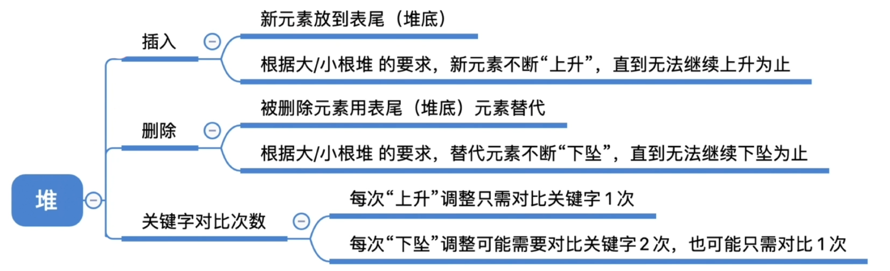

### 四、归并排序

==基本思想==：将多个<font color='#BAOC2F'>有序子序列</font>归并为一个有序序列称为归并排序，算法的核心在于将数组内有序的两个序列合并为一个。

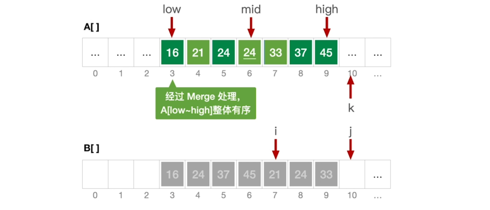

> 注：m路归并每选出一个元素需要对比关键字m-1次

```cpp
//[low...mid]和A[mid+1...high]各自有序 将两个部分归并
void merge(int A[], int n, int low, int mid, int high) {
    int i, j, k;
    int *B = (int *)malloc(n*sizeof(int));//辅助数组B
    for (k = low; k <= high; ++k) B[k] = A[k];//将A中的所有元素复制到B中
    for (i = low, j = mid + 1, k = i; i <= mid && j <= high; ++k) {//归并操作
        if (B[i] <= B[j]) A[k] = B[i++];//将较小值复制到A中
        else A[k] = B[j++];
    }
    while(i <= mid) A[k++] = B[i++];//未归并完的部分直接复制到尾部
    while(j <= high) A[k++] = B[j++];
}

void mergeSort(int A[], int n, int low, int high) {
    if (low < high) {
        int mid = (low + high)/2;//从中间划分
        mergeSort(A, n, low, mid);//左半部分归并排序
        mergeSort(A, n, mid + 1, high);//右半部分归并排序
        merge(A, n, low, mid, high);//归并操作
    }
}
mergeSort(L.elem, L.length, 0, L.length - 1);
```

1. 归并排序时间效率为O（nlog<sub>2</sub>n）
2. 归并排序空间效率为O（n）
3. 归并排序是一个稳定的排序算法

> 注：关于2路归并的归并树（倒立的二叉树）
>
> 1. 二叉树的第h层最多有2<sup>h-1</sup>个结点，即满足 n ≤ 2<sup>h-1</sup> 即为 h - 1 = $\lceil log_2n \rceil$
> 2. n个元素进行2路归并，归并趟数为$\lceil log_2n \rceil$

### 五、基数排序

==基本思想==：分配+收集（基数排序不是一种基于比较思想的排序算法）

基数排序/桶排序/箱排序：设置<font color='#BAOC2F'>多个箱子</font>将<font color='#BAOC2F'>关键字为k的记录放入第k个箱子中</font>（分配），然后再<font color='#BAOC2F'>按照序号</font>将非空的连接（收集）

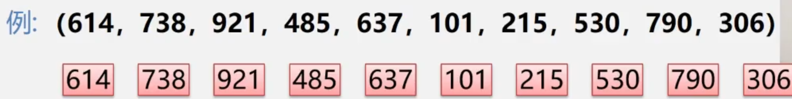

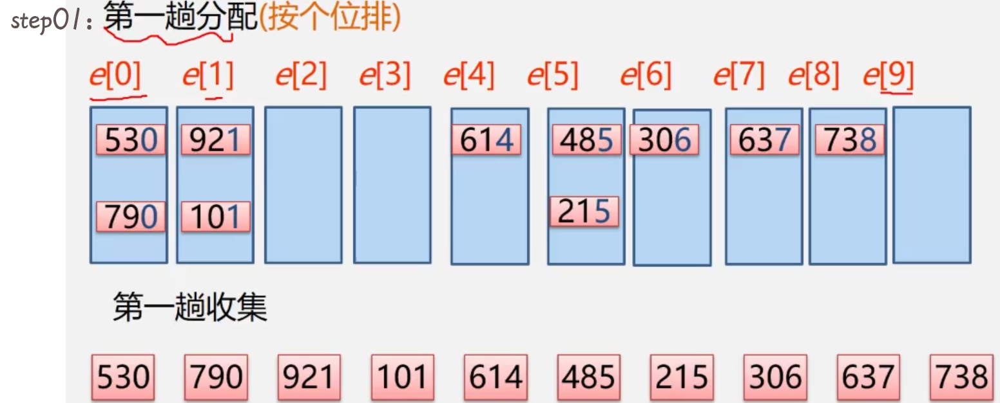

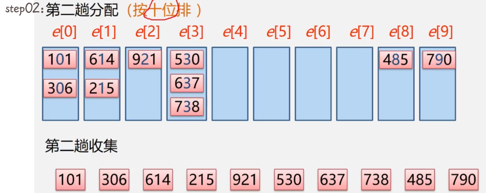

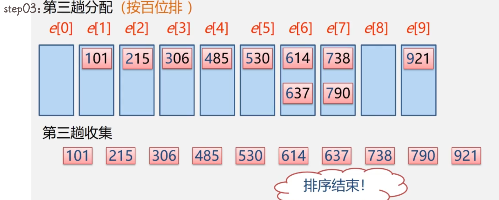

==算法分析==：

1. 基数排序时间效率：O(k*(n+m))，其中k为关键字个数、m为关键字取值范围为m个值

2. 基数排序空间效率：O(m+n)
3. 基数排是一种<font color='#BAOC2F'>稳定的排序算法</font>
4. 数据元素关键字可以拆分为d组且d较小、每组关键字的取值范围不大/r较小、数据元素个数n较大（针对的问题）

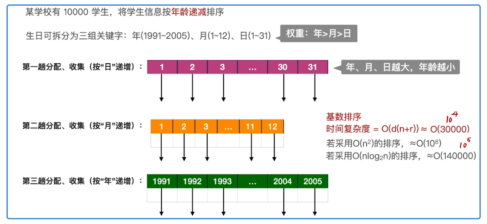

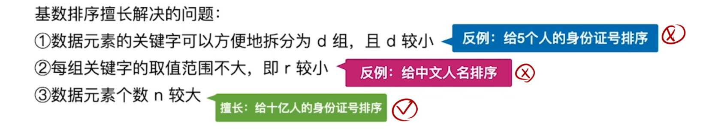

### 七、总结

| 时间复杂度         | 排序方法                                                     |
| ------------------ | ------------------------------------------------------------ |
| O（nlogn）         | 快速排序、堆排序、归并排序（其中快速排序最好）               |
| O（n<sup>2</sup>） | 直接插入排序、冒泡排序、简单选择排序（其中直接插入排序最好） |
| O（n）             | 基数排序                                                     |

1. 当待排序序列<font color='#BAOC2F'>关键字顺序有序</font>时，直接插入排序和冒泡排序能达到O（n）的时间复杂度，而对于<font color='#BAOC2F'>快速排序将退化</font>为O（n<sup>2</sup>）
2. 简单选择排序、堆排序和归并排序的<font color='#BAOC2F'>时间性能不随</font>记录序列中的关键字的分布而变化。
3. 所有的简单排序方法（包括直接插入、冒泡和简单选择）的堆排序的空间复杂度为O（1）
4. 快速排序栈需要使用辅助空间，空间复杂度为O（logn）
5. 归并排序所需要使用的辅助空间为最多O（n）
6. 链式基数排序需要附设队列首位指针，空间复杂度为O（r*d）

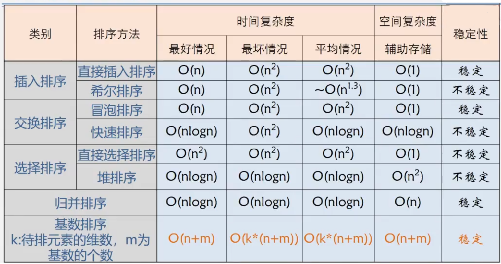
