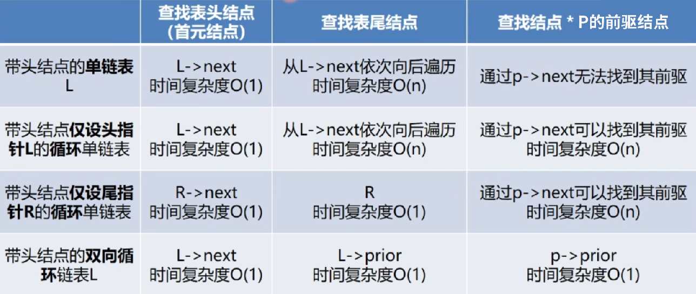

# 第二章：线性表

---

### 一、线性表

线性表：具有<font color='#BAOC2F'>相同特性的数据元素</font>的一个<font color='#BAOC2F'>有限序列</font>，数据元素的个数定义为表的长度。

线性表ADT的定义如下：

```cpp
ADT List {
    数据对象:
    	D = {ai | ai属于Element, (i = 1, 2, ..., n)}
    数据关系:
    	R = {<ai-1, ai> | ai-1, ai属于D, (i = 1, 2, ..., n)}
    基本操作:
    	InitList(&L);
    	DestroyList(&L);
    	ListInsert(&L, i, e);
    	ListDelete(&L, i, &e);
} ADT List
```

### 二、线性表的顺序表示

#### 1.顺序表定义：

顺序存储结构：将<font color='#BAOC2F'>逻辑上相邻的数据元素</font>存储在<font color='#BAOC2F'>物理上相邻的存储单元中</font>的存储结构（逻辑上相邻，物理上也相邻）

==顺序表的特点==：

1. 线性表顺序存储结构必须<font color='#BAOC2F'>占用一片连续的存储空间</font>，
2. 知道某个元素的存储位置就<font color='#BAOC2F'>可以计算其他元素的存储位置</font>，
3. 顺序表：随机存取


#### 2.顺序表存储表示：

根据顺序表的地址连续、依次存放、随机存储、类型相同等特点，可以用高级语言中的数组来表示顺序表这种数据结构。

关于数组的内存分配有两种方式（顺序表初始化）：

1. 数组静态分配：数组的大小和空间初始固定，一旦空间占满再加入新的数据就会发生溢出，进而导致程序崩溃。

    ```cpp
    #define MaxSize 100
    typedef struct {
        ElemType elem[MaxSize];//顺序表最大长度(容量)
        int length;//顺序表目前长度
    } SqList;
    ```

2. 数组动态分配：数组的存储空间是动态分配的，一旦空间占满就会另外开辟一块更大的存储空间，替换原来的存储空间（扩容）。

    ```cpp
    typedef struct {
        ElemType *elem;//顺序表最大长度(容量)
        int length;//顺序表目前长度
    } SqList;
    
    SqList L;
    L.data = (ElemType*)malloc(sizeof(ElemType)*MaxSize)
    ```

> 补充：C与Cpp对于内存动态分配语句中的函数说明
>
> 1. c动态内存分配：
>
>     | 函数      | 说明                                            |
>     | --------- | ----------------------------------------------- |
>     | malloc(n) | 开辟n字节长度的地址空间，并返回这段空间的首地址 |
>     | sizeof(x) | 计算变量x的长度                                 |
>     | free(p)   | 释放指针p所指变量的存储空间（彻底删除一个变量） |
>
> 2. cpp动态存储分配：
>
>     | 函数    | 说明                                                         | 举例                                         |
>     | ------- | ------------------------------------------------------------ | -------------------------------------------- |
>     | new T() | 申请用于存储T类型对象的内存空间，并按照初值列表进行赋值<br />如果执行成功则返回T类型的指针（指向新分配的内存），<br />否则返回0（NULL） | int *p = new int(10);<br />int *p = new int; |
>     | delete  | 释放指针p所指向的内存，指针p必须是new操作的返回值            | delete p;                                    |

#### 3.顺序表基本操作：

```cpp
//函数返回结果状态码
#define TRUE 1
#define FALSE 0
#define OK 1
#define ERROR 0
#define INFEASIBLE -1
#define OVERFLOW -2

//Status是函数的类型，其值是函数结果状态码
typedef int Status;
typedef char ElemType;
```

##### （1）简单操作：

```cpp
//操作1：初始化一个空的顺序表
Status InitSqList(SqList &L) {
    //1.为顺序表分配内存空间
    L.elem = new ElemType[MAXSIZE];
    if (!L.elem) {
        exit(OVERFLOW);//内存分配失败，则直接返回
    } else {
        L.length = 0;//内存分配成功，则设定目前顺序表的长度为0
    }
    return OK;
}
```

```cpp
//操作2：顺序表取值(按下标查找)
Status GetElem(SqList L, int i, ElemType &e) {
    if (i < 1 || i > L.length) return ERROR;//非法取值
    e = L.elem[i - 1];
    return OK;
}
```

```cpp
//操作3：顺序表清空
void ClearList(SqList &L) {
    L.length = 0;
}
```

```cpp
//操作4：顺序表销毁
void DestroyList(SqList &L) {
    if(L.elem) delete L.elem;
}
```

##### （2）顺序表查找操作：

从表的一端考试逐个进行记录的<font color='#BAOC2F'>关键字和给定值</font>的比较（逐个遍历），如果找到则返回该元素的位置序号，否则返回0

```cpp
int LocateElem(SqList L, ElemType e) {
    for (int i = 0; i < L.length; ++i) {
        if (L.elemp[i] == e) return i + 1;
    }
    return 0;
}
```

- 最好情况：查找的元素就在表头，需要比较1次时间复杂度为O(1)
- 最坏情况：查找的元素在表位 or 不存在，需要比较n次时间复杂度为O(n)
- 平均情况：需要比较(n + 1) / 2次时间复杂度为O(n)，因此线性表按值查找的平均时间复杂度为<font color='#BAOC2F'>O(n)</font>

##### （3）顺序表插入操作：

算法思想：

1. 判断插入位置i是否合法，否则返回ERROR
2. 判断顺序表的存储空间是否已满，否则返回ERROR
3. 将第`n~i`位元素依次向后移动一个位置，空出第i位置▲
4. 将插入元素e放入到插入位置▲
5. 修改顺序表目前长度+1，插入成功返回OK▲

```cpp
Status SqListInsert(SqList &L, int i, ElemType e) {
    if (i < 1 || i > L.length + 1) return ERROR;//非法插入
    if (L.length == MAXSIZE) return ERROR;//顺序表已满
    //1.将插入元素及其之后的元素后移
    for (j = L.length - 1; j >= i - 1; --j) {
        L.elem[j + 1] = L.elem[j];
    }
    //2.将插入元素e放入到插入位置
    L.elem[i - 1] = e;
    //3.修改顺序表目前长度
    L.length++;
    return OK;
}
```

- 最好情况：在顺序表尾插入(i = n + 1)，元素后移执行语句不执行，时间复杂度为O(1)
- 最坏情况：在顺序表头插入(i = n)，元素后移语句将执行n次，时间复杂度为O(n)
- 平均情况：元素后移语句平均需要执行n / 2次，顺序表插入算法的平均时间复杂度为<font color='#BAOC2F'>O(n)</font>

##### （4）顺序表删除操作：

算法思想：

1. 判断删除位置i是否合法，否则返回ERROR
2. 将将要删除的元素保存到e中▲
3. 将第`i+1~n`位的元素依次向前移动一个位置▲
4. 修改顺序表目前长度-1，删除成功返回OK▲

```cpp
Status SqListDelete(SqList &L, int i, Elemtype &e) {
    if (i < 1 || i > L.length) return ERROR;//非法删除
    //1.将将要删除的元素保存到e中
    e = L.elem[i - 1];
    //2.将删除元素之后的元素向前移动
    for (int j = i; j <= L.length - 1; ++j) {
        L.elem[j - 1] = L.elem[j];
    }
    //3.修改顺序表目前长度
    L.length--;
    return OK;
}
```

- 最好情况：删除表尾元素(i = n)，元素前移执行语句不执行，时间复杂度为O(1)
- 最坏情况：删除表头元素(i = n)，元素前移语句将执行n - 1次，时间复杂度为O(n)
- 平均情况：元素前移语句平均需要执行(n - 1)/2次，顺序表删除算法的平均时间复杂度为<font color='#BAOC2F'>O(n)</font>

##### （5）总结：

顺序表优点：

1. 存储密度大
2. 可以随机存取表中任意元素
3. 算法效率：查找/插入/删除算法的平均时间复杂度都为O(n)，空间复杂度为O(1)

顺序表缺点：

1. 浪费存储空间
2. 在插入/删除某一元素时，需要移动大量元素
3. 属于静态存储形式，数据元素的个数不能自由扩充

#### 4.Cpp中的参数传递：

参数传递的方式有两种：值传递与地址传递（参数为指针变量/数组名、引用类型）

##### （1）值传递：

值传递：将实参的值传送给函数局部工作区相应的副本中，函数使用该副本执行必要的功能（函数修改的是副本的值，实参不改变）。

```cpp
#include <iostream>
using namespace std;

void swap(float m, float n) {
    float temp = n;
    m = n;
    n = temp;
}

int main() {
    float a, b;
    cin >> a >> b;
    swap(a, b);
    cout << a << " " << b << endl;
    return 0;
}
```

##### （2）地址传递（指针变量）

```cpp
#include <iostream>
using namespace std;

//1.形参变化不影响实参（实际交换了指针变量）
void swap1(float *m, float *n) {
    float *temp = m;
    m = n;
    n = temp;
}

//2.形参变化影响实参（实际交换了指针所指向的ab值）
void swap2(float *m, float *n) {
    float temp = *m;
    *m = *n;
    *n = temp;
}

int main() {
    float a, b;
    float *p1, *p2;
    
    cin >> a >> b;
    p1 = &a; p2 = &b;
    
    swap1(p1, p2);
    cout << "调用swap1方法：形参变化不影响实参（实际交换了指针变量）" << endl;
    cout << a << " " << b << endl;
    
    swap2(p1, p2);
    cout << "调用swap2方法：形参变化影响实参（实际交换了指针所指向的ab值）" << endl;
    cout << a << " " << b << endl;
    return 0;
}
```


##### （3）地址传递（数组名）

如果传递的参数是数组的首地址，对<font color='#BAOC2F'>形参数组</font>所做的任何操作<font color='#BAOC2F'>都将反应到实参数组中</font>：

```cpp
#include <iostream>
#include <string.h>
using namespace std;

//1.传递数组地址,且数组地址使用char b[]接收
void func1(char temp[]) {
    strcpy(temp, "Rewrite by func1, address access by char temp[].");
}

//2.传递数组地址,且数组地址使用char *b接收
void func2(char *temp) {
    strcpy(temp, "Rewrite by func2, address access by char *temp.");
}

//注意：数组地址即为数组首个元素的地址,故char b[]与char *b作用相同

int main() {
    char a[50] = "this is a test!";
    cout << a << endl;
    func1(a);
    cout << a << endl;
    func2(a);
    cout << a << endl;
    return 0;
}
```


##### （4）地址传递（引用类型&）

引用：为实际对象提供了一个<font color='#BAOC2F'>替代的名字</font>。

```cpp
#include <iostream>
using namespace std;

void swap(float &m, float &n) {
    float temp = m;
    m = n;
    n = temp;
}

int main() {
    float a, b;
    cin >> a >> b;
    swap(a, b);
    cout << a << " " << b << endl;
}
```

### 三、线性表的链式表示

#### 1.链表定义：

链式存储结构：结点在存储器中的位置是任意的（逻辑上相邻的数据元素在物理上不一定相邻）

链表特点：

1. 链表中<font color='#BAOC2F'>结点在存储器中的位置是任意的</font>，
2. 访问链表时<font color='#BAOC2F'>只能通过头指针进入</font>并通过每个结点的指针域依次向后顺序扫描。
3. 链表：顺序存取


| 名词     | 解释                                                         |
| -------- | ------------------------------------------------------------ |
| 头指针   | 是<font color='#BAOC2F'>指向链表中第一个结点</font>的指针    |
| 头结点   | 链表首元结点之前<font color='#BAOC2F'>附设</font>的一个结点  |
| 首元结点 | 链表中存储<font color='#BAOC2F'>第一个数据元素</font>a1的结点 |

> 注：链表中头结点中并不存储元素，<font color='#BAOC2F'>首元结点才是第一个存储元素</font>的结点！

==问题1：头结点设置的好处？==

1. 便于首元结点的统一处理

    首元结点的地址保存在<font color='#BAOC2F'>头结点的指针中</font>，所以在链表的第一个位置上的操作与其他位置上的结点操作相同（<font color='#BAOC2F'>省去首结点特判处理</font>）

2. 便于空表和非空表的统一处理

    无论链表是否为空，头指针都是指向头结点的非空指针（空表和非空表的处理相同）

> 注：这些优点只有在实际编程实现顺序表中才能真正体会，需要自己实现一遍顺序表的结构！

==问题2：头结点数据域中存放的是什么？==

头结点的数据域可以为空，也可以存放线性表的长度、或者其他附加信息（但是该结点不能计入链表的长度length）


#### 2.链表存储表示：


```cpp
typedef struct Node {
    ElemType data;//数据域
    struct Node *next;//指针域（指向结点的指针）
}Node, *LinkList;//LinkList为指向结构体Node的指针类型（为头指针使用）

LinkList L;//1.定义链表L（开辟链表头指针）
Node *p;//2.定义指向结点的指针p
```

#### 3.链表简单操作：

##### （1）链表初始化：

单链表初始化即为<font color='#BAOC2F'>构造一个空表</font>：


1. 生成一个新结点作为头结点，用头指针L指向头结点
2. 将头结点的指针域置为NULL

```cpp
Status InitLinkList(LinkList &L) {
    L = (LinkList)malloc(sizeof(Node));//L = new Node;
    L->next = NULL;
    return OK;
}
```

##### （2）链表置空：

空链表：链表仍然存在，但链表中<font color='#BAOC2F'>没有元素</font>称为空链表（头指针和头结点仍然存在）

算法思路：依次释放所有结点，并将头结点指针域设置为空


```cpp
Status ClearLinkList(LinkList &L) {
    Node *p, *q;
    p = L->next;
    while(p) {//没有到达表尾则循环删除结点
        q = p->next;
        delete p;
        p = q;
    }
    L->next = NULL;//头结点指针域为空
    return OK;
}
```

##### （3）链表判空：

空链表：链表仍然存在，但链表中<font color='#BAOC2F'>没有元素</font>称为空链表（头指针和头结点仍然存在）

```cpp
int ListEmpty(LinkList L) {
    if (L->next) {
        return 0;//L中还有元素非空表，则返回0
    } else {
        return 1;//L中没有元素为空表，则返回1
    }
}
```

##### （4）求链表表长：

算法思路：从首结点开始，依次计数所有结点


```cpp
int LinkListLength(LinkList L) {//返回L中的数据元素个数
    Node *p;
    p = L->next;
    int i = 0;
    while(p) {
        i++;
        p = p->next;
    }
    return i;
}
```

##### （5）链表销毁：

> 注：销毁单链表<font color='#BAOC2F'>不可通过直接把头指针置空实现</font>，而是要依次释放所有的结点（<font color='#BAOC2F'>包括头结点</font>）

算法思路：从头指针开始，依次释放掉所有结点


```cpp
Status DestroyLinkList(LinkList &L) {
    Node *p;
    while(L) {
        p = L;
        L = L->next;
        delete p;
    }
    return OK;
}
```

#### 4.链表重要操作：

##### （1）头插法建立链表：

==头插法图示==：将新元素<font color='#BAOC2F'>插入到链表的头部</font>（与<font color='#BAOC2F'>结点的插入操作</font>十分相似）


采用头插法建立单链表时，读入数据的顺序与生成链表的元素顺序是相反的（故这里需要<font color='#BAOC2F'>从e结点开始倒序输入</font>才能建立正序的链表）。

==头插法步骤==：

1. 建立一个空表
2. 生成新结点，将读入数据存放到新结点的数据域中
3. 依次将新结点插入到链表数据结点的最前端


```cpp
//for循环写法
void CreateLinkList(LinkList &L, int n) {
    L = new Node; L->next = NULL;
    for (int i = n; i > 0; --i) {
        p = new Node;
        cin >> p->data;
        p->next = NULL;
        
        p->next = L->next;
        L->next = p;
    }
}
```

```cpp
//while循环写法
void CreateLinkList(LinkList &L) {
    L = new Node; L->next = NULL;
    int x;
    cin >> x;
    while (x != 9999) {//输入9999表示结束插入
        p = new Node;
        p->data = x;
        p->next = NULL;
        
        p->next = L->next;
        L->next = p;
        
        cin >> x;
    }
}
```

##### （2）尾插法建立链表：

==尾插法图示==：将新元素<font color='#BAOC2F'>插入到链表的尾部</font>。


采用尾插法建立单链表时，读入数据的顺序与生成链表的元素顺序是相同的（但是需要多增加一个尾指针`r`，使其始终指向尾结点）。

==尾插法步骤==：

1. 建立一个空表，创建尾指针r指向链表尾结点（开始时r同L均指向头结点）
2. 生成新结点，将读入数据存放到新结点的数据域中
3. 依次将新结点插入到链表数据结点的尾部
4. 尾指针指向新节点


```cpp
//for循环写法
void CreateLinkList(LinkList &L, int n) {
    L = new Node; L->next = NULL;
    Node *r = L;//创建尾指针初始时指向头结点
    for (int i = 0; i < n; ++i) {
        Node *p = new Node;
        cin >> p->data;
        p->next = NULL;
        
        r->next = p;
        r = p;
    }
}
```

```cpp
//while循环写法
void CreateLinkList(LinkList &L) {
    L = new Node; L->next = NULL;
    Node *r = L;
    int x;
    cin >> x;
    while (x != 9999) {//输入9999表示结束插入
        p = new Node;
        p->data = x;
        p->next = NULL;
        
        r->next = p;
        r = p;
        
        cin >> x;
    }
}
```

##### （3）按序查找元素：

根据单链表中元素的下标`i`，从指定位置获取数据（返回元素值or结点的地址）。

==算法图示==：从链表的头指针出发，顺着链域next逐个结点向下搜索，直至搜索到第`i`个结点为止（链表不是随机存取的结构）


==算法步骤==：

1. 从第1个结点`L->next`顺链扫描，用指针p指向当前扫描到的结点（初始化为`p = L->next`）
2. `j`做计数器累计当前扫描过的结点数（初始化`j=1`）
3. 当p指向扫描到的下一结点，计数器`j+1`
4. 当`j==i`时，p所指的结点就是要寻找的第`i`个结点

```cpp
//写法1:返回需要查找结点的值
Status GetElem(LinkList L, int i, ElemType &e) {
    Node *p = L->next;
    int j = 1;
    while (p && j < i) {
        p = p->next;
        j++;
    }
    if (!p || j > i) return ERROR;//非法查找
    e = p->data;
    return OK;
}
```

```cpp
//写法2:返回需要查找结点
Node *GetElem(LinkList L, int i) {
    Node *p = L->next;
    int j = 1;
    if (i == 0) return L;//如果i=0则返回头结点
    if (i < 1) return NULL;//非法查找
    while (p && j < i) {
        p = p->next;
        j++;
    }
    return p;
}
```

##### （4）按值查找元素：

根据<font color='#BAOC2F'>指定数据获取该数据所在的位置</font>（返回元素下标or结点的地址）


```cpp
//写法1:返回需要查找结点的下标
int LocateElem(LinkList L, ElemType e) {
    p = L->next;
    int j = 1;
    while (p != NULL && p->data != e) {
        p = p->next;
        j++;
    }
    if (p == NULL) {
        return ERROR;//非法查找
    }
    return j;
}
```

```cpp
//写法2:返回需要查找的结点
Node *LocateElem(LinkList L, ElemType e) {
    Node *p = L->next;
    while (p != NULL && p->data != e) {
        p = p->next;
    }
    return p;
}
```

##### （5）按序插入：

==算法图示==：

在第`i`个结点前插入值为e的新结点


==算法步骤==：

1. 首先找到a<sub>i-1</sub>的存储位置`p`
2. 生成一个数据域为e的新节点`s`
3. 插入新的结点：①新结点的指针域指向结点a<sub>i</sub>：`s->next = p->next;`，②结点a<sub>i-1</sub>的指针域指向新结点：`p->next = s;`


> 注：链表插入操作中的步骤①和步骤②是有先后顺序的，如果<font color='#BAOC2F'>交换顺序</font>将导致a<sub>i</sub>的<font color='#BAOC2F'>地址丢失</font>。

```cpp
Status LinkListInsert(LinkList &L, int i, ElemType e) {
    Node *p = L;
    int j = 0;
    //1.寻找第i个结点，将指针p指向其前驱
    while (p != NULL j < i - 1) {
        p = p->next;
        j++;
    }
    if (p == NULL || j > i -1) return ERROR;
    
    //2.生成新的结点s并为其数据域赋值
    Node *s = new Node; s->data = e;
    
    //3.进行结点插入操作
    s->next = p->next;
    p->next = s;
    
    return OK;
}
```

##### （6）按序删除：

==算法图示==：

删除第i个结点


==算法步骤==：

1. 首先找到a<sub>i-1</sub>的存储位置`p`，并保存要删除的a<sub>i</sub>值
2. 令`p->next`指向a<sub>i+1</sub>
3. 释放结点a<sub>i</sub>的空间


```cpp
Status Delete(LinkList &L, int i, ElemType &e) {
    Node *p = L; int j = 0;
    //1.寻找第i个结点，将指针p指向其前驱
    while (p->next != NULL && j < i - 1) {
        p = p->next;
        j++;
    }
    if(p->next == NULL || j > i - 1) return ERROR;
    
    //2.保存元素值后进行删除操作
    Node *q = p->next;
    p->next = q->next;
    e = q->data;
    
    //3.释放已经删除结点的内存
    delete q;
    
    return OK;
}
```

##### （7）按值删除：


```cpp
//while循环判定后 删除指定元素
void Delete(LinkList &L, int x) {
    if (L == NULL) return;
    Node *p = L;
    while (p->next != NULL) {
        if (p->next->data == x) {
            Node *q = p->next;
            p->next = q->next;
            delete q;
        }
        if (p->next != NULL) p = p->next;//若p指针指向尾元素则不进行自增操作（否则将p指针置空导致访问p->next非法空间）
    }
}
```

#### 5.循环链表：

##### （1）循环链表：

循环链表是一种头尾相接的链表（表中<font color='#BAOC2F'>最后一个结点的指针域</font>指向<font color='#BAOC2F'>头结点</font>，整个链表形成一个环形）

循环链表的优点是从表中任一结点出发，均可找到表中的其他结点。


由于循环链表中没有NULL指针，故涉及遍历操作时终止条件就不再是判断`p`或`p->next`是否为空，而是判断它们<font color='#BAOC2F'>是否等于头指针</font>。


##### （2）循环链表合并：

==算法图示==：

将两<font color='#BAOC2F'>个带尾指针的循环链表</font>进行合并（将Tb合并在Ta）


==算法步骤==：

> 注：对链表的操作常常是在<font color='#BAOC2F'>表的首位位置上</font>进行的。


1. 创建指针p保存表头结点`Node *p = La->next;`
2. 将Lb首元结点连接到La的表尾`La->next = Lb->next->next;`
3. 释放Lb的表头结点`delete Lb->next;`
4. 将Lb的尾结点指针指向La的表头`Lb->next = p;`

```cpp
LinkList LinkListConnect(LinkList La, LinkList Lb) {
    Node *p = La->next;
    La->next = Lb->next->next;
    delete Lb->next;
    Lb->next = p;
    return Lb;
}
```

> 注：循环链表不设置头指针而<font color='#BAOC2F'>仅设置尾指针</font>，从而使得操作效率更高。循环链表合并的时间复杂度为O(1)

#### 6.双向链表：

##### （1）双向链表：

在单链表的每个结点里再增加一个<font color='#BAOC2F'>指向其直接前驱</font>的指针域prior，称为双向链表。


- 在双向链表中有些操作如ListLength、GetElem等仅涉及一个方向的指针，故其算法与线性链表相同。
- 在双向链表中的插入insert、删除delete，则需要<font color='#BAOC2F'>同时修改两个方向上的指针</font>（两者的操作时间复杂度均为O(n)）

##### （2）双向链表插入：


```cpp
//核心操作
s->prior = p->prior;
p->prior->next = s;
s->next = p;
p->prior = s;
```

```cpp
void DoubleLinkListInsert(DuLinkList &L, int i, ElemType e) {
    //在带头结点的双向链表L的第i个位置插入元素e
    if ((Node *p = GetElem(L, i)) == NULL) return ERROR;
    Node *s = new Node;
    s->data = e;
    
    s->prior = p->prior;
	p->prior->next = s;
	s->next = p;
	p->prior = s;
    
    return OK;
}
```

##### （3）双向链表删除：


```cpp
//核心操作
p->prior->next = p->next;
p->next->prior = p->prior;
```

```cpp
void DoubleLinkListDelete(DuLinkList &L, int i, ElemType e) {
    //删除带头结点的双向链表L的第i个元素，并用e返回
    if ((Node *p = GetElem(L, i)) == NULL) return ERROR;
    e = p->data;
    
    p->prior->next = p->next;
	p->next->prior = p->prior;
    
    delete p;
    return OK;
}
```

==各种链表间时间效率对比：==



### 四、顺序表与链表的比较：


### 五、线性表应用

#### 1.线性表的合并

##### （1）无序表的合并：

==问题描述==：利用两个线性表La和Lb分别表示两个集合A与B，现要求一个新的集合A = A∪B（无序）


==算法步骤==：

1. 依次取出Lb中的每个元素
2. 在La中查找取出的该Lb元素
3. 如果查找不到则将其插入到La中的最后位置

```cpp
void union(List &La, List Lb) {
    La_len = ListLength(La);
    Lb_len = ListLength(Lb);
    for (int i = 1; i <= Lb_len; ++i) {
        GetElem(Lb, i, e);//查找元素
        if (LocateElem(La, e != NULL)) {
            ListInsert(&La, ++La_len, e);//如果没有查找到元素则进行插入操作
        }
    }
}
//算法复杂度为O(ListLength(La))*O(ListLength(Lb))
```

##### （2）有序表的合并：

==问题描述==：已知线性表La和Lb中的数据元素按值非递减有序排列，现要求将La和Lb归并为一个新的线性表Lc，且元素仍非递减有序。


==算法步骤==：

1. 创建一个空表Lc
2. 依次从La或Lb中<font color='#BAOC2F'>摘取</font>元素较小的结点，插入到Lc表的最后直至其中一个表变成空表为止。
3. 继续将La或Lb其中一个表的剩余结点插入在Lc表的最后

==顺序表实现有序表的合并==：

```cpp
void MergeList(SqList La, SqList Lb, SqList &Lc) {
    //1.准备指向有序数组首元素的各个指针
    pa = La.elem;
    pb = Lb.elem;
    pc = Lc.elem;
    Lc.length = La.length + Lb.length;
    
    //2.准备指向有序数组尾元素的指针
    paLast = La.elem + La.length - 1;
    pbLast = Lb.elem + Lb.length - 1;
    
    //3.依次摘取两表中较小的结点进行插入操作
    while (pa <= paLast && pb <= pbLast) {
        if (*pa <= *pb) {
            *pc++ = *pa++; //*pc = *pa; pc++; pa++;
        } else {
            *pc++ = *pb++;
        }
    }
    
    //4.将某一个表中剩余的元素全部添加到Lc中
    while (pa <= paLast) *pc++ = *pa++;//Lb到达表尾，将La中的元素全部加入Lc
    while (pb <= pbLast) *pc++ = *pb++;//La到达表尾，将Lb中的元素全部加入Lc
}
//算法时间复杂度为O(ListLength(La)) + O(ListLength(Lb))
//算法空间复杂度为O(ListLength(La)) + O(ListLength(Lb))
```

==链表实现有序表合并==：

```cpp
void MergeList(LinkList &La, LinkList &Lb, LinkList &Lc) {
    //Stage1
    pa = La->next;
    pb = Lb->next;
    pc = Lc = La;
    
    //Stage2 & Stage3
    while (pa != NULL && pb != NULL) {
        if (pa->data <= pb->data) {
            pc->next = pa;
            pc = pa;
            pa = pa->next;
        } else {
            pc->next = pb;
            pc = pb;
            pb = pb->next;
        }
    }
    
    //Stage4
    pc->next = pa ? pa : pb;
    delete Lb;
}
//算法时间复杂度O(ListLength(La) + ListLength(Lb))
```


#### 2.线性表其他应用：

##### （1）密集多项式：

多项式的运算：实现两个多项式加/减/乘运算


##### （2）稀疏多项式：

如果同样按照密集多项式的存储方式来存储稀疏多项式，会导致出现空间严重浪费的情况，故<font color='#BAOC2F'>增加一个指数存储项</font>。


==算法步骤==：

1. 创建一个新的数组c（用于存储多项式运算的结果多项式）

2. 分别从头遍历比较数组a和数组b中的每一项

    若指数相同则将对应的系数相加，若其和不为零则在c中增加一个新的项（和为零则丢弃）

    若指数不同则将较小的项复制到c中

3. 当一个多项式遍历完成时，将另一个剩余项依次复制到c中即可

##### （3）稀疏多项式操作：

==存储方式的改进==：按照密集多项式的存储方式并<font color='#BAOC2F'>增加一个指数存储项</font>来存储稀疏多项式还是有不足，可以改用<font color='#BAOC2F'>链式存储结构</font>来存储。


==稀疏多项式创建==：

- 创建一个只有头结点的空链表
- 根据多项式的项的个数n，循环n次执行以下操作：
    1. 生成一个新节点`*s`
    2. 输入多项式当前项的系数和指数，赋给新的结点`*s`的数据域
    3. 设置一个前驱指针`pre`用于指向<font color='#BAOC2F'>待找到的第1个大于输入项指数</font>的结点的前驱，`pre`初始值指向头结点
    4. 指针q初始化指向首元结点
    5. 循链向下逐个比较<font color='#BAOC2F'>链表中当前结点</font>与<font color='#BAOC2F'>输入项的指数</font>，找到<font color='#BAOC2F'>第1个大于输入项指数</font>的结点`*q`
    6. 将输入项结点`*s`插入到结点`*q`之前

```cpp
void CreatePolyn(Polynomial &Po, int n) {
    Po = new PNode; Po->next = NULL;
    for (int i = 1; i <= n; ++i) {
        PNode *s = new PNode;
        cin >> s->coef >> s->expn;//输入指数与系数
        
        PNode *pre = Po;
        q = Po->next;
        while (q != NULL && q->expn < s->expn) {
            pre = q;
            q = q->next;
        }
        s->next = q;
        pre->next = s;
    }
}
```

==稀疏多项式相加操作==：


##### （3）图书信息管理：


1. 线性表中数据元素的类型可以为简单类型，也可以为复杂类型
2. 许多实际应用问题所涉及的基本操作有很大的相似性，不应为每个具体应用单独编写程序。
3. 从<font color='#BAOC2F'>具体应用</font>中抽象出<font color='#BAOC2F'>共性的逻辑结构和基本操作</font>（抽象数据类型），然后实现其存储结构和基本操作。

```cpp
struct Book {
    char id[20];//ISBN
    char name[50];//书名
    int price;//定价
}

//顺序表
typedef struct {
    Book *data;
    int length;
} BookSqList;

//链表
typedef struct LNode {
    Book data;
    struct LNode *next;
} LNode, *BookLinkList;
```


