# 第四章：串与数组

---

### 一、串

String串是指零个or多个任意字符串组成的有限序列。

```cpp
ADT String {
    数据对象：
    数据关系：
    基本操作：
        StrAssign(&T, chars);
        StrCompare(S, T);
    	StrLength(s);
    	Concat(&T, S1, S2);
    	SubString(&Sub, S, pos, len);
    	StrCopy(&T, S);
        StrEmpty(S);
    	ClearString(&S);
    	Index(S, T, pos);//字符串匹配算法
        Replace(&S, T, V);
    	StrInsert(&S, pos, T);
    	StrDelete(&S, pos, len);
    	DestroyString(&S);
} ADT String
```

#### 1.存储结构：

串中元素逻辑关系与线性表相同，串可以采用与线性表相同的存储结构：

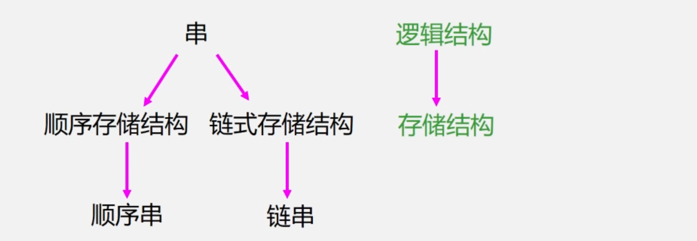

##### （1）顺序串：

```cpp
#define MAXLEN 255
typedef struct{
    char ch[MAXLEN + 1];//存储串的一维数组
    int length;//串当前的长度
}SString;
```

##### （2）链串：

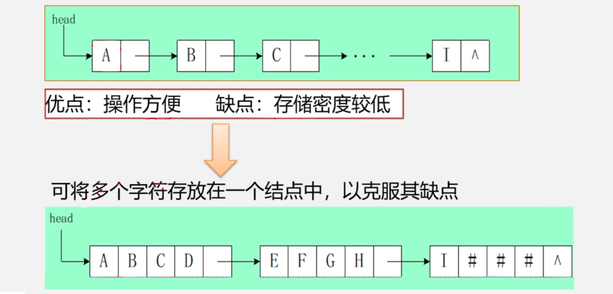

==块链结构==对普通的链串进行优化，提高存储密度：

```cpp
#define CHUNKSIZE 80 //块的大小
typedef struct Chunk {
    char ch[CHUNKSIZE];
    struct Chunk *next;
}Chunk;

typedef struct {
    Chunk *head, *tail;//串的头指针和尾指针
    int curlen;//串的当前长度
}LString;//字符串的块链结构
```

> 注意：在实际中相较于链串，<font color='#BAOC2F'>顺序串</font>使用更多（对字符串的插入、删除运算较少，顺序结构更利于匹配、查找操作）

#### 2.模式匹配算法：

- 算法目的：确定主串中所含子串（模式串）第一次出现的位置（字符串定位算法）
- 算法应用：搜索引擎7拼写检查、语言翻译、数据压缩
- 算法种类：Brute-Force算法（经典朴素穷举算法）、KMP算法（速度快）

##### （1）BF算法：

Btute-Force算法（模式匹配算法）采用了穷举法的思路：从主串的<font color='#BAOC2F'>每一个字符开始</font>依次进行匹配。

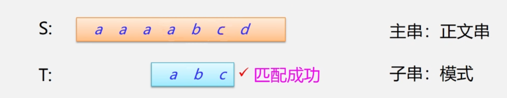

1. 将主串的第pos个字符和模式串的第一个字符进行比较
2. 若相等则继续逐个比较后续的字符
3. 若不相等则从主串的下一个字符开始，重新与模式串的第一个字符进行比较（回溯`j=1`、`i=i-j+2`）
4. 直到与主串的1个<font color='#BAOC2F'>连续子串字符序列</font>与模式串相等，返回S中与T匹配的子序列第一个字符的序号（匹配成功）
5. 否则匹配失败返回0

```cpp
//写法1：从主串的第一个位置开始查找
int Index_BF(SString S, SString T) {
    int i = 1, j = 1;
    while (i <= S.length && j <= T.length) {
        if (S.ch[i] == T.ch[j]) {//主串和子串匹配则加1继续下一个字符
            ++i;
            ++j;
        } else {//主串和子串不匹配则将指针回溯重新开始下一次匹配
            i = i - j + 2;
            j = 1;
        }
    }
    if (j >= T.length) {//返回匹配的第一个字符的下标
        return i - T.length;
    } else {
        return 0;
    }
}
```

```cpp
//写法2：从主串的pos位置开始查找
int Index_BF(SString S, SString T, int pos) {
    int i = pos, j = 1;
    while (i <= S.length && j <= T.length) {
        if (S.ch[i] == T.ch[j]) {//主串和子串匹配则加1继续下一个字符
            ++i;
            ++j;
        } else {//主串和子串不匹配则将指针回溯重新开始下一次匹配
            i = i - j + 2;
            j = 1;
        }
    }
    if (j >= T.length) {//返回匹配的第一个字符的下标
        return i - T.length;
    } else {
        return 0;
    }
}
```

- 时间复杂度最好情况为`O(m)`，
- 时间复杂度最差为`O(n-m)*m + m`，
- 时间复杂度平均情况为O`(n*m)`

##### （2）KMP算法：

KMP算法相较于BF算法中`i`指针可不必回溯、`j`指针尽量减少回溯步数，算法时间复杂度可提速到`O(n+m)`

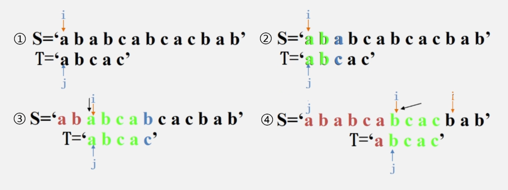

定义`next[j]`函数，用于确定当模式中第`j`个字符与主串中相应字符<font color='#BAOC2F'>失配</font>时需要回溯的位置，回溯规则如下：

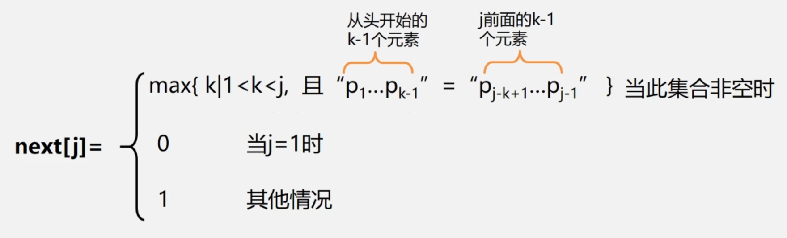

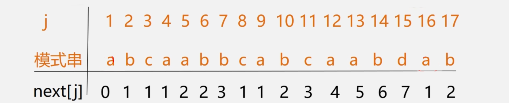

```cpp
int Index_KMP(SString S, SString T, int pos) {
    int i = pos, j = 1;
    while (i < S.length && j < T.legngth) {
        if (j == 0 || S.ch[i] == T.ch[j]) {
            ++i;
            ++j;
        } else {
            j = next[j];//根据j的值在next表中查找，获取j指针的回溯位置
        }
    }
    if (j > T.length) {
        return i - T.length;
    } else {
        return 0;
    }
}

//next表的计算方法
void getNext(SString T, int &next[]) {
    int i = 1, j = 0;
    int next[1] = 0;
    while (i < T.length) {
        if (j == 0 || T.ch[i] == T.ch[j]) {
            ++i;
            ++j;
            next[i] = j;
        } else {
            j = next[j];
        }
    }
}
```

##### （3）KMP算法改进：

==针对KMP算法中的next函数进行改进==：根据next值求出nextval的值

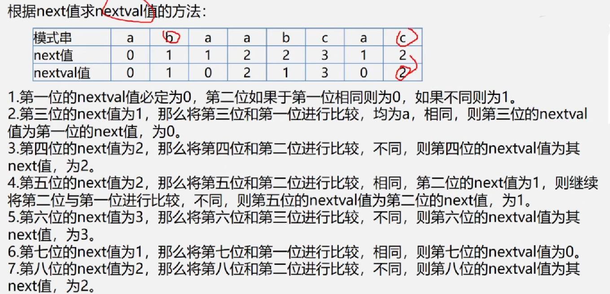

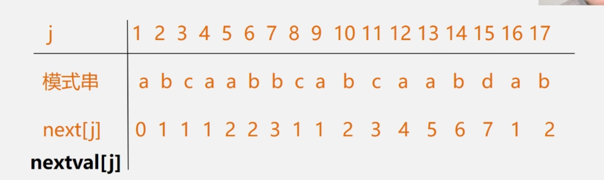

```cpp
int Index_KMP(SString S, SString T, int pos) {
    int i = pos, j = 1;
    while (i < S.length && j < T.legngth) {
        if (j == 0 || S.ch[i] == T.ch[j]) {
            ++i;
            ++j;
        } else {
            j = next[j];//根据j的值在next表中查找，获取j指针的回溯位置
        }
    }
    if (j > T.length) {
        return i - T.length;
    } else {
        return 0;
    }
}

//next表的计算方法
void getNext(SString T, int &next[]) {
    int i = 1, j = 0;
    int next[1] = 0;
    while (i < T.length) {
        if (j == 0 || T.ch[i] == T.ch[j]) {
            ++i;
            ++j;
            if (T.ch[i] != T.ch[j]) nextval[i] = j;
            else nextval[i] = nextval[j];
        } else {
            j = nextval[j];
        }
    }
}
```

#### 3.应用病毒感染检测：

研究者将人的DNA和病毒DNA均表示成由一些字幕组成的字符串序列，

然后检测某种病毒DNA序列是否在患者的DNA序列中出现过（如果出现过则此人感染了病毒，否则没有感染病毒）

> 注意：人的DNA序列式线性的，而病毒的DNA序列是环状的

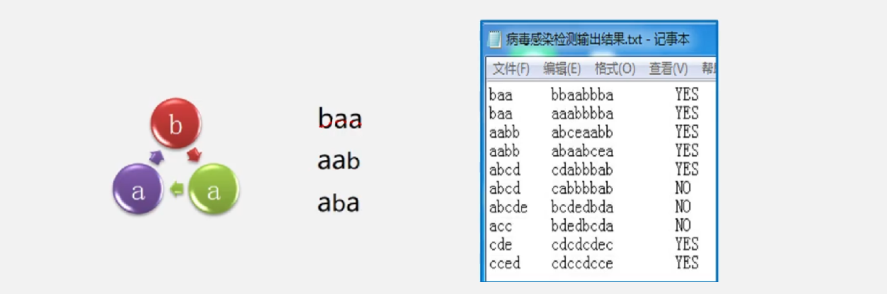

- 病毒感染检测：https://blog.csdn.net/Linux518/article/details/119120547

1. 对于每一个待检测的任务假设病毒DNA序列的长度为m，因为病毒DNA序列是环状的，为了取到每个可行的长度为m的模式串可将存储病毒DNA序列的字符串长度扩大为2m（将病毒DNA序列连续存储两次）
2. 然后循环m次，依次取得每个长度为m的环状字符串，将该字符串作为模式串、人的DNA序列作为主串，调用BF算法进行模式匹配
3. 只要匹配成功既可终止循环，表明该人感染了对应的病毒，否则循环m次结束循环。

### 二、数组

#### 1.数组定义：

数组：按照一定格式排列起来的，<font color='#BAOC2F'>具有相同类型</font>的数据元素的集合。

- 一维数组：若线性表中的数据元素为<font color='#BAOC2F'>非结构的简单元素</font>，则称为一维数组（定长的线性表）。
- 二维数组：若一维数组中的元素又是一个一维数组结构，则称为二维数组。

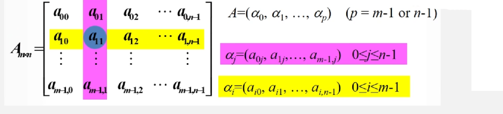

```cpp
typedef int array[m][n];
typedef int array1[n];
typedef array1 array2[m];//m行n列的二维数组
```

- 三维数组：若二维数组中的元素又是一个一维数组，则称作三维数组。

#### 2.数组存储结构：

由于数组结构固定维数与界数基本不变且一般不作插入删除操作，所以很少采用链式存储结构（常采用顺序存储结构表示数组）。

因此在存储数组结构之前，需要解决将<font color='#BAOC2F'>多维关系映射到一维关系</font>的问题。

##### （1）一维数组：

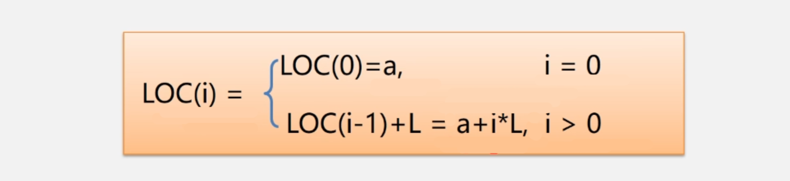

##### （2）二维数组：

二维数组有两种顺序存储方式：

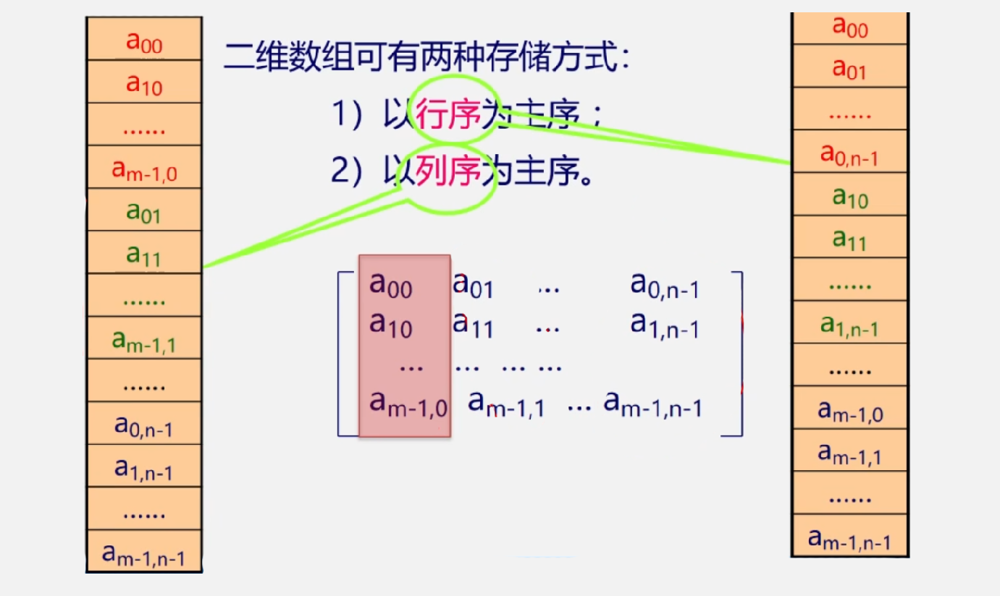

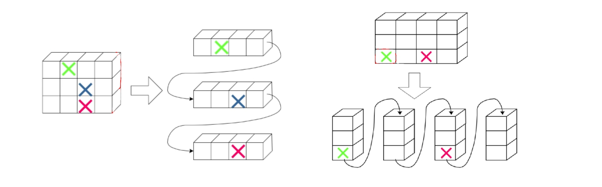

==以行序为主序的顺序存储==：

设数组存储位置`LOC(0,0)`每个元素需要L个存储单元，则`a[i][j]`的存储位置为`LOC(i,j)=LOC(0,0)+(n*i+j)*L`

##### （3）三维数组：

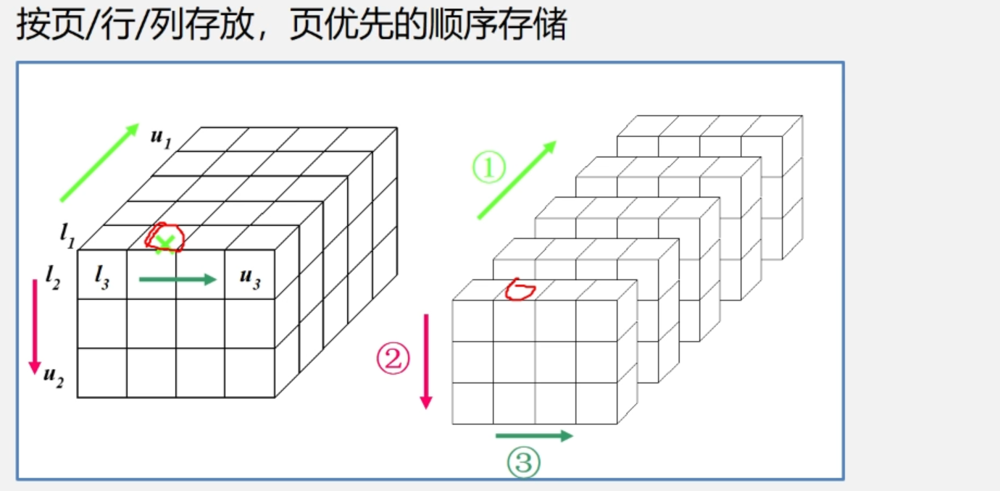

==页优先的顺序存储==：

设数组存储位置`LOC(0,0,0)`每个元素需要L个存储单元，且各维元素的个数为m1,m2,m3

则`a[i][j][k]`的存储位置为`LOC(i,j,k)=a + i*m2*m3 + j*m3 + k;`

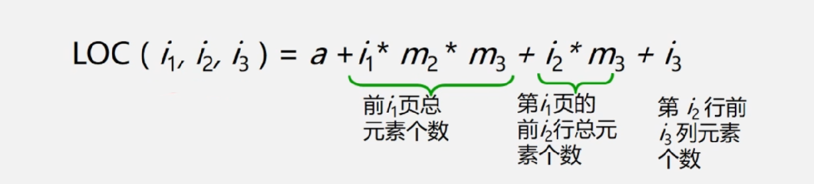

#### 3.特殊矩阵的压缩存储

##### （1）对称矩阵：

存储方式：只存储上or下三角（包括主对角线）的数据元素，以<font color='#BAOC2F'>行序为主序</font>将元素存放在一维数组`arr[n(n+1)/2]`中


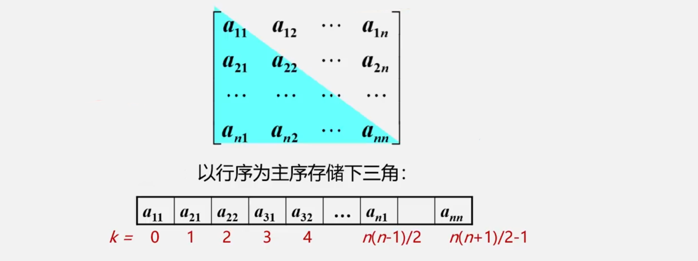

##### （2）三角矩阵：

存储方法：重复的元素常数c可以共享一个元素存储空间，占用`n(n+1)/2+1`个空间

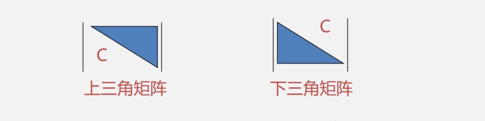

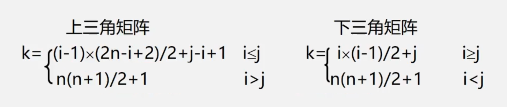

##### （3）对角矩阵：

存储方式：以对角线的顺序存储

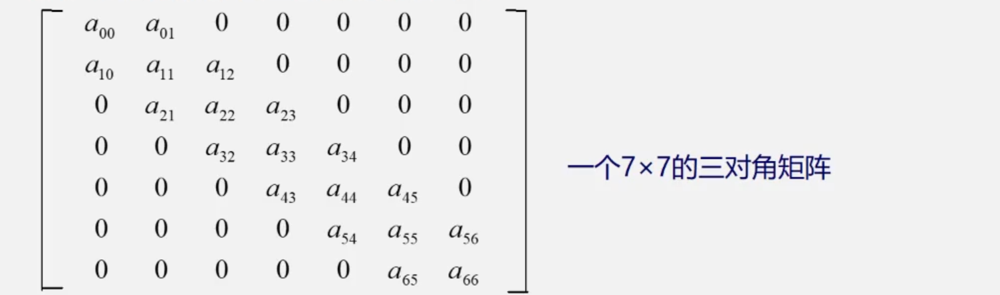

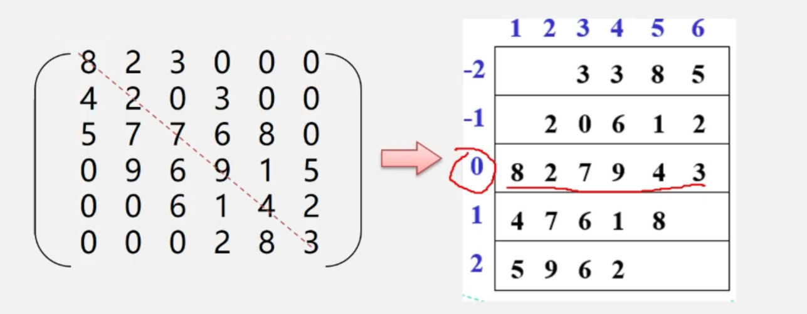

##### （4）稀疏矩阵：

定义：在n行m列的矩阵中有t个非零元素，当`t/m*n) ≤ 0.05`时称为该矩阵为稀疏矩阵。

存储方式：只存储各个<font color='#BAOC2F'>非零元素的值</font>、<font color='#BAOC2F'>行列位置</font>和矩阵的行列数，三元组的<font color='#BAOC2F'>不同表示方法</font>可决定稀疏矩阵<font color='#BAOC2F'>不同的压缩存储方法</font>。

==顺序存储结构==：三元组存储

- 三元组顺序表的优点：非零元素在表中<font color='#BAOC2F'>按行序有序存储</font>，因此便于进行按行顺序处理的<font color='#BAOC2F'>矩阵运算</font>。
- 三元组顺序表的缺点：<font color='#BAOC2F'>不能随机存储</font>。若按行号存取某一行中的非零元素，则需要从头开始进行查找。

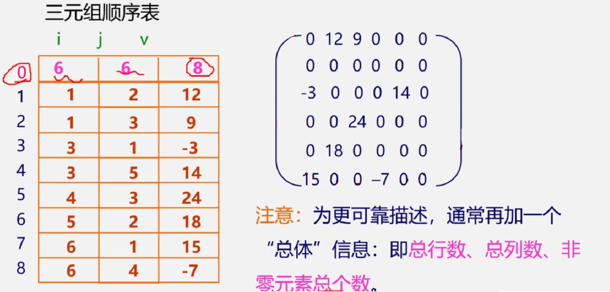

==链式存储结构==：十字链表存储

在十字链表中矩阵的每1个非零元素用1个结点表示，结点除了`(row, col, value)`以外，还需要两个域：

- right：用于链接同一行中的下一个非零元素
- down：用于链接同一列中的下一个非零元素
- 链式存储结构的优点：能够<font color='#BAOC2F'>灵活的插入</font>因运算而产生的新的非零元素，<font color='#BAOC2F'>删除</font>因运算而产生的新的零元素，实现矩阵的各种运算。


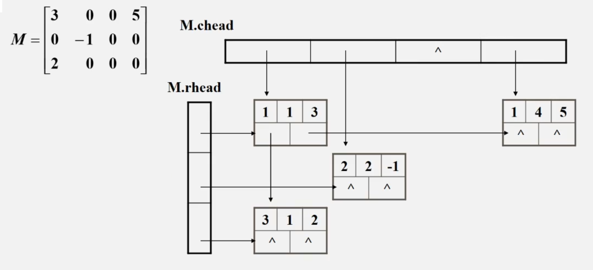

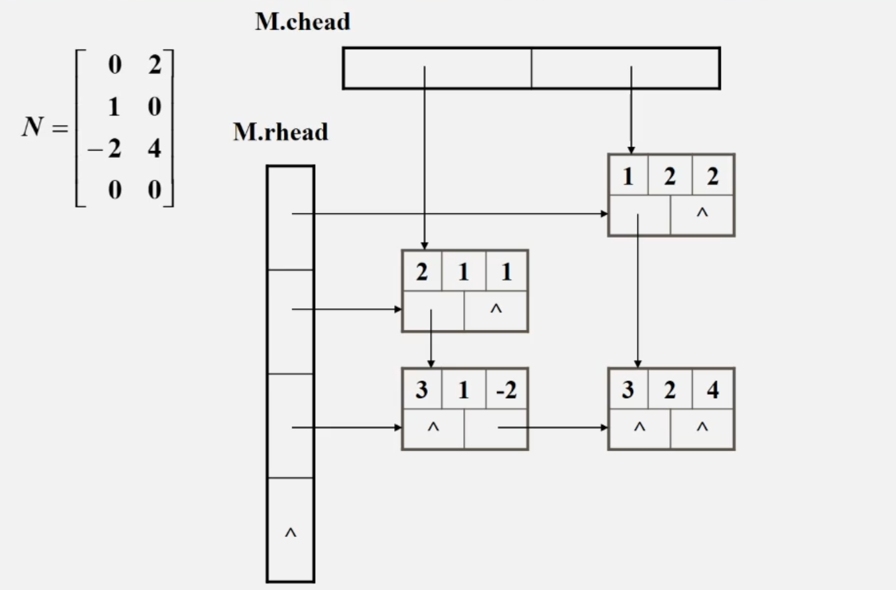


