# 第五章：BT（上）

---

### 一、BT概述

#### 1.概念

1. 根结点：非空树中<font color='#BAOC2F'>无前驱结点</font>的结点
2. 分支结点：度`!=0` <font color='#BAOC2F'>非终端结点</font>则称为分支结点
3. 内部结点：除开根节点以外的<font color='#BAOC2F'>分支结点</font>称为内部结点
4. 叶子结点：度`==` 0则称为叶子结点
5. 结点的度：结点有几个孩子（分支）
6. 树的度Degree：树内<font color='#BAOC2F'>各节点度的最大值</font>
7. 树的深度/高度Depth：树中<font color='#BAOC2F'>结点的最大层次</font>

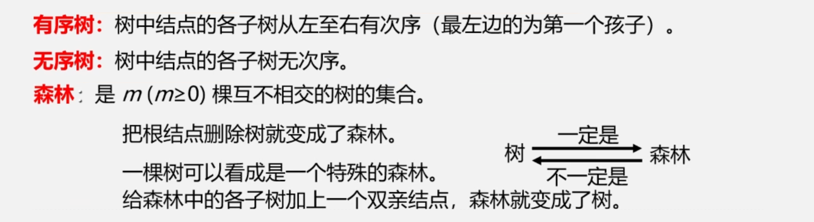

#### 2.T性质：

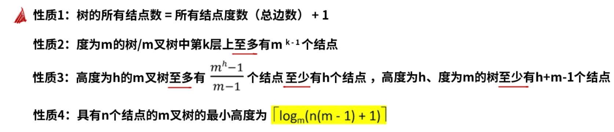

#### 3.BT性质：

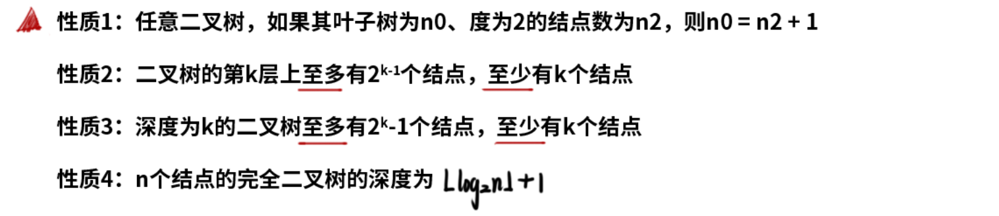

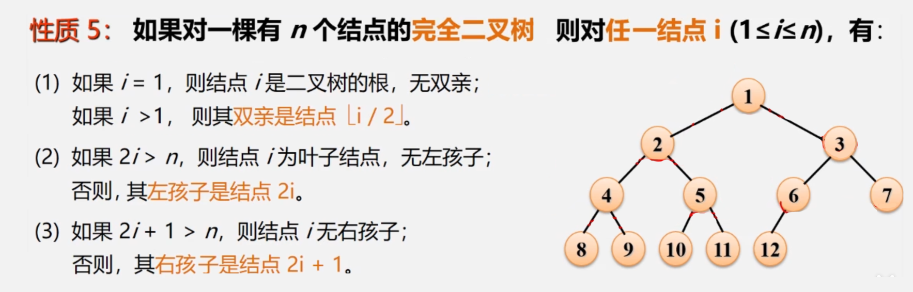

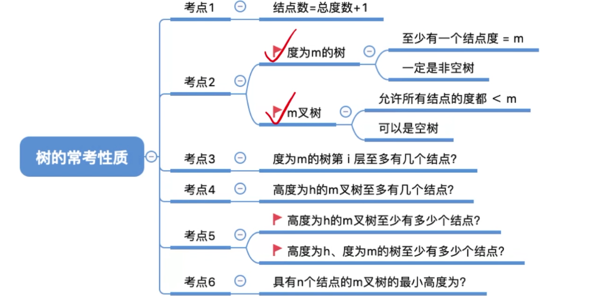

#### 4.特殊二叉树：

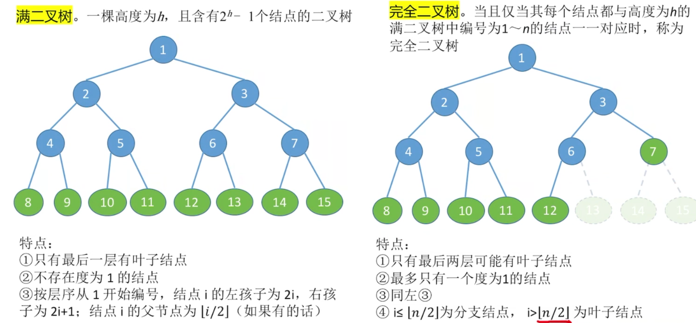

### 二、BT存储结构

#### 1.顺序二叉树

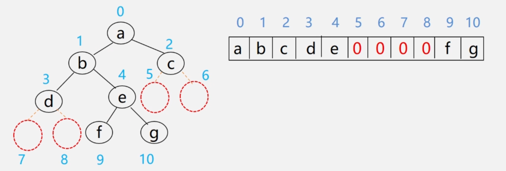

- 实现：按照<font color='#BAOC2F'>满二叉树的结点层次</font>编号，用<font color='#BAOC2F'>数组依次存放</font>二叉树中的数据元素，结点关系蕴含在元素的存储位置中。
- 缺点：深度为k的二叉树<font color='#BAOC2F'>只有k个结点</font>的单支树需要长度为2<sup>k</sup>-1的一维数组（存储空间浪费），适于存储满二叉树和完全二叉树。

```cpp
//顺序存储
#define MAXTSIZE 100
struct TreeNode {
    ElemType value;
    bool isEmpty;
};
TreeNode SqBiTree[MAXTSIZE];
for (int i = 0; i < MAXTSIZE; ++i) SqBiTree[i].isEmpty = true;//顺序二叉树初始化
```

#### 2.链式二叉树

##### （1）二叉链表：

```cpp
typedef struct BiTNode {
    ElemType data;
    struct BiNode *lchild, *rchild;
} BiTNode, *BiTree;
```

> 注：在n个结点的二叉链表中，必有`n+1`个空指针域。分析：二叉链表中必有2n个链域，除根结点外每个结点仅有一个双亲，所有只会有`n-1`个结点的链域存放指针，指向非空子女结点。

##### （2）三叉链表：

```cpp
typedef struct TriTNode {
    ElemType data;
    struct TriTNode *lchild, *parent, *rchild;
} TriTNode, *TriTree;
```

### 三、BT遍历

#### 1.先根遍历

```cpp
//二叉链表实现先序遍历二叉树
Status PreOrderTraverse(BiTree T) {
    if (T == NULL) {
        return OK;
    } else {
        visit(T);//访问根结点
        PreOrderTraverse(T->lchild);//递归遍历左子树
        PreOrderTraverse(T->rchild);//递归遍历右子树
    }
}
```

#### 2.中根遍历

```cpp
//二叉链表实现中序遍历二叉树
Status InOrderTraverse(BiTree T) {
    if (T == NULL) {
        return OK;
    } else {
        InOrderTraverse(T->lchild);//递归遍历左子树
        visit(T);//访问根结点
        InOrderTraverse(T->rchild);//递归遍历右子树
    }
}
```

#### 3.后根遍历

```cpp
//二叉链表实现后序遍历二叉树
Status PostOrderTraverse(BiTree T) {
    if (T == NULL) {
        return OK;
    } else {
        InOrderTraverse(T->lchild);//递归遍历左子树
        InOrderTraverse(T->rchild);//递归遍历右子树
        visit(T);//访问根结点
    }
}
```

> 注：三种遍历算法的<font color='#BAOC2F'>访问路径是相同的</font>，只是访问结点的时机不相同。

#### 4.遍历序列确定BT

1. 若二叉树中各节点的值均不相同，则二叉树结点的先序遍历、中序遍历和后序遍历都是唯一的。
2. 由二叉树的<font color='#BAOC2F'>先序序列、中序遍历序列</font>，or 由二叉树的<font color='#BAOC2F'>中序遍历、后序遍历序列</font>可以确定唯一的二叉树。

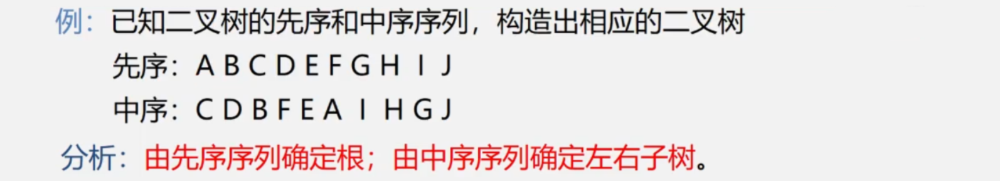

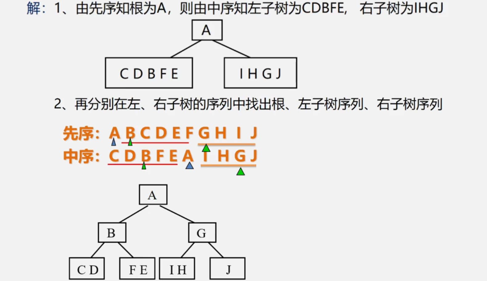

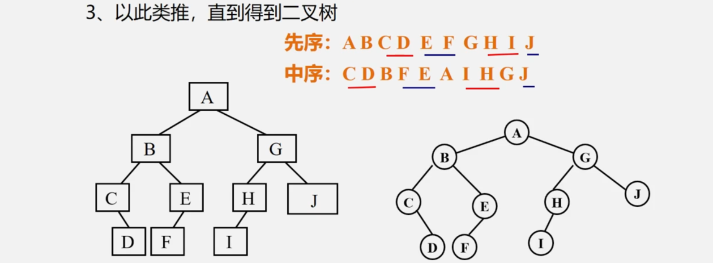

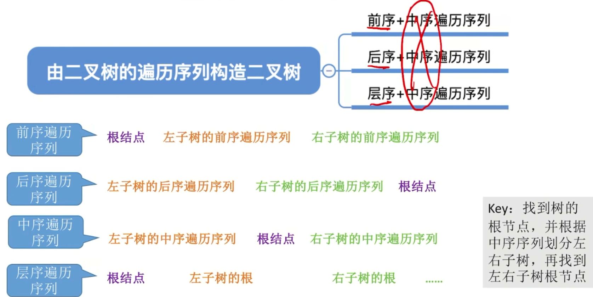

> 注：前序、后序、层序序列遍历的两两组合是<font color='#BAOC2F'>无法唯一确定</font>一棵二叉树的。

#### 5.BTの非递归遍历（借助栈）

非递归算法的关键：在中序遍历过某个结点的整个左子树之后，如何找到该结点的根以及其右子树？

```cpp
/*算法思路：
1.建立一个栈
2.根结点进栈，遍历左子树
3.根结点出栈输出根结点，遍历右子树
*/
Status InOrderTraverse(BiTree T) {
    BiTree p; InitStack(S); p = T;
    while (p || !StackEmpty(S)) {
        if (p) {
            Push(S, p);
            p = p->lchild;
        } else {
            Pop(S, q);
            print("%s", q->data);
            p = q->rchild;
        }
    }
    return OK;
}
```

#### 6.BTの层序遍历（借助队列）

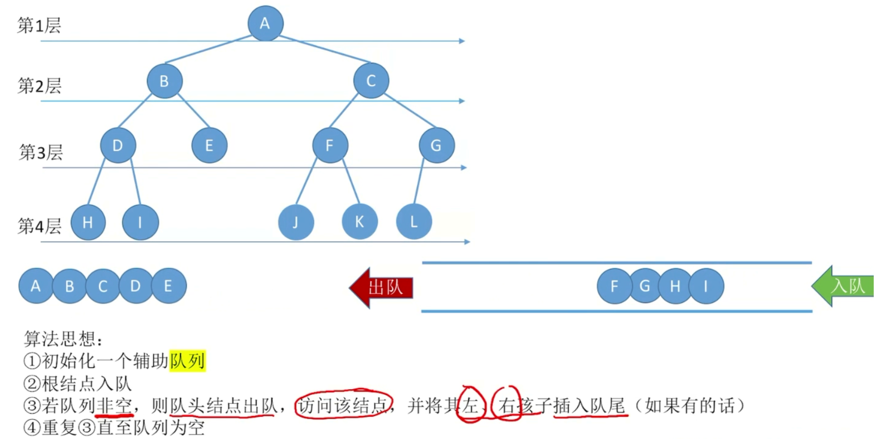

```cpp
/*
借助链队列实现二叉树的层序遍历
算法思路：
1.初始化一个辅助队列，并将根节点入队
2.队列不为空时：则队头结点出队并访问该结点
  如果它有左孩子结点，将左孩子结点入队
  如果它有右孩子结点，将右孩子结点入队
*/
//二叉树结点
typedef struct BiTNode {
    char data;
    struct BiTNode *lchild, *rchild;
} BiTNode, *BiTree;

//链队列结点
typedef struct LinkNode {
    BiTNode *data;
    struct LinkNode *next;
} LinkNode;

//链队列
typedef struct {
    LinkNode *front, *rear;
} LinkQueue;

//层序遍历
void LeverOrder(BiTree p) {
    LinkQueue Q; InitQueue(Q);
    EnQueue(Q, p);
    while (!IsEmpty(Q)) {
        DeQueue(Q, p);
        visit(p);
        if (p->lchild != NULL) EnQueue(Q, p->lchild);//有左孩纸入队
        if (p->rchild != NULL) EnQueue(Q, p->rchild);//有左孩纸入队
    }
}
```

```cpp
/*
借助顺序队列实现二叉树的层序遍历
算法思路：
1.将根节点入队
2.队列不为空时：从队列中出队一个结点并访问它
  如果它有左孩子结点，将左孩子结点入队
  如果它有右孩子结点，将右孩子结点入队
*/
//二叉树结点
typedef struct BiTNode {
    char data;
    struct BiTNode *lchild, *rchild;
} BiTNode, *BiTree;

//链队列
typedef struct {
    BiTNode data[MAXSIZE];//存放队中元素
    int front, rear;//队头、队尾指针
} SqQueue;//顺序循环队列类型

void LevelOrder(BiTNode *p) {
    SqQueue *sq; InitQueue(sq);
    EnQueue(sq, p);//树的根结点指针进入队列
    while (!QueueEmpty(sq)) {
        DeQueue(sq, p);//出队结点p
        visit(p);
        if (p->lchild != NULL) EnQueue(sq, p->lchild);//有左孩子时将其入队
        if (p->rchild != NULL) EnQueue(sq, p->rchild);//有右孩子时将其入队
    }
}
```

> 1. 二叉树的<font color='#BAOC2F'>层次遍历</font>其实也<font color='#BAOC2F'>可以使用栈</font>实现（比队列实现稍复杂）
> 2. 队列中并没有必要保存<font color='#BAOC2F'>整个结点的真实数据</font>，只需要保存指向结点的指针即可。
> 3. 二叉树的层序遍历和图的广度优先遍历类似（树是一种特殊的图）

### 四、BT遍历算法应用

#### 1.BT的建立

按照<font color='#BAOC2F'>先序遍历序列</font>建立二叉树的<font color='#BAOC2F'>二叉链表</font>：

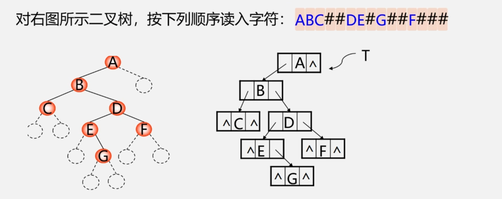

```cpp
//按照先序遍历的方式建立二叉树
Status CreateBiTree(BiTree &T) {
    cin >> ch;
    if (ch == '#') {
        T = NULL;
    } else {
        if (!(T = (BiTNode*)malloc(sizeof(BiTNode)))) exit(OVERFLOW);//T = new BiTNode;
        T->data = ch;//生成根结点
        CreateBiTree(T->lchild);//构造左子树
        CreateBiTree(T->rchild);//构造右子树
    }
    return OK;
}
```

#### 2.BT的复制

按照<font color='#BAOC2F'>先序遍历的思想</font>，复制二叉树：

```cpp
/*算法思想：按照先序遍历的思想复制二叉树
1.如果是空树，递归结束
2.否则申请新节点空间，复制根结点
  递归复制左子树
  递归复制右子树
*/
Status Copy(BiTree T, BiTree &NewT) {
    if (T == NULL) {
        NewT = NULL; return 0;
    } else {
        NewT = new BiTNode;
        NewT->data = T->data;//复制根结点
        Copy(T->lchild, NewT->lchild);//递归复制左子树
        Copy(T->rchild, NewT->rchild);//递归复制右子树
    }
}
```

#### 3.BT深度计算

```cpp
/*算法思想：
1.如果是空树，则深度为0
2.否则递归计算左子树的深度记为m，递归计算右子树的深度记为n
3.二叉树的深度则为m与n的较大者+1
*/
int Depth(BiTree T) {//后序遍历算法的变种
    if (T == NULL) {
        return 0;
    } else {
        m = Depth(T->lChild);
        n = Depth(T->rChild);
        return m > n ? m+1 : r+1;//树的深度 = Max(左子树深度, 右子树深度) + 1;
    }
}
```

#### 4.BT结点个数计算

```cpp
/*算法思想：
1.如果是空树，则结点个数为0
2.否则，结点个数为左子树的结点个数 + 右子树的结点个数 + 1 
*/
int NodeCount(BiTree T) {
    if (T == NULL) return 0;
    else return NodeCount(T->lchild) + NodeCount(T->rchild) + 1;
}
```

#### 5.BT叶子结点个数计算

1. 如果是空树，则叶子结点的个数为0
2. 否则，叶子结点的个数为：左子树叶子结点个数 + 右子树叶子结点个数

```cpp
int LeadCount(BiTree T) {
    if (T == NULL) return 0;
    if (T->lchild == NULL && T->rchild == NULL) {
        return 1;
    } else {
        return LeafCount(T->lchild) + LeafCount(T->rchild);
    }
}
```

### 五、线索二叉树

#### 1.中序线索二叉树

使用二叉链表存储结构时，可以方便的找到某个结点的左右孩子，但无法直接找到该结点<font color='#BAOC2F'>在某种遍历序列中的前驱和后继结点</font>：

1. 通过遍历寻找（增加时间负担）

2. 再增设前驱、后继指针域（增加存储负担）

3. 利用<font color='#BAOC2F'>二叉树链表中的空指针域</font>

    如果某个结点的左孩子为空，则将空的左孩子指针域改为<font color='#BAOC2F'>指向其前驱</font>，

    如果某个结点的右孩子为空，则将空的右孩子指针域改为<font color='#BAOC2F'>指向其后继</font>，

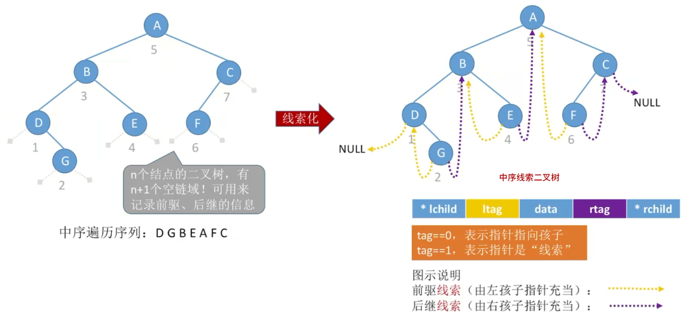

```cpp
//写法1：二叉树中序线索化
typedef struct ThreadNode {
    ElemType data;
    struct ThreadNode *lchild, *rchild;
    int ltag, rtag;
} ThreadNode, *ThreadTree;

ThreadNode *pre = NULL;//全局变量pre用于指向当前访问结点的前驱
//中序线索化二叉树T
void CreateInThread(ThreadTree T) {
    pre = NULL;
    if (T != NULL) {//非空二叉树才能线索化
        InThread(T);//中序线索化二叉树
        if (pre->rchild == NULL) {
            pre->rtag = 1;//特判处理最后一个结点
        }
    }
}
//中序遍历二叉树，边遍历边线索化
void InThread(ThreadTree T) {
    if (T != NULL) {
        InThread(T->lchild);
        visit(T);
        InThread(T->rchild);
    }
}
//具体的线索化逻辑
void visit(ThreadNode *q) {
    if (q->lchild == NULL) {
        q->lchild = pre;//左子树为空，建立前驱线索
        q->ltag = 1;
    }
    if (pre != NULL && pre->rchild == NULL) {
        pre->rchild = q;//建立前驱结点的后继线索
        pre->rtag = 1;
    }
    pre = q;
}
//总结：中序线索化其实就是一个中序遍历的过程，只不过在中序遍历的过程中需要边遍历、边处理这个结点
```

```cpp
//写法2：二叉树中序线索化
typedef struct ThreadNode {
    ElemType data;
    struct ThreadNode *lchild, *rchild;
    int ltag, rtag;
} ThreadNode, *ThreadTree;

//中序线索化二叉树T
void CreateInThread(ThreadTree T) {
    pre = NULL;
    if (T != NULL) {//非空二叉树才能线索化
        InThread(T, pre);//中序线索化二叉树
        if (pre->rchild == NULL) {
            pre->rtag = 1;//特判处理最后一个结点
        }
    }
}
//中序遍历二叉树，边遍历边线索化
void InThread(ThreadTree q, ThreadTree &pre) {
    if (q != NULL) {
        InThread(q->lchild, pre);
        if (q->lchild == NULL) {
            q->lchild = pre;//左子树为空，建立前驱线索
            q->ltag = 1;
        }
        if (pre != NULL && pre->rchild == NULL) {
            pre->rchild = q;//建立前驱结点的后继线索
            pre->rtag = 1;
        }
        pre = q;
        InThread(q->rchild, pre);
    }
}
```

#### 2.先序线索二叉树

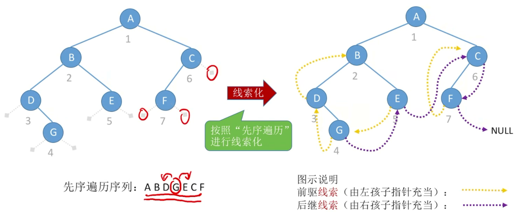

先序遍历存在lchild为前序的情况，需要特殊处理。

```cpp
//写法1：二叉树先序线索化
typedef struct ThreadNode {
    ElemType data;
    struct ThreadNode *lchild, *rchild;
    int ltag, rtag;
} ThreadNode, *ThreadTree;

ThreadNode *pre = NULL;//全局变量pre用于指向当前访问结点的前驱
void CreatePreThread(ThreadTree T) {
    pre = NULL;
    if (T != NULL) {
        PreThread(T);
        if (pre->rchild == NULL) {
            pre->rtag = 1;//特判处理最后一个结点
        }
    }
}
void PreThread(ThreadTree T) {
    if (T != NULL) {
        visit(T);
        if (T->ltag == 0) PreThread(T->lchild);//lchild不是前驱线索
        PreThread(T->rchild);
    }
}
//具体的线索化逻辑
void visit(ThreadNode *q) {
    if (q->lchild == NULL) {
        q->lchild = pre;//左子树为空，建立前驱线索
        q->ltag = 1;
    }
    if (pre != NULL && pre->rchild == NULL) {
        pre->rchild = q;//建立前驱结点的后继线索
        pre->rtag = 1;
    }
    pre = q;
}
```

```cpp
//写法2：二叉树先序线索化
typedef struct ThreadNode {
    ElemType data;
    struct ThreadNode *lchild, *rchild;
    int ltag, rtag;
} ThreadNode, *ThreadTree;

void CreatePreThread(ThreadTree T) {
    pre = NULL;
    if (T != NULL) {
        PreThread(T, pre);
        if (pre->rchild == NULL) {
            pre->rtag = 1;//特判处理最后一个结点
        }
    }
}
void PreThread(ThreadTree q, ThreadTree &pre) {
    if (q != NULL) {
        if (q->lchild == NULL) {
            q->lchild = pre;//左子树为空，建立前驱线索
            q->ltag = 1;
        }
        if (pre != NULL && pre->rchild == NULL) {
            pre->rchild = q;//建立前驱结点的后继线索
            pre->rtag = 1;
        }
        pre = q;
        if (q->ltag == 0) PreThread(q->lchild);//lchild不是前驱线索
        PreThread(q->rchild, pre);
    }
}
```

#### 3.后序线索二叉树

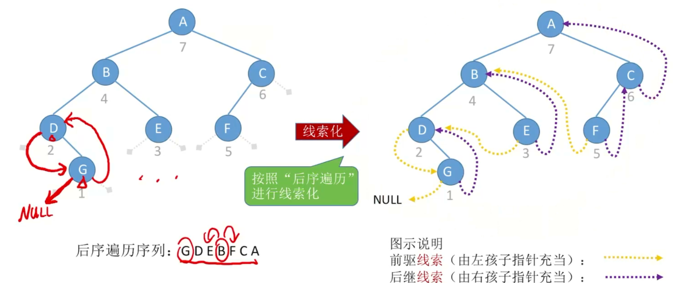

```cpp
//写法1：二叉树后序线索化
typedef struct ThreadNode {
    ElemType data;
    struct ThreadNode *lchild, *rchild;
    int ltag, rtag;
} ThreadNode, *ThreadTree;

ThreadNode *pre = NULL;//全局变量pre用于指向当前访问结点的前驱
void CreatePostThread(ThreadTree T) {
    pre = NULL;
    if (T != NULL) {
        PostThread(T);
        if (pre->rchild == NULL) {
            pre->rtag = 1;//特判处理最后一个结点
        }
    }
}
void PostThread(ThreadTree T) {
    if (T != NULL) {
        PostThread(T->lchild);
        PostThread(T->rchild);
        visit(T);
    }
}
void visit(ThreadNode *q) {
    if (q->lchild == NULL) {
        q->lchild = pre;//左子树为空，建立前驱线索
        q->ltag = 1;
    }
    if (pre != NULL && pre->rchild == NULL) {
        pre->rchild = q;//建立前驱结点的后继线索
        pre->rtag = 1;
    }
    pre = q;
}
```

```cpp
//写法2：二叉树后序线索化
typedef struct ThreadNode {
    ElemType data;
    struct ThreadNode *lchild, *rchild;
    int ltag, rtag;
} ThreadNode, *ThreadTree;

void CreateInThread(ThreadTree T) {
    pre = NULL;
    if (T != NULL) {
        PostThread(T, pre);
        if (pre->rchild == NULL) {
            pre->rtag = 1;//特判处理最后一个结点
        }
    }
}
void PostThread(ThreadTree q, ThreadTree &pre) {
    if (q != NULL) {
        PostThread(q->lchild, pre);
        PostThread(q->rchild, pre);
        if (q->lchild == NULL) {
            q->lchild = pre;//左子树为空，建立前驱线索
            q->ltag = 1;
        }
        if (pre != NULL && pre->rchild == NULL) {
            pre->rchild = q;//建立前驱结点的后继线索
            pre->rtag = 1;
        }
        pre = q;
    }
}
```

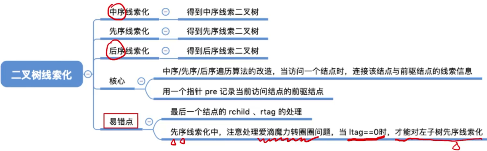

### 六、线索二叉树遍历

#### 1.中序线索找中序后继

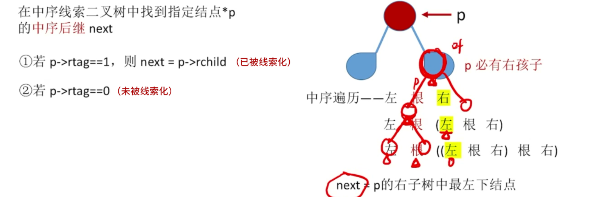

```cpp
//找到以P为根的子树中，第一个被中序遍历的结点（循环寻找到最左下的结点（不一定是叶子结点））
ThreadNode *FirstNode(ThreadNode *p) {
    while (p->ltag == 0) p = p->lchild;
    return p;
}
//在中序线索树中查找结点p的后继结点
ThreadNode *NextNode(ThreadNode *p) {
    if (p->rtag == 0) return FirstNode(p->rchild);//未被线索化
    else return p->rchild;////已被线索化
}
```

```cpp
//对中序线索二叉树进行中序遍历（利用线索实现非递归算法O(1)）
void Inorder(ThreadNode *T) {
    for (ThreadNode *p = FirstNode(T); p != NULL; p = NextNode(p)) {
        visit(p);
    }
}
```

#### 2.中序线索找中序前驱

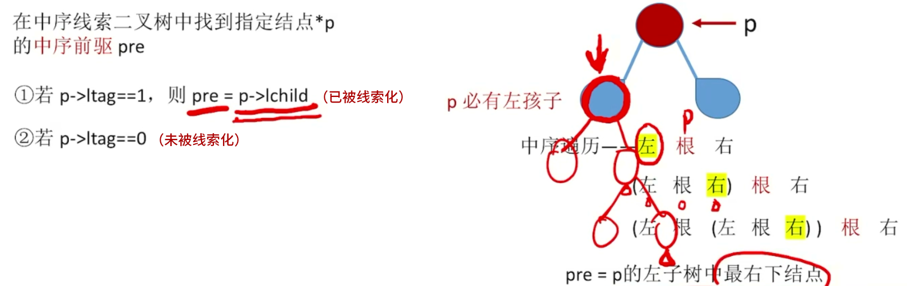

```cpp
//找到以P为根的子树中，最后一个被中序遍历的结点（循环寻找到最右下的结点（不一定是叶子结点））
ThreadNode *LastNode(ThreadNode *p) {
    while (p->rtag == 0) p = p->rchild;
    return p;
}
//在中序线索树中查找结点p的前驱结点
ThreadNode *PreNode(ThreadNode *p) {
    if (p->ltag == 0) return LastNode(p->lchild);//未被线索化
    else return p->lchild;////已被线索化
}
```

```cpp
//对中序线索二叉树进行逆向的中序遍历（利用线索实现非递归算法O(1)）
void RevInorder(ThreadNode *T) {
    for (ThreadNode *p = LastNode(T); p != NULL; p = PreNode(p)) {
        visit(p);
    }
}
```

#### 3.线索二叉树遍历总结

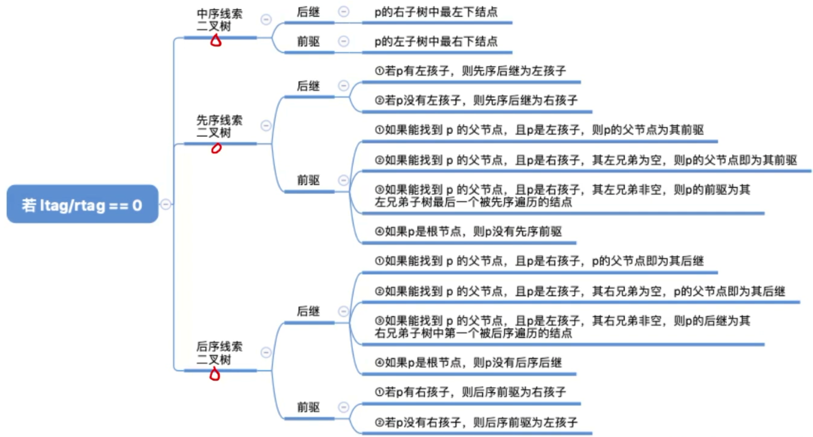


