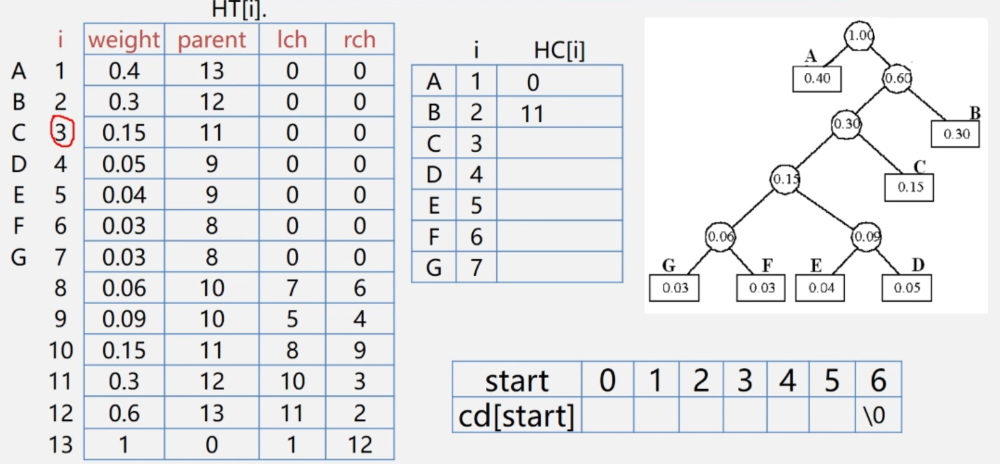

# 第五章：二叉树（下）

---

### 一、树与森林

#### 1.树存储结构

##### （1）双亲表示法：

实现：定义<font color='#BAOC2F'>结构数组</font>存放树的结点，每个结点含两个域（找双亲容易、找孩子难）

- 数据域：存放结点本身信息
- 双亲域：指示本结点的<font color='#BAOC2F'>双亲结点在数组中的位置</font>。


```cpp
#define MAXTSIZE 100
typedef struct PTNode {
    ElemType data;
    int parent;//双亲位置域
} PTNode;
typedef struct {
    PTNode nodes[MAXTSIZE];
    int r;//根结点的位置
    int n;//结点的个数
} PTree;
```

##### （2）孩子链表表示法：

实现：将每个结点的孩子结点排列用单链表存储，而n个头指针又组成一个线性表用顺序表存储（找孩子容易、找双亲难）


```cpp
//孩子结点结构：child + next
typedef struct CTNode {
    int child;
    struct CTNode *next;
} *ChildPtr;
//双亲结点结构：data + firstchild
typedef struct CTBox {
    ElemType data;
    ChildPtr firstchild;//孩子链表头指针
} CTBox;
typedef struct {
    CTBox nodes[MAXTSIZE];
    int n;//结点个数
    int r;//根节点的位置
} CTree;
```

##### （3）孩子兄弟表示法：

二叉链表表示法/二叉树表示法/孩子兄弟表示法，

实现：用<font color='#BAOC2F'>二叉链表</font>表示数的存储结构，链表中每个结点的<font color='#BAOC2F'>两个指针域</font>分别指向其<font color='#BAOC2F'>第一个孩子结点</font>和<font color='#BAOC2F'>下一个兄弟结点</font>。


```cpp
typedef struct CSNode {
    ElemType data;
    struct CSNode *firstchild, *nextsibling;
} CSNode, *CSTree;
```

#### 2.树与二叉树互转

将树转化为二叉树进行处理，<font color='#BAOC2F'>利用二叉树的算法</font>来实现对树的操作，由于树和二叉树都可以<font color='#BAOC2F'>用二叉树链表</font>作存储结构，则以二叉链表做媒介可以<font color='#BAOC2F'>导出树与二叉树之间的对应关系</font>。给定一棵树，可以找到唯一的二叉树与之对应

##### （1）树转换为二叉树：

- 理解：[树转换为二叉树](https://www.bilibili.com/video/BV1nJ411V7bd?p=98&t=100)

二叉树转换步骤（兄弟相连留长子）：

1. 加线：在兄弟之间加一根连线
2. 抹线：对每个结点除了其左孩子外，去除其与其他孩子之间的关系
3. 旋转：以树的根结点为轴心，将整树顺时针旋转45度


##### （2）二叉树转换为树：

- 理解：[二叉树转换为树](https://www.bilibili.com/video/BV1nJ411V7bd?p=98&t=765)

树转换步骤（左孩右右连双亲，去掉原来右孩线）：

1. 加线：若p为双亲结点的左孩子，则将p的右孩子、右孩子的右孩子…沿分支找到所有的右孩子与双亲连接
2. 抹线：抹掉原二叉树中双亲与右孩子之间的连线
3. 调整：将结点按层次排列，形成树结构


#### 3.森林与二叉树互转

##### （1）森林转为二叉树：

- 理解：[森林转为二叉树](https://www.bilibili.com/video/BV1nJ411V7bd?p=99&t=33)

森林转为二叉树（树变二叉根相连）

1. 将各棵树分别转换为二叉树
2. 将每棵树的根结点用线相连
3. 以第一棵树根结点为二叉树的根，再以根结点为轴心顺时针旋转，构成二叉树形结构


##### （2）二叉树转为森林：

- 理解：[二叉树转为森林](https://www.bilibili.com/video/BV1nJ411V7bd?p=99&t=249)

二叉树转为森林（去掉全部右孩线，孤立二叉再还原）。

1. 抹线：将二叉树中根节点与其右孩子连线，及沿右分支搜索到的所有右孩子间连线全部抹掉（产生许多孤立的二叉树）
2. 还原：将孤立的二叉树还原为树


#### 4.树与森林的遍历


##### （1）树的遍历：

> 注：树的遍历没有中根遍历的情况，因为<font color='#BAOC2F'>无法确定根的中序位置</font>。


```cpp
void PreOrder(TreeNode *R) {
    if (R != NULL) {
        visit(R);
        while (R->nextTree != NULL) {
            PreOrder(T);
        }
    }
}
```


```cpp
void PostOrder(TreeNode *R) {
    if (R != NULL) {
        while (R->nextTree != NULL) {
            PostOrder(T);
        }
        visit(R);
    }
}
```


##### （2）森林的遍历：


### 二、哈夫曼树

#### 1.哈夫曼树构造

在含有n个带权结点的二叉树中，其中带<font color='#BAOC2F'>权路径长度WPL最小的二叉树</font>称为哈夫曼树，也称为最优二叉树。

根据哈夫曼树中<font color='#BAOC2F'>权越大的叶子</font>离<font color='#BAOC2F'>根结点越近</font>的规律，利用贪心算法的思想：构造哈夫曼树时<font color='#BAOC2F'>首先选择权值小</font>的叶子结点。


==哈夫曼树性质==：

1. 每个初始结点最终都会成为叶结点，且权值越小的结点到根节点的路径长度越大
2. 包含n个叶子结点的哈夫曼树中共有2n-1个结点
3. 哈夫曼树结点的度数为0或者2，没有度为1的结点
4. 哈夫曼树的构造并不唯一，但是路径长度WPL必然相同且为最优
5. 包含n棵树的森林要经过n-1次合并才能形成哈夫曼树，共产生n-1个新结点


#### 2.哈夫曼树构造算法

采用顺序存储结构，一维数组实现：

```cpp
typedef struct {
    int weight;
    int parent, lch rch;
} HTNode, *HuffmanTree;
```

##### （1）数组初始化：

1. 初始化`HT[1...2n-1]`：`lch = rch = parent=0`
2. 输入初始化<font color='#BAOC2F'>n个叶子结点</font>：设置`HT[1...n]`的weight值

##### （2）结点的n-1次合并：

对结点进行n-1次合并，依次产生n-1个结点`HT[i]，i=n+1, n+2, …2n-1`

1. 在HT[1…i-1]中选取两个<font color='#BAOC2F'>未被选过</font>（parent==0）<font color='#BAOC2F'>且weight最小</font>的结点`HT[s1]`和`HT[s2]`

2. 修改HT[s1]和HT[s2]的parent值：`HT[s1].parent=i;`、`HT[s2].parent=i;`

3. 修改新产生的HT[i]：

    ```cpp
    HT[i].weight = HT[s1].weight + HT[s2].weight;
    HT[i].lch = s1;
    HT[i].rch = s2;
    ```

```cpp
void CreatHuffmanTree(HuffmanTree HT, int n) {
    if (n <= 1) return;
    //1.数组初始化
    m = 2 *n - 1;//数组共2n-1个元素
    HT = new HTNode[m + 1];//0号单元未用，HT[m]表示根节点
    for (int i = 1; i <= m; ++i) {
        HT[i].lch = 0;
        HT[i].rch = 0;
        HT[i].parent = 0;
    }
    for (int i = 1; i <= n; ++i) cin >> HT[i].weight;
    
    //2.开始构造哈夫曼树（合并产生n-1个结点）
    for (int i = n + 1; i <= m; ++i) {
        Select(HT, i - 1, s1, s2);//在HT[k]中选择两个其双亲域为0、且权值最小的结点，并返回他们在HT中的序号s1、s2
        HT[s1].parent = i; HT[s2].parent = i;//从F中删除s1, s2
        HT[i].lch = s1; HT[i].rch = s2;//s1，s2分别作为i的左右孩子
        HT[i].weight = HT[s1].weight + HT[s2].weight; //i的权值为左右孩子权值之和
    }
}
```

#### 3.哈夫曼树应用哈夫曼编码

##### （1）问题引入：

==固定长度编码==：


==可变长度编码==：允许对不同字符用不等长的二进制位表示，


==哈夫曼编码==：字符集中的每个字符作为一个叶子结点，各个<font color='#BAOC2F'>字符出现的频度</font>作为结点的权值，来构造哈夫曼树：

1. 统计字符集中每个字符在电文中出现的平均概论（概率越大、要求编码越短）
2. 将每个字符的平均概论作为权值，利用哈夫曼树的特点（权值越大的叶子离根越近）构造哈夫曼树。（概率越大的结点路径越短）
3. 在哈夫曼树的<font color='#BAOC2F'>每个结点分支上标记0和1</font>（左分支0，右分支1）
4. 把<font color='#BAOC2F'>从根到每个叶子的路径上的标号</font>连接起来，作为该叶子代表的字符编码


> 1. 哈夫曼编码是<font color='#BAOC2F'>前缀码</font>（没有一片树叶是另一片树叶的祖先）
> 2. 哈夫曼编码是<font color='#BAOC2F'>最优前缀码</font>（哈夫曼树的带权路径长度最短，字符编码总长度一定是最短的）

##### （2）哈夫曼编码：



```cpp
//从叶子到根逆向求每个字符的哈夫曼编码，存储在编码表HC中
void CreatHuffmanCode(HuffmanTree HT, HuffmanCode &HT, int n) {
    HC = new char*[n + 1];//分配n个字符编码的头指针矢量
    cd = new char[n];//分配临时存放编码的动态数组空间
    cd[n - 1] = '\0';//编码结束符
    for (int i = 1; i <= n; ++i) {//逐个字符求哈夫曼编码
        start = n - 1; c = i; f = HT[i].parent;
        while (f != 0) {//从叶子结点开始向上回溯直到根节点
            start--;//回溯一次start向前指一个位置
            if (HT[f].lchild == c) {
                cd[start] = '0';//结点c是f的左孩子，则生成代码0
            } else {
                cd[start] = '1';//结点c是f的右孩子，则生成代码1
            }
            c = i; f = HT[i].parent;//继续向上回溯
        }//求出第i个字符的编码
        HC[i] = new char[n - start];//为第i个字符串编码分配空间
        strpy(HC[i], &cd[start]);//将求得的编码从临时空间cd复制到HC的当前行中
    }
    delete cd;//释放临时空间
}
```

### 三、并查集

#### 1.并查集（双亲表示法）


使用<font color='#BAOC2F'>双亲表示法</font>，每个结点中保存指向双亲的指针，并和查的方式更加方便。（声明一个数组S即可表示集合的关系）


```cpp
#define MAXTSIZE 100
typedef struct PTNode {
    ElemType data;
    int parent;//双亲位置域
} PTNode;
typedef struct {
    PTNode nodes[MAXTSIZE];//双亲表示
    int r;//根结点的位置
    int n;//结点的个数
} PTree;
```


```cpp
//并查集初始化
#define SIZE 13
int UFSets[SIZE];//集合元素数组
void Initial(int S[]) {
    for (int i = 0; i < SIZE; ++i) S[i] = -1;
}
```

```cpp
//并查集基本操作
//Find查操作，找到x所属集合（返回x所属根结点）	时间复杂度O(n)
int Find(int S[], int x) {
    while(S[x] >= 0) x = S[x];
    return x;
}
//Union并操作，将两个结合合并为一个	时间复杂度O(1)
void Union(int S[], int Root1, int Root2) {
    if (Root1 == Root2) return;//要求Root1与Root2是不同的集合
    S[Root2] = Root1;//将根Root2连接到另一根Root1的下面
}
```

#### 2.并查集优化Union（小树并大树）：

在并查集的Find操作中，若<font color='#BAOC2F'>结点数量为n</font>则Find最坏时间复杂度为`O(n)`

优化思路：在每次Union操作构建树的时候，尽可能让<font color='#BAOC2F'>树不长太高</font>（小树合并到大树）。


```cpp
//并查集基本操作
//Find查操作，找到x所属集合（返回x所属根结点）	时间复杂度O(log2n)
int Find(int S[], int x) {
    while(S[x] >= 0) x = S[x];
    return x;
}
//Union并操作，小树合并到大树	时间复杂度O(1)
void Union(int S[], int Root1, int Root2) {
    if (Root1 == Root2) return;
    if (S[Root2] > S[Root1]) {//Root2结点数更少
        S[Root1] += S[Root2];//累加结点总数
        S[Root2] = Root1;//小树合并到大树
    } else {//Root1结点数更少
        S[Root2] += S[Root1];
        S[Root1] = Root2;
    }
}
//该方法构造的树高度不超过[log2n] + 1
```


#### 3.并查集进一步优化Find（路径压缩）：

Find操作的优化：压缩路径，先找到根节点、再将查找路径上的<font color='#BAOC2F'>所有结点</font>都<font color='#BAOC2F'>挂到根结点下面</font>。


```cpp
//并查集基本操作
//Find查操作优化，先找到根节点再进行路径压缩
int Find(int S[], int x) {
    int root = x;
    while (S[root] >= 0) root = S[root];//循环查找根
    while (x != root) {//压缩路径
        int t = S[x];//t指向x的父节点
        S[x] = root;//x直接挂到根节点下
        x = t;
    }
    return root;//返回根节点编号
}
//Union并操作，小树合并到大树	时间复杂度O(1)
void Union(int S[], int Root1, int Root2) {
    if (Root1 == Root2) return;
    if (S[Root2] > S[Root1]) {//Root2结点数更少
        S[Root1] += S[Root2];//累加结点总数
        S[Root2] = Root1;//小树合并到大树
    } else {//Root1结点数更少
        S[Root2] += S[Root1];
        S[Root1] = Root2;
    }
}
//该方法构造的树高度不超过[log2n] + 1
```

优化后的	并查集的Find、Union操作时间复杂度都很低。


### 四、二叉树经典问题

#### 1.数据压缩

- 数据压缩：[https://zhuanlan.zhihu.com/p/144562146](https://zhuanlan.zhihu.com/p/144562146)


#### 2.表达式求值

- Cpp：[https://www.pudn.com/news/62ac953fca7ee606dccd7b69.html](https://www.pudn.com/news/62ac953fca7ee606dccd7b69.html)
- Java：[https://blog.csdn.net/qq_44028290/article/details/106376961](https://blog.csdn.net/qq_44028290/article/details/106376961)


