# 第六章：图（上）

---

### 一、基本概念

#### 1.图G相关概念：

```cpp
Graph = (Vertex, Edge)
G = (V, E)
//V:顶点（数据元素）的有穷非空集合
//E:边的有穷集合
```

1. 无向图：每条边都是无方向的
2. 有向图：每条边都是有方向的
3. 完全图：任意两个点都有一条边相连
4. 稀疏图：有很少边/弧的图
5. 稠密图：有较多边/弧的图
6. 网：边/弧带有权重的图

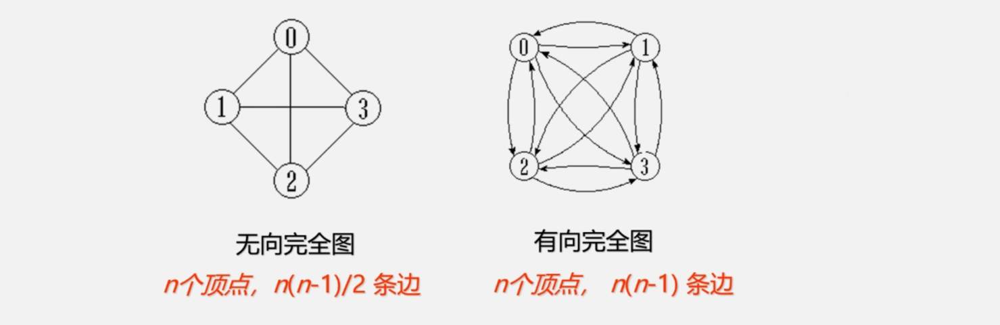

#### 2.顶点V相关概念：

1. 邻接：边/弧相连的两个顶点之间的关系，例如：(vi, vj)称为vi和vj<font color='#BAOC2F'>互为邻接点</font>、<vi, vj>称vi邻接到vj，vj邻接于vi
2. 关联/依附：边/弧与顶点之间的关系，例如：(vi, vj)/<vi, vj>称为该边/弧关联于vi和vj
3. 顶点的度：与该顶点相关联的边的数目，记为TD(v)，在有向图中<font color='#BAOC2F'>顶点的度</font>等于<font color='#BAOC2F'>该顶点的入度与出度之和</font>。
4. 顶点的入度：<font color='#BAOC2F'>以v为终点</font>的有向边的条数，记作ID(v)
5. 顶点的出度：<font color='#BAOC2F'>以v为始点</font>的有向边的条数，记作OD(v)

#### 3.边E相关的概念：

1. 路径：接续的边构成的顶点序列
2. 路径长度：路径上边/弧的数目/<font color='#BAOC2F'>权值之和</font>
3. 回路：第一个顶点和最后一个顶点相同的路径。
4. 简单路径：除路径起点和终点<font color='#BAOC2F'>可以相同</font>外，<font color='#BAOC2F'>其余顶点均不相同</font>的路径。
5. 简单回路：除路径起点和终点<font color='#BAOC2F'>相同</font>外，其余顶点均不相同的路径。
6. 连通：无向图中两个顶点间有路径存在，则称为连通。
7. 强连通：有向图中两个顶点间有正向、逆向的路径，则称为强连通。
8. 连通图：无向图中任意两个顶点之间都是连通的，则称为连通图
9. 强连通图：有向图中任意两个顶点之间都是强连通的，则称为强连通图

>==补充：有向图无向图边数问题==
>
>- 对于n个顶点的无向图G，若G是<font color='#BAOC2F'>连通图</font>则最少有n-1条边，若G是<font color='#BAOC2F'>非连通图</font>则最多可能有$C_{n-1}^2$条边
>- 对于n个顶点的有向图G，若G是<font color='#BAOC2F'>强连通图</font>则最少有n条边（即形成一条回路）

#### 4.子图G相关概念：

1. 连通分量：无向图中的<font color='#BAOC2F'>极大连通子图</font>称为连通分量（子图必须连通，且包含尽可能多的顶点和边）

2. 强连通分量：有向图中的<font color='#BAOC2F'>极大强连通子图</font>称为强连通分量（子图必须强连通，同时保留尽可能多的边）

    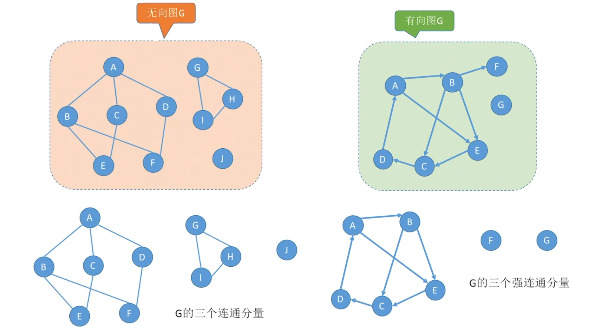

3. 生成树：是一个<font color='#BAOC2F'>连通图</font>中，<font color='#BAOC2F'>包含全部顶点</font>的一个<font color='#BAOC2F'>极小连通子图</font>（边尽可能的少，但要保持连通）。

    若图中顶点数为n则它的生成树含有n-1条边，对生成树而言若砍去1条边则变成非连通图，若加上1条边则会形成回路。

    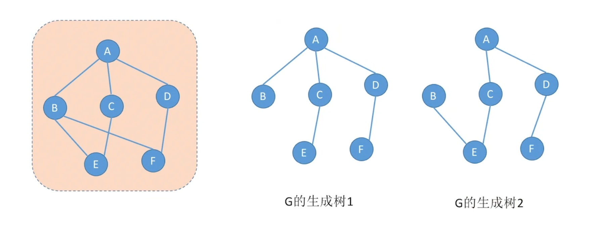

4. 生成森林：是一个<font color='#BAOC2F'>非连通图</font>中，<font color='#BAOC2F'>连通分量的生成树</font>构成了非连通图的生成森林。

    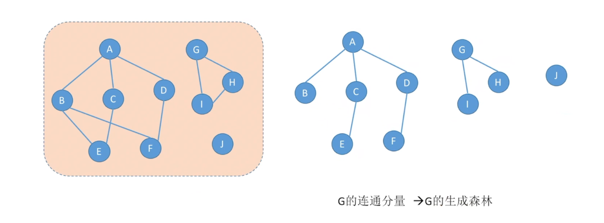


### 二、图的存储结构

#### 1.数组表示法AdjacencyMatrix

顶点表是一个一维数组`Vexs[n]`用于存放各个顶点的信息：

邻接矩阵是一个二维数组`A.arcs[n][n]`用于存放各个顶点之间边的关系：
$$
A.arc[i][j]=\begin{cases}
1,~~~~~if~(Vi, Vj)∈E ~~或<Vi,Vj>∈E \\
\\
\\
0,~~~~~else
\end{cases}
$$

##### （1）无向图邻接矩阵表示

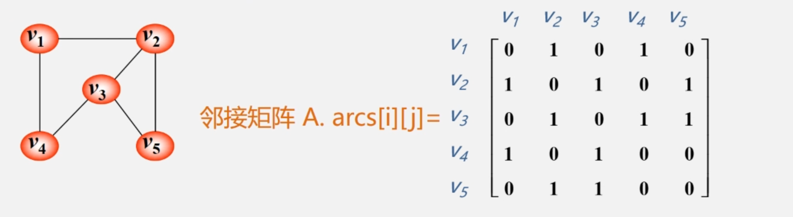

1. 只要确定了顶点编号，图的邻接矩阵表示方式唯一
2. 顶点`i`的度 = 第`i`行/列中1的个数
3. 无向图的邻接矩阵是<font color='#BAOC2F'>对称的</font>
4. <font color='#BAOC2F'>完全图</font>的邻接矩阵中，对角元素为0其余全为1
5. 设图G的邻接矩阵为A（矩阵元素为0/1），则A<sup>n</sup>的元素$A^n[i][j]$等于由顶点`i`到顶点`j`的长度为`n`的路径的数目。

##### （2）有向图邻接矩阵表示

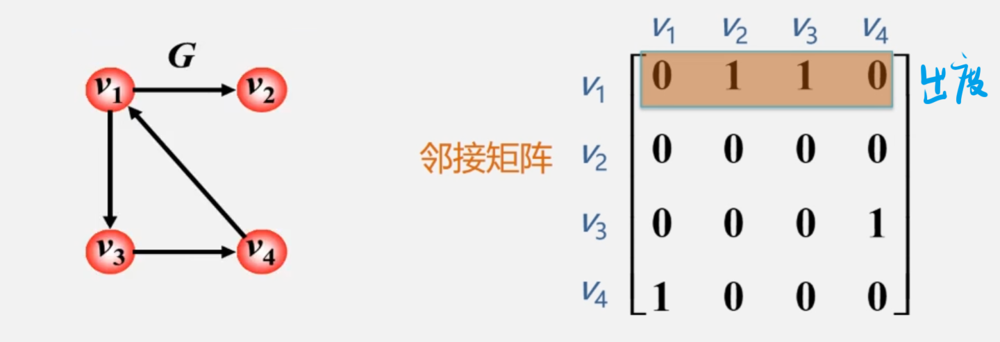

1. 有向图的邻接矩阵可能是<font color='#BAOC2F'>不对称的</font>
2. 顶点的出度=第`i`行元素之和、顶点的入度=第`i`列元素之和
3. 顶点的度=第`i`行元素之和+第`i`列元素之和

> ==补充==：由<font color='#BAOC2F'>邻接矩阵表示有向图</font>可引出，<font color='#BAOC2F'>邻接矩阵表示有向网</font>：
>
> 其中邻接矩阵重新定义为`A.arcs[n][n]`：
> $$
> A.arc[i][j]=\begin{cases}
> Wij,~~~~~if~(Vi, Vj)∈E ~~或<Vi,Vj>∈E \\
> \\
> \\
> \infty,~~~~~else~(无边/弧)
> \end{cases}
> $$
> 如下图所示：
>
> 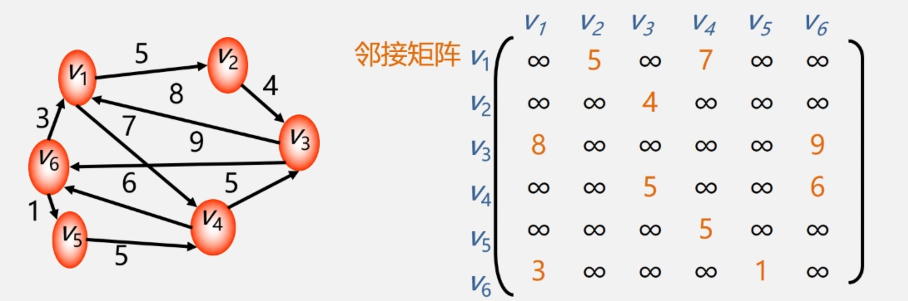

##### （3）邻接矩阵建立无向网★

邻接矩阵的存储表示：用两个数组分别存储<font color='#BAOC2F'>顶点表</font>和<font color='#BAOC2F'>邻接矩阵</font>，

```cpp
#define MVNum//最大顶点数
#define MaxInt IFINITY//表示极大值无穷
typedef char VerTexType;//设置边的权值类型为整型
typedef int AcrType;//设置顶点的数据类型字符型

typedef struct {
    VerTexType vexs[MVNum];//顶点表
    AcrType arcs[MVNum][MVNum];//邻接矩阵or边表
    int vexnum, arcnum;//图的当前顶点数和边数
} AMGraph;//Adjacency Matrix Graph
```

采用邻接矩阵表示法创建<font color='#BAOC2F'>无向网</font>：

1. 输入总顶点vexnum数和总边数arcnum
2. 建立顶点表：依次输入点的信息存入顶点表中
3. 初始化邻接矩阵，使每个<font color='#BAOC2F'>权值初始化为极大值</font>
4. 根据图G的边的情况构造邻接矩阵

```cpp
Status createUDN(AMGraph &G) {//采用邻接矩阵表示法，创建Undirected Net无向网
    //1.输入图的顶点数与边数
    cin >> G.vexnum >> G.arcnum;
    //2.输入顶点信息
    for (int i = 0; i < G.vernum; ++i) cin >> G.vex[i];
    //3.初始化邻接矩阵
    for (int i = 0; i < G.vexnum; ++i)
        for (int j = 0; j < G.vexnum; ++j)
            G.arcs[i][j] = MaxInt;//边的权值均设为最大值
    //4.构造邻接矩阵（输入边信息）
    for (int i = 0; i < G.arcnums; ++i) {
        cin >> v1 >> v2 >> w;//输入一条边所依附的顶点及边的权值
        i = LocateVex(G, v1);
        j = LocateVex(G, v2);//确定v1和v2在G中的位置
        G.arcs[i][j] = w;//边<v1, v2>的权值置为w
        G.arcs[j][i] = G.arcs[i][j];//对称边<v2, v1>的权值置为w
    }
    return OK;
}
```

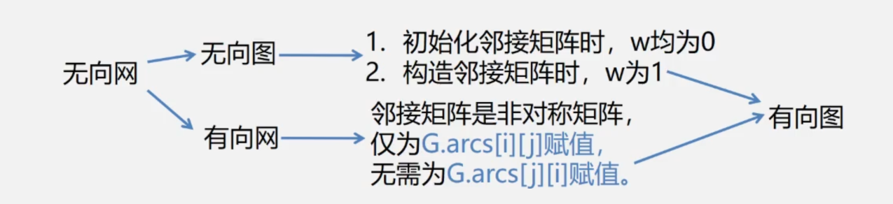

##### （4）邻接矩阵表示法分析：

| 优点                                                         |
| ------------------------------------------------------------ |
| 直观、简单、易于理解                                         |
| 便于检查<font color='#BAOC2F'>任意一对顶点</font>之间是否存在联系（边） |
| 便于找到<font color='#BAOC2F'>任意顶点</font>的所有邻接点（有联系的点） |
| 便于计算<font color='#BAOC2F'>任意顶点</font>的度：从该点出发的边数为出度、指向该点的边数为入度 |

| 缺点                                              |
| ------------------------------------------------- |
| 不利于增加和删除顶点                              |
| 浪费空间—存储稀疏图，点很多而边很少有大量无效元素 |
| 浪费时间—统计稀疏图中一共有多少条边               |

#### 2.链式表示法AdjacencyList

建立一个<font color='#BAOC2F'>顶点表</font>记录各个顶点的信息 和一个<font color='#BAOC2F'>线性链表</font>记录关联着同一顶点的边的信息

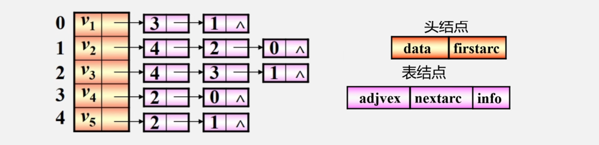

##### （1）无向图邻接表表示

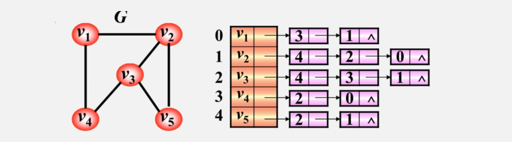

1. 邻接表<font color='#BAOC2F'>不是唯一的</font>，链表结点的顺序是可调换的。
2. 无向图中顶点`vi`的度即为第`i`个单链表中的<font color='#BAOC2F'>节点数</font>。
3. 若无向图中有n个顶点与e条边，则邻接表需要n个头结点与2e个表结点来存储（更适合<font color='#BAOC2F'>稀疏矩阵的存储</font>）

##### （2）有向图邻接表表示

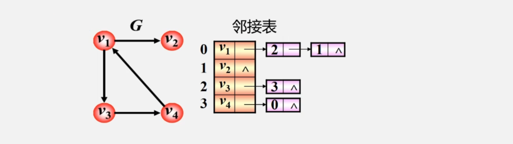

1. 有向图中顶点`Vi`的<font color='#BAOC2F'>出度</font>即为第`i`个单链表中的<font color='#BAOC2F'>结点数</font>。
2. 有向图中顶点`Vi`的<font color='#BAOC2F'>入度</font>即为<font color='#BAOC2F'>整个单链表中的邻接点域值</font>为`i-1`的<font color='#BAOC2F'>结点数</font>（困难）。

##### （3）邻接表建立无向图★

邻接表的存储表示：


```cpp
#define MVNum 100//最大顶点数
//顶点的结构定义
typedef struct VNode {
    VerTexTyped data;//顶点信息
    ArcNode *firstarc;//指向第一条依附该顶点的边的指针
} VNode, AdjList[MVNum];//AdjList表示邻接表类型，即AdjList v;相当于VNode v[MVNum];

//边的结构定义
typedef struct ArcNode {
    int adjvex;//该边所指向的顶点的位置
    struct ArcNode *nextarc;//指向下一条边的指针
    OtherInfo info;//与边相关的信息
} ArcNode;

//图的结构定义
typedef struct {
    AdjList vertices;//vertexs
    int vexnum, arcnum;//图的当前顶点数和边数
} ALGraph;
```

采用邻接表表示法创建<font color='#BAOC2F'>无向图</font>：

1. 输入总顶点vexnum数和总边数arcnum

2. 建立顶点表：依次输入点的信息存入顶点表中，并且使每个<font color='#BAOC2F'>表头结点的指针域</font>初始化为NULL

3. 根据图G的边的情况构造邻接表（单链表）：

    依次输入每条边依附的两个顶点，查找两个顶点的序号`i`和`j`建立边结点

    将此边结点分别插入到`vi`和`vj`对应的两个<font color='#BAOC2F'>边链表</font>的头部

```cpp
Status createUDG(ALGraph &G) {//采用邻接表表示法，创建Undirected Graph无向网
    //1.输入图的顶点数与边数
    cin >> G.vexnum >> G.arcnum;
    //2.输入表头顶点信息 构造表头结点
    for (int i = 0; i < G.vernum; ++i) {
        cin >> G.vertices[i].data;//输入顶点值
        G.vertices[i].firstarc = NULL;//初始化表头结点的指针域
    }
    //3.输入边结点信息 构造邻接表
    for (int i = 0; i < G.arcnums; ++i) {
        cin >> v1 >> v2;//输入一条边所依附的两个顶点
        i = LocateVex(G, v1);
        j = LocateVex(G, v2);//确定v1和v2在G中的位置
        
        //(1)生成一个新的边结点*p1
        p1 = new ArcNode;
        p1->adjvex = j;//邻接点序号为j
        p1->nextarc = G.vertices[i].firstarc;
        G.vertices[i].firstarc = p1;//将新结点*p1插入顶点Vi的边表头部
        
        //(2)生成一个新的对称边结点*p2
        p2 = new ArcNode;
        p2->adjvex = i;//邻接点序号为i
        p2->nextarc = G.vertices[j].firstarc;
        G.vertices[j].firstarc = p2;//将新结点*p2插入顶点Vj的边表头部
    }
    return OK;
}
```

##### （4）邻接表表示法分析：

| 优点                                                         |
| ------------------------------------------------------------ |
| 节约稀疏图的空间：需要N个头指针+2E个结点（每个结点至少2个域） |
| 便于找到<font color='#BAOC2F'>任意顶点</font>的所有邻接点（有联系的点） |
| 便于计算<font color='#BAOC2F'>任意顶点</font>的度：对于无向图方便，对于有向图只能计算出度，入度需要逆邻接表来计算 |

| 缺点                                                         |
| ------------------------------------------------------------ |
| 不便于检查<font color='#BAOC2F'>任意一对顶点</font>之间是否存在联系（边） |

==邻接矩阵与邻接表之间的对比==：

联系：邻接表中每个<font color='#BAOC2F'>链表</font>对应于邻接<font color='#BAOC2F'>矩阵中的一行</font>，链表中<font color='#BAOC2F'>结点的个数</font>等于矩阵<font color='#BAOC2F'>行中非零元素的个数</font>。

| 对比     | 邻接矩阵                                 | 邻接表                                                       |
| -------- | ---------------------------------------- | ------------------------------------------------------------ |
| 复杂度   | 邻接矩阵的空间复杂度为O（n<sup>2</sup>） | 邻接表的空间复杂度为O（n+e）顶点数+边数                      |
| 应用性   | 邻接矩阵多用于稠密图                     | 邻接表多用于稀疏图                                           |
| 表示方式 | 邻接矩阵是唯一的（行列号与顶点编号一致） | 邻接表不是唯一的（链表次序与顶点编号无关）对于任意<font color='#BAOC2F'>无向图</font> |
| 邻边查找 | 邻接矩阵必须遍历对应的行/列              | 邻接表找<font color='#BAOC2F'>有向图入边</font>不方便（其余很方便） |

#### 3.链式表示法的改进：

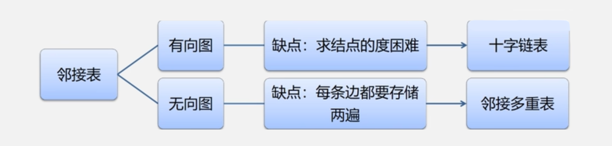

| 邻接表缺点                                                   | 方案       | 具体                                                         |
| ------------------------------------------------------------ | ---------- | ------------------------------------------------------------ |
| 有向图时<font color='#BAOC2F'>度计算困难</font>（邻接表便于求出度、逆邻接表便于求入度） | 十字链表   | <font color='#BAOC2F'>邻接表</font>和<font color='#BAOC2F'>逆邻接表</font>结合形成的链表。 |
| 存储无向图时<font color='#BAOC2F'>每条边重复存储</font>的问题 | 邻接多重表 | 删除边、删除结点等操作十分的方便                             |

##### （1）十字链表：

十字链表Orthogonal List，

1. 是<font color='#BAOC2F'>只能用于存储有向图</font>的一种链式存储结构，
2. 为了解决<font color='#BAOC2F'>有向图度</font>计算困难问题，将有向图的<font color='#BAOC2F'>邻接表</font>和<font color='#BAOC2F'>逆邻接表</font>结合起来形成的链表。
3. 有向图中的弧对应十字链表中的<font color='#BAOC2F'>弧结点</font>，有向图中的<font color='#BAOC2F'>顶点</font>在十字链表中有对应的<font color='#BAOC2F'>顶点结点</font>。


==案例演示==：根据如下有向图<font color='#BAOC2F'>建立十字链表</font>。

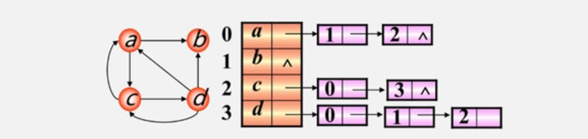

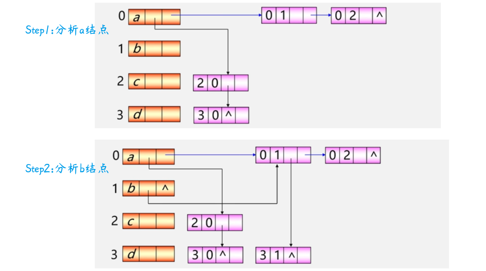

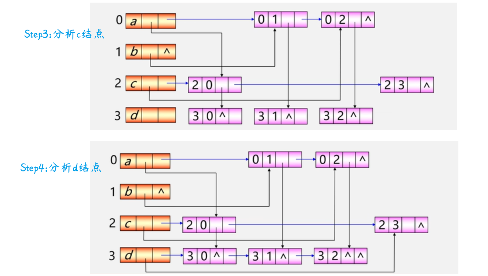

十字链表建立完毕

##### （2）邻接多重表：

邻接多重表，

1. 是<font color='#BAOC2F'>只能用于存储无向图</font>的一种链式存储结构，
2. 为了解决邻接表存储无向图时<font color='#BAOC2F'>每条边重复存储</font>的问题而提出的。
3. 删除边、删除结点等操作十分的方便


==案例演示==：根据如下无向图<font color='#BAOC2F'>建立邻接多重表</font>：


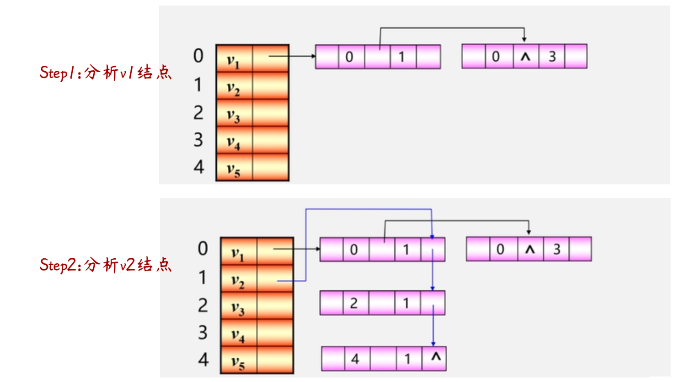

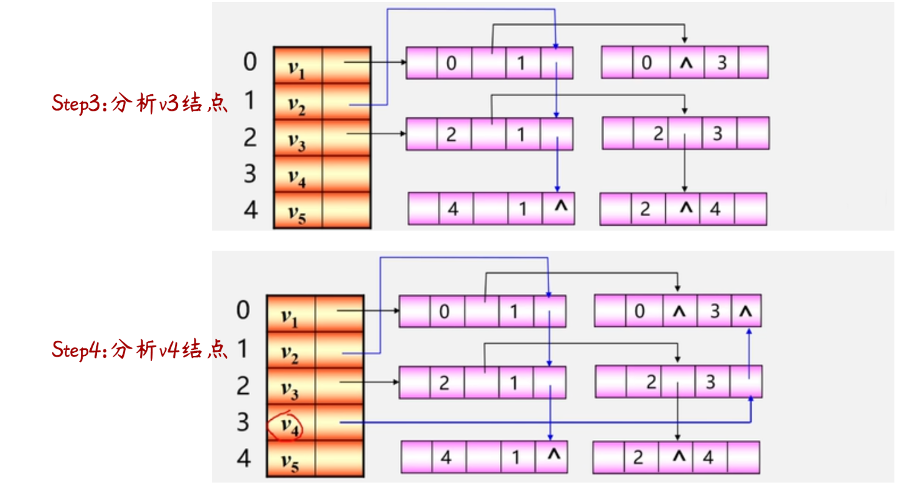

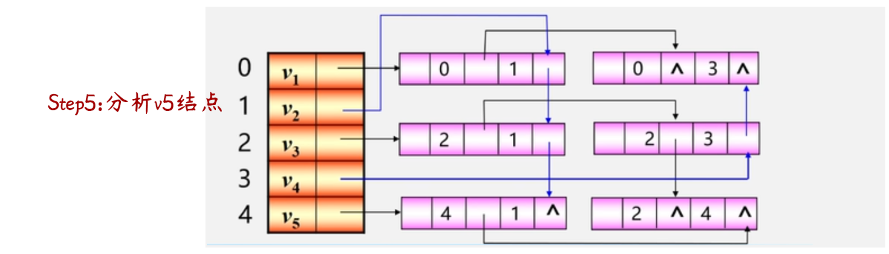

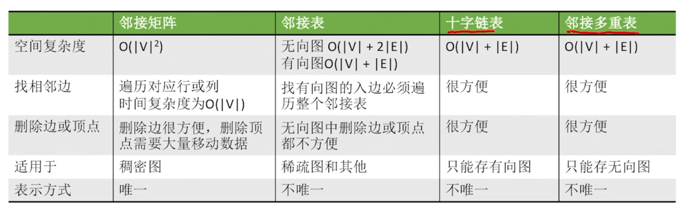

### 三、图的遍历

> 注：遍历的实质就是找到<font color='#BAOC2F'>每一个顶点的邻接点</font>的过程（需要设置visit数组避免重复访问结点的问题）

#### 1.广度优先搜索BFS

##### （1）BFS思想：

> 注：连通图的广度优先遍历类似于<font color='#BAOC2F'>树的层次遍历</font>，需要一个<font color='#BAOC2F'>辅助队列</font>。

1. 从图中某结点出发，首先依次访问该结点的<font color='#BAOC2F'>所有相邻邻接结点</font>vi1、vi2、…vin（同一层）
2. 再按照这些顶点被访问的先后次序，依次访问与它们<font color='#BAOC2F'>相邻的</font>所有<font color='#BAOC2F'>未被访问的</font>顶点
3. 重复此过程，直到所有顶点均被访问为止

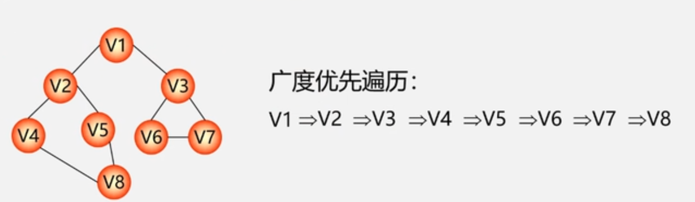

==BFS具体过程如下==：

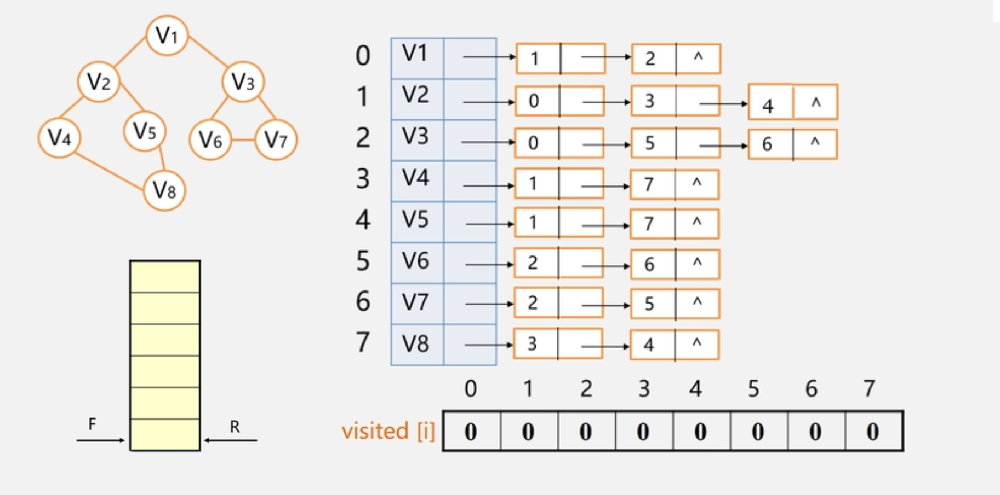

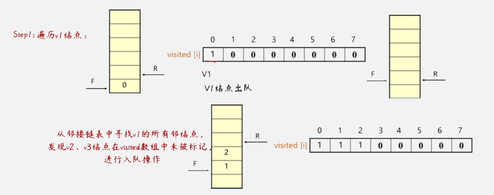

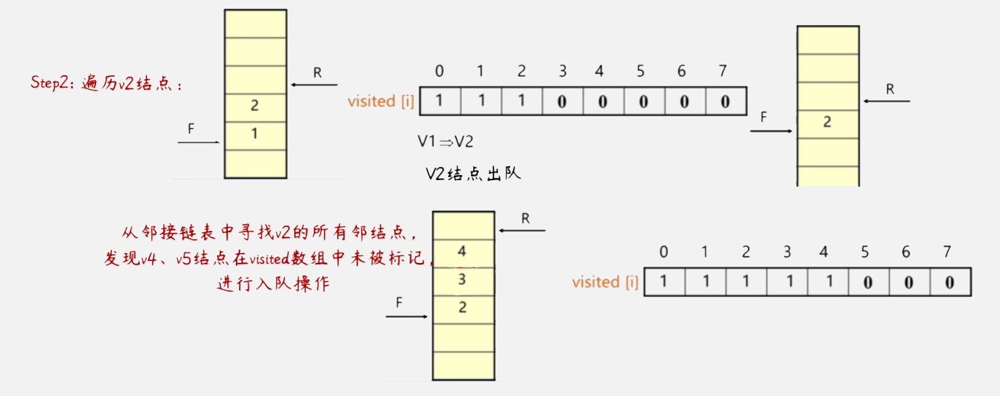

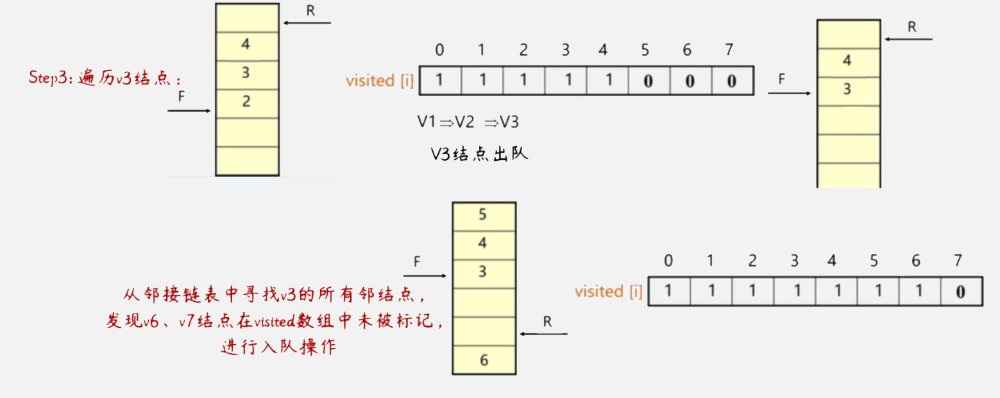

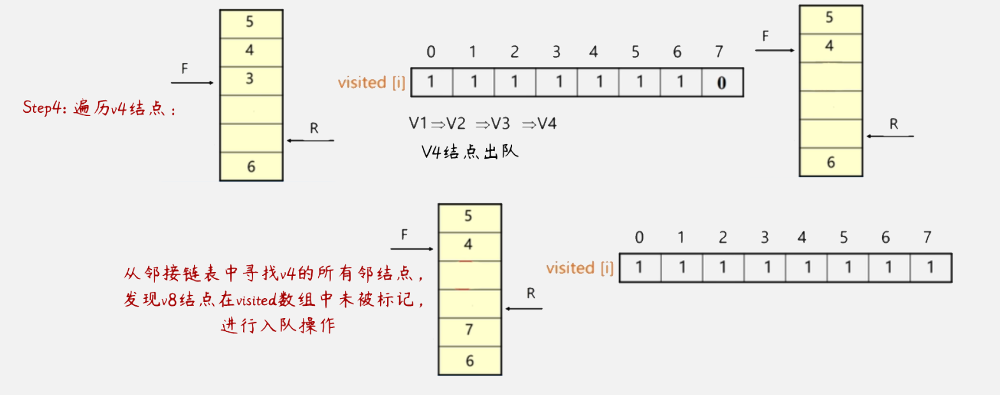

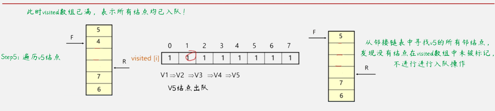

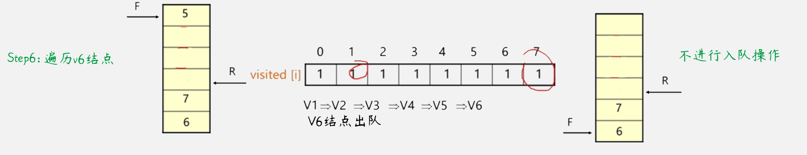

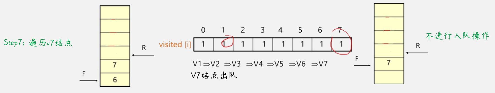

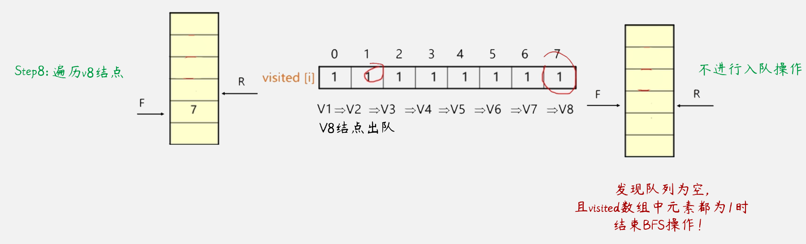

##### （2）BFS的实现：

```cpp
bool visited[MAX_VERTEX_NUM];//访问标记数组（初始值都为false）

void BFSTraverse(Graph G) {//对图G进行广度优先遍历（处理非连通图）
    for (int i = 0; i < G.vexnum; ++i) visited[i] = FALSE;//对访问标记数组初始化
    InitQueue(Q);
    for (int i = 0; i < G.vexnum; ++i) {//从0号顶点开始遍历
        if (!visited[i]) {//对每个连通分量调用一次BFS
            BFS(G, i);//Vi未访问过则从vi开始BFS
        }
    }
}

void BFS(Graph G, int v) {//从顶点v出发 广度优先遍历图G
    visit(v);//访问初始顶点v
    visited[v] = TRUE;//对v做已标记访问
    InitQueue(Q);//辅助队列Q初始化 置空
    EnQueue(Q, v);//v入队列Q
    while (!isEmpty(Q)) {
        DeQueue(Q, u);//队头元素出队
        for (int w = FirstNeighbor(G, u); w >= 0; w = NextNeighbor(G, u, w)) {
            //w为u的尚未访问的邻接顶点
            if (!visited[w]) {
                visit(w);
                visited[w] = TRUE;
                EnQueue(Q, W);
            }
        }
    }
}
```

##### （3）算法分析：

- 用邻接矩阵来表示图，BFS对于每一个被访问到的顶点，都要循环检测矩阵中的完整一行（n个元素），时间复杂度为O（n<sup>2</sup>）
- 用邻接表来表示图，虽然有2e个<font color='#BAOC2F'>表结点</font>但是只需扫描e个结点即可，加上访问n个<font color='#BAOC2F'>头结点</font>的时间，时间复杂度为O（n + e）
- 同一个图的<font color='#BAOC2F'>邻接矩阵表示方式唯一</font>，因此广度优先遍历序列唯一
- 同一个图的<font color='#BAOC2F'>邻接表表示方式不唯一</font>，因此广度优先遍历序列不唯一

#### 2.深度优先搜索DFS

##### （1）DFS思想：

> 注：连通图的深度优先遍历类似于<font color='#BAOC2F'>树的先根遍历</font>，需要一个<font color='#BAOC2F'>辅助栈</font>。

1. 在访问图中起始顶点`v`之后，由顶点`v`出发访问它的任一<font color='#BAOC2F'>邻接顶点</font>`v1`
2. 在访问图中邻接顶点`v1`之后，由顶点`v1`出发访问它的任一<font color='#BAOC2F'>邻接但是还没有被访问过的</font>顶点`v2`
3. 在访问图中邻接顶点`v2`之后，进行类似的访问v3、v4、v5…直到所有的邻接顶点都被访问过为止
4. 当在<font color='#BAOC2F'>某顶点时</font>其<font color='#BAOC2F'>所有邻接顶点都被访问过</font>，退到<font color='#BAOC2F'>上一个访问过的顶点</font>检测其是否还有<font color='#BAOC2F'>没有被访问过的</font>邻接顶点（回溯）

    如果有则对该<font color='#BAOC2F'>未访问顶点</font>进行访问，再从该顶点出发，进行类似的访问v3、v4、v5…直到所有的邻接顶点都被访问过为止

    如果没有则<font color='#BAOC2F'>再退到上一个访问过的顶点</font>检测其是否还有<font color='#BAOC2F'>没有被访问过的</font>邻接顶点（继续回溯）
5. 重复上述过程，直到连通图中的所有顶点都被访问过为止。

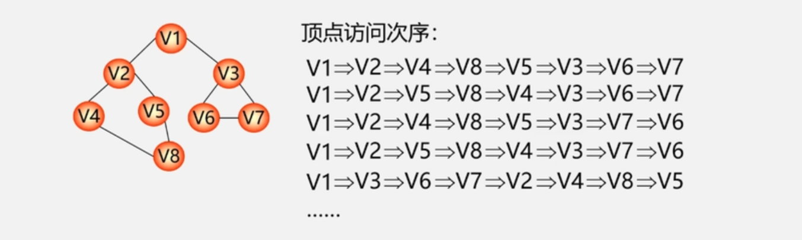

##### （2）DFS的实现：

```cpp
bool visited[MAX_VERTEX_NUM];

void DFSTraverse(Graph G) {//对图G进行深度优先遍历
    for (int i = 0; i < G.vexnum; ++i) visited[i] = FALSE;//初始标记化数组
    for (int i = 0; i < G,vexnum; ++i) {//从v = 0开始遍历
        if (!visited[i]) {
            DFS(G, v);
        }
    }
}

void DFS(Graph G, int v) {//从顶点v出发 深度优先遍历图G
    visit(v);//访问顶点v
    visited[v] = TRUE;
    for (int w = FirstNeighbor(G, v); w >= 0; w = NextNeighbor(G, v, w)) {
        if (!visited[w]) {//w为u的尚未访问的邻接结点
            DFS(G, w);
        }
    }
}
```

1. 如果图的存储结构确定（此处邻接矩阵结构确定）时，则DFS遍历的顺序只有一种
2. 回溯的过程即为if不执行的情况，无需书写！

##### （3）算法分析：

- 用邻接矩阵来表示图，遍历图中的每一个顶点都要<font color='#BAOC2F'>从头扫描该顶点所在的行</font>，时间复杂度为O（n<sup>2</sup>）
- 用邻接表来表示图，虽然有2e个<font color='#BAOC2F'>表结点</font>但是只需扫描e个结点即可，加上访问n个<font color='#BAOC2F'>头结点</font>的时间，时间复杂度为O（n + e）

==DFS与BFS算法效率比较==：

1. 空间复杂度相同O（n）：DFS借用了栈，而BFS借用了队列
2. 时间复杂度<font color='#BAOC2F'>只与存储结构有关</font>，而与搜索的路径无关DFS/BFS


