# 第六章：图（下）

---

==难点整理==：

1. Prim算法：  https://www.bilibili.com/video/BV1Rg411n7c8/

2. Kruskal算法：https://www.bilibili.com/video/BV1Se411N7be/  

3. Dijkstra算法：

    wangzhuo：https://www.bilibili.com/video/BV1xG411T7yM/

    xianyu：https://video.weibo.com/show?fid=1034:4843285718695944

4. Floyd算法：

    wangzhuo：https://www.bilibili.com/video/BV1tV4y1c75Z/

    xianyu1：https://www.bilibili.com/video/BV1uA411R76f/

    xianyu2：https://www.bilibili.com/video/BV1uA411R7dq/
    
5. 拓扑排序：

### 一、最小生成树

生成树Spanning Tree：是指所有<font color='#BAOC2F'>顶点均由边连接</font>在一起，但<font color='#BAOC2F'>不存在回路</font>的<font color='#BAOC2F'>图</font>。

生成树具有以下特点：

1. <font color='#BAOC2F'>生成树的顶点个数</font>与<font color='#BAOC2F'>图的顶点个数</font>相同
2. 生成树是图的<font color='#BAOC2F'>极小连通子图</font>，去掉任意一条边则为非连通子图
3. 有n个顶点的连通图，其生成树有`n-1`条边
4. 在生成树中再<font color='#BAOC2F'>添加一条边</font>必然<font color='#BAOC2F'>形成回路</font>
5. 生成树中任意两个顶点间的<font color='#BAOC2F'>路径是唯一</font>的
6. 一个图可以有许多棵不同的生成树

以无向图为例，根据生成树的定义需要<font color='#BAOC2F'>包含所有的顶点、且不存在回路</font>的特性，

可以<font color='#BAOC2F'>直接对无向图进行DFS/BFS的遍历</font>访问其所有的顶点，在访问的过程中将走过的边添加到生成树上，

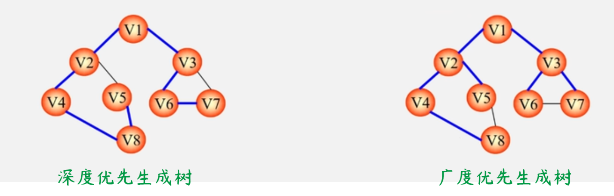

#### 1.MST：

MST概念：给定一个无向网，在该网络的所有生成树中，使得<font color='#BAOC2F'>各边权值之和最小</font>的那棵生成树称为该网的<font color='#BAOC2F'>最小生成树MST</font>，

1. 设`N=(V, E)`是一个连通网，且U是顶点集V的一个非空子集，
2. 若边`(u, v)`是一条具有最小权值的边，其中u∈U、v属于V-U，则<font color='#BAOC2F'>必存在一棵</font>包含边`(u, v)`的最小生成树。

MST最小生成树性质实际上是一种<font color='#BAOC2F'>贪心算法</font>（选择权值最小的边），大部分最小生成树算法都是<font color='#BAOC2F'>利用MST的性质</font>来构造最小生成树：

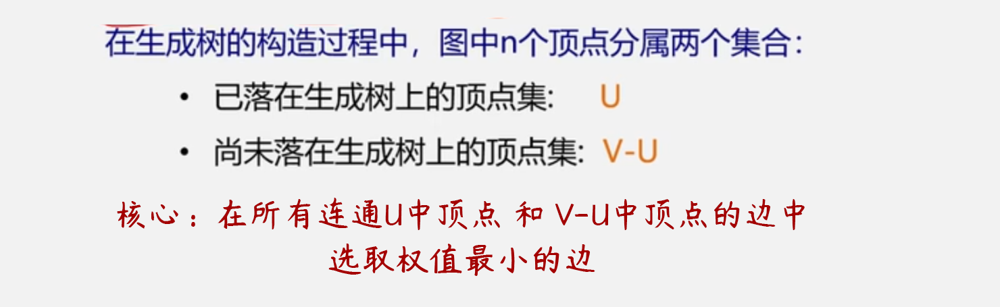

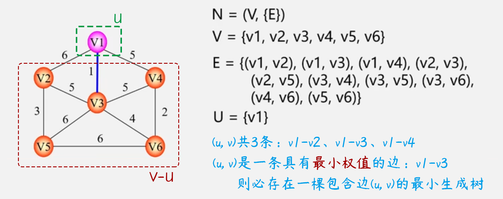

#### 2.Prim构造MST：

设 $N=(V,E)$ 是连通网，$TE$ 是 $N$ 上最小生成树中边的集合，

1. 初始化令 $U = \{u_0\}$ , $TE = \{~\}$ 
2. 在所有的 $u \in U$ 、$v \in V-U$中找一条代价最小的边 $(u_0,~v_0)$ 
3. 将  $(u_0,~v_0)$ 加入集合TE，将 $v_0$ 加入 $U$ 中
4. 重复上述操作直至 $U = V$ 为止
5. 则 $T = (V,~TE)$ 为N的最小生成子树

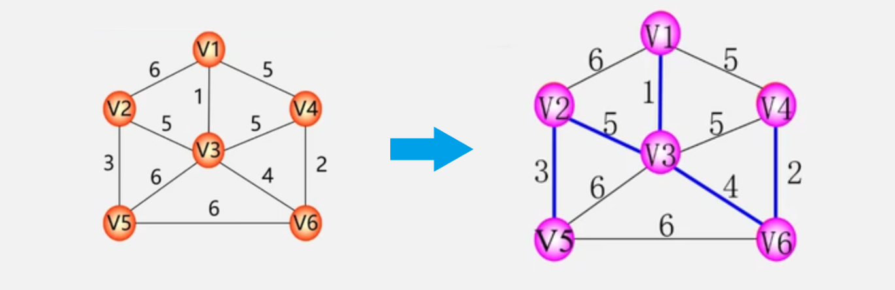

#### 3.Kruskal构造MST：

设 $N=(V,E)$ 是连通网，

1. 初始化令最小生成树初始状态为，<font color='#BAOC2F'>只有n个结点而无边</font>的非连通图 $T = (V, ~\{~\})$ 

2. 在 $E$ 中选取代价最小的边

    若改变依附的顶点落在 $T$ 中不同的连通分量上（不能成环），则将该边加入到 $T$ 中

    否则舍去该边，选取下一条代价最小的边

3. 以此类推直至 $T$ 中所有顶点都在同一连通分量上为止

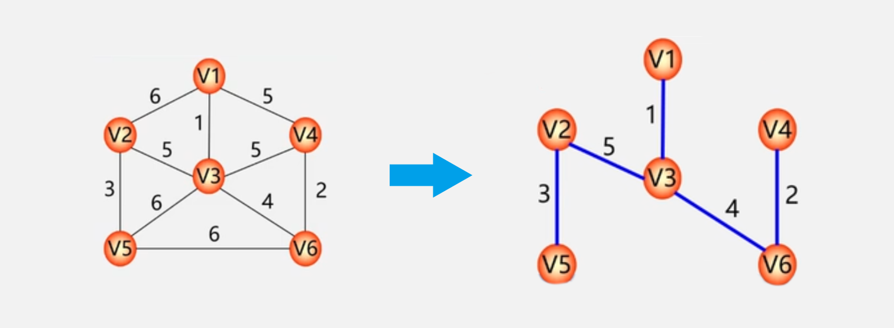

==Prim&Kruskal比较==：

|    算法    |        Prim        |       Kruskal       |
| :--------: | :----------------: | :-----------------: |
|  算法思想  |       选择点       |       选择边        |
| 时间复杂度 | O（n<sup>2</sup>） | O（eloge），e为边数 |
|  适用范围  |      边稠密图      |      边稀疏图       |

### 二、最短路径

在有向网中A点到达B点的<font color='#BAOC2F'>多条路径中</font>，寻找一条<font color='#BAOC2F'>各边权值之和最小</font>的路径，即为最短路径。

最短路径与最小生成树的不同在于，路径上不一定包含n个顶点和n-1条边（不一定包含所有顶点和所有的边），最小生成树的子集。

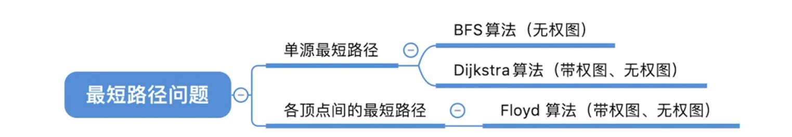

#### 1.BFS：

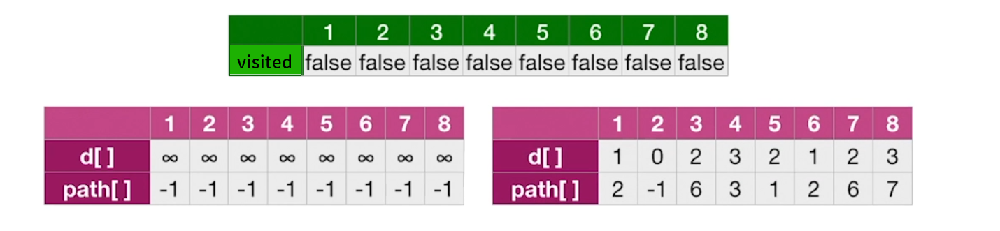

```cpp
bool visited[MAX_VERTEX_NUM];
void BFS(Graph G, int v) {//求顶点u到其他顶点的最短路径
    //d[i]表示从u到i结点的最短路径长度
    for (int i = 0; i < G.vexnum; ++i) {
        d[i] = INFINITY;//初始化路径长度
        path[i] = -1;//每个顶点在最短路径上的直接前驱（最短路径从哪个顶点过来）
    }
    d[u] = 0;//起始顶点的最短距离为0
    visited[u] = TRUE;
    
    EnQueue(Q, u);
    while (!isEmpty(Q)) {//BFS算法
        DeQueue(Q, u);
        for (int w = FirstNeighbor(G, u); w >= 0; w = NextNeighbor(G, u, w)) {
            if (!visited[w]) {
                d[w] = d[u] + 1;//路径长度+1
                path[w] = u;//记录最短路径时从哪过来的
                visited[w] = TRUE;
                EnQueue(Q, W);
            }
        }
    }
}
```

#### 2.Dijkstra算法：

<font color='#BAOC2F'>单源最短路径</font>问题可以使用Dijkstra算法进行处理，算法按照<font color='#BAOC2F'>路径长度递增次序</font>产生最短路径，

==求最短路径步骤==：

1. 初始化：先找出从源点v<sub>0</sub>到各终点vk的直达路径（v<sub>0</sub>，v<sub>k</sub>），即<font color='#BAOC2F'>通过一条弧到达</font>的路径

2. 路径选择：从初始化得到的路径中找出一条<font color='#BAOC2F'>长度最短</font>的路径（v<sub>0</sub>，u）

3. 路径调整：在路径选择之后对其<font color='#BAOC2F'>余各条路径</font>进行<font color='#BAOC2F'>适当的调整</font>

    若在图中存在弧（u，v<sub>k</sub>）且（v<sub>0</sub>， u）+（u，v<sub>k</sub>）<（v<sub>0</sub>，v<sub>k</sub>），则以路径（v<sub>0</sub>，u，v<sub>k</sub>）替代（v<sub>0</sub>，v<sub>k</sub>）

4. 递归：在调整后的各条路径中，再寻找长度最短的路径依次类推

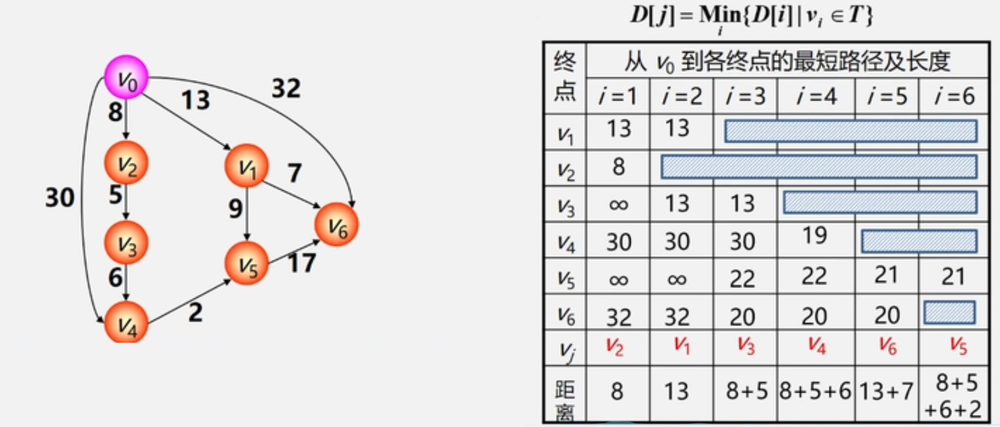

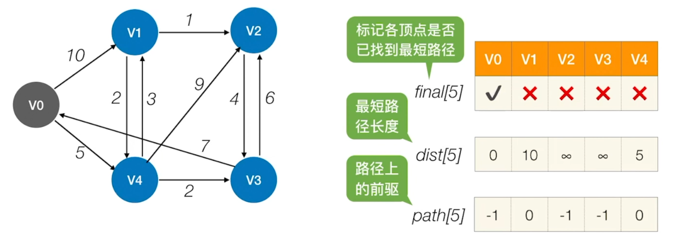

#### 3.Floyd算法：

求<font color='#BAOC2F'>所有顶点间最短路径</font>可以使用Floyd算法，逐个顶点试探从v<sub>i</sub>到v<sub>j</sub>的所有<font color='#BAOC2F'>可能存在</font>的路径中，选出一条长度最短的路径（动态规划）。

==求最短路径步骤==：

1. 设置一个 $n*n$ 阶方阵令，若顶点之间有弧则矩阵元素为权值，否则为$\infty$（记录着最短路径的矩阵）
2. 逐步在直接路径中增加<font color='#BAOC2F'>中间顶点</font>，若加入中间顶点后路径变短则修改，否则维持原值。
3. 当所有顶点试探完毕之后，算法结束

```cpp
//准备工作 根据图的信息初始化矩阵 A 和 path数组
for (int k = 0; k < n; ++k) {//考虑以Vk作为中转点
    for (int i = 0; i < n; ++i) {//遍历整个矩阵 i为行号 j为列号
        for (int j = 0; j < n; ++j) {
            if (A[i][j] > A[i][k] + A[k][j]) {//以Vk作为中转点的路径更短
                A[i][j] = A[i][k] + A[k][j];//更新最短路径长度
                path[i][j] = k;//中转点
            }
        }
    }
}
```

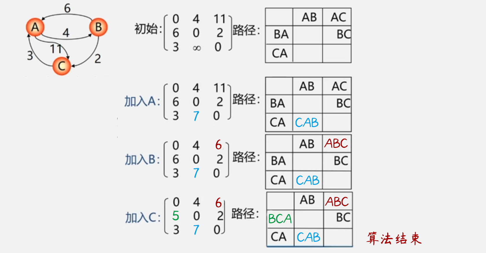

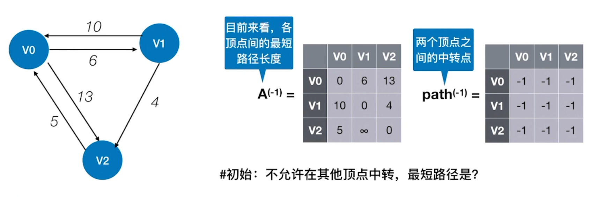

==求最短路径总结==：

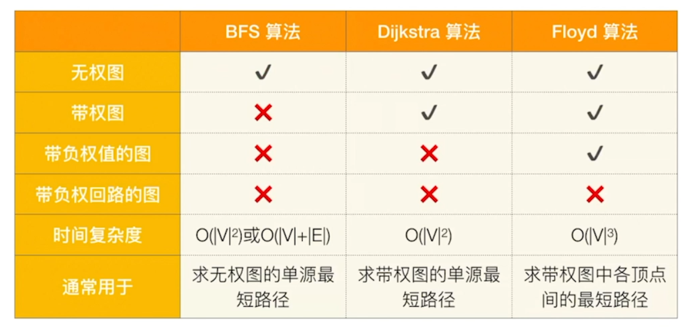

### 三、拓扑排序与AOV网

关于<font color='#BAOC2F'>拓扑排序</font>与<font color='#BAOC2F'>关键路径</font>的问题研究主要是针对于<font color='#BAOC2F'>有向无环图</font>DAG图（Directed Acycline Graph）的。

有向无环图常用来描述一个<font color='#BAOC2F'>工程/系统的进行过程</font>，一个工程可以分为若干个<font color='#BAOC2F'>子工程</font>。

#### 1.AOV网：

用一个有向图表示工程的各子工程及其相互制约的关系，

以<font color='#BAOC2F'>顶点</font>表示<font color='#BAOC2F'>活动</font>，<font color='#BAOC2F'>弧</font>表示<font color='#BAOC2F'>活动之间的优先制约关系</font>，称这种有向图为<font color='#BAOC2F'>顶点表示活动的网</font>AOV网（Activity On Vertex network）

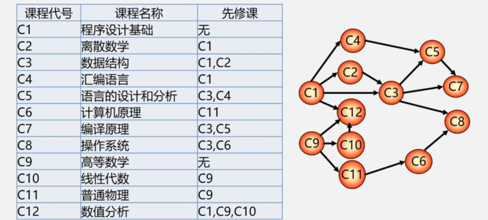

#### 2.拓扑排序：

在AOV网<font color='#BAOC2F'>没有回路</font>的前提下，将全部活动排成一个<font color='#BAOC2F'>线性序列</font>，

使得若AOV网中有弧$~<i, j>~$存在，则在这个序列中$~i~$一定排在$~j~$的前面，具有该性质的<font color='#BAOC2F'>线性序列</font>称为<font color='#BAOC2F'>拓扑有序序列</font>，

==拓扑排序思路==：

1. 在AOV网中选一个<font color='#BAOC2F'>没有前驱的顶点</font>（入度为0）并且对其进行输出
2. 从图中<font color='#BAOC2F'>删除该顶点</font>和<font color='#BAOC2F'>所有以它为起点的有向边</font>。
3. 重复上述步骤直至全部顶点输出

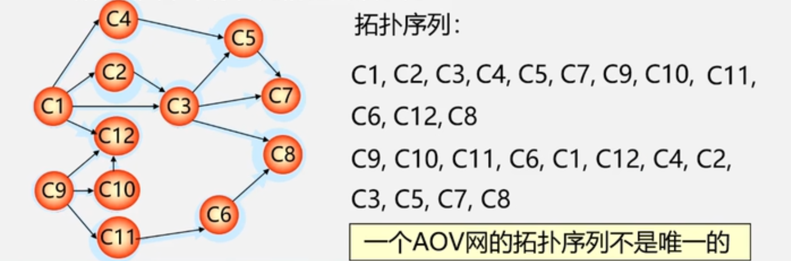

> 检测AOV网中是否存在环：对有向图构造其顶点的<font color='#BAOC2F'>拓扑有序序列</font>，若网中<font color='#BAOC2F'>所有顶点都在其拓扑有序序列中</font>则该AOV网必定不存在环。

==拓扑排序代码==：

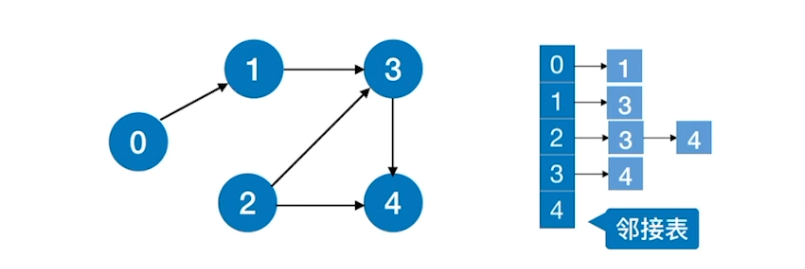

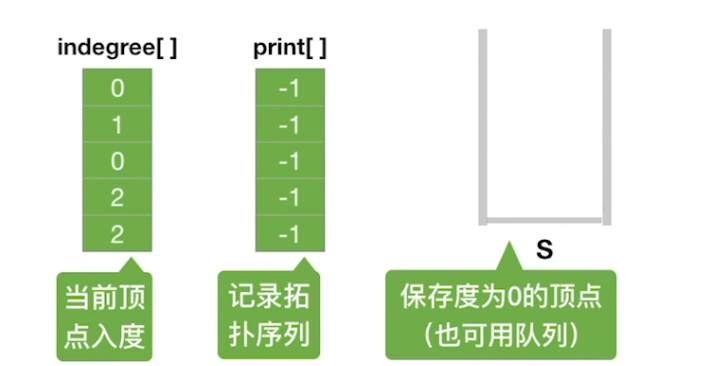

```cpp
#define MaxVertexNum 100
//边表结点
typedef struct ArcNode {
    int adjvex;//该弧所指向顶点的位置
    struct ArcNode *nextarc;//指向下一条弧的指针
    //InfoType info;//网的边权值
} ArcNode;
//顶点表结点
typedef struct VNode {
    VertexType data;//顶点信息
    ArcNode *firstarc;//指向第一条依附该顶点的弧的指针
} VNode, AdjList[MaxVertexNum];
//图的定义
typedef struct {
    AdjList vertices;//邻接表
    int vexnum, arcnum;//图的顶点数和弧数
} Graph;//以邻接表存储的图类型

//拓扑排序算法
bool TopologicalSort(Graph G) {
    InitStack(S);//初始化栈 用于存储入度为0的顶点
    for (int i = 0; i < G.vexnum; ++i) {
        if (indegree[i] == 0) Push(S, i);//将所有入度为0的顶点进栈
    }
    
    int count = 0;//用于记录当前已输出的顶点数
    while (!IsEmpty(S)) {
        Pop(S, i);//栈顶元素出栈
        print[count++] = i;//输出顶点i
        for (p = G.vertices[i].firstarc; p; p = p->nextarc) {
            //将所有i指向的顶点的入度减1 并将入度减为0的顶点压入栈S
            v = p->adjvex;
            if (!(--degree[v])) Push(S, v);
        }
    }
    
    if (count < G.vexnum) return false;//拓扑排序失败图中有回路
    else return true;//拓扑排序成功
}
```

==逆拓扑排序思路==：

1. 在AOV网中选一个<font color='#BAOC2F'>没有后继的顶点</font>（出度为0）并且对其进行输出
2. 从图中<font color='#BAOC2F'>删除该顶点</font>和<font color='#BAOC2F'>所有以它为终点的有向边</font>。
3. 重复上述步骤直至全部顶点输出

### 四、关键路径与AOE网

#### 1.AOE网：

用一个有向图表示工程的各子工程及其相互制约的关系，

以<font color='#BAOC2F'>弧</font>表示<font color='#BAOC2F'>活动</font>，<font color='#BAOC2F'>顶点</font>表示<font color='#BAOC2F'>活动的开始或结束事件</font>，称这种有向图为<font color='#BAOC2F'>边表示活动的网</font>AOE网（Activity On Edge network）

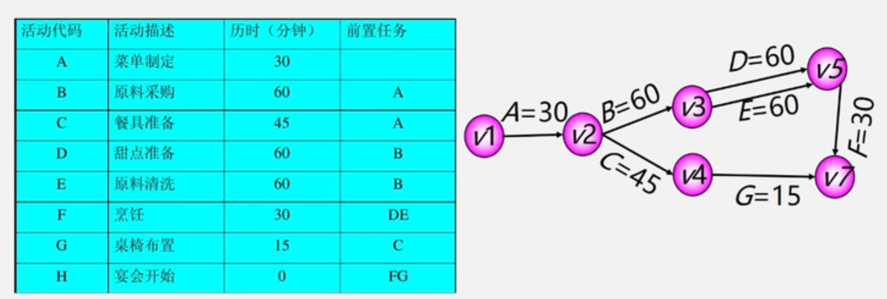

#### 2.关键路径：

###### 4个相关概念：

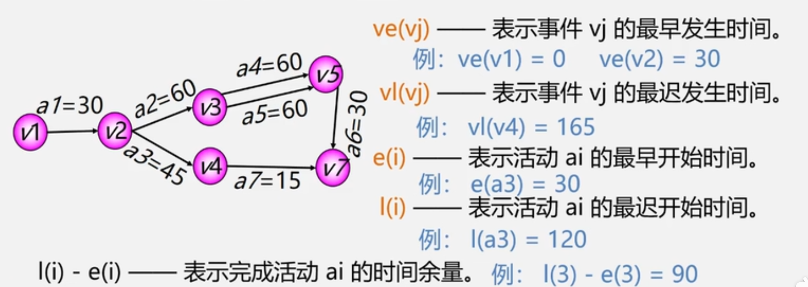

- 关键活动：关键路径上的活动，即`l(i) - e(i) = 0 `的活动
- 关键路径：<font color='#BAOC2F'>路径长度最长</font>的路径，由许多个关键活动组成

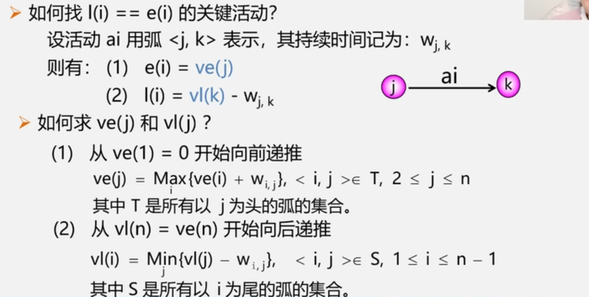

###### 关键路径的求解步骤：

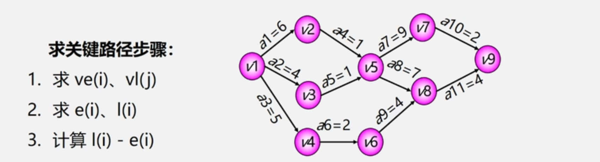

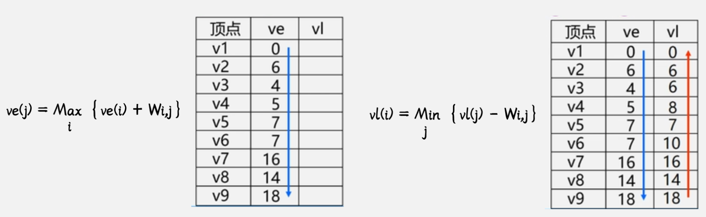

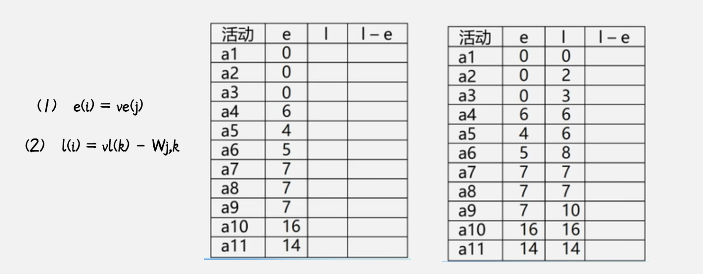

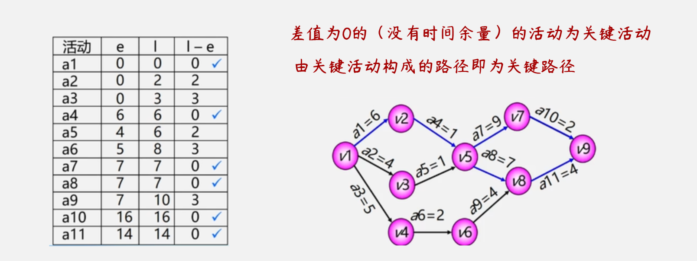

> ==关键路径的几点注意事项==：
>
> 1. 若网中有几条个关键路径，则需要加快同时在几条关键路径上的关键活动，如a11、a10、a8、a7
>
>     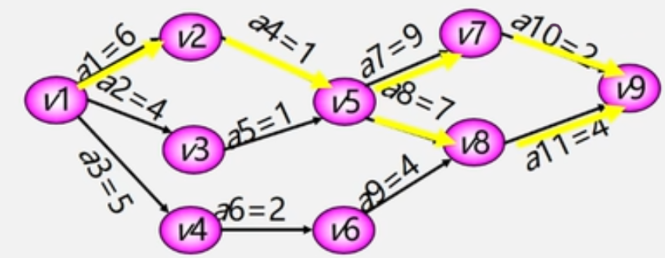
>
> 2. 如果一个活动<font color='#BAOC2F'>处于所有的关键路径上</font>，那么<font color='#BAOC2F'>提高这个活动的速度</font>就能缩短整个工程的完成时间，如a1、a4
>
> 3. 处于所有的关键路径上的活动完成的时间不能缩短太多，否则原来的关键路径可能会改变（需要重写寻找关键路径）


