# 第七章：查找

---

- 主关键字：可唯一标识记录的关键字
- 次关键字：用以识别若干记录的关键字
- 关键字的平均比较次数，平均查找长度ASL（Average Search Length）

$$
ASL = \sum_{i=1}^np_ic_i
$$

|     参数      |             说明              |
| :-----------: | :---------------------------: |
|       n       |          记录的个数           |
| p<sub>i</sub> |     查找到第i个记录的概率     |
| c<sub>i</sub> | 查找到第i个记录所需的比较次数 |

### 一、线性表的查找

#### 1.顺序查找

应用范围：顺序表或线性表表示的<font color='#BAOC2F'>静态查找表</font>（表内元素无序）

```cpp
typedef struct {
    ElemType *R;//表基址
    int length;//表长
} SSTable;//Sequential Search Table
SSTable ST;//定义顺序表ST
```

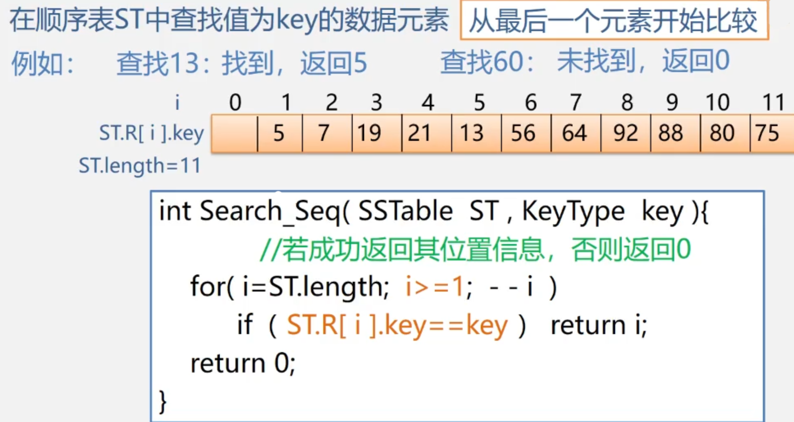

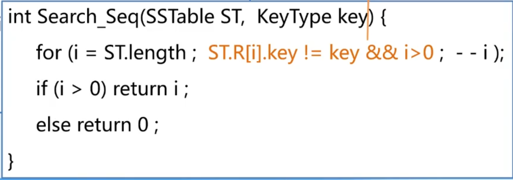

注意到每执行一次循环都要进行两次比较，

 改进：==利用哨兵简化减少for循环比较次数==，将待查关键字key存入表头，可免去查找过程中每一步都要检测是否查找完毕（加快速度）

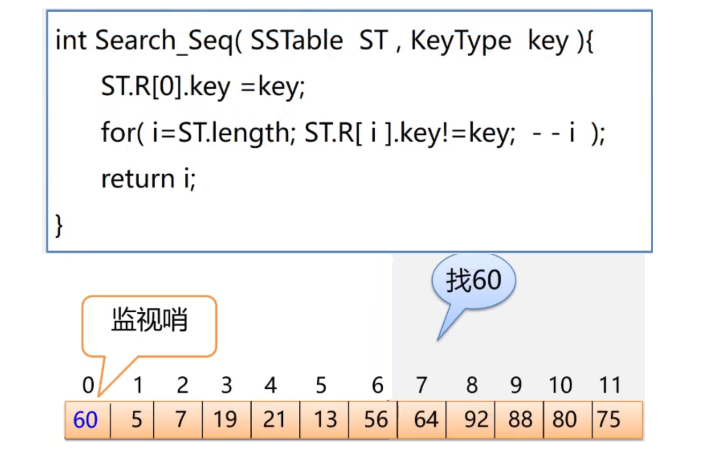

> 注意：当`ST.length`比较大时，此改进能使进行一次查找所需要的平均时间几乎减少一半。

顺序查找法优点：算法简单，逻辑次序无要求，且不同存储结构均适用

顺序查找法缺点：ASL太长时间效率太低

#### 2.折半查找

折半查找每次可将待查找记录所在的区间缩小一半，

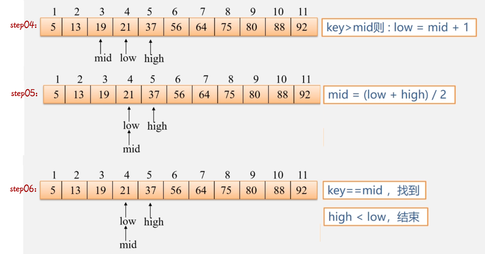

1. low、hight、mid分别指向待查找元素所在区间的上届、下界和中点，key为给定需要查找的值：

2. 使key与mid值做比较
    若`key = R[mid]`查找成功

    若`key < R[mid]`，则`high = mid - 1`

    若`key > R[mid]`，则`low = mid + 1`

3. 重复上述操作，直至`low > high`查找失败

非递归二叉查找：

```cpp
int binSearch(SqList sql, int target) {
    int low = 0;
    int high = sql.length - 1;
    int mid;
    while (low <= high) {
        mid = (low + high) / 2;
        cout << "low : " << low << " high : " << high << " mid : " << mid << endl;
        if (target == sql.elem[mid]) {
            return mid;
        } else if (target < sql.elem[mid]) {
            high = mid - 1;
        } else {
            low = mid + 1;
        }
    }
    return -1;
}
```

递归二分查找：

```cpp
//low = 0; high = sql.length - 1;
int binSearch(SqList sql, int target, int low, int high) {
    if (low > high) return -1;
    int mid = (low + high) / 2;
    if (target == sql.elem[mid]) {
        return mid;
    } else if (target < sql.elem[mid]) {
        high = mid - 1;
        binSearch(sql, target, low, high);
    } else {
        low = mid + 1;
        binSearch(sql, target, low, high);
    }
}
```

#### 3.折半查找分析

利用<font color='#BAOC2F'>判定树</font>对折半查找进行算法效率分析：

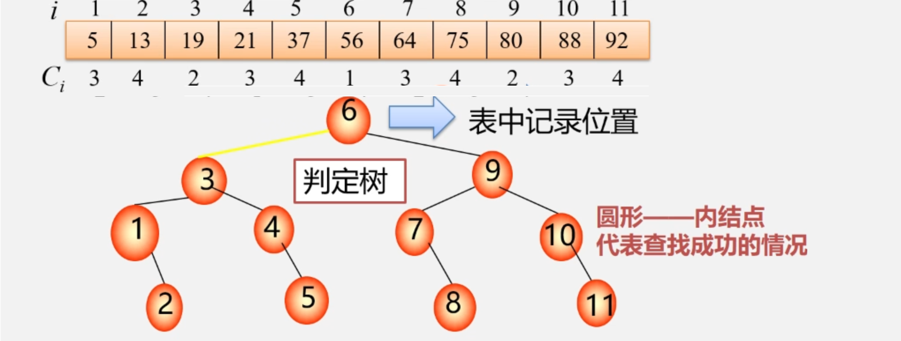

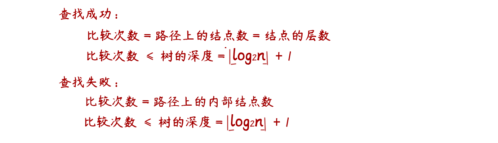

平均查找长度ASL（成功时）：

设表长为n = 2<sup>h</sup> - 1，则`h = log2(n + 1)`其中树为深度为h的满二叉树，且表中每个记录的查找概率相等P<sub>i</sub> = 1/n

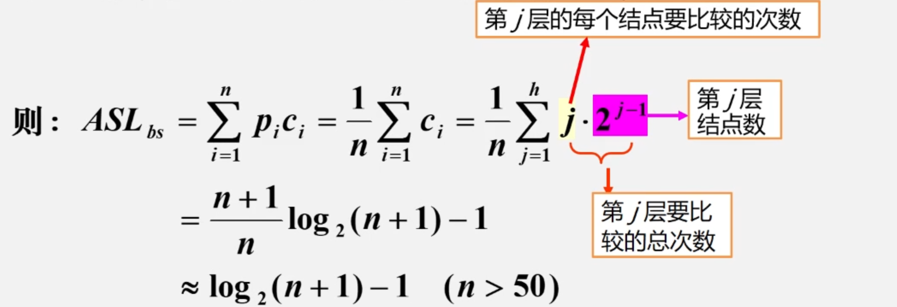

折半查找优点：效率比顺序查找更高

折半查找缺点：只适用于有序表，且仅限于顺序存储结构（对线性链表无效）

#### 4.分块查找

查找条件：

1. 将表分成若干块，且表或者有序或者分块有序，若`i < j`则第`j`块中所有记录的关键字均大于第`i`块中的最大关键字
2. 建立索引表（每个结点含有最大关键字域 和 指向本块第一个结点的指针，且按关键字有序）

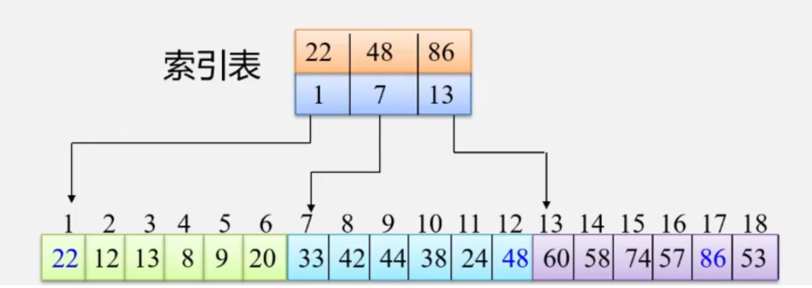

查找过程：先确定待查找记录所在块（顺序查找or折半查找），再在块内查找（顺序查找）

查找效率：
$$
ALS = L_b + L_w
$$

|     参数      |       说明        |
| :-----------: | :---------------: |
| L<sub>b</sub> | 对索引表查找的ASL |
| L<sub>w</sub> |  对块内查找的ASL  |

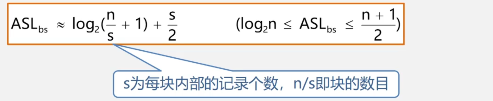

分块查找法优点：插入和删除比较容易，无需移动大量元素

分块查找法缺点：要增加一个索引表的存储空间，并对初始索引表进行排序运算

分块查找法适用情况：线性表既要快速查找又经常动态变化，则可采用分块查找

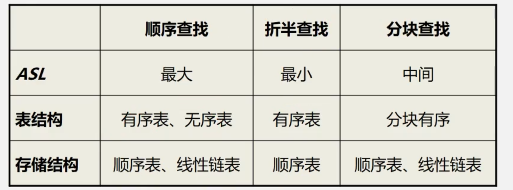

### 二、树表的查找

当表插入删除操作频繁时，为维护表的有序性<font color='#BAOC2F'>需要移动表中的很多记录</font>，

可以改用动态查找表（表结构在查找过程中动态生成）几种特殊的树进行优化：

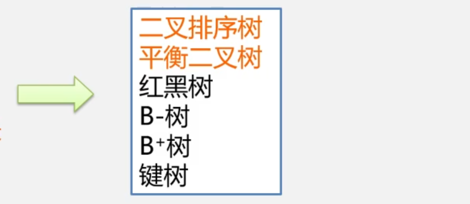

#### 1.二叉排序树BST

##### （1）基本概念：

二叉排序树（Binary Sort Tree）又称为二叉搜索树、二叉查找树，二叉排序树满足：

1. 若左子树非空，则左子树上所有的结点的<font color='#BAOC2F'>值均小于</font>根节点的值
2. 若右子树非空，则右子树上所有的结点的<font color='#BAOC2F'>值均大于等于</font>根节点的值
3. 其左右子树本身又各是一棵二叉排序树

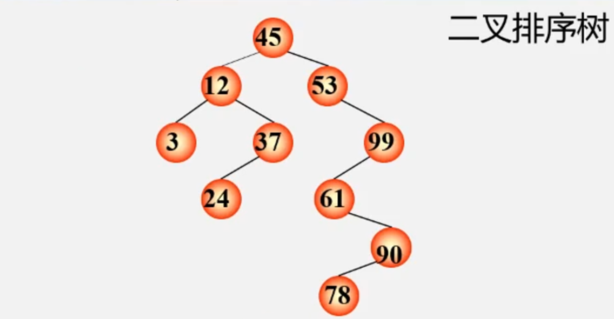

==二叉排序树的性质==：

中序遍历非空的二叉排序树，所得到的数据元素序列是一个<font color='#BAOC2F'>按关键字排列</font>的<font color='#BAOC2F'>递增有序序列</font>。

##### （2）二叉排序树查找：

1. 查找的<font color='#BAOC2F'>关键字等于根节点</font>查找成功，否则
2. 若小于根节点，查其左子树
3. 若大于根节点，查其右子树

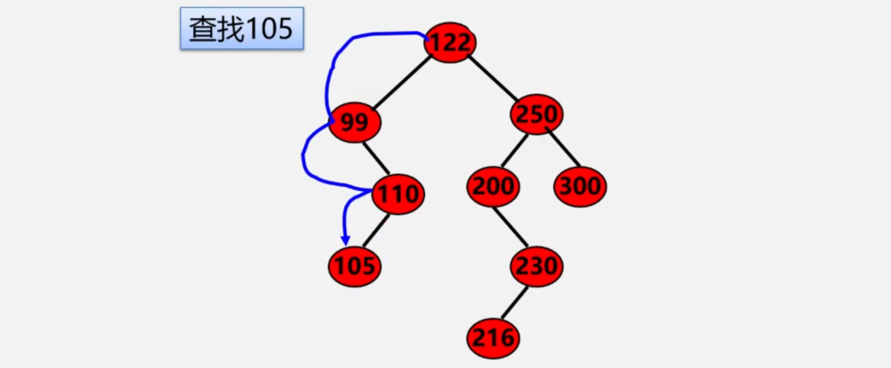

```cpp
typedef struct {
    KeyType key;//关键字项
    InfoType otherInfo;//其他数据域
}

typedef struct BSTNode {
    ElemType data;//数据域
    struct BSTNode *lchild, *rchild;//左右孩子指针
} BSTNode, *BSTree;

BSTree T;//定义二叉排序树T
```

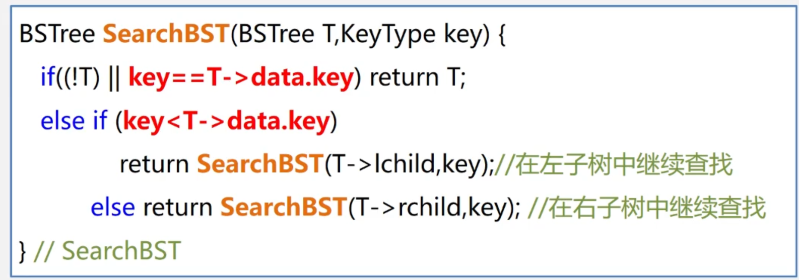

==算法分析==：

二叉排序树上查找某关键字，实际上走了一条<font color='#BAOC2F'>从根节点到该节点的路径</font>：


比较的关键字次数 = 此结点所在层次数，最多的比较次数 = 树的深度

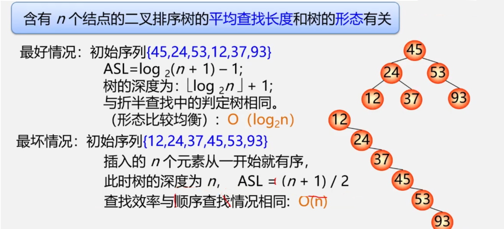

> 注：提高形态不均衡的二叉排序树查找效率，可以通过==对二叉排序树平衡化处理==，尽量让二叉树的形状均衡化。

##### （3）二叉排序树插入：

1. 若二叉排序树为空，则将<font color='#BAOC2F'>插入结点作为根节点</font>插入到空树中
2. 否则继续在其左右子树上查找：
3. 若树中已有，则不再插入
4. 若树中没有，则查找直至某个叶子结点的左/右子树为空为止，然后进行插入
5. 若大于根节点，查其右子树

> 注意：插入的元素一定在叶子结点上

##### （4）二叉排序树生成：

从空树出发，经过一系列的查找插入操作之后，可生成一棵二叉排序树：

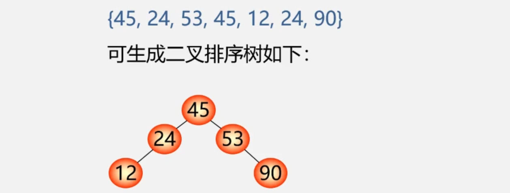

一个无序序列可<font color='#BAOC2F'>通过构造二叉排序树</font>变成一个有序序列，构造树的过程就是对无序序列进行排序的过程。

插入结点均为叶子结点故无需移动其他结点，相当于在有序序列上插入记录而<font color='#BAOC2F'>无需移动其他记录</font>。

> 注意：关键字的输入顺序不同，建立的二叉排序树形态也不同（查找效率也不同！）

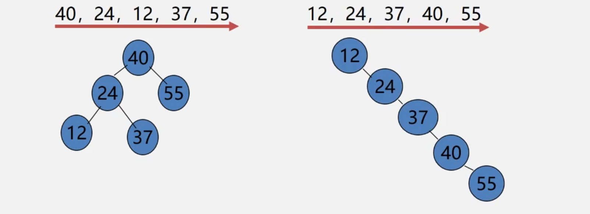

##### （5）二叉排序树删除：

从二叉排序树中删除一个结点，不能把以该节点为根的子树都删去而只能删掉该结点，

并且还应保证删除后所得的二叉树，仍然满足二叉排序树的性质（中序遍历有序）。

应考虑的问题：

1. 将因删除结点断开的二叉链表重新链接起来
2. 防止重新链接后树的<font color='#BAOC2F'>高度增加</font>（高度增加查找效率变差）

==删除的结点为叶子结点==：直接删去该结点，双亲结点相应的指针域改为空

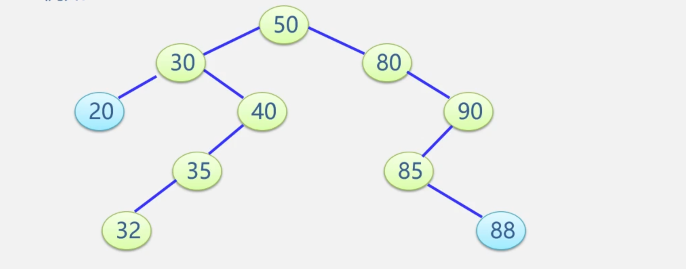

==删除的结点只有左/右子树==：用其左子树或右子树替换即可（结点替换）

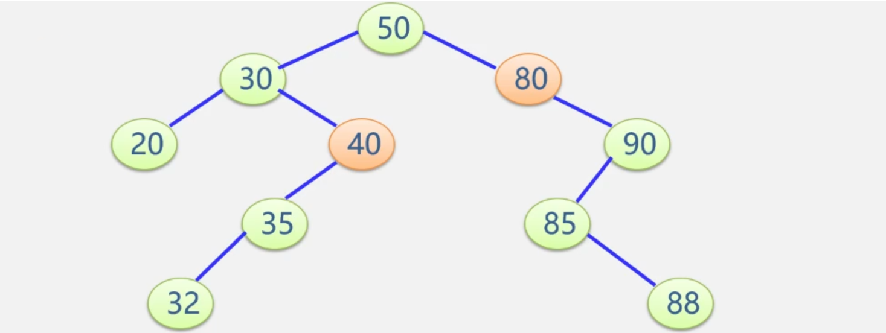

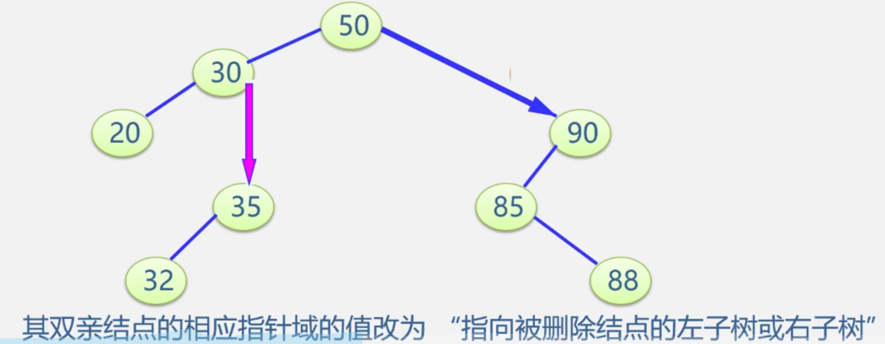

==删除的结点既有左子树、又有右子树==：

方法1：用中序前驱值替换，然后删除该前驱结点（前驱是左子树中最大的结点）

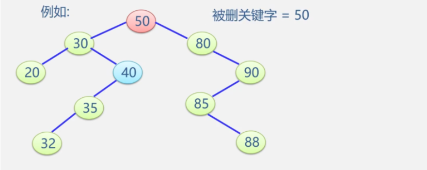

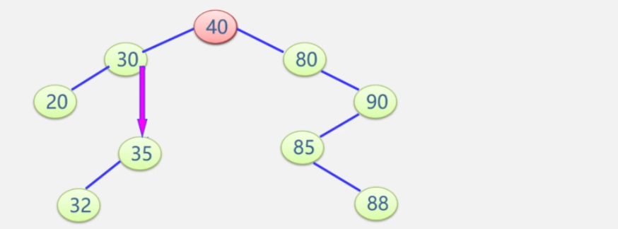

方法2：用中序后继值替换，然后删除该后继结点（后继是右子树中最小的结点）

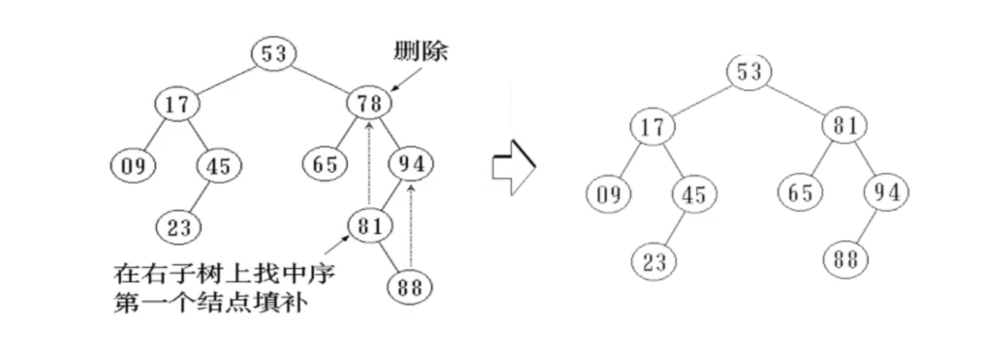

#### 2.平衡二叉树AVL

##### （1）基本概念：

平衡二叉树（balanced binary tree）又称AVL树（Adelson-Velskii and Landis），

一棵平衡二叉树是具有以下性质的<font color='#BAOC2F'>二叉排序树</font>：

1. 左子树与右子树的<font color='#BAOC2F'>高度之差的绝对值</font> ≤ 1
2. 左子树与右子树也是<font color='#BAOC2F'>平衡</font>二叉树排序树

为每个结点附加一个数字，给出该结点左子树与右子树的高度差，称为结点的<font color='#BAOC2F'>平衡因子</font>（BF）

> 注意：平衡二叉树的平衡因子只有可能是-1、0、1

##### （2）失衡二叉排序树调整：

如果在一棵AVL树中插入一个新的结点后造成失衡，则必须重新调整树的结构，使之恢复平衡。

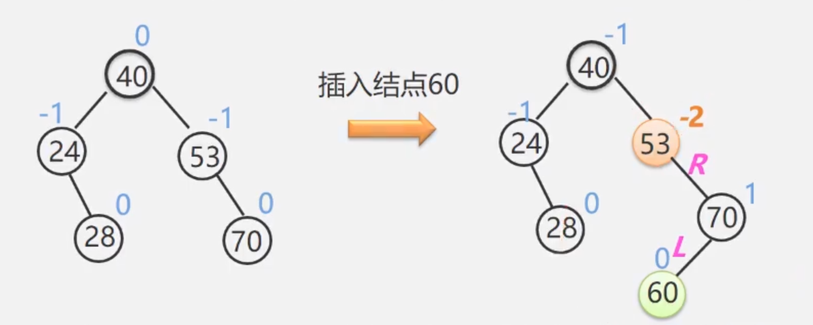

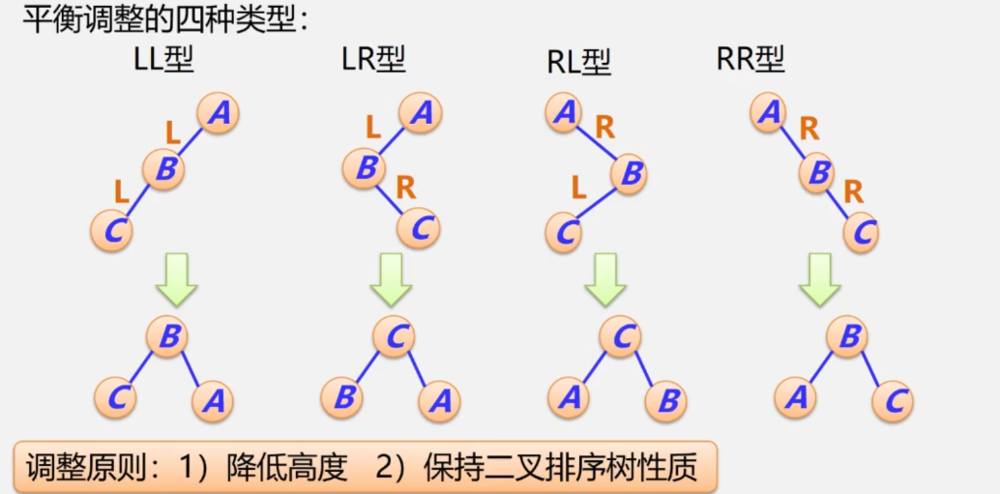

###### case1：LL型调整

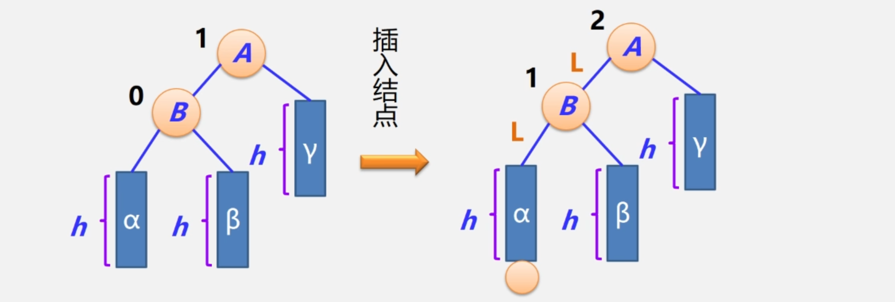

1. B结点带其左子树α一起上升
2. A结点成为B结点的右孩子
3. B结点原来的右子树β作为A结点的左子树

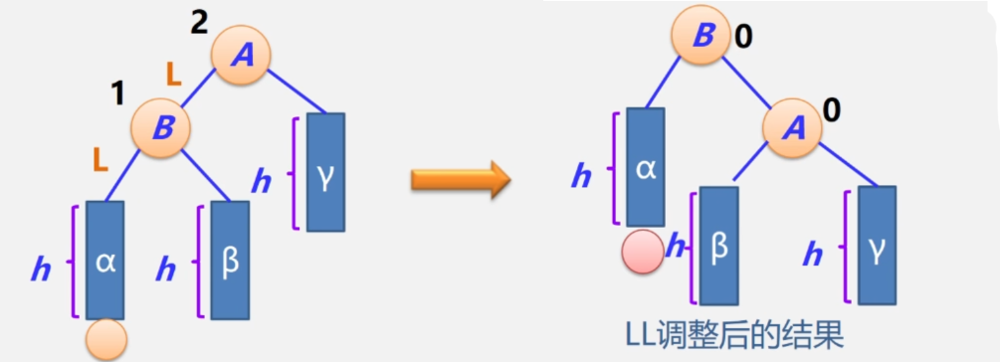

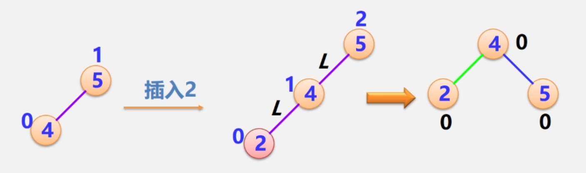

###### case2：RR型调整

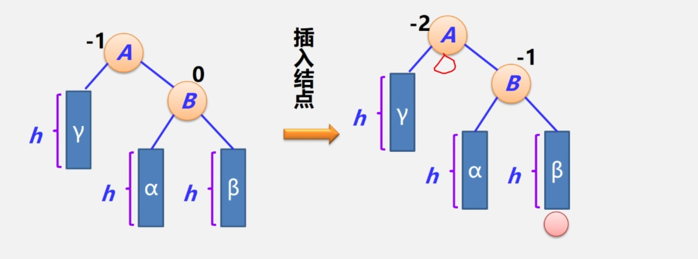

1. B结点带右子树β一起上升
2. A结点成为B结点的左孩子
3. 原来B结点的左子树α作为A结点的右子树

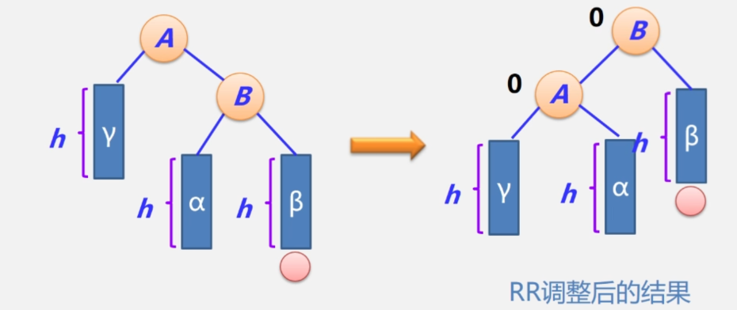

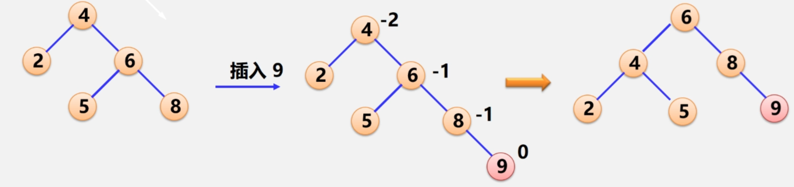

###### case3：LR型调整

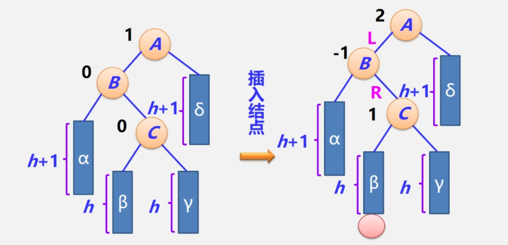

1. C结点穿过A、B结点上升
2. B结点成为C结点的左孩子
3. A结点成为C结点的右孩子
4. 原来C结点的左子树β作为B结点的右子树
5. 原来C结点的右子树γ作为A结点的左子树

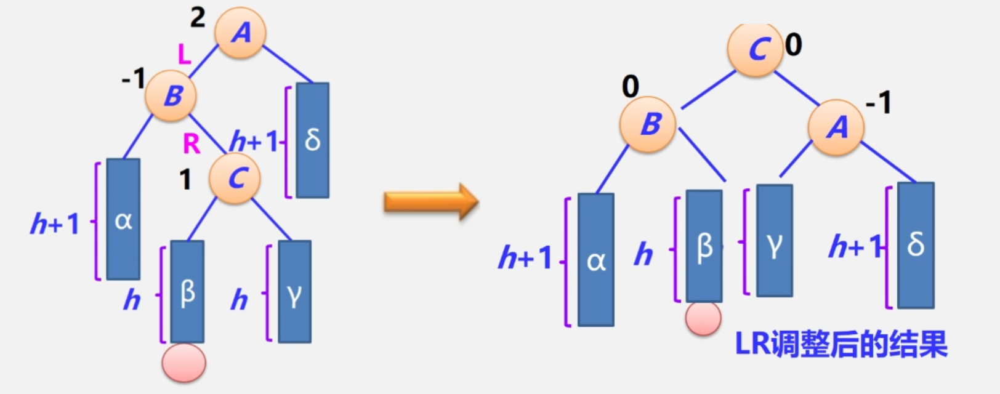

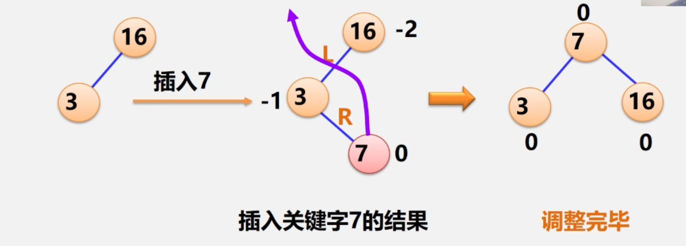

###### case4：RL型调整：

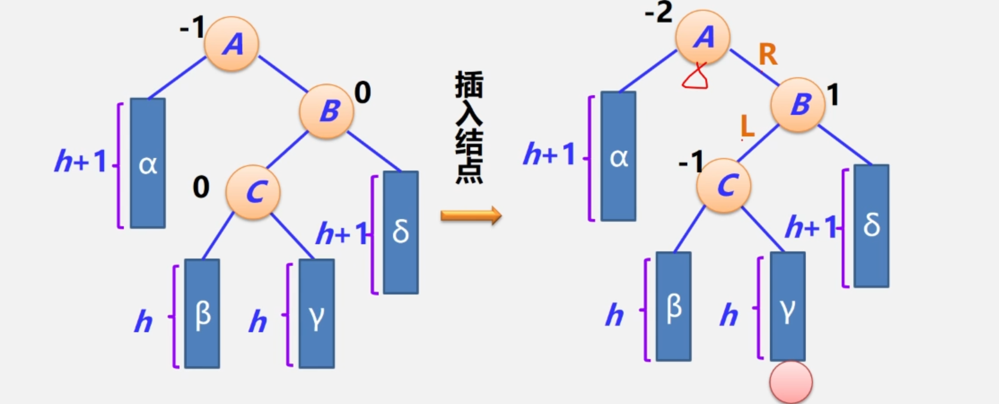

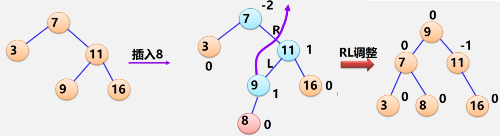

##### （3）失衡调整案例：

输入关键字序列（16， 3， 7， 11， 9， 26， 18， 14， 15），给出构造AVL树的步骤以及结果：

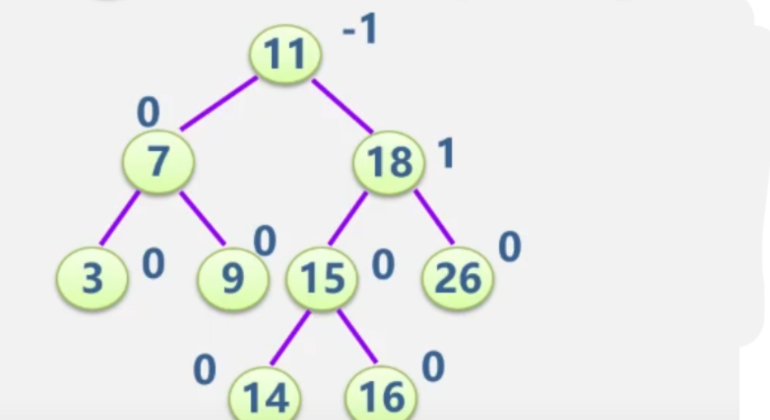


#### 3.红黑树


### 三、Hash表的查找

记录的存储位置与关键字之间存在对应关系，对应关系的函数—hash函数`Loc(i) = H(keyi)`

根据散列函数`H(key) = k`，若查找不到则返回一个特殊值（空指针 或 空记录）

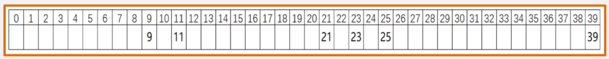

- 优点：查找效率高
- 缺点：空间效率低

使用散列表要解决好的两个问题：

1. 构造<font color='#BAOC2F'>好的散列函数</font>（函数尽可能简单—提高转换速度、key值计算出的地址应集中均匀分布—减少空间浪费）
2. 制定一个好的冲突解决方案

#### 1.Hash函数构造

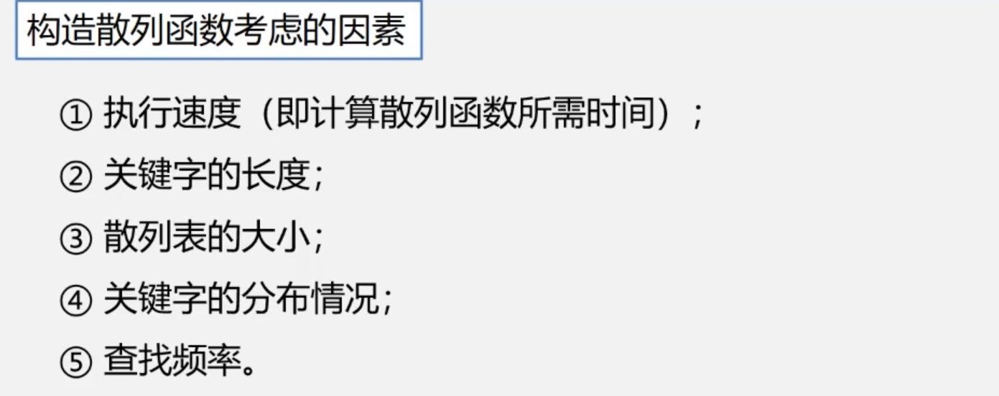

根据元素集合的特性构造：

- 要求1：n个数据源仅占用n个地址，虽然散列查找是以空间换时间但是仍希望散列的地址空间尽量小
- 要求2：无论用什么方法存储，目的都是尽量均匀的存放元素避免冲突

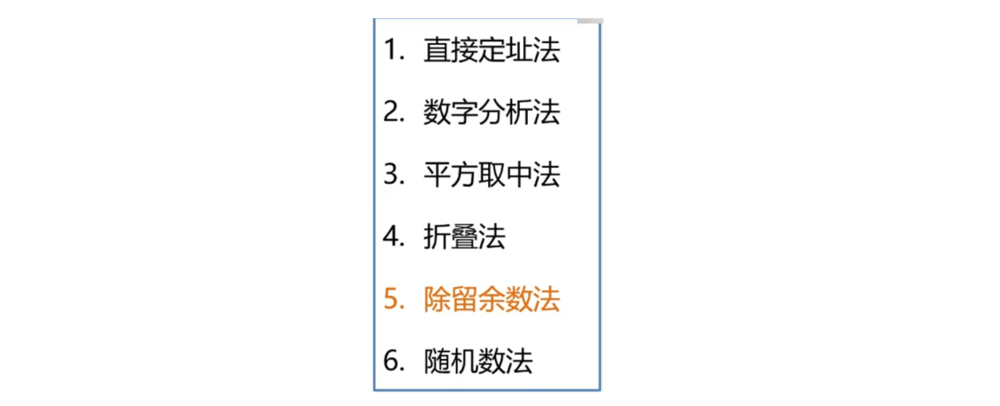

##### （1）直接定值法：

$$
Hash(key) = a*key + b
$$

优点：以关键码key的<font color='#BAOC2F'>某个线性函数值</font>为Hash地址，不会产生冲突

缺点：要占用连续的地址空间，空间效率较低

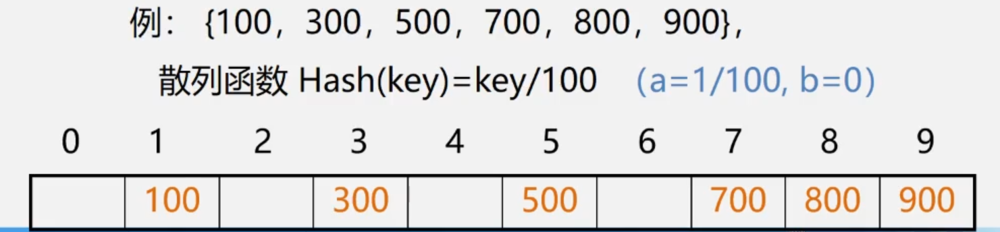

##### （2）除留余数法：

$$
Hash(key) = key~mod~p
$$

> 注意：如何选取合适的p值？设表长为m，取`p ≤ m`且为质数

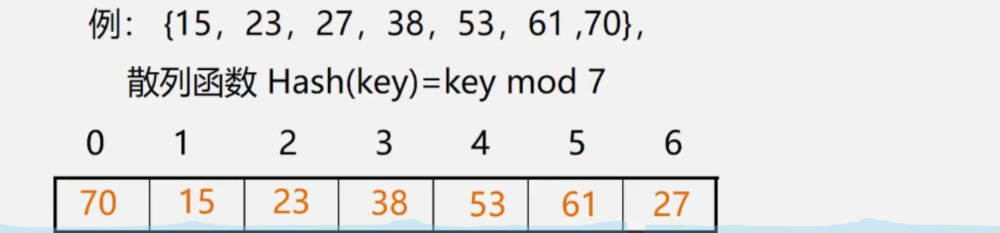

#### 2.Hash函数冲突解决方案

##### （1）开地址法：

有冲突时就去寻找下一个空的散列表，只要散列表足够大，空的散列地址总能找到并将数据元素存入。

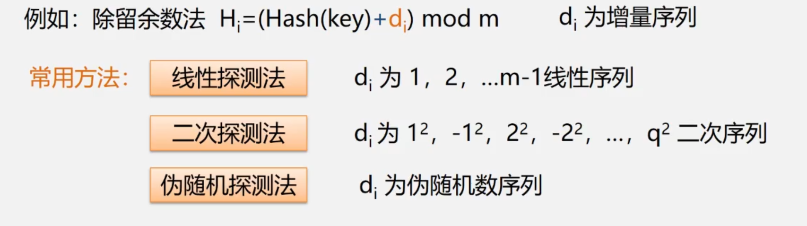

线性探测法：

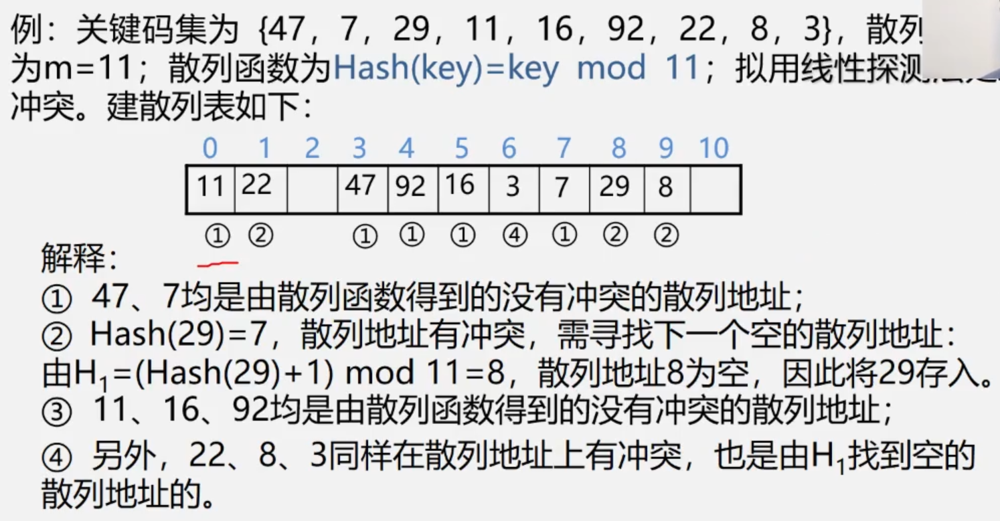

二次探测法：

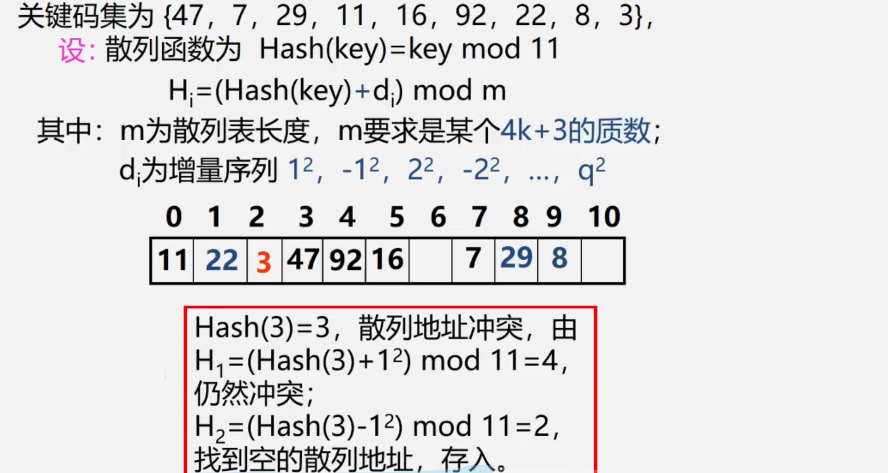

伪随机探测法：

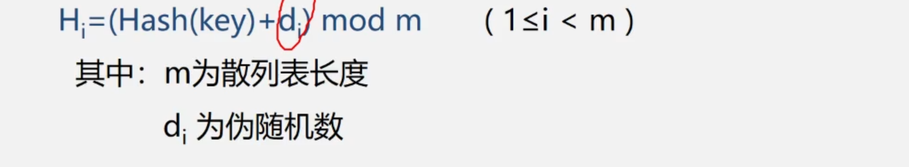

##### （2）链地址法：

相同Hash地址的记录链成一条单链表，m个地址设m个单链表，然后<font color='#BAOC2F'>用一个数组</font>将m个单链表的<font color='#BAOC2F'>表头指针</font>存储起来（形成动态结构）

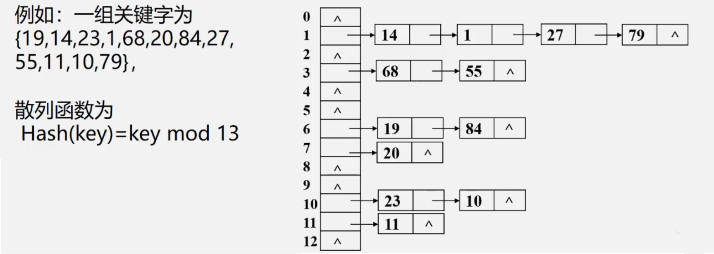

链地址法建立散列表步骤：

1. 取数据元素的关键字key，计算其Hash/散列函数值（地址）
2. 若计算的Hash函数值为空，则将该元素添加到此数组中
3. 若计算的Hash函数值非空，则利用链表的前插法 或 后插法将该元素插入此链表

链地址法优点：

1. 非同义词不会冲突，无聚集现象
2. 链表上的结点是动态申请的，更适用于表长不定的情况

#### 3.Hash表的查找

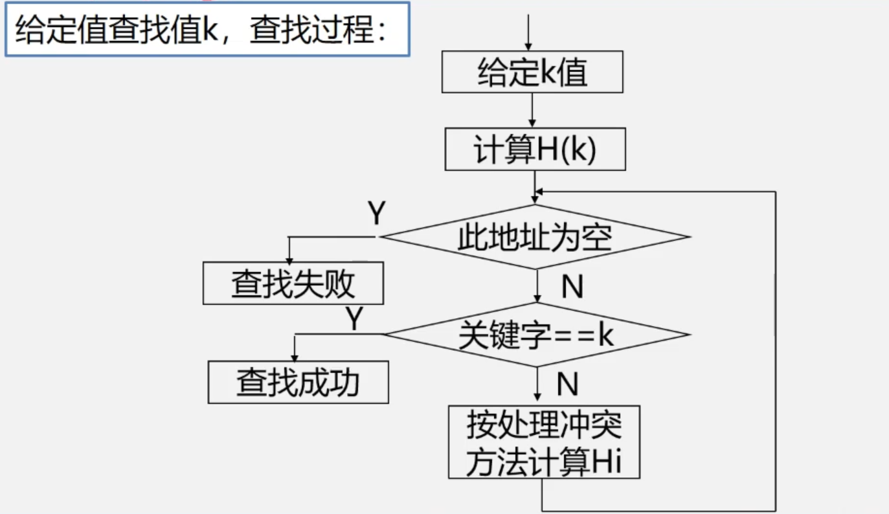

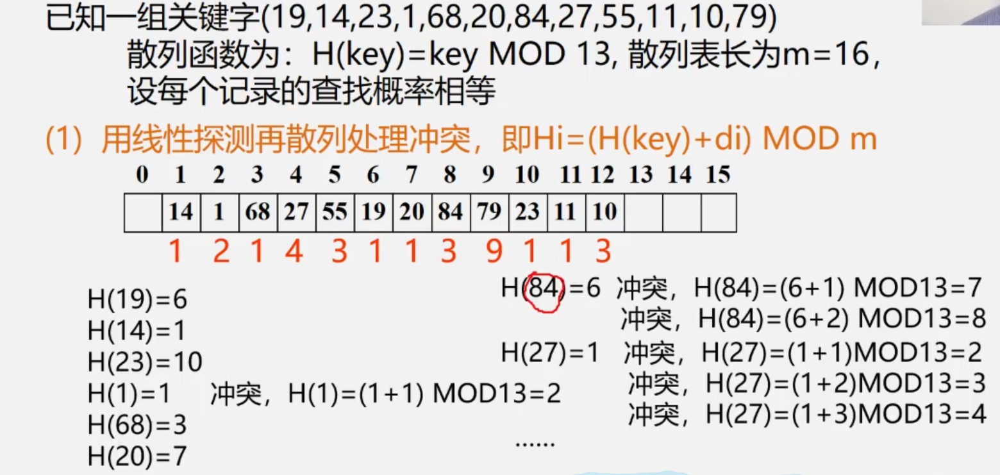

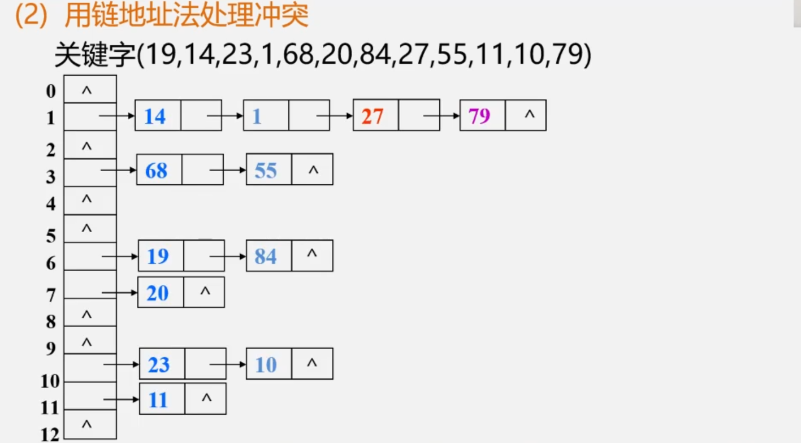

==Hash表的查找效率分析==：

使用平均查找长度ASL来衡量查找算法，ASL取决于：

1. 散列函数
2. 处理冲突的方法
3. 散列表的装填因子α（α = 表中填入的记录数 / Hash表的长度）

> 注意：α越大，表中记录的数量越多、表装的越满、发生冲突的可能性越大、查找时比较的次数越多

ASL与装填因子有关：既不是严格的O(1)，也不是O(n)


